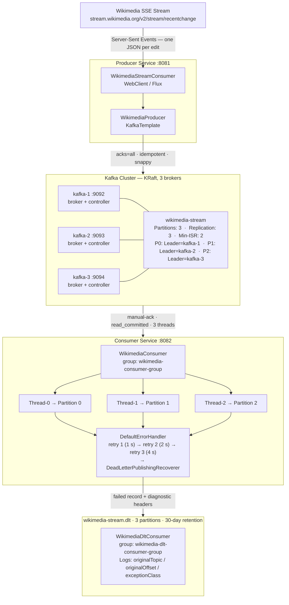
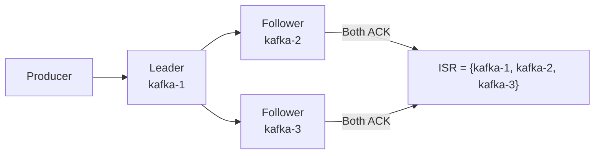
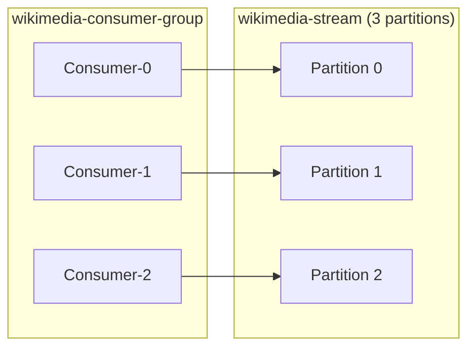
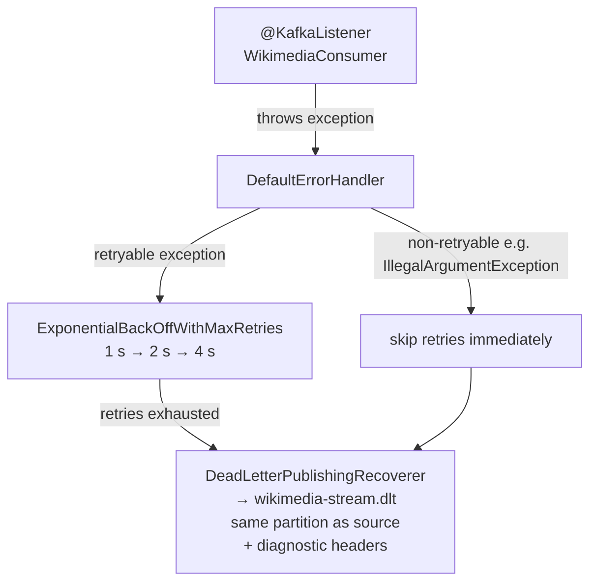
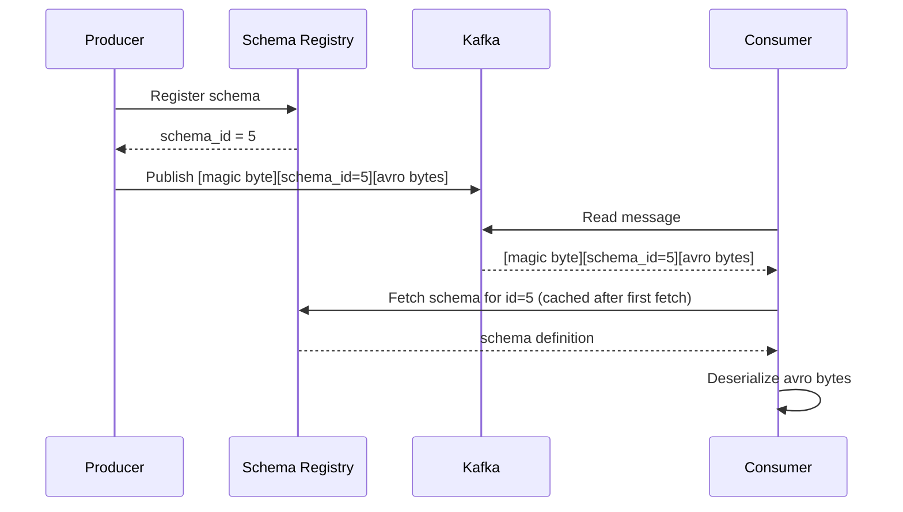
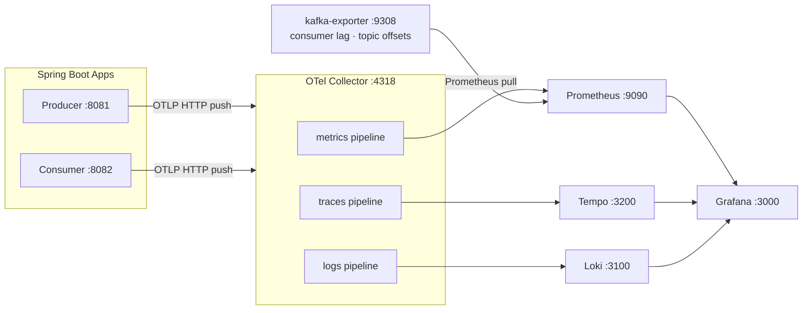
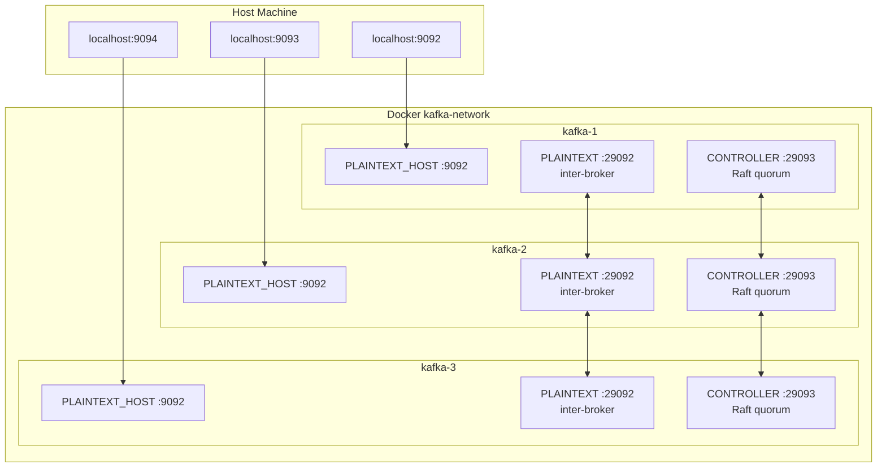

# Apache Kafka with Spring Boot

Production-grade Kafka integration built on a real-world use case: streaming live edits from the [Wikimedia Recent Changes SSE feed](https://stream.wikimedia.org/v2/stream/recentchange) through a 3-broker KRaft cluster into a Spring Boot consumer.

---

## Table of Contents

1. [Architecture](#architecture)
2. [Kafka Core Concepts](#kafka-core-concepts)
   - [Topics & Partitions](#topics--partitions)
   - [Offsets](#offsets)
   - [Replication & ISR](#replication--isr)
   - [Consumer Groups](#consumer-groups)
   - [KRaft — Kafka Without ZooKeeper](#kraft--kafka-without-zookeeper)
3. [Producer Deep Dive](#producer-deep-dive)
   - [Acknowledgments](#acknowledgments-acks)
   - [Idempotent Producer](#idempotent-producer)
   - [Batching & Linger](#batching--linger)
   - [Compression](#compression)
4. [Consumer Deep Dive](#consumer-deep-dive)
   - [Offset Management](#offset-management)
   - [Manual Acknowledgment](#manual-acknowledgment)
   - [Consumer Group Rebalancing](#consumer-group-rebalancing)
   - [Isolation Level & Exactly-Once](#isolation-level--exactly-once)
   - [Dead-Letter Topic (DLT)](#dead-letter-topic-dlt)
5. [Schema Registry](#schema-registry)
6. [Project Structure](#project-structure)
7. [Infrastructure](#infrastructure)
8. [Getting Started](#getting-started)
   - [Step 5 — Explore Kafka UI](#step-5--explore-kafka-ui)
   - [Step 6 — Observe with OpenTelemetry](#step-6--observe-with-opentelemetry)
   - [Step 7 — Simulate a DLT failure](#step-7--simulate-a-dlt-failure)
   - [Step 8 — Browse the H2 database](#step-8--browse-the-h2-database)
9. [Configuration Reference](#configuration-reference)
10. [Production Checklist](#production-checklist)

---

## Architecture



---

## Kafka Core Concepts

### Topics & Partitions

A **topic** is a named, ordered, and durable log of records. Think of it like a table in a database, but append-only and replicated.

Every topic is split into one or more **partitions**. Partitions are the unit of parallelism in Kafka:

- **Ordering** is guaranteed only within a single partition. If message ordering matters across your entire dataset (e.g., all events for a specific user), route them to the same partition using a consistent key.
- **Throughput** scales with partition count because producers and consumers can work on different partitions simultaneously.
- **More partitions = more parallelism**, but also more open file handles, longer leader election times, and higher metadata overhead. The sweet spot for most workloads is 10–50 partitions per topic, per broker.

**When to add partitions:** When a single consumer thread can't keep up with the producer throughput and you have headroom to add more consumer instances.

**You cannot reduce partition count** after topic creation without recreating the topic.

```
Topic: wikimedia-stream  (3 partitions)

Partition 0: [offset 0] [offset 1] [offset 2] [offset 3] ──► append
Partition 1: [offset 0] [offset 1] [offset 2]             ──► append
Partition 2: [offset 0] [offset 1]                        ──► append
```

### Offsets

An **offset** is a monotonically increasing integer that uniquely identifies a record within a partition. Kafka never overwrites records — it only appends.

**Consumer offsets** are stored in an internal Kafka topic: `__consumer_offsets`. This stores `(group-id, topic, partition) → offset` so consumers can resume from where they left off after a restart.

- `auto.offset.reset=earliest` → start from offset 0 if no committed offset exists (useful when deploying a new consumer group against an existing topic)
- `auto.offset.reset=latest` → start from the next record written after the consumer joins (useful for real-time dashboards that don't need history)

### Replication & ISR

Kafka replicates each partition across multiple brokers for fault tolerance.

| Term | Meaning |
|---|---|
| **Replication Factor (RF)** | Total number of replicas per partition (leader + followers) |
| **Leader** | The single broker that handles all reads and writes for that partition |
| **Follower** | Passively replicates the leader's log |
| **ISR (In-Sync Replicas)** | The set of replicas currently caught up to the leader |
| **min.insync.replicas** | Minimum ISR size before the leader rejects produce requests with `acks=all` |

**How durability works:**



> If `kafka-2` falls behind: ISR shrinks to `{kafka-1, kafka-3}`  
> If ISR drops below `min.insync.replicas=2`: the leader rejects writes (safer than silent data loss)

**Production rule of thumb:** RF=3, min.insync.replicas=2. This lets you lose one broker (for maintenance or failure) while still accepting writes, and guarantees that at least two copies of every message always exist.

### Consumer Groups

A **consumer group** is a logical subscriber. Kafka distributes partitions across the group members so each partition is consumed by exactly one member at a time.



> Adding a 4th consumer: one consumer sits idle — more consumers than partitions means no assignment.  
> Removing Consumer-1: Partition 1 is reassigned to Consumer-0 or Consumer-2 (rebalance).

**Horizontal scaling:** Add more consumers (up to the partition count) to scale throughput linearly. Once you have as many consumers as partitions, you need more partitions to scale further.

**Multiple groups:** Each consumer group maintains its own independent offset cursor. Ten different groups can consume the same topic, each processing the full stream independently.

### KRaft — Kafka Without ZooKeeper

Prior to Kafka 2.8 / KIP-500, every Kafka deployment required a separate ZooKeeper ensemble to manage cluster metadata, broker registration, and leader election. This created operational complexity: two distributed systems to run, monitor, and tune.

**KRaft (Kafka Raft)** replaces ZooKeeper with a built-in Raft consensus protocol. One or more brokers take on the **controller** role and maintain the cluster metadata log internally.

| | ZooKeeper Mode | KRaft Mode |
|---|---|---|
| Separate process | Yes (ZooKeeper ensemble) | No |
| Metadata storage | ZooKeeper znodes | Internal `__cluster_metadata` topic |
| Controller election | Via ZooKeeper | Via Raft consensus |
| Supported since | Kafka 0.x | Kafka 2.8 (preview), stable from 3.3 |
| Required in prod | Kafka ≥ 3.7 deprecates ZooKeeper | Yes |
| Partition limit | ~200 k | Millions (no ZK bottleneck) |

**This project uses KRaft with combined mode:** each broker acts as both a broker and a controller. In large production clusters you would dedicate 3–5 nodes to the controller role only (no broker traffic), isolating the quorum from I/O load.

---

## Producer Deep Dive

### Acknowledgments (`acks`)

The `acks` setting controls how many replicas must confirm a write before the broker responds to the producer. It is the primary lever for the durability–throughput trade-off.

| `acks` | Behavior | Risk | Throughput |
|---|---|---|---|
| `0` | Fire-and-forget; producer never waits | Message loss on any failure | Highest |
| `1` | Leader acknowledges; doesn't wait for followers | Loss if leader crashes before replication | High |
| `all` (`-1`) | All ISR members acknowledge | No loss as long as ISR ≥ min.insync.replicas | Moderate |

**Use `acks=all` whenever data loss is unacceptable.** The latency cost is usually single-digit milliseconds in a well-tuned cluster.

### Idempotent Producer

With `enable.idempotence=true`, Kafka assigns a **Producer ID (PID)** and a **sequence number** to each record. If the producer retries a failed send, the broker detects the duplicate sequence number and ignores the re-send — exactly one copy lands in the log regardless of network hiccups.

Requirements:
- `acks=all`
- `retries > 0`
- `max.in.flight.requests.per.connection ≤ 5`

Without idempotence, a producer retry after a network timeout can produce the same record twice.

### Batching & Linger

Kafka producers accumulate records into batches before sending. Two config keys control this:

- **`batch.size`** — maximum bytes per batch. The producer sends immediately once the batch is full, regardless of `linger.ms`.
- **`linger.ms`** — how long to wait for more records to fill the batch before sending a partially-filled one.

```
linger.ms=0  (default): send immediately → low latency, small batches, less compression gain
linger.ms=20:           wait 20ms       → larger batches, better throughput, better compression
```

**When to use high linger.ms:** Non-interactive pipelines where throughput matters more than latency (ETL, log aggregation, analytics events). Set to 0 for user-facing request/reply flows.

### Compression

Compression works at the batch level: Kafka compresses the entire batch, not individual records, which delivers much better ratios than per-record compression.

| Codec | Speed | Ratio | Best for |
|---|---|---|---|
| `none` | — | — | Already-compressed data (JPEG, video) |
| `gzip` | Slow | High | Archival, cold storage cost reduction |
| `snappy` | Fast | Moderate | General-purpose throughput (our default) |
| `lz4` | Fastest | Low–Moderate | Latency-sensitive, high-volume streams |
| `zstd` | Moderate | Best | Best overall; prefer for Kafka 2.1+ |

Set the same codec on both producer (`compression.type`) and topic config to prevent the broker from needlessly decompressing and recompressing batches.

---

## Consumer Deep Dive

### Offset Management

Kafka consumers track their position in a partition via **committed offsets**. The offset represents the next record to be read — not the last one processed.

**Auto-commit (`enable.auto.commit=true`):** Kafka commits the current offset every `auto.commit.interval.ms`. This can cause:
- **Data loss** if the consumer crashes between the commit and actual processing
- **Duplicate processing** if the consumer crashes after processing but before the next auto-commit fires

**Manual commit** (`enable.auto.commit=false` + `ack-mode=MANUAL_IMMEDIATE`): You control exactly when the offset advances. Only commit after your processing is complete and durable.

### Manual Acknowledgment

With Spring Kafka and `ack-mode: manual_immediate`, the `Acknowledgment` object is injected into your listener method. Call `acknowledge()` only after you have safely persisted or forwarded the message.

```java
@KafkaListener(topics = "wikimedia-stream", groupId = "wikimedia-consumer-group")
public void consume(ConsumerRecord<String, String> record, Acknowledgment ack) {
    processAndPersist(record.value());  // write to DB, forward to another service, etc.
    ack.acknowledge();                  // only now advance the offset
}
```

If your service crashes before `acknowledge()` is called, the same record is redelivered on restart — providing **at-least-once delivery**. Pair this with idempotent processing logic to achieve **effectively-once** semantics without the overhead of Kafka transactions.

### Consumer Group Rebalancing

A **rebalance** occurs when the partition assignment within a group changes:
- A consumer joins or leaves the group
- A consumer fails to poll within `max.poll.interval.ms`
- Topic partitions are added

During a rebalance, all consumers in the group pause, offsets for in-progress partitions are committed, and a new assignment is computed by the **group coordinator** broker.

**Minimising rebalance impact:**
- Tune `max.poll.records` so each poll finishes well within `max.poll.interval.ms`
- Use **Static Group Membership** (`group.instance.id`) for predictable restart scenarios — the broker holds the partition assignment for a grace period so a restarting consumer rejoins without triggering a full rebalance
- Use **Cooperative Sticky Assignor** (`partition.assignment.strategy`) to allow incremental rebalances where only the moved partitions are revoked, not all partitions

### Isolation Level & Exactly-Once

`isolation.level` controls which messages a consumer can read:

| Level | Behaviour |
|---|---|
| `read_uncommitted` (default) | Reads all messages including those from in-flight (uncommitted) transactions |
| `read_committed` | Only reads messages from completed, committed transactions. Aborted transaction messages are silently filtered. |

Use `read_committed` whenever your producer uses transactions. Without it, a consumer may read half of a transactional write, process it, and later see the abort — leading to inconsistent state.

### Dead-Letter Topic (DLT)

A **dead-letter topic** is where records go when they can't be processed successfully after all retries are exhausted. Without one, you have only two bad options: infinite retry (blocking the partition) or silently dropping the message.

**How it works in this project:**



**DLT headers added automatically by Spring Kafka:**

| Header | Type | Content |
|---|---|---|
| `kafka_dlt-original-topic` | String | `wikimedia-stream` |
| `kafka_dlt-original-partition` | int (4 bytes) | Source partition number |
| `kafka_dlt-original-offset` | long (8 bytes) | Source offset |
| `kafka_dlt-original-timestamp` | long (8 bytes) | Source record timestamp |
| `kafka_dlt-exception-fqcn` | String | Fully qualified exception class |
| `kafka_dlt-exception-message` | String | Exception message |
| `kafka_dlt-exception-cause-fqcn` | String | Root cause class (if present) |

**Why same-partition routing?** Routing the failed record to the same partition number on the DLT preserves relative ordering of failures. If you need to replay a partition's DLT records in order, they are co-located.

**Non-retryable exceptions** (`addNotRetryableExceptions`): For exceptions where retrying is pointless — a malformed JSON payload will never parse correctly regardless of how many times you try — configure the error handler to skip backoff and route immediately to the DLT. This avoids wasting time and blocking healthy records that follow in the same partition.

**DLT retention (30 days vs. 7 days on the source):** Failed records need a longer investigation window. Engineers must have time to diagnose the root cause, fix the consumer logic, and replay the DLT before records expire.

**Triggering the DLT in development:**

```java
// Add to WikimediaConsumer.consume() temporarily to see DLT in action:
if (record.value().contains("some-condition")) {
    throw new RuntimeException("Simulated processing failure");
}
```

Then watch the consumer retry 3 times (with logs showing each attempt) before the record appears in `wikimedia-stream.dlt` with the full header diagnostics.

**Inspecting the DLT:**

```bash
docker exec kafka-1 kafka-console-consumer \
  --bootstrap-server localhost:9092 \
  --topic wikimedia-stream.dlt \
  --from-beginning \
  --property print.headers=true
```

---

## Schema Registry

Confluent Schema Registry (running at `http://localhost:8085` in this project) provides:

1. **Schema storage** — a versioned repository of Avro, Protobuf, and JSON Schema definitions
2. **Compatibility enforcement** — rejects producer schemas that would break existing consumers (BACKWARD, FORWARD, or FULL compatibility modes)
3. **Wire format** — producers embed only a schema ID (4 bytes) in the message, not the full schema, which drastically reduces message size



**When to use it:** Any time you have multiple producers or consumers that evolve independently. The registry prevents the "schema mismatch" production incident class entirely.

This project currently uses plain String serialization. Migrating to Avro + Schema Registry involves:
- Adding `io.confluent:kafka-avro-serializer` dependency
- Replacing `StringSerializer`/`StringDeserializer` with `KafkaAvroSerializer`/`KafkaAvroDeserializer`
- Setting `schema.registry.url=http://localhost:8085`

---

## Project Structure

```
kafka-springboot/
├── docker-compose.yml              # 3-broker KRaft cluster + observability stack
├── prometheus.yml                  # Prometheus scrape config (kafka-exporter + otel-collector)
├── otel-collector-config.yml       # OTel Collector pipelines (metrics → Prometheus, traces → Tempo, logs → Loki)
├── tempo-config.yml                # Grafana Tempo local storage config
│
├── producer/                       # Spring Boot :8081 — reads Wikimedia SSE, publishes to Kafka
│   └── src/main/
│       ├── java/com/javaguy/producer/
│       │   ├── InstallOpenTelemetryAppender.java # wires Logback → OTel SDK at startup
│       │   ├── config/
│       │   │   ├── WebClientConfig.java          # WebClient bean
│       │   │   └── WikimediaTopicConfig.java     # wikimedia-stream (3P / RF3 / min-ISR 2)
│       │   ├── controller/
│       │   │   └── WikimediaController.java      # GET /api/v1/wikimedia → starts stream
│       │   ├── producer/
│       │   │   └── WikimediaProducer.java        # KafkaTemplate with send callback
│       │   └── stream/
│       │       └── WikimediaStreamConsumer.java  # SSE → ServerSentEvent decoder → Kafka
│       └── resources/
│           ├── application.yml                   # Kafka + OTel OTLP endpoints
│           └── logback-spring.xml                # routes logs to OTel appender
│
└── consumer/                       # Spring Boot :8082 — consumes, persists, exposes REST API
    └── src/main/
        ├── java/com/javaguy/consumer/
        │   ├── InstallOpenTelemetryAppender.java # wires Logback → OTel SDK at startup
        │   ├── config/
        │   │   ├── KafkaConsumerConfig.java      # DefaultErrorHandler + DLT recoverer + factory
        │   │   └── WikimediaTopicConfig.java     # wikimedia-stream + wikimedia-stream.dlt topics
        │   ├── consumer/
        │   │   ├── WikimediaConsumer.java         # parse JSON → persist → manual ack
        │   │   └── WikimediaDltConsumer.java      # DLT listener — logs all diagnostic headers
        │   ├── controller/
        │   │   └── WikimediaEventController.java  # REST: /events, /recent, /wiki/{w}, /stats
        │   ├── dto/
        │   │   └── WikimediaEventDto.java         # Jackson record — maps Wikimedia JSON fields
        │   ├── entity/
        │   │   └── WikimediaEvent.java            # JPA entity with Kafka provenance columns
        │   └── repository/
        │       └── WikimediaEventRepository.java  # Spring Data JPA + aggregation queries
        └── resources/
            ├── application.yml                    # Kafka + H2 + JPA + OTel OTLP endpoints
            └── logback-spring.xml                 # routes logs to OTel appender
```

---

## Infrastructure

### Cluster Topology

| Container | Host Port | Role | Node ID |
|---|---|---|---|
| kafka-1 | 9092 | broker + controller | 1 |
| kafka-2 | 9093 | broker + controller | 2 |
| kafka-3 | 9094 | broker + controller | 3 |
| schema-registry | 8085 | schema store | — |
| kafka-ui | 8080 | management UI | — |
| kafka-exporter | 9308 | Prometheus metrics exporter (consumer lag, topic offsets via Kafka API) | — |
| otel-collector | 4317 / 4318 | OTLP receiver — accepts metrics, traces, and logs pushed by both Spring Boot apps | — |
| prometheus | 9090 | metrics store — scrapes kafka-exporter and otel-collector Prometheus exporter | — |
| tempo | 3200 | trace backend (Grafana Tempo) | — |
| loki | 3100 | log backend (Grafana Loki) | — |
| grafana | 3000 | dashboard UI — queries Prometheus, Tempo, and Loki | — |

All services share the `kafka-network` Docker bridge network. Inter-broker traffic flows over the internal `PLAINTEXT` listener on port 29092 (invisible to the host). Controller Raft consensus uses port 29093. Your Spring Boot apps connect to the `PLAINTEXT_HOST` listeners at `localhost:9092,9093,9094`.

### Observability Signal Flow



### Listener Architecture



---

## Getting Started

### Prerequisites

- Docker ≥ 24 and Docker Compose v2
- Java 25 (project target; Spring Boot 4.x minimum is Java 21)
- Maven 3.9+

---

### Step 1 — Start the Kafka cluster

```bash
docker compose up -d
```

Wait for all three brokers to become healthy (~30 s):

```bash
docker compose ps
```

Every service should show `healthy` in the STATUS column. If a broker is still starting, wait another 15 s and re-run.

Verify KRaft quorum (no ZooKeeper required):

```bash
docker exec kafka-1 kafka-metadata-quorum \
  --bootstrap-server localhost:9092 describe --status
```

You should see `LeaderId` and three voters listed.

---

### Step 2 — Start the Consumer

Start the consumer **before** the producer so it is ready to receive messages as soon as they arrive and you can watch offsets advance in real time.

```bash
cd consumer
./mvnw spring-boot:run
```

Expected startup log:

```
Started ConsumerApplication in 3.2 seconds
```

The topics `wikimedia-stream` and `wikimedia-stream.dlt` are auto-declared by `WikimediaTopicConfig` on startup.

---

### Step 3 — Start the Producer

Open a second terminal:

```bash
cd producer
./mvnw spring-boot:run
```

Then trigger the Wikimedia live stream:

```bash
curl http://localhost:8081/api/v1/wikimedia
```

The producer connects to the Wikimedia SSE endpoint and begins publishing one JSON event per Wikipedia edit to `wikimedia-stream`. Back in the **consumer terminal** you will see:

```
Saved | partition=0 offset=0   type=edit wiki=enwiki  title='Lionel Messi'
Saved | partition=2 offset=0   type=new  wiki=frwiki  title='Économie de la France'
Saved | partition=1 offset=0   type=edit wiki=dewiki  title='Berlin'
```

---

### Step 4 — Query the REST API

The consumer exposes a REST API on port 8082. Try these while events are flowing:

```bash
# 10 most recently consumed events
curl http://localhost:8082/api/v1/wikimedia/events/recent | jq

# Paginated full list (newest first)
curl "http://localhost:8082/api/v1/wikimedia/events?page=0&size=5" | jq

# Filter by wiki
curl http://localhost:8082/api/v1/wikimedia/events/wiki/enwiki | jq

# Filter by event type: edit | new | log | categorize
curl http://localhost:8082/api/v1/wikimedia/events/type/edit | jq

# Aggregated stats — total events, bot vs human, breakdown by wiki and type
curl http://localhost:8082/api/v1/wikimedia/events/stats | jq
```

Example stats response:

```json
{
  "totalEvents": 1842,
  "botEdits":    312,
  "humanEdits":  1530,
  "byWiki":  { "enwiki": 720, "dewiki": 280, "frwiki": 190 },
  "byType":  { "edit": 1500, "new": 280, "log": 62 }
}
```

---

### Step 5 — Explore Kafka UI

Open **http://localhost:8080** in a browser.

**Brokers tab**
- Confirms all 3 brokers are online and shows the active Raft controller.

**Topics → wikimedia-stream**
- *Overview*: partition count (3), replication factor (3), min ISR (2).
- *Messages*: click a partition to browse individual records. You can see the raw JSON payload and record metadata (offset, timestamp, headers).
- *Consumers*: shows `wikimedia-consumer-group` with per-partition lag. Lag should stay near 0 while the consumer is running.

**Topics → wikimedia-stream.dlt**
- Empty under normal operation. Messages appear here only after all retries are exhausted (see Step 7).

**Consumer Groups → wikimedia-consumer-group**
- Shows which partition is assigned to which consumer thread and current lag across all partitions.

---

### Step 6 — Observe with OpenTelemetry

Both Spring Boot apps use `spring-boot-starter-opentelemetry` (Spring Boot 4 first-party observability) to push all three signals — **metrics**, **traces**, and **logs** — to the OTel Collector via OTLP HTTP. Everything starts automatically with `docker compose up -d`.

#### Signal routing

| Signal | From | Via | To | View in |
|---|---|---|---|---|
| Metrics | both apps (OTLP push) | otel-collector → Prometheus exporter | Prometheus :9090 | Grafana |
| Metrics | kafka-exporter (Prometheus pull) | — | Prometheus :9090 | Grafana |
| Traces | both apps (OTLP push) | otel-collector | Tempo :3200 | Grafana → Explore → Tempo |
| Logs | both apps (OTLP push via Logback appender) | otel-collector | Loki :3100 | Grafana → Explore → Loki |

#### Spring Boot Actuator endpoints

Both services still expose health and metrics endpoints (replace `8081` with `8082` for the consumer):

| Endpoint | URL | What it shows |
|---|---|---|
| Health | `http://localhost:8081/actuator/health` | Liveness, readiness, Kafka connectivity |
| Metrics index | `http://localhost:8081/actuator/metrics` | All registered metric names |
| Single metric | `http://localhost:8081/actuator/metrics/kafka.producer.record.send.total` | One metric with tags |

#### Prometheus — Kafka metrics

Open **http://localhost:9090/targets** — both jobs should show `UP`:

| Job | Source | What it collects |
|---|---|---|
| `kafka-exporter` | Prometheus pull from `:9308` | Consumer group lag, topic partition offsets |
| `otel-collector` | Prometheus pull from `:8889` | JVM, HTTP, Kafka client metrics from both apps |

Useful PromQL queries at **http://localhost:9090/graph**:

```promql
# Consumer group lag per partition — the key operational alert metric
kafka_consumergroup_lag{consumergroup="wikimedia-consumer-group"}

# Total lag across all partitions
kafka_consumergroup_lag_sum{consumergroup="wikimedia-consumer-group"}

# Current write-head offset per partition (proxy for producer throughput)
kafka_topic_partition_current_offset{topic="wikimedia-stream"}

# JVM heap used by the consumer
jvm_memory_used_bytes{job="otel-collector", area="heap"}

# HTTP request rate on the consumer REST API
rate(http_server_requests_seconds_count{job="otel-collector"}[1m])
```

#### Grafana — set up data sources and dashboards

1. Open **http://localhost:3000** and log in with `admin` / `admin`.
2. Go to **Connections → Data Sources** and add all three:

   | Name | Type | URL |
   |---|---|---|
   | Prometheus | Prometheus | `http://prometheus:9090` |
   | Tempo | Tempo | `http://tempo:3200` |
   | Loki | Loki | `http://loki:3100` |

3. In the **Tempo** data source settings, enable **Trace to logs** and link it to your Loki source — this lets you jump from a trace span directly to the logs that fired at the same moment.

4. Import pre-built dashboards (**Dashboards → Import**):
   - ID **7589** — *Kafka Exporter Overview* (consumer lag, topic offsets, partition leaders)
   - ID **12900** — *JVM (Micrometer)* (heap, GC, thread count, HTTP rates)

#### Tempo — exploring traces

Go to **Explore → Tempo** and search by service name `producer` or `consumer`. Each Kafka listener invocation, HTTP request, and JDBC call appears as a span. You can see the full call chain from HTTP request → Kafka consume → database write on a single waterfall trace.

#### Loki — querying logs

Go to **Explore → Loki** and run:

```logql
# All logs from the consumer service
{service_name="consumer"}

# Only ERROR-level logs across both services
{service_name=~"producer|consumer"} | json | level="ERROR"

# DLT failures specifically
{service_name="consumer"} |= "DLT"
```

Logs include the OTel `traceId` field automatically, so clicking a log line lets you jump straight to the matching trace in Tempo.

After the consumer is running and lag reaches zero, stop it temporarily and watch the `kafka_consumergroup_lag` metric climb in Grafana in real time — then restart it and watch the lag drain.

---

### Step 7 — Simulate a DLT failure

To see the dead-letter flow in action, temporarily make the consumer throw on a record by adding one line to `WikimediaConsumer.consume()`:

```java
// Add after the parse() call — remove after testing
if (dto.type() != null && dto.type().equals("edit")) {
    throw new RuntimeException("Simulated transient failure");
}
```

Restart the consumer. In the logs you will see the record retried 3 times with exponential backoff:

```
ERROR o.s.k.l.DefaultErrorHandler - Record failed, retrying...  (attempt 1)
ERROR o.s.k.l.DefaultErrorHandler - Record failed, retrying...  (attempt 2)
ERROR o.s.k.l.DefaultErrorHandler - Record failed, retrying...  (attempt 3)
ERROR c.j.c.consumer.WikimediaDltConsumer - [DLT] partition=0 offset=17 |
      originalTopic=wikimedia-stream originalPartition=0 originalOffset=17 |
      exception=java.lang.RuntimeException cause='Simulated transient failure' |
      value='{"type":"edit","title":"..."}'
```

Now check the DLT in Kafka UI (**Topics → wikimedia-stream.dlt → Messages**) — you will see the failed record with its full diagnostic headers visible in the *Headers* panel.

To trigger the **non-retryable** path (straight to DLT, no backoff):

```java
throw new IllegalArgumentException("Simulated permanent failure");
```

This skips all retries and routes directly to the DLT in one step.

Remove the throw and restart to return to normal operation.

---

### Step 8 — Browse the H2 database

Open **http://localhost:8082/h2-console** in a browser.

| Field | Value |
|---|---|
| JDBC URL | `jdbc:h2:mem:wikimediadb` |
| User name | `sa` |
| Password | `password` |

Useful queries:

```sql
-- All events newest first
SELECT * FROM WIKIMEDIA_EVENTS ORDER BY PROCESSED_AT DESC LIMIT 20;

-- Count by wiki
SELECT WIKI, COUNT(*) AS cnt FROM WIKIMEDIA_EVENTS GROUP BY WIKI ORDER BY cnt DESC;

-- Bot vs human edits
SELECT BOT, COUNT(*) FROM WIKIMEDIA_EVENTS GROUP BY BOT;

-- Events per Kafka partition (confirms load spread across partitions)
SELECT KAFKA_PARTITION, COUNT(*) FROM WIKIMEDIA_EVENTS GROUP BY KAFKA_PARTITION;
```

---

### Useful CLI Commands

```bash
# Describe topic — shows partition leaders, replicas, and current ISR
docker exec kafka-1 kafka-topics \
  --bootstrap-server localhost:9092 \
  --topic wikimedia-stream --describe

# Watch consumer group lag in real time
docker exec kafka-1 kafka-consumer-groups \
  --bootstrap-server localhost:9092 \
  --group wikimedia-consumer-group --describe

# Inspect DLT messages including headers
docker exec kafka-1 kafka-console-consumer \
  --bootstrap-server localhost:9092 \
  --topic wikimedia-stream.dlt \
  --from-beginning \
  --property print.headers=true \
  --property print.offset=true \
  --max-messages 5

# Tail the live stream topic
docker exec kafka-1 kafka-console-consumer \
  --bootstrap-server localhost:9092 \
  --topic wikimedia-stream

# Reset consumer group offset to replay all events from the beginning
docker exec kafka-1 kafka-consumer-groups \
  --bootstrap-server localhost:9092 \
  --group wikimedia-consumer-group \
  --topic wikimedia-stream \
  --reset-offsets --to-earliest --execute
```

---

## Configuration Reference

### Producer Properties (`producer/src/main/resources/application.yml`)

| Property | Value | Why |
|---|---|---|
| `bootstrap-servers` | `localhost:9092,9093,9094` | List all brokers — resilient bootstrap |
| `acks` | `all` | Wait for full ISR acknowledgment |
| `retries` | `3` | Retry transient failures |
| `compression-type` | `snappy` | Fast, decent ratio |
| `batch-size` | `32768` | 32 KiB batches for throughput |
| `enable.idempotence` | `true` | Deduplicate retried sends |
| `max.in.flight.requests.per.connection` | `5` | Max concurrent unack'd requests (≤5 with idempotence) |
| `linger.ms` | `20` | Wait up to 20 ms to fill batches |
| `delivery.timeout.ms` | `120000` | Total time budget for a send (ms) |
| `request.timeout.ms` | `30000` | Broker response timeout per request |

### Consumer Properties (`consumer/src/main/resources/application.yml`)

| Property | Value | Why |
|---|---|---|
| `bootstrap-servers` | `localhost:9092,9093,9094` | Top-level — shared by consumer and DLT producer |
| `consumer.auto-offset-reset` | `earliest` | Process from the start on new group |
| `consumer.enable-auto-commit` | `false` | Manual offset control |
| `consumer.max-poll-records` | `500` | Records per poll() call |
| `consumer.isolation.level` | `read_committed` | Skip uncommitted transactional messages |
| `consumer.session.timeout.ms` | `45000` | Broker declares consumer dead after this |
| `consumer.heartbeat.interval.ms` | `15000` | Heartbeat frequency (< 1/3 of session timeout) |
| `consumer.max.poll.interval.ms` | `300000` | Max time between polls before rebalance |
| `producer.key/value-serializer` | `StringSerializer` | Required for `KafkaTemplate` used by DLT recoverer |
| `producer.acks` | `all` | DLT records must be durably written |

> **Note:** `ack-mode`, `concurrency`, and `poll-timeout` are set in `KafkaConsumerConfig` (Java), not YAML.
> Spring Boot's `spring.kafka.listener.*` bindings apply only to the auto-configured factory, which is
> replaced by our custom `kafkaListenerContainerFactory` bean.

### DLT Error Handler (`KafkaConsumerConfig`)

| Setting | Value | Why |
|---|---|---|
| Max retries | `3` | 4 total attempts before DLT |
| Initial interval | `1 000 ms` | First retry after 1 s |
| Multiplier | `2.0` | Doubles each retry |
| Max interval | `10 000 ms` | Cap backoff at 10 s |
| Non-retryable | `IllegalArgumentException` | Malformed input — retrying won't help |
| DLT routing | `{topic}.dlt` same partition | Preserves per-partition ordering on DLT |
| DLT retention | `30 days` | Longer window for investigation and replay |

### Topic Config (`WikimediaTopicConfig`)

| Config | Value | Why |
|---|---|---|
| `partitions` | `3` | One per consumer thread |
| `replicas` | `3` | Survives one broker failure |
| `min.insync.replicas` | `2` | Reject writes when only 1 replica is in ISR |
| `retention.ms` | `604800000` | Keep events for 7 days |
| `retention.bytes` | `10737418240` | Cap at 10 GiB per partition |
| `compression.type` | `snappy` | Consistent with producer setting |

### OpenTelemetry Properties (both `application.yml` files)

Spring Boot 4's `spring-boot-starter-opentelemetry` is configured entirely through `management.*` properties. The same keys apply to both producer and consumer — only the service name differs.

> **Dependency note:** `spring-boot-starter-opentelemetry` does **not** pull in the Logback bridge transitively in Spring Boot 4.x. Both modules declare it explicitly with compile scope so that `InstallOpenTelemetryAppender` can reference it at compile time:
> ```xml
> <dependency>
>     <groupId>io.opentelemetry.instrumentation</groupId>
>     <artifactId>opentelemetry-logback-appender-1.0</artifactId>
>     <version>2.29.0-alpha</version>
> </dependency>
> ```

| Property | Value | Signal |
|---|---|---|
| `management.otlp.metrics.export.url` | `http://otel-collector:4318/v1/metrics` | Metrics |
| `management.otlp.metrics.export.enabled` | `true` | Metrics |
| `management.opentelemetry.tracing.export.otlp.endpoint` | `http://otel-collector:4318/v1/traces` | Traces |
| `management.opentelemetry.logging.export.otlp.endpoint` | `http://otel-collector:4318/v1/logs` | Logs |
| `management.tracing.sampling.probability` | `1.0` | Traces (100% sampling) |
| `management.tracing.export.enabled` | `true` | Traces |

> All three signals share OTLP HTTP on port **4318**. The OTel Collector (`otel-collector-config.yml`) fans them out: metrics → Prometheus exporter `:8889`, traces → Tempo `:3200`, logs → Loki `:3100`.

---

## Production Checklist

- [ ] **TLS everywhere.** Replace `PLAINTEXT` listeners with `SSL` or `SASL_SSL`. Use Confluent's `cp-kafka` TLS configuration or the `ssl.*` Kafka properties.
- [ ] **Authentication.** Enable SASL/SCRAM-SHA-512 or mTLS for both broker-to-broker and client-to-broker communication.
- [ ] **Authorization.** Kafka ACLs (`kafka-acls`) or Confluent RBAC restrict which clients can produce/consume which topics.
- [ ] **Dedicated controller nodes.** For clusters handling > 5 k partitions, separate controller-only nodes (`KAFKA_PROCESS_ROLES: controller`) from broker-only nodes to isolate Raft I/O from data I/O.
- [ ] **JVM heap sizing.** Each broker typically runs with `-Xms6g -Xmx6g`. The OS page cache does the heavy lifting — don't give Kafka too much heap.
- [x] **Monitoring.** Both apps push metrics, traces, and logs via OTLP to the OTel Collector. Prometheus scrapes the collector for PromQL queries. Grafana Tempo stores traces; Grafana Loki stores logs. `kafka-exporter` provides consumer group lag and topic offset metrics. See [Observe with OpenTelemetry](#step-6--observe-with-opentelemetry).
- [ ] **Log directories on fast disks.** Kafka is I/O bound. Use dedicated NVMe volumes for `KAFKA_LOG_DIRS`. Separate OS disk from data disk.
- [ ] **Retention tuning.** Set `retention.ms` and `retention.bytes` per-topic based on downstream replay requirements, not just capacity.
- [ ] **Consumer lag alerting.** Alert when `consumer group lag > threshold` — it means consumers are falling behind producers.
- [ ] **Schema Registry compatibility mode.** Default is BACKWARD (new schema can read old data). Set per-subject with `PUT /config/<subject>`.
- [ ] **Graceful shutdown.** Call `KafkaTemplate.flush()` before the producer exits to drain the in-flight batch. Spring Boot's `@PreDestroy` or a `SmartLifecycle` bean is the right hook.
- [x] **Dead-letter topic.** `wikimedia-stream.dlt` receives failed records after 3 retries with exponential backoff. `WikimediaDltConsumer` logs all diagnostic headers. See [Dead-Letter Topic (DLT)](#dead-letter-topic-dlt).
- [ ] **Secret management.** Never store passwords in `application.yml`. Use environment variables, Kubernetes Secrets, or a secrets manager (HashiCorp Vault, AWS Secrets Manager).
