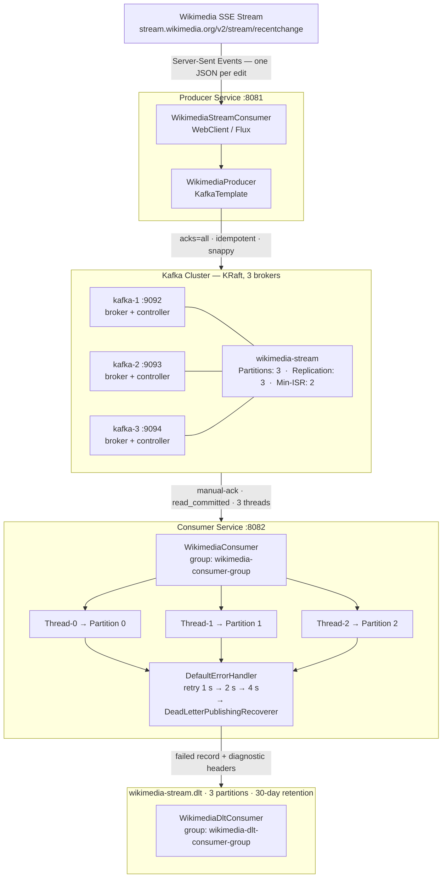

# Apache Kafka with Spring Boot

Production-grade Kafka integration built on a real-world use case: streaming live edits from the [Wikimedia Recent Changes SSE feed](https://stream.wikimedia.org/v2/stream/recentchange) through a 3-broker KRaft cluster into a Spring Boot consumer.

Spring Boot 4 · Java 25 · Kafka (KRaft) · OpenTelemetry

---

> ### 📚 New to Kafka? Don't start here.
>
> This README is the **reference manual** for the finished code. If you want to *learn* Kafka, work through the **[28-lesson course](lessons/README.md)** instead — it builds this entire pipeline from scratch, and the first seven lessons use nothing but Kafka UI and the CLI. No Java until Lesson 08.

---

## Architecture



---

## Quick start

**Prerequisites:** Docker ≥ 24, Docker Compose v2, Java 25, Maven 3.9+, ~4 GB free RAM.

```bash
# 1. Start the cluster and observability stack (11 containers)
docker compose up -d

# 2. Wait for the brokers to report (healthy) — not just Up
docker compose ps kafka-1 kafka-2 kafka-3

# 3. Verify the KRaft quorum elected a controller
docker exec kafka-1 kafka-metadata-quorum \
  --bootstrap-server kafka-1:29092 describe --status
```

Then, in two terminals:

```bash
cd consumer && ./mvnw spring-boot:run    # :8082
cd producer && ./mvnw spring-boot:run    # :8081
```

Start the stream and watch records flow:

```bash
curl http://localhost:8081/api/v1/wikimedia

docker exec kafka-1 kafka-get-offsets \
  --bootstrap-server kafka-1:29092 --topic wikimedia-stream
```

> Run `docker compose stop` / `start` between sessions. `docker compose down -v` destroys the volumes — every topic, message, and consumer offset.

---

## Service topology

| Container | Host port | Role |
|---|---|---|
| `kafka-1` | 9092 | broker + controller, node 1 |
| `kafka-2` | 9093 | broker + controller, node 2 |
| `kafka-3` | 9094 | broker + controller, node 3 |
| `schema-registry` | 8085 | schema store (container listens on 8081) |
| `kafka-ui` | 8080 | management UI |
| `kafka-exporter` | 9308 | consumer lag + topic offsets for Prometheus |
| `otel-collector` | 4317 / 4318 | OTLP receiver (metrics, traces, logs) |
| `prometheus` | 9090 | metrics store |
| `tempo` | 3200 | trace store (query API; OTLP ingest is on 4318) |
| `loki` | 3100 | log store |
| `grafana` | **3001** | dashboards (container listens on 3000) |

All services share the `kafka-network` bridge. Inter-broker traffic uses the internal `PLAINTEXT` listener on 29092; controller Raft consensus uses 29093. Apps on the host connect via `localhost:9092,9093,9094`.

**Running the CLI inside a container?** Use the internal listener — `--bootstrap-server kafka-1:29092`. Using `localhost:9092` there makes the client try to reach nodes 2 and 3 at addresses that don't exist inside the container.

---

## REST API

The consumer exposes the persisted events on `:8082`:

```bash
GET /api/v1/wikimedia/events          # paginated, newest first
GET /api/v1/wikimedia/events/recent   # 10 most recent
GET /api/v1/wikimedia/events/wiki/enwiki
GET /api/v1/wikimedia/events/type/edit    # edit | new | log | categorize
GET /api/v1/wikimedia/events/stats        # totals, bot vs human, by wiki, by type
```

H2 console at `http://localhost:8082/h2-console` — JDBC URL `jdbc:h2:mem:wikimediadb`, user `sa`, password `password`.

---

## Project structure

```
kafka-springboot/
├── lessons/                      # the 28-lesson course — start here to learn
├── docker-compose.yml            # 3-broker KRaft cluster + observability stack
├── prometheus.yml
├── otel-collector-config.yml
├── tempo-config.yml
│
├── producer/                     # :8081 — reads Wikimedia SSE, publishes to Kafka
│   └── src/main/java/com/javaguy/producer/
│       ├── config/               # WebClientConfig, WikimediaTopicConfig
│       ├── controller/           # WikimediaController — GET /api/v1/wikimedia
│       ├── producer/             # WikimediaProducer — KafkaTemplate + send callback
│       └── stream/               # WikimediaStreamConsumer — SSE → Kafka
│
└── consumer/                     # :8082 — consumes, persists, exposes REST API
    └── src/main/java/com/javaguy/consumer/
        ├── config/               # KafkaConsumerConfig (error handler + DLT), topics
        ├── consumer/             # WikimediaConsumer, WikimediaDltConsumer
        ├── controller/           # WikimediaEventController
        ├── dto/                  # WikimediaEventDto — Jackson record
        ├── entity/               # WikimediaEvent — JPA + Kafka provenance columns
        └── repository/           # Spring Data JPA + aggregation queries
```

---

## Where the concepts are explained

Every design decision in this codebase is justified in a lesson. Rather than duplicate that here:

| Topic | Lesson |
|---|---|
| Topics, partitions, offsets | [01](lessons/01-what-kafka-actually-is.md) · [03](lessons/03-first-topic-by-hand.md) |
| Keys and partition affinity | [04](lessons/04-partitions-and-keys.md) · [11](lessons/11-keys-and-partition-affinity.md) |
| Consumer groups, lag, replay | [05](lessons/05-offsets-and-consumer-groups.md) |
| Replication, ISR, `min.insync.replicas` | [06](lessons/06-replication-and-isr.md) |
| KRaft and the controller quorum | [07](lessons/07-kraft-no-zookeeper.md) |
| Topic configuration as code | [09](lessons/09-topics-as-code.md) |
| `acks` and the idempotent producer | [10](lessons/10-acks-and-idempotence.md) |
| Batching, `linger.ms`, compression | [12](lessons/12-batching-linger-compression.md) |
| Manual acknowledgment, delivery semantics | [17](lessons/17-manual-acknowledgment.md) |
| Concurrency and rebalancing | [19](lessons/19-concurrency-and-rebalancing.md) |
| Retries and the error handler | [20](lessons/20-error-handler-and-retries.md) |
| Dead-letter topic and its headers | [21](lessons/21-dead-letter-topics.md) · [22](lessons/22-dlt-headers-and-replay.md) |
| Testing with Testcontainers | [24](lessons/24-testing-with-testcontainers.md) |
| Schema Registry and Avro | [25](lessons/25-schema-registry-and-avro.md) |
| Observability (OTel, Prometheus, Grafana) | [26](lessons/26-observability.md) |
| CLI toolbox, incident recipes, production checklist | [27](lessons/27-ops-and-production-checklist.md) |

---

## Notes on this codebase

It is a **teaching artifact**, not a deployable system. Specifically:

- **No security at all.** `PLAINTEXT` listeners, no authentication, no ACLs, and a database password committed to git.
- **H2 in memory** with `ddl-auto: create-drop`. Production wants a real database, `validate`, and Flyway migrations.
- **The producer sends records without a key**, so there is no ordering guarantee between two edits to the same page. Deliberate — this pipeline only counts and stores events — but it constrains every future consumer. See [Lesson 11](lessons/11-keys-and-partition-affinity.md).
- **The consumer stores duplicates on redelivery.** `(kafka_partition, kafka_offset)` is indexed but not unique. See [Lesson 18](lessons/18-persisting-with-jpa.md).
- **`WikimediaEventController` returns JPA entities** directly. [Lesson 23](lessons/23-rest-api-over-events.md) builds the version with response DTOs and explains the cost.
- **Tracing samples at 100%.** Fine locally, ruinous at scale.

The full production checklist lives in [Lesson 27](lessons/27-ops-and-production-checklist.md).

---

## Observability

All three signals are pushed over OTLP to the collector, which fans them out:

| Signal | To | View in |
|---|---|---|
| Metrics | Prometheus `:9090` | Grafana |
| Traces | Tempo (OTLP ingest `:4318`, queries `:3200`) | Grafana → Explore → Tempo |
| Logs | Loki `:3100` | Grafana → Explore → Loki |

`kafka-exporter` is scraped directly by Prometheus for consumer lag — the metric worth alerting on:

```promql
sum(kafka_consumergroup_lag{consumergroup="wikimedia-consumer-group"})
```

Grafana is at **`http://localhost:3001`** (`admin` / `admin`). Add Prometheus (`http://prometheus:9090`), Tempo (`http://tempo:3200`), and Loki (`http://loki:3100`) as data sources, then import dashboards **7589** (Kafka Exporter) and **12900** (JVM Micrometer).

Apps run on the host by default and export to `http://localhost:4318`. Running them inside the compose network instead? Set `OTEL_COLLECTOR_URL=http://otel-collector:4318`.

Setup, verification, and the four ways this stack can fail silently: [Lesson 26](lessons/26-observability.md).

---

## Changelog

See [CHANGELOG.md](CHANGELOG.md).
