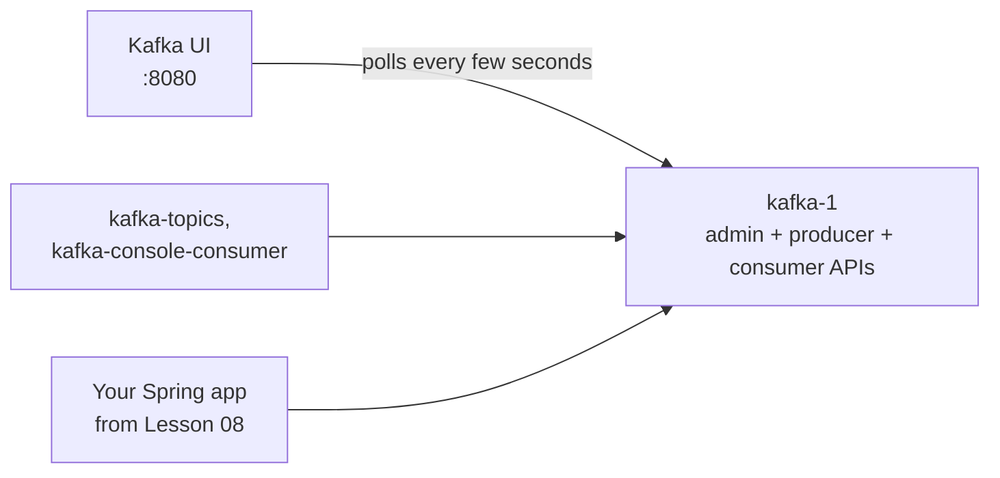

# Lesson 02: A Tour of Kafka UI

> **Part 1: Kafka Without Code**

---

## What you'll learn

- How to read the Brokers, Topics and Consumers screens
- Why a brand-new cluster has no topics at all, not even Kafka's own
- Which numbers on these screens actually matter in production
- Why a dashboard is never your source of truth

---

## Why this matters

You are about to spend five lessons manipulating Kafka by hand. Kafka UI is the window you will watch it through. When you produce a record in Lesson 03, spread a topic across partitions in Lesson 04, or kill a broker in Lesson 06, this is where you will see the effect.

More practically: when a Kafka pipeline breaks at 2 a.m., the first thing anyone opens is a screen like this one. Knowing which number says "a broker is down" and which says "a consumer is falling behind" is a real operational skill, and it is easier to learn now, on a cluster where nothing is at stake.

---

## Before you start

[Lesson 00](00-prerequisites-and-cluster.md), with your broker healthy:

```bash
docker compose ps kafka-1
```

Then open **http://localhost:8080**.

---

## The concept

Kafka has no built-in web interface. The broker exposes a binary protocol and a set of admin APIs, and that is all. Everything on these screens is Kafka UI calling those same APIs.



Two consequences worth carrying with you.

**Nothing in this UI is privileged.** Anything you can do here you can do from the CLI or from Java, because all three are the same API calls. There is no back door and no special access.

**The UI can be stale.** It polls. If the broker died two seconds ago, the screen may not know yet. When something looks wrong, confirm with `docker compose ps` and the CLI before believing a dashboard.

The tool itself is worth one note. Kafka UI was originally built by Provectus, who stopped work on it in 2023. The maintained version, and the one your Compose file runs, is the community fork published as `kafbat/kafka-ui`. If you find older tutorials referring to `provectuslabs/kafka-ui`, that image is unmaintained and has known unpatched vulnerabilities.

---

## Hands-on

### 1. The Dashboard

The landing page lists every cluster the UI is configured to watch. You have one, `local-kraft-cluster`, because that is the name you gave it in `KAFKA_CLUSTERS_0_NAME`.

Confirm three things:

| Field | Expected | Meaning |
|---|---|---|
| Status | `Online` | The UI reached the broker and got metadata back |
| Brokers | `1` | One node in the cluster |
| Version | `4.2-IV1` | The metadata version the cluster negotiated, so Kafka 4.2 |

Now look at the topic count. It is **zero**.

That is worth pausing on, because it is not what most people expect. Kafka keeps consumer positions in a topic called `__consumer_offsets`, which you read about in Lesson 01. On a cluster this fresh, that topic does not exist yet. Kafka creates it the first time a consumer group needs to commit something, and nothing has consumed yet.

You will watch it appear in Lesson 03.

### 2. Brokers

Open **Brokers** in the left navigation. One row, broker ID `1`, listening on `kafka-1:29092`. That is the internal listener from Lesson 00, because the UI runs inside the Docker network.

Four columns on this screen are the ones that tell you a cluster is unwell. All four are empty or zero right now, which is exactly why it is worth reading their definitions before they have values:

**Partitions** is how many partition *replicas* this broker stores. Not how many partitions exist in the cluster: how many copies this particular broker is responsible for.

**Leaders** is how many of those replicas this broker leads. Every partition has exactly one leader, and all reads and writes for a partition go through its leader. Followers only replicate; they serve no client traffic.

**Partitions skew** and **Leaders skew** express how far this broker is from its fair share, as a percentage.

Skew is the number that matters, and it is the one you cannot see yet. With one broker, every replica and every leader is on that broker by definition, so its fair share is 100% and skew is meaningless. Add brokers in Lesson 06 and these columns start earning their place: if one broker leads 90% of partitions, it absorbs nearly all the traffic while the others idle, and it will fall over first.

That failure mode has a specific cause and a specific fix, both in Lesson 27.

### 3. Topics

Open **Topics**, and turn on the option to show internal topics.

The list is empty. Not "empty except for the internal ones": genuinely empty.

This is Kafka being lazy in a useful way. Internal topics are created on first use, not at startup:

| Topic | Created when |
|---|---|
| `__consumer_offsets` | the first consumer group commits a position |
| `__transaction_state` | the first transactional producer starts |
| `_schemas` | Schema Registry starts, which you add in Lesson 25 |

`__cluster_metadata`, the log you read on disk in Lesson 01, does exist, but it is not a normal topic and the UI does not list it. It belongs to the Raft layer rather than to the broker's topic namespace, which is why you had to go to the filesystem to see it.

### 4. Kafka stores its own state in Kafka

`__consumer_offsets` is the one to think about, before it exists.

A consumer's position is a bookmark, as Lesson 01 established. `__consumer_offsets` is where those bookmarks live, and it is an ordinary topic: 50 partitions, replicated like anything else, holding records keyed by consumer group, topic and partition. It uses a compacted cleanup policy rather than time-based retention, because what matters is the *latest* position for each key, not the history of every commit.

Once you notice that Kafka coordinates itself using Kafka, much of its design stops looking arbitrary. Consumer positions are a topic. Cluster metadata is a log. Both get the same durability machinery as your data, because they *are* your data as far as the storage layer is concerned.

### 5. Consumers

Open **Consumers**. Empty, because nothing is consuming.

You will come back here in Lesson 05, when this becomes the most useful screen in the UI. It is where **consumer lag** lives: the gap between the last record written to a partition and the last record a group has processed.

Lag is the Kafka health metric. Not CPU, not disk. Flat lag near zero means the pipeline is keeping up. Steadily climbing lag means consumers are slower than producers, and it comes with a deadline: once a record ages past the topic's retention, it is deleted whether anyone read it or not.

### 6. Cross-check the UI against the CLI

The UI told you there is one broker and no topics. Confirm both without it:

```bash
docker exec kafka-1 kafka-topics --bootstrap-server localhost:9092 --list
```

No output. There are no topics, internal or otherwise.

```bash
docker exec kafka-1 kafka-consumer-groups --bootstrap-server localhost:9092 --list
```

No output either. No consumer groups.

Getting the same answer from two tools is not busywork. It is the habit that will save you in Lesson 06, when the UI and reality briefly disagree.

---

## Try it yourself

1. The Dashboard reports the cluster version as `4.2-IV1`. Now ask the broker what version it thinks it is:

   ```bash
   docker exec kafka-1 kafka-topics --version
   ```

   ```
   8.2.2-ccs
   ```

   Three different numbers are now in play: the image tag `8.2.2`, this `8.2.2-ccs`, and the cluster's `4.2-IV1`. Work out which of them is Confluent's packaging version and which is Apache Kafka's, then explain why a cluster tracks a *metadata* version separately from its software version at all. What would break during a rolling upgrade if it did not?

2. Ask the broker what it thinks `__consumer_offsets` should look like, before the topic exists:

   ```bash
   docker exec kafka-1 kafka-configs --bootstrap-server localhost:9092 \
     --entity-type brokers --entity-name 1 --describe --all \
     | grep -iE 'offsets.topic'
   ```

   Two of the lines that come back are the settings that will shape `__consumer_offsets` when it is created:

   ```
   offsets.topic.num.partitions=50 ... synonyms={DEFAULT_CONFIG:offsets.topic.num.partitions=50}
   offsets.topic.replication.factor=1 ... synonyms={STATIC_BROKER_CONFIG:offsets.topic.replication.factor=1, DEFAULT_CONFIG:offsets.topic.replication.factor=3}
   ```

   Read the `synonyms` on the second line carefully. It shows your Compose setting winning over Kafka's own default of 3, and it tells you which value would have applied if you had not set it. Work out what would have happened on your one-broker cluster the first time a consumer group tried to commit.

---

## Common mistakes

**Treating the UI as the source of truth.**
It polls on an interval. During a broker failure the screen lags reality by seconds. Confirm with `docker compose ps` and the CLI.

**Expecting internal topics on a fresh cluster.**
They are created on first use. An empty topic list is correct, not a sign that something failed to start.

**Reading `Offset min: 4821` as "4821 records were lost".**
It means retention has deleted records below that offset. Offsets are never reset or reused; the log start pointer simply moves forward.

**Assuming replication factor 3 means "3 copies you can read from".**
You read from the leader only. The other replicas exist for durability and failover, not for read scaling. This misconception comes straight from database read-replicas, and it is worth unlearning before Lesson 06.

---

## Check your understanding

**1. The Topics screen is empty even with internal topics shown. Lesson 01 said consumer positions are stored in a topic. Are both statements true?**

<details>
<summary>Reveal answer</summary>

Yes. `__consumer_offsets` is where positions are stored, and it does not exist yet because no consumer group has committed one.

Kafka creates its internal topics on first use rather than at startup. The moment a consumer group commits, the broker creates the topic using its `offsets.topic.num.partitions` and `offsets.topic.replication.factor` settings, and it appears in this list.

</details>

**2. `__consumer_offsets` is an ordinary topic. What does that imply about a consumer group's committed position if the broker leading that topic's partition goes down?**

<details>
<summary>Reveal answer</summary>

On a properly replicated cluster, nothing is lost: a follower replica is promoted to leader and commits continue.

On *your* cluster right now, everything is lost, because the replication factor is 1. There is no follower to promote. That is not a flaw in the design, it is the direct consequence of running one broker, and it is why the replication factor for this topic is something you set deliberately rather than leave to chance.

The deeper point is that consumer offsets get exactly the same durability guarantees as your data, using the same machinery, and therefore the same failure modes. Kafka has no separate, specially protected store for coordination state.

</details>

**3. A topic has 3 partitions and replication factor 3 on a 3-broker cluster. How many partition replicas exist, and how many accept writes?**

<details>
<summary>Reveal answer</summary>

Nine replicas: 3 partitions with 3 copies each. Every broker stores one replica of every partition.

Three accept writes: the single leader of each partition. The other six are followers that replicate from their leader and serve no client traffic at all.

This is the shape your cluster will have after Lesson 06. Right now it has 1 replica per partition, all on one broker, and every one of them is a leader.

</details>

**4. After Lesson 06 you have three brokers. One shows a leaders skew of `+64%` and the other two around `-32%`. The cluster is online and no topic reports under-replicated partitions. Is anything wrong?**

<details>
<summary>Reveal answer</summary>

Yes, it is unbalanced, even though it is healthy. One broker is leading roughly twice its fair share of partitions, so it absorbs roughly twice the read and write traffic while the other two are underused.

Nothing is broken and no data is at risk, which is exactly why this is easy to miss. It usually happens after a broker restarts: its partitions get re-led by whoever took over, and leadership does not move back on its own. The remedy is a preferred-leader election, in Lesson 27.

</details>

**5. Why is consumer lag a better production alert than "consumer CPU is high"?**

<details>
<summary>Reveal answer</summary>

Because lag measures the thing you actually care about, whether the pipeline is keeping up, and it does so regardless of why it is not.

High CPU might mean your consumer is working hard and keeping up perfectly. Low CPU might mean it is blocked on a slow database and falling badly behind. Lag captures both in one number: records produced but not yet processed.

Rising lag also has a hard deadline attached. Once a record ages past the topic's retention it is deleted, whether or not it was ever consumed.

</details>

---

## Recap

You toured the three screens you will use for the rest of Part 1. Brokers shows who is alive and, once you have more than one, whether work is spread evenly. Topics is empty, which taught you that Kafka creates its internal topics on first use rather than at startup. Consumers is empty too, but it is where lag will appear, and lag is the number that matters.

You also checked both claims against the CLI and got the same answers, which is the habit worth keeping.

Now put something in a topic.

**Next:** [Lesson 03: Create a Topic, Produce and Consume by Hand](03-first-topic-by-hand.md)
