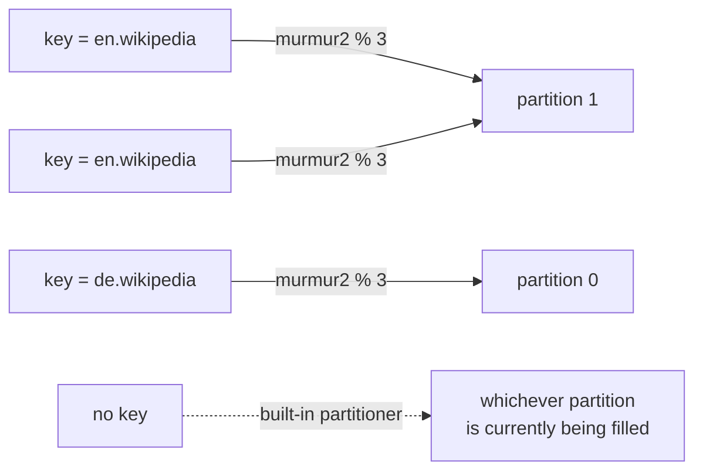

# Lesson 04: Partitions and Keys

> **Part 1: Kafka Without Code**

---

## What you'll learn

- How Kafka decides which partition a record goes to
- Why the same key always lands on the same partition, and why that is the whole point
- What actually happens to records with no key, which is not round-robin
- Why adding partitions to a keyed topic is a breaking change

---

## Why this matters

Lesson 01 claimed that ordering holds only within a partition, so records that must stay in order must share a partition. This lesson is where you take control of that.

The mechanism is one line of arithmetic, and getting it wrong produces a specific and nasty class of production bug: `order-cancelled` processed before `order-created`, a user's second update overwriting their third, a balance going negative because two transfers were applied out of order. None of those look like Kafka bugs. They look like application bugs, and you will spend a day chasing them.

In Lesson 03 you produced five records to a three-partition topic and they all landed on one partition. By the end of this lesson you will know exactly why, and what it cost you.

---

## Before you start

[Lesson 03](03-first-topic-by-hand.md), with your broker healthy.

---

## The concept

When a producer sends a record, something has to choose a partition:

```
if the record has a key:
    partition = murmur2(key) % numberOfPartitions
else:
    partition = chosen by the producer's built-in partitioner
```

The keyed case is the one to memorise. The key is hashed with `murmur2`, and the hash is taken modulo the partition count.

Three consequences fall straight out.

**The same key always maps to the same partition.** The hash is deterministic. `murmur2("en.wikipedia") % 3` gives the same answer today, tomorrow, and on anyone else's machine.

**Kafka does not care what the key means.** It is bytes to be hashed. Whether it is a user ID, an order ID or a wiki name is entirely your decision.

**The partition count is part of the equation.** Change it and existing keys start hashing somewhere else. Hold that thought until the last quiz question.



---

## Hands-on

### 1. A topic with three partitions

```bash
docker exec kafka-1 kafka-topics \
  --bootstrap-server localhost:9092 \
  --create --topic lessons-keys \
  --partitions 3 --replication-factor 1
```

### 2. Produce records with keys

The console producer has to be told that your input contains keys, and what separates key from value:

```bash
docker exec -it kafka-1 kafka-console-producer \
  --bootstrap-server localhost:9092 \
  --topic lessons-keys \
  --reader-property parse.key=true \
  --reader-property key.separator=:
```

At the prompt, type these six lines. Three distinct keys, some repeated:

```
>en.wikipedia:edit-1
>de.wikipedia:edit-2
>en.wikipedia:edit-3
>fr.wikipedia:edit-4
>en.wikipedia:edit-5
>de.wikipedia:edit-6
```

Ctrl-D to exit.

### 3. See where they landed

```bash
docker exec kafka-1 kafka-console-consumer \
  --bootstrap-server localhost:9092 \
  --topic lessons-keys \
  --from-beginning --max-messages 6 \
  --formatter-property print.key=true \
  --formatter-property print.partition=true \
  --formatter-property key.separator=' | '
```

```
Partition:2 | fr.wikipedia | edit-4
Partition:0 | de.wikipedia | edit-2
Partition:0 | de.wikipedia | edit-6
Partition:1 | en.wikipedia | edit-1
Partition:1 | en.wikipedia | edit-3
Partition:1 | en.wikipedia | edit-5
Processed a total of 6 messages
```

Stop and read that.

- Every `en.wikipedia` record is on partition **1**. All three.
- Every `de.wikipedia` record is on partition **0**. Both.
- `fr.wikipedia` is on partition **2**.

You should see exactly these partition numbers, not merely a similar grouping. `murmur2` is deterministic, so with three partitions `en.wikipedia` hashes to partition 1 on every machine.

Within partition 1, the `en.wikipedia` records appear as `edit-1`, `edit-3`, `edit-5`, the order you typed them. That is the guarantee you bought by using a key.

Notice what the *partitions* did, though. The consumer returned partition 2 first, then 0, then 1, which is neither the order you produced nor ascending partition order. Your run may group them differently again. Across partitions, order means nothing, and a consumer is free to return whatever a poll gave it.

### 4. Now produce records without keys

```bash
docker exec kafka-1 kafka-topics \
  --bootstrap-server localhost:9092 \
  --create --topic lessons-nokey \
  --partitions 3 --replication-factor 1

printf 'a\nb\nc\nd\ne\nf\n' | docker exec -i kafka-1 kafka-console-producer \
  --bootstrap-server localhost:9092 --topic lessons-nokey
```

Predict the result before you look. Six records, three partitions, no keys, so two each?

```bash
docker exec kafka-1 kafka-console-consumer \
  --bootstrap-server localhost:9092 \
  --topic lessons-nokey \
  --from-beginning --max-messages 6 \
  --formatter-property print.partition=true
```

All six land on **one** partition. Which one varies; do not be surprised by a number other than 0.

Confirm it from the offsets:

```bash
docker exec kafka-1 kafka-get-offsets \
  --bootstrap-server localhost:9092 --topic lessons-nokey
```

```
lessons-nokey:0:6
lessons-nokey:1:0
lessons-nokey:2:0
```

Two partitions are completely empty.

### 5. Why, and what the partitioner actually does

Almost every tutorial will tell you keyless records are distributed round-robin, one record at a time. That has not been true since Kafka 2.4, and the mechanism has changed again since.

What Kafka 4 actually does, in the producer's built-in partitioner:

- Keyless records are sent to one partition until roughly `batch.size` **bytes** have accumulated for it, then the partitioner switches to another partition.
- The switch is driven by bytes produced, not by whether a batch happened to be full and not by `linger.ms`.
- By default the choice is *adaptive*: partitions on brokers that have been responding slowly are chosen less often, so a struggling broker naturally receives less traffic.

Your six tiny records were nowhere near `batch.size`, which defaults to 16 KiB, so the partitioner never switched. They all went to one partition.

Two pieces of history worth knowing, because you will meet both in older material. The class that introduced this behaviour was called the *sticky partitioner*, added in Kafka 2.4. It and `DefaultPartitioner` were deprecated in Kafka 3.3 and **removed in Kafka 4.0**. If you find a tutorial telling you to set `partitioner.class=org.apache.kafka.clients.producer.UniformStickyPartitioner`, that class no longer exists; the built-in behaviour replaced it and is what you get by configuring nothing.

Why batch rather than spread? Because batching is per partition, and a batch is the unit of network request and of compression. Spreading six records across three partitions turns one request into three, each a third the size and each compressing worse. Filling one partition at a time produces fewer, larger, better-compressed requests. Over millions of records the distribution evens out.

> The takeaway: "no key" does not mean "evenly spread". It means you have given up all control over placement, and therefore all ordering guarantees between your records. Over millions of records the load balances. Over any six of them, it may not.

### 6. Prove the modulo is real

Create the same keys on a topic with a different partition count:

```bash
docker exec kafka-1 kafka-topics \
  --bootstrap-server localhost:9092 \
  --create --topic lessons-keys-4 \
  --partitions 4 --replication-factor 1

printf 'en.wikipedia:x\nde.wikipedia:x\nfr.wikipedia:x\n' \
  | docker exec -i kafka-1 kafka-console-producer \
    --bootstrap-server localhost:9092 --topic lessons-keys-4 \
    --reader-property parse.key=true --reader-property key.separator=:

docker exec kafka-1 kafka-console-consumer \
  --bootstrap-server localhost:9092 --topic lessons-keys-4 \
  --from-beginning --max-messages 3 \
  --formatter-property print.key=true \
  --formatter-property print.partition=true \
  --formatter-property key.separator=' | '
```

```
Partition:0 | en.wikipedia | x
Partition:2 | fr.wikipedia | x
Partition:1 | de.wikipedia | x
```

`en.wikipedia` was on partition 1 with three partitions. With four it is on partition 0. `de.wikipedia` moved from 0 to 1.

Nothing about the key changed. Only the divisor did. That single observation is the whole reason the last quiz question matters, and the reason partition counts on keyed topics are treated as near-permanent.

---

## Try it yourself

1. Run the keyless `printf` from step 4 five more times against `lessons-nokey`, checking `kafka-get-offsets` after each run. Do all three partitions eventually receive records? Given what step 5 said about `batch.size`, explain why the distribution changes between runs at all, when no single run gets anywhere near 16 KiB.

2. Find the volume at which the partitioner actually starts switching. First try two thousand small records:

   ```bash
   docker exec kafka-1 bash -c 'for i in $(seq 1 2000); do echo "record-$i"; done \
     | kafka-console-producer --bootstrap-server localhost:9092 --topic lessons-nokey'
   ```

   Check `kafka-get-offsets`. They will very likely all be on one partition still. Now push fifty thousand larger ones:

   ```bash
   docker exec kafka-1 bash -c 'for i in $(seq 1 50000); do echo "record-$i-padding-padding-padding"; done \
     | kafka-console-producer --bootstrap-server localhost:9092 --topic lessons-nokey'
   ```

   ```
   lessons-nokey:0:18533
   lessons-nokey:1:13907
   lessons-nokey:2:17566
   ```

   Now it has spread, and notably it is not even: one partition took a third more than another. Explain both observations in terms of bytes against `batch.size` rather than record counts, and say why "roughly equal in the long run" is the strongest promise available here.

3. You have a topic keyed by `user_id` with 3 partitions and a year of data, and you increase it to 6 partitions. A user's old records are on partition 1. Where do their new records go, and what exactly breaks for a consumer that needs that user's events in order?

---

## Common mistakes

**"No key means round-robin."**
It has not since Kafka 2.4. The built-in partitioner fills one partition at a time, switching after roughly `batch.size` bytes, and it is bursty by design.

**Configuring `partitioner.class=UniformStickyPartitioner`.**
That class and `DefaultPartitioner` were removed in Kafka 4.0. The behaviour they provided is now built in, so configure nothing.

**Using a key with very low cardinality.**
Keying by `country` when 90% of your traffic is one country puts 90% of records on one partition. That partition's consumer becomes your bottleneck while the others idle. This is a *hot partition*, and it is the most common Kafka scaling failure.

**Using a maximum-cardinality key when you did not need ordering.**
Keying by a UUID that appears exactly once gives perfect distribution and zero ordering benefit. You paid the hashing cost for nothing. Omit the key.

**Assuming the consumer reads partitions in produce order, or in partition order.**
It does neither. It returns whatever the broker gave it for that poll, partition by partition, as step 3 showed.

---

## Check your understanding

**1. You produce 1,000 records keyed by `user_id` to a 3-partition topic. Is the load evenly spread?**

<details>
<summary>Reveal answer</summary>

Roughly, but only if `user_id` has high cardinality and no single user dominates.

`murmur2` distributes uniformly across the *key space*, not across your *traffic*. If one power user generates 40% of your records, 40% of your traffic lands on one partition no matter how good the hash is.

Even distribution depends on the distribution of your keys, not on the hash function.

</details>

**2. Records with the same key always land on the same partition. Does the reverse hold: do records on the same partition always have the same key?**

<details>
<summary>Reveal answer</summary>

No. The mapping is many-to-one. With 3 partitions and thousands of distinct keys, roughly a third of all keys share partition 0.

This matters because ordering is guaranteed per partition, which is stronger than you asked for but is what you get. Records for unrelated keys that happen to collide on a partition are still processed in log order, so a slow record for key A delays key B queued behind it.

</details>

**3. Your producer sends with no key. You need `order-created` processed before `order-cancelled` for the same order. A colleague suggests setting `linger.ms=0` so batches are small. Does that fix it?**

<details>
<summary>Reveal answer</summary>

No, and the reasoning behind the suggestion is wrong twice over.

`linger.ms` does not drive partition switching in the first place; accumulated bytes against `batch.size` do. So changing it does not make the two records more likely to share a partition.

Even if it did, and even if they happened to land together, that would be luck rather than a guarantee. Nothing would stop the next pair from splitting.

The only fix is to give both records the same key, the order ID, so they hash to the same partition. Ordering is a partitioning decision, not a batching one.

</details>

**4. A topic keyed by `user_id` has 3 partitions and 12 months of history. You increase it to 6 partitions for more consumer parallelism. What exactly breaks?**

<details>
<summary>Reveal answer</summary>

The key-to-partition mapping changes for most keys, because the formula is `murmur2(key) % partitionCount` and the divisor just went from 3 to 6. You watched this happen in step 6 with three keys and a change from 3 to 4.

Concretely: a user whose records have always been on partition 1 may now have new records written to partition 4. Their history is split across two partitions, and the per-key ordering guarantee is broken across that boundary, because a consumer reading partition 4 has no way to know partition 1 holds earlier records for the same user.

Old data is not moved or rewritten. Nothing errors and nothing warns you. That is why partition counts on keyed topics are treated as near-permanent, and why people over-provision partitions up front.

If you need per-key ordering preserved across a resize, create a new topic with the target partition count and re-key the data into it.

</details>

**5. Why does filling one partition at a time improve throughput, when it makes the short-term distribution worse?**

<details>
<summary>Reveal answer</summary>

Because a producer batches records per partition, and a batch is the unit of both network request and compression.

Spreading records evenly across 3 partitions gives you 3 batches that each fill a third as fast, so each is sent smaller, or later, or both. Three small requests cost more than one large one, and small batches compress poorly.

Filling one partition until roughly `batch.size` bytes have gone to it produces one large, well-compressed request. Across many batches the partitions receive roughly equal shares, so the long-run distribution is fine.

You trade short-term evenness for throughput. That is a good trade when records are independent, and it is irrelevant when they are keyed, because a key overrides the partitioner entirely.

</details>

**6. `partitioner.adaptive.partitioning.enable` defaults to true, so keyless records avoid slow brokers. Why does that setting have no effect at all on keyed records?**

<details>
<summary>Reveal answer</summary>

Because a key determines the partition arithmetically, and the partition determines the broker. There is no choice left to make.

`murmur2(key) % partitionCount` names a partition, that partition has exactly one leader, and the record must go to that leader. If the leader is slow, the producer waits. Adaptive partitioning can only help when the producer is free to choose, which is precisely the keyless case.

That is the hidden cost of keying: you gain ordering and lose the ability to route around a struggling broker. A hot partition on a slow broker is therefore doubly bad, and no producer setting will save you from it.

</details>

---

## Recap

`partition = murmur2(key) % partitionCount` when there is a key, and the built-in partitioner when there is not. Same key, same partition, therefore same log, therefore ordered. No key means no control and no ordering, in exchange for larger batches and more throughput.

You also proved the modulo is real by watching two keys move partitions when the count changed from 3 to 4, which is the mechanism behind the most expensive mistake in this lesson.

Next, the other half of the picture: not who writes to a partition, but who reads it.

**Next:** [Lesson 05: Offsets and Consumer Groups](05-offsets-and-consumer-groups.md)
