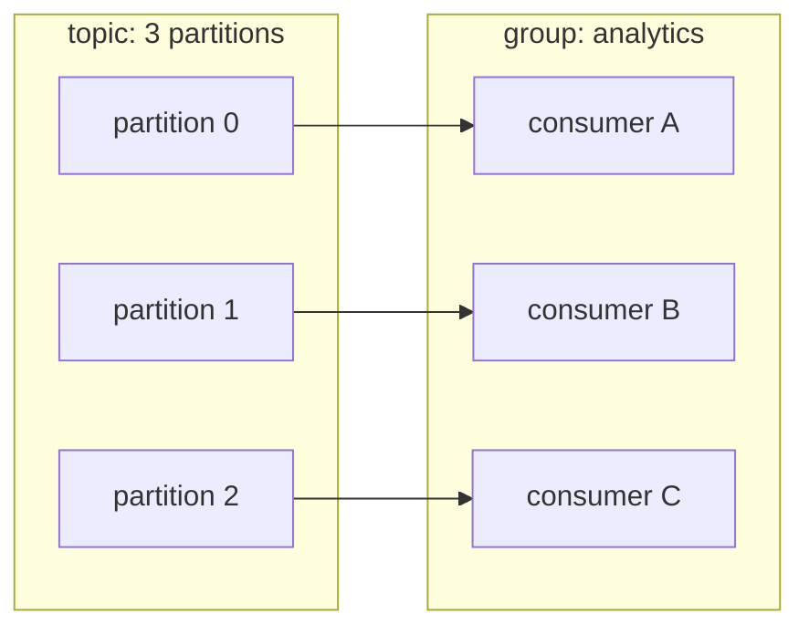

# Lesson 05: Offsets and Consumer Groups

> **Part 1: Kafka Without Code**

---

## What you'll learn

- What a consumer group is, and why every consumer belongs to one
- How to read consumer lag, the number you will alert on in production
- How partitions are assigned to group members, and what happens when there are too many members
- How to replay a topic by resetting offsets

---

## Why this matters

Consumer groups are how Kafka scales reading, and offsets are how it remembers where you were. Together they deliver the two properties that made Kafka worth learning in Lesson 01: many independent readers, and replay.

This is also the lesson with the most operational payoff. When a Kafka pipeline is in trouble, "what is the lag on this group?" is the first question asked, and `kafka-consumer-groups --describe` is the command that answers it. Resetting offsets is how you recover after shipping a bad consumer.

---

## Before you start

[Lesson 04](04-partitions-and-keys.md). You will create a fresh topic here, so leftovers do not matter.

---

## The concept

### Every consumer is in a group

There is no such thing as a consumer outside a group. When you ran `kafka-console-consumer` without a `--group` flag in Lesson 03, Kafka invented a throwaway group named something like `console-consumer-73947`. That is why running it twice replayed everything: each run was a different group with no saved position.

A consumer group is identified by a string, its `group.id`, and it owns two things:

- a set of members that come and go
- a committed offset per partition, stored in `__consumer_offsets`

### One partition, one member

Within a group, each partition is assigned to exactly one member. That single rule is where everything else follows from:



Add a fourth consumer to that group and it gets nothing. It sits idle, waiting for one of the other three to die. The partition count is a hard ceiling on a group's parallelism.

This is also why per-partition ordering is safe to rely on: only one member ever reads a given partition, so records within it are processed in log order by a single consumer.

Note what is *not* in that diagram: brokers. Partition assignment is a property of the group and the topic, not of how many machines you are running. Your cluster has one broker and this lesson still works completely.

### Different groups are independent

Two groups reading the same topic each receive every record and each track their own offsets. They cannot affect one another. `billing` falling behind does not slow `analytics`, and neither can delete data the other needs.

### Lag

Lag is the log end offset minus the committed offset, per partition. It is the number of records produced but not yet processed by that group.

Flat and near zero means the group is keeping up. Steadily climbing means consumers are slower than producers, and you have until the retention window expires to fix it.

---

## Hands-on

### 1. Set up

```bash
docker exec kafka-1 kafka-topics \
  --bootstrap-server localhost:9092 \
  --create --topic lessons-groups \
  --partitions 3 --replication-factor 1

printf 'a\nb\nc\nd\ne\nf\ng\nh\ni\n' | docker exec -i kafka-1 kafka-console-producer \
  --bootstrap-server localhost:9092 --topic lessons-groups
```

Nine records. Check where they went:

```bash
docker exec kafka-1 kafka-get-offsets \
  --bootstrap-server localhost:9092 --topic lessons-groups
```

```
lessons-groups:0:0
lessons-groups:1:0
lessons-groups:2:9
```

Keyless, so as Lesson 04 established, the built-in partitioner put them all on one partition. Two partitions are empty. That is about to teach you something.

### 2. Consume as a named group

```bash
docker exec kafka-1 kafka-console-consumer \
  --bootstrap-server localhost:9092 \
  --topic lessons-groups \
  --from-beginning \
  --group demo-group \
  --max-messages 9
```

All nine records print. Now the important part, inspecting the group:

```bash
docker exec kafka-1 kafka-consumer-groups \
  --bootstrap-server localhost:9092 \
  --describe --group demo-group
```

```
Consumer group 'demo-group' has no active members.

GROUP           TOPIC           PARTITION  CURRENT-OFFSET  LOG-END-OFFSET  LAG             CONSUMER-ID     HOST            CLIENT-ID
demo-group      lessons-groups  0          0               0               0               -               -               -
demo-group      lessons-groups  1          0               0               0               -               -               -
demo-group      lessons-groups  2          9               9               0               -               -               -
```

Read it column by column:

- **`has no active members`**: the console consumer exited. The group still exists, with its offsets intact. A group outlives its members.
- **`CURRENT-OFFSET`**: where the group's bookmark sits. Partition 2 is at 9; the empty partitions are at 0.
- **`LOG-END-OFFSET`**: where each partition's log ends.
- **`LAG 0`** on every row: fully caught up.
- **`CONSUMER-ID` is `-`**: nobody is assigned right now.

Notice the group has a committed offset for partitions 0 and 1 even though it never read a record from them. Joining a group and being assigned a partition is enough to establish a position there.

> If you see no offsets at all, the consumer exited before committing. The console consumer auto-commits on an interval and on clean shutdown, so use `--max-messages` and let it exit normally, as above.

### 3. Watch lag appear

Produce four more records without consuming them:

```bash
printf 'j\nk\nl\nm\n' | docker exec -i kafka-1 kafka-console-producer \
  --bootstrap-server localhost:9092 --topic lessons-groups

docker exec kafka-1 kafka-consumer-groups \
  --bootstrap-server localhost:9092 --describe --group demo-group
```

```
GROUP           TOPIC           PARTITION  CURRENT-OFFSET  LOG-END-OFFSET  LAG             CONSUMER-ID     HOST            CLIENT-ID
demo-group      lessons-groups  0          0               0               0               -               -               -
demo-group      lessons-groups  1          0               4               4               -               -               -
demo-group      lessons-groups  2          9               9               0               -               -               -
```

Partition 1 now shows `LAG 4`. Four records exist that `demo-group` has not processed.

Two things to take from that output. Nobody is running and nothing is broken: lag is a statement about a group's position against the log, and it does not require a live consumer. And the four new records went to partition **1**, while the first nine went to partition 2, which is the built-in partitioner switching between separate producer runs exactly as Lesson 04 described.

### 4. Two consumers, one group

Open two terminals and run the same command in each:

```bash
docker exec -it kafka-1 kafka-console-consumer \
  --bootstrap-server localhost:9092 \
  --topic lessons-groups \
  --group split-group \
  --from-beginning \
  --formatter-property print.partition=true
```

Both connect. From a third terminal, look at the assignment:

```bash
docker exec kafka-1 kafka-consumer-groups \
  --bootstrap-server localhost:9092 --describe --group split-group
```

Three partitions, two members. One consumer holds two partitions, the other holds one. Kafka split the work, and the `CONSUMER-ID`, `HOST` and `CLIENT-ID` columns are now populated.

Start a third consumer with the same command and describe again: each member now owns exactly one partition.

Start a fourth. Describe again. One member is assigned no partitions at all.

That is the ceiling from the concept section, in the flesh. A fourth consumer cannot help, because three partitions can feed at most three members.

Now press Ctrl-C on the consumer that owns partition 0 and re-describe within a few seconds. The idle fourth consumer picks up partition 0. That handover is a **rebalance**, and Lesson 19 is about what it costs.

Ctrl-C the rest.

### 5. Replay by resetting offsets

This is the payoff for the whole "log, not a queue" idea.

Always dry-run first. Omit `--execute` and Kafka tells you what it would do:

```bash
docker exec kafka-1 kafka-consumer-groups \
  --bootstrap-server localhost:9092 \
  --group demo-group --topic lessons-groups \
  --reset-offsets --to-earliest
```

```
WARN: No action will be performed as the --execute option is missing. In version 5.0, this command will require either --dry-run or --execute to be specified. You should add the --dry-run option explicitly if you are scripting this command and want to keep the current default behavior without prompting.

GROUP           TOPIC           PARTITION  NEW-OFFSET
demo-group      lessons-groups  2          0
demo-group      lessons-groups  0          0
demo-group      lessons-groups  1          0
```

Read that warning rather than skipping it. Today, omitting `--execute` means a dry run. In Kafka 5.0 it will be an error, and you will have to say `--dry-run` explicitly. If you script this command, write `--dry-run` now.

Then do it:

```bash
docker exec kafka-1 kafka-consumer-groups \
  --bootstrap-server localhost:9092 \
  --group demo-group --topic lessons-groups \
  --reset-offsets --to-earliest --execute
```

Check the result:

```bash
docker exec kafka-1 kafka-consumer-groups \
  --bootstrap-server localhost:9092 --describe --group demo-group
```

```
GROUP           TOPIC           PARTITION  CURRENT-OFFSET  LOG-END-OFFSET  LAG             CONSUMER-ID     HOST            CLIENT-ID
demo-group      lessons-groups  0          0               0               0               -               -               -
demo-group      lessons-groups  1          0               4               4               -               -               -
demo-group      lessons-groups  2          0               9               9               -               -               -
```

Thirteen records pending across two partitions. Start a consumer with `--group demo-group --from-beginning` and all thirteen replay.

You copied nothing and re-produced nothing. The records never left. You moved a bookmark.

> A group must have no active members to reset. Kafka refuses to move offsets out from under a running consumer. In production that means stopping the service, resetting, and starting it again.

Other targets, all useful in an incident:

| Flag | Moves the group to |
|---|---|
| `--to-earliest` | the oldest retained record |
| `--to-latest` | the end of the log, skipping everything pending |
| `--to-offset 500` | an exact offset |
| `--to-datetime 2026-07-09T00:00:00.000` | the first record after a timestamp |
| `--shift-by -100` | 100 records back from where it is now |

`--to-datetime` is the one you will actually reach for: replay everything since the bad deploy went out at 09:15. It works because of the `.timeindex` file you found in Lesson 01.

### 6. Clean up

```bash
for t in lessons-groups lessons-keys lessons-keys-4 lessons-nokey lessons-demo ordering-test; do
  docker exec kafka-1 kafka-topics --bootstrap-server localhost:9092 --delete --topic $t 2>/dev/null
done
```

Leave `__consumer_offsets` alone. Lesson 06 starts from a clean cluster anyway, for reasons that will be obvious when you get there.

---

## Try it yourself

1. Consume `lessons-groups` with `--group A`, then separately with `--group B`. Both see all records. Now reset `A` to earliest and describe `B`. Did `B` move? Why is that the single most important property in this lesson?

2. Run `kafka-consumer-groups --bootstrap-server localhost:9092 --list`. You will see leftover `console-consumer-*` groups from Lesson 03 alongside the ones you named. Where did they come from, why does each have a different number, and what would eventually remove them?

3. Reset `demo-group` with `--to-latest` instead of `--to-earliest`, then start a consumer. Nothing arrives. Name a real situation in which throwing away every pending record is the correct action.

4. Try to reset the offsets of a group while a consumer is running: start a consumer with `--group demo-group` in one terminal and run the reset in another. Read the error. Then explain why Kafka can enforce this at all, given that the consumer and the CLI are two unrelated processes.

---

## Common mistakes

**Running `--reset-offsets` while the consumer is running.**
Kafka refuses, and it is saving you. Stop the group first.

**Forgetting `--execute` and thinking the reset worked.**
Without it you get a dry run and a warning. From Kafka 5.0 this becomes an error rather than a default.

**Believing lag requires a running consumer.**
Lag is log end minus committed. It is defined whether or not anyone is connected, which is exactly why it works as an alert.

**Adding consumers beyond the partition count to go faster.**
They idle. To scale past the partition count you must add partitions, with all the key-remapping consequences from Lesson 04.

**Using the same `group.id` for two different applications.**
They will split the partitions between them, and each application will see only some of the records. Two applications that both need every record need two group IDs. This is a genuinely nasty bug, because it looks like random data loss rather than a configuration mistake.

---

## Check your understanding

**1. A topic has 3 partitions and a group has 5 consumers. How many are doing work, and what are the other two for?**

<details>
<summary>Reveal answer</summary>

Three are assigned one partition each. The other two are idle, assigned nothing and consuming nothing.

They are not useless: they are hot standbys. If a working consumer dies, a rebalance triggers and an idle member picks up the orphaned partition within seconds. You are trading wasted capacity for faster failover.

To actually increase throughput you must increase the partition count.

</details>

**2. `--describe` shows `CURRENT-OFFSET 500`, `LOG-END-OFFSET 500`, `LAG 0`, and `has no active members`. Is this pipeline healthy?**

<details>
<summary>Reveal answer</summary>

It is caught up, and it is not running. Those are two different claims and this output makes both.

Zero lag with no members means the group processed everything and then stopped. If that is a batch job that finished, fine. If it is a service that should be running, your consumer is down, and because nothing has been produced since, lag alone will not tell you.

Alert on lag *and* on member count. Lag near zero is only reassuring while consumers are alive.

</details>

**3. Group `billing` resets to earliest and replays 10 million records. What happens to group `analytics`, which reads the same topic?**

<details>
<summary>Reveal answer</summary>

Logically, nothing. `analytics` keeps its own committed offsets in `__consumer_offsets` under its own group ID and does not observe `billing` at all.

Physically, there is one shared effect: replaying 10 million records makes the brokers do real work, in disk reads and network, which can add latency for everyone. Isolation is logical, not physical.

</details>

**4. You deploy a consumer with a bug that wrote wrong data to your database for six hours. The topic retains records for seven days. Describe the recovery, and name the one thing that would make it impossible.**

<details>
<summary>Reveal answer</summary>

Fix the bug, deploy it, stop the consumer, clean up the corrupted rows, then:

```
--reset-offsets --to-datetime <six hours ago> --execute
```

Restart. The consumer reprocesses the last six hours from the log.

What makes it impossible is retention shorter than the window you need to replay. If the topic kept only one hour, the records are gone and no reset can bring them back. This is why a dead-letter topic is usually given far longer retention than the topic it protects, which you will configure in Lesson 21: failures need a longer investigation window than the happy path.

A second, subtler blocker: if reprocessing is not idempotent, replaying six hours may double-count. That is Lesson 17.

</details>

**5. Why does Kafka store consumer offsets in a topic rather than in a database table on the controller?**

<details>
<summary>Reveal answer</summary>

Because a compacted, replicated Kafka topic already is a fault-tolerant, ordered, replicated key-value store, and Kafka has to run one anyway.

Offset commits get the same replication factor, the same leader election and the same durability guarantees as your data, using code that is already on the hot path and heavily optimised. A separate datastore would mean a second consistency model, a second failure mode and a second thing to operate.

It also means an offset commit is just a produce, which is why committing is fast, and why a group's position survives exactly the failures the data itself survives. On your one-broker cluster, that cuts both ways.

</details>

**6. In step 2, `demo-group` had a committed offset of 0 for partitions 0 and 1, which contained no records at all. Why commit a position in an empty partition?**

<details>
<summary>Reveal answer</summary>

Because the group was assigned those partitions, and a position is per assigned partition rather than per record read.

The commit records "I have consumed everything up to offset 0", which is true and useful: it is what makes `LAG 0` correct for an empty partition rather than unknown. It also means that when records finally arrive on partition 1, as they did in step 3, the group already has a defined starting point and `auto.offset.reset` never comes into play.

That is the general shape of it. `auto.offset.reset` applies only when a group has *no* committed offset for a partition, which is why it matters on the very first run and effectively never afterwards.

</details>

---

## Recap

Every consumer belongs to a group. Within a group, one partition goes to exactly one member, so the partition count caps parallelism and extra members idle as standbys. Groups are mutually invisible, each keeping its own bookmark in `__consumer_offsets`. Lag is log end minus committed, defined even when nobody is running, which is what makes it the alert worth building. And because reads never destroy, moving the bookmark replays history.

One thing has been quietly assumed for five lessons: that the data is still there when you go looking, even if a machine dies. Your cluster has one broker, so that assumption is currently false. Time to fix it.

**Next:** [Lesson 06: Replication and ISR](06-replication-and-isr.md)
