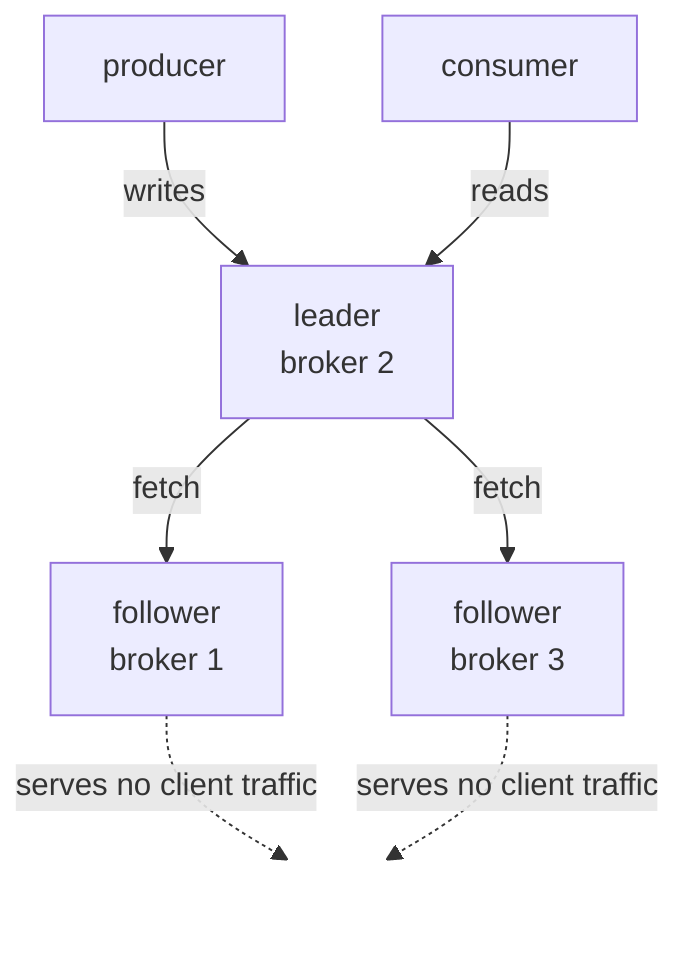

# Lesson 06: Replication and ISR

> **Part 1: Kafka Without Code**

---

## What you'll learn

- How to grow your cluster from one broker to three
- What the ISR is, and why only its members can become leader
- How `acks` and `min.insync.replicas` work as a pair, and what each does without the other
- What actually happens to a write when the cluster cannot honour the durability you asked for

---

## Why this matters

Five lessons have quietly assumed your data is still there when you go looking. On a one-broker cluster that assumption is false: lose the broker and you lose everything. This is the lesson where that stops being true.

It is also the lesson with the most dangerous misconceptions attached. Two settings control durability, they live in different places, and each is inert without the other. Configure one and you have the comforting feeling of durability with none of the substance. You will produce records into a deliberately broken cluster and watch exactly what survives.

---

## Before you start

[Lesson 05](05-offsets-and-consumer-groups.md), with your single broker running. You are about to change `docker-compose.yml`.

---

## The concept

### Replicas, leaders, followers

A partition with replication factor 3 exists as three copies on three brokers.

- Exactly one copy is the **leader**. All reads and writes go through it.
- The other two are **followers**. They continuously fetch from the leader and do nothing else.



Followers are not read replicas. They exist so that when the leader dies, one of them can take over without losing data. Adding replicas buys durability and failover, never read throughput.

### The ISR

A follower is **in sync** if it has fetched from the leader recently, within `replica.lag.time.max.ms`, which defaults to 30 seconds. The set of caught-up replicas, including the leader, is the **ISR**.

The ISR is dynamic. A follower that falls behind because of a slow disk, a network problem or a stopped process is ejected, and rejoins when it catches up.

The guarantee that matters: **only a member of the ISR can be elected leader.** A replica that missed the last ten thousand records must never become leader, because promoting it would silently erase them.

Kafka 4 adds a refinement called **ELR**, for Eligible Leader Replicas. When a replica leaves the ISR, Kafka can still remember that it held every committed record at the moment it left, which keeps it eligible for promotion later. You will see the `Elr` column populate during the experiment below, and it is the reason the `--describe` output has two columns you have so far been able to ignore.

### `acks` and `min.insync.replicas` are a pair

Two settings, in two different places, that only work together.

**`acks`** is a *producer* setting. It answers: how many replicas must confirm this write before `send()` is considered successful?

| `acks` | Leader waits for | If the leader dies right after acknowledging |
|---|---|---|
| `0` | nothing, not even the leader's own append | record probably lost |
| `1` | itself only | record lost if no follower had fetched yet |
| `all` | every replica currently in the ISR | record survives |

**`min.insync.replicas`** is a *topic* setting, with a broker-level default. It answers: how small may the ISR shrink before the partition is considered unable to accept durable writes?

The crucial detail is what "all" means. `acks=all` waits for all **in-sync** replicas, not all assigned replicas. If the ISR has shrunk to one, `acks=all` means "the leader", and on its own it would degrade silently as replicas fail. `min.insync.replicas` is what puts a floor under that.

So neither setting does its job alone. `acks=all` without a floor degrades to `acks=1` as replicas drop out. A floor without `acks=all` is a promise the producer never asks anyone to keep.

### The standard configuration

Replication factor 3, `min.insync.replicas` 2, `acks=all`.

You tolerate exactly one broker failure with full durability. Lose one broker and the ISR drops to 2, which still meets the floor, so writes continue. Lose two and writes are refused: Kafka chooses to be unavailable rather than accept a write it cannot make durable.

That is a deliberate choice of consistency over availability, and it is the right default for data you care about. You will declare exactly this configuration in code in Lesson 09.

---

## Hands-on

### 1. Add two brokers

Open `docker-compose.yml`. First, change one line in `kafka-1`, so that all three nodes will vote on cluster metadata:

```yaml
      KAFKA_CONTROLLER_QUORUM_VOTERS: '1@kafka-1:29093,2@kafka-2:29093,3@kafka-3:29093'
```

Then raise the replication settings for Kafka's own internal topics, which have been pinned at 1 because one broker could not do better:

```yaml
      KAFKA_OFFSETS_TOPIC_REPLICATION_FACTOR: 3
      KAFKA_TRANSACTION_STATE_LOG_REPLICATION_FACTOR: 3
      KAFKA_TRANSACTION_STATE_LOG_MIN_ISR: 2
      KAFKA_DEFAULT_REPLICATION_FACTOR: 3
```

Now add two more services. They are `kafka-1` with three values changed each time: the node ID, the host-facing port, and the advertised host listener.

```yaml
  kafka-2:
    image: confluentinc/cp-kafka:8.3.1
    hostname: kafka-2
    container_name: kafka-2
    ports:
      - "9093:9092"
    environment:
      KAFKA_NODE_ID: 2
      KAFKA_PROCESS_ROLES: 'broker,controller'
      CLUSTER_ID: 'MkU3OEVBNTcwNTJENDM2Qg'
      KAFKA_CONTROLLER_QUORUM_VOTERS: '1@kafka-1:29093,2@kafka-2:29093,3@kafka-3:29093'

      KAFKA_LISTENER_SECURITY_PROTOCOL_MAP: 'CONTROLLER:PLAINTEXT,PLAINTEXT:PLAINTEXT,PLAINTEXT_HOST:PLAINTEXT'
      KAFKA_LISTENERS: 'PLAINTEXT://0.0.0.0:29092,CONTROLLER://0.0.0.0:29093,PLAINTEXT_HOST://0.0.0.0:9092'
      KAFKA_ADVERTISED_LISTENERS: 'PLAINTEXT://kafka-2:29092,PLAINTEXT_HOST://localhost:9093'
      KAFKA_INTER_BROKER_LISTENER_NAME: 'PLAINTEXT'
      KAFKA_CONTROLLER_LISTENER_NAMES: 'CONTROLLER'

      KAFKA_OFFSETS_TOPIC_REPLICATION_FACTOR: 3
      KAFKA_TRANSACTION_STATE_LOG_REPLICATION_FACTOR: 3
      KAFKA_TRANSACTION_STATE_LOG_MIN_ISR: 2
      KAFKA_DEFAULT_REPLICATION_FACTOR: 3
      KAFKA_NUM_PARTITIONS: 3

      KAFKA_LOG_RETENTION_HOURS: 168
      KAFKA_GROUP_INITIAL_REBALANCE_DELAY_MS: 0
    volumes:
      - kafka-2-data:/var/lib/kafka/data
    networks:
      - kafka-network
    healthcheck:
      test: ["CMD", "kafka-broker-api-versions", "--bootstrap-server", "localhost:9092"]
      interval: 10s
      timeout: 10s
      retries: 10
      start_period: 20s

  kafka-3:
    image: confluentinc/cp-kafka:8.3.1
    hostname: kafka-3
    container_name: kafka-3
    ports:
      - "9094:9092"
    environment:
      KAFKA_NODE_ID: 3
      KAFKA_PROCESS_ROLES: 'broker,controller'
      CLUSTER_ID: 'MkU3OEVBNTcwNTJENDM2Qg'
      KAFKA_CONTROLLER_QUORUM_VOTERS: '1@kafka-1:29093,2@kafka-2:29093,3@kafka-3:29093'

      KAFKA_LISTENER_SECURITY_PROTOCOL_MAP: 'CONTROLLER:PLAINTEXT,PLAINTEXT:PLAINTEXT,PLAINTEXT_HOST:PLAINTEXT'
      KAFKA_LISTENERS: 'PLAINTEXT://0.0.0.0:29092,CONTROLLER://0.0.0.0:29093,PLAINTEXT_HOST://0.0.0.0:9092'
      KAFKA_ADVERTISED_LISTENERS: 'PLAINTEXT://kafka-3:29092,PLAINTEXT_HOST://localhost:9094'
      KAFKA_INTER_BROKER_LISTENER_NAME: 'PLAINTEXT'
      KAFKA_CONTROLLER_LISTENER_NAMES: 'CONTROLLER'

      KAFKA_OFFSETS_TOPIC_REPLICATION_FACTOR: 3
      KAFKA_TRANSACTION_STATE_LOG_REPLICATION_FACTOR: 3
      KAFKA_TRANSACTION_STATE_LOG_MIN_ISR: 2
      KAFKA_DEFAULT_REPLICATION_FACTOR: 3
      KAFKA_NUM_PARTITIONS: 3

      KAFKA_LOG_RETENTION_HOURS: 168
      KAFKA_GROUP_INITIAL_REBALANCE_DELAY_MS: 0
    volumes:
      - kafka-3-data:/var/lib/kafka/data
    networks:
      - kafka-network
    healthcheck:
      test: ["CMD", "kafka-broker-api-versions", "--bootstrap-server", "localhost:9092"]
      interval: 10s
      timeout: 10s
      retries: 10
      start_period: 20s
```

Point the UI at all three brokers, so it can still reach the cluster if `kafka-1` is the one that is down:

```yaml
      KAFKA_CLUSTERS_0_BOOTSTRAPSERVERS: 'kafka-1:29092,kafka-2:29092,kafka-3:29092'
```

And declare the two new volumes at the bottom of the file:

```yaml
volumes:
  kafka-1-data:
  kafka-2-data:
  kafka-3-data:
```

`CLUSTER_ID` is deliberately identical on all three. A broker refuses to join a cluster whose ID does not match the one its log directory was formatted with, which is what Lesson 00's second exercise demonstrated.

### 2. Start the new cluster

```bash
docker compose up -d
```

Compose recreates `kafka-1` because its environment changed, and creates the two new brokers. You do **not** need to wipe anything: your topics, records and consumer offsets from the earlier lessons survive.

Wait for all three to report healthy, then ask who is voting:

```bash
docker exec kafka-1 kafka-metadata-quorum \
  --bootstrap-server kafka-1:29092 \
  describe --status
```

```
ClusterId:              MkU3OEVBNTcwNTJENDM2Qg
LeaderId:               1
LeaderEpoch:            4
HighWatermark:          2380
MaxFollowerLag:         0
MaxFollowerLagTimeMs:   0
CurrentVoters:          [{"id": 1, "endpoints": ["CONTROLLER://kafka-1:29093"]}, {"id": 2, "endpoints": ["CONTROLLER://kafka-2:29093"]}, {"id": 3, "endpoints": ["CONTROLLER://kafka-3:29093"]}]
CurrentObservers:       []
```

Three voters. Compare that to Lesson 00, where `CurrentVoters` had one entry.

You can also watch the metadata log replicate:

```bash
docker exec kafka-1 kafka-metadata-quorum \
  --bootstrap-server kafka-1:29092 \
  describe --replication
```

```
NodeId	DirectoryId           	LogEndOffset	Lag	LastFetchTimestamp	LastCaughtUpTimestamp	Status
1     	AAAAAAAAAAAAAAAAAAAAAA	2406        	0  	1785399538284     	1785399538284        	Leader
2     	AAAAAAAAAAAAAAAAAAAAAA	2405        	1  	1785399538230     	1785399537799        	Follower
3     	AAAAAAAAAAAAAAAAAAAAAA	2406        	0  	1785399538274     	1785399538274        	Follower
```

That is the metadata log itself being replicated with a leader and two followers, which is the same pattern your data partitions are about to use. Lesson 07 is about that layer.

### 3. The address rule changes now

Lesson 03 used `--bootstrap-server localhost:9092` inside the container because there was one broker and one address. Run that now:

```bash
docker exec kafka-1 kafka-metadata-quorum \
  --bootstrap-server localhost:9092 describe --status
```

```
WARN [AdminClient clientId=adminclient-1] Connection to node 3 (localhost/127.0.0.1:9094) could not be established. Node may not be available. (org.apache.kafka.clients.NetworkClient)
WARN [AdminClient clientId=adminclient-1] Connection to node 2 (localhost/127.0.0.1:9093) could not be established. Node may not be available. (org.apache.kafka.clients.NetworkClient)
```

The command still produces its answer, which is why this is so easy to ignore.

Here is the mechanism. You connected to `localhost:9092`, which inside `kafka-1` is `kafka-1` itself. That worked. The broker then returned cluster metadata listing the other two brokers at their **host-facing** advertised addresses, `localhost:9093` and `localhost:9094`, because that is the listener your connection arrived on. Inside the container nothing is listening on those ports, so every attempt to reach nodes 2 and 3 fails.

Use the internal listener instead:

```bash
docker exec kafka-1 kafka-metadata-quorum \
  --bootstrap-server kafka-1:29092 describe --status
```

No warnings. The broker hands back `kafka-2:29092` and `kafka-3:29092`, which resolve inside the Docker network.

**From here to the end of the course, every command run inside a container uses `kafka-1:29092`.** Your Spring applications, which run on your machine rather than in the network, will use `localhost:9092,9093,9094` for the mirror-image reason.

### 4. Notice what did not change

Adding brokers does not retroactively replicate existing topics:

```bash
docker exec kafka-1 kafka-topics \
  --bootstrap-server kafka-1:29092 \
  --describe --topic __consumer_offsets | head -1
```

```
Topic: __consumer_offsets	PartitionCount: 50	ReplicationFactor: 1	Configs: compression.type=producer,min.insync.replicas=1,cleanup.policy=compact,segment.bytes=104857600
```

Still replication factor 1. It was created in Lesson 03 when the cluster had one broker, and a replication factor is fixed at creation time. Only *new* topics pick up the default of 3 you just configured.

That is worth internalising, because it is a real operational trap: growing a cluster does not make its existing data more durable. Changing the replication factor of an existing topic is a partition reassignment, which Lesson 27 covers.

### 5. Find a setting that does nothing

Try to raise the cluster-wide minimum in the obvious way. Add `KAFKA_MIN_IN_SYNC_REPLICAS: 2` to a broker, restart, and ask what the broker thinks:

```bash
docker exec kafka-1 kafka-configs --bootstrap-server kafka-1:29092 \
  --entity-type brokers --entity-name 1 --describe --all \
  | grep 'min.insync.replicas'
```

```
  min.insync.replicas=1 sensitive=false synonyms={DYNAMIC_DEFAULT_BROKER_CONFIG:min.insync.replicas=1, DEFAULT_CONFIG:min.insync.replicas=1}
```

Still 1, and your setting does not even appear in the list of synonyms.

The reason is in the output. This Kafka image sets a cluster-wide **dynamic** default of `min.insync.replicas=1`, and a dynamic config outranks a static one from a properties file or an environment variable. Your `KAFKA_MIN_IN_SYNC_REPLICAS` is being silently outvoted. Compare it with `default.replication.factor`, which shows `STATIC_BROKER_CONFIG:default.replication.factor=3` and does take effect.

This is why the Compose file in this course does not set `KAFKA_MIN_IN_SYNC_REPLICAS` at all. Shipping configuration that does nothing is worse than shipping none, because you will believe it. `min.insync.replicas` is set per topic from here on, which is where it belongs and what Lesson 09 does in code.

The general habit is the point: after setting anything important, ask the broker what it actually believes.

### 6. Create a deliberately strict topic

For this experiment you will use `min.insync.replicas=3` rather than the production-standard 2. The reason is practical: with a floor of 2 you would have to stop two brokers to see a write refused, and stopping two of three brokers also destroys the controller quorum, so you would be watching two failures at once and unable to tell them apart.

With a floor of 3, stopping a single broker breaks writes while the quorum stays healthy. One variable at a time.

```bash
docker exec kafka-1 kafka-topics \
  --bootstrap-server kafka-1:29092 \
  --create --topic lessons-isr \
  --partitions 1 --replication-factor 3 \
  --config min.insync.replicas=3
```

```bash
docker exec kafka-1 kafka-topics \
  --bootstrap-server kafka-1:29092 \
  --describe --topic lessons-isr
```

```
Topic: lessons-isr	TopicId: 4G--l28bRPaPoj14a8zFuA	PartitionCount: 1	ReplicationFactor: 3	Configs: min.insync.replicas=3
	Topic: lessons-isr	Partition: 0	Leader: 2	Replicas: 2,3,1	Isr: 2,3,1	Elr: 	LastKnownElr: 
```

Three assigned, three in sync. Your leader may be a different broker; leadership is assigned when the partition is created.

### 7. Write while healthy

```bash
echo 'before-failure' | docker exec -i kafka-1 kafka-console-producer \
  --bootstrap-server kafka-1:29092 \
  --topic lessons-isr \
  --command-property acks=all
```

```bash
docker exec kafka-1 kafka-get-offsets \
  --bootstrap-server kafka-1:29092 --topic lessons-isr
```

```
lessons-isr:0:1
```

One record, acknowledged by three replicas.

> Older material passes producer settings as `--producer-property`. That still works in Kafka 4.x but warns that it is deprecated in favour of `--command-property`.

### 8. Kill a broker

Stop a broker that is **not** the leader of your partition. In the output above the leader is 2, so `kafka-3` is safe to stop:

```bash
docker compose stop kafka-3
```

Wait about 10 seconds and describe again:

```bash
docker exec kafka-1 kafka-topics \
  --bootstrap-server kafka-1:29092 \
  --describe --topic lessons-isr
```

```
	Topic: lessons-isr	Partition: 0	Leader: 2	Replicas: 2,3,1	Isr: 2,1	Elr: 3	LastKnownElr: 
```

Three things changed, and each one matters.

`Isr: 2,1`. The ISR shrank. Broker 3 is no longer caught up, which is unsurprising given it is not running.

`Replicas: 2,3,1` is unchanged. Broker 3 is still *assigned* a copy of this partition. Nothing was deleted or reassigned.

`Elr: 3`. This is the column you were told to ignore in Lesson 03, and it has just earned its place. Broker 3 left the ISR while holding every committed record, so Kafka has recorded it as an *eligible* leader replica. If broker 2 and broker 1 were both lost, Kafka would know that broker 3 is safe to promote, rather than having to choose between unavailability and possible data loss.

Confirm the cluster itself is fine, so you know you are observing one failure and not two:

```bash
docker exec kafka-1 kafka-metadata-quorum \
  --bootstrap-server kafka-1:29092 describe --status | grep LeaderId
```

```
LeaderId:               1
```

Two of three voters is a majority. The cluster is operating normally, and the only thing that has changed is that one partition has two in-sync copies instead of three.

### 9. Write with `acks=all` and watch it refused

```bash
echo 'during-failure' | docker exec -i kafka-1 kafka-console-producer \
  --bootstrap-server kafka-1:29092 \
  --topic lessons-isr \
  --command-property acks=all \
  --command-property max.block.ms=10000 \
  --command-property retries=0
```

```
ERROR Error when sending message to topic lessons-isr with key: null, value: 14 bytes with error: (org.apache.kafka.clients.producer.internals.ErrorLoggingCallback)
org.apache.kafka.common.errors.NotEnoughReplicasException: Messages are rejected since there are fewer in-sync replicas than required.
```

There it is. The ISR is 2, the floor is 3, so the broker refuses the write.

Nothing is corrupt. The cluster is up, the leader is alive, and it is deliberately rejecting your data because it cannot provide the durability you asked for. Kafka would rather fail your write loudly than accept it and risk losing it.

### 10. Now write with `acks=1`, and read the result carefully

Same broker still down, same topic, same floor of 3. This time the producer does not ask the leader to wait for anyone:

```bash
echo 'acks-1-during-failure' | docker exec -i kafka-1 kafka-console-producer \
  --bootstrap-server kafka-1:29092 \
  --topic lessons-isr \
  --command-property acks=1
```

No error. No warning. Exit code 0. The producer believes it succeeded.

Now ask how many records the topic has:

```bash
docker exec kafka-1 kafka-get-offsets \
  --bootstrap-server kafka-1:29092 --topic lessons-isr
```

```
lessons-isr:0:1
```

Still one. And a consumer sees only the original record:

```bash
docker exec kafka-1 kafka-console-consumer \
  --bootstrap-server kafka-1:29092 \
  --topic lessons-isr --from-beginning --timeout-ms 8000 \
  --formatter-property print.offset=true
```

```
Offset:0	before-failure
```

So where did the record go? Look at the leader's log on disk, using the tool from Lesson 01. Run this against whichever broker leads the partition:

```bash
docker exec kafka-2 kafka-dump-log \
  --files /var/lib/kafka/data/lessons-isr-0/00000000000000000000.log \
  --print-data-log | grep payload
```

```
offset: 0 ... payload: before-failure
offset: 1 ... payload: acks-1-during-failure
```

**The record is on disk at offset 1, and no consumer can see it.**

This is the most important observation in the lesson, and it is not what most documentation will tell you. The record was appended to the leader's log, but it was never **committed**. While the ISR is below `min.insync.replicas`, the partition's high watermark does not advance, and consumers can only read up to the high watermark. The record exists, is invisible, and the producer was told nothing.

Compare the three outcomes you have now produced against the same topic:

| Producer setting | ISR state | Result |
|---|---|---|
| `acks=all` | ISR meets the floor | written, committed, readable |
| `acks=all` | ISR below the floor | refused with a clear exception |
| `acks=1` | ISR below the floor | written, not committed, not readable, no error |

The third row is the dangerous one. A loud rejection is a good outcome: your application can retry, alert or buffer. Silent acceptance of a record nobody can read is worse than either success or failure, because nothing in the producer's view of the world indicates a problem.

### 11. Heal the cluster

```bash
docker compose start kafka-3
```

Give it 20 to 30 seconds, then describe:

```
	Topic: lessons-isr	Partition: 0	Leader: 2	Replicas: 2,3,1	Isr: 1,2,3	Elr: 	LastKnownElr: 
```

`Isr: 1,2,3` again, and `Elr` is empty because there is no longer a replica outside the ISR to track. Broker 3 restarted, fetched what it had missed, caught up within `replica.lag.time.max.ms` and rejoined automatically. No operator action was required.

Now count the records again:

```bash
docker exec kafka-1 kafka-get-offsets \
  --bootstrap-server kafka-1:29092 --topic lessons-isr
```

```
lessons-isr:0:2
```

Two. The `acks=1` record from step 10 has appeared, at offset 1, and consumers can now read it. Committing was deferred, not denied: the record became visible the moment the ISR met the floor again.

It is worth being precise about what that does and does not tell you. It became readable here because the leader survived. Had broker 2 failed while the ISR was below the floor, that record was on exactly one disk and would have been lost, having been reported as a success.

Retry the `acks=all` write from step 9 and it now succeeds.

### 12. Clean up

```bash
docker exec kafka-1 kafka-topics \
  --bootstrap-server kafka-1:29092 --delete --topic lessons-isr
```

---

## Try it yourself

1. Recreate `lessons-isr` with the production-standard `min.insync.replicas=2`. Stop one broker and produce with `acks=all`. Does it succeed? Now explain, without running it, what stopping a second broker would do and why the result would be hard to interpret.

2. With all brokers up, describe a topic and note the **first** entry in its `Replicas` list. Stop that broker, wait for a new leader, then start it again. Does leadership return to it on its own? This is preferred leader election, and it is why the leaders-skew column from Lesson 02 goes bad after restarts.

3. Repeat step 10, but this time stop the *leader* rather than a follower while the record is uncommitted. Before you run it, predict whether the record survives, then check. Explain the outcome in terms of how many disks held it.

4. Produce with `acks=0` to a topic whose leader broker you have just stopped, and predict what `kafka-get-offsets` reports before you look. What does the producer's exit code tell you, and what does that imply about using `acks=0` for anything you care about?

---

## Common mistakes

**Setting `min.insync.replicas` equal to the replication factor.**
Replication factor 3 with a floor of 3 means zero fault tolerance for writes: lose any single broker and all writes stop. You used it above as a teaching device. Never ship it.

**Setting `acks=all` and assuming you are safe.**
Without a floor of at least 2, `acks=all` collapses to `acks=1` the moment the ISR shrinks to one, silently.

**Setting `min.insync.replicas` and assuming you are safe.**
A producer using `acks=1` never asks the leader to wait, so the floor never protects that write. What it does instead, as step 10 showed, is withhold the record from consumers, which is not the same as protecting anybody.

**Reading `Isr: 2,1` as "a replica was deleted".**
Nothing was deleted. Compare it against `Replicas`, which is the assignment and does not change.

**Assuming a successful `send()` means a readable record.**
Acknowledged and committed are different states. Only committed records are visible to consumers.

**Treating followers as read replicas.**
Clients never read from followers. Replicas buy durability and failover, never read throughput.

**Assuming a bigger cluster makes existing data safer.**
Replication factor is fixed at topic creation. Step 4 showed `__consumer_offsets` still at 1 on a three-broker cluster.

---

## Check your understanding

**1. Replication factor 3, `min.insync.replicas=2`, producer `acks=all`. Two brokers die. What happens to reads and to writes?**

<details>
<summary>Reveal answer</summary>

Writes stop. The ISR is down to one, below the floor of 2, so the leader rejects every `acks=all` produce with `NotEnoughReplicasException`.

Reads continue. The surviving leader still holds every committed record and serves consumers normally.

Kafka has chosen consistency over availability for writes while remaining available for reads. That asymmetry is intentional: the leader is authoritative, so a stale read is not possible, but accepting an under-replicated write risks losing data that was reported as durable.

</details>

**2. Your topic has `min.insync.replicas=2`. A colleague's new service sets `acks=1` for better latency. Kafka reports no errors. What have they actually changed?**

<details>
<summary>Reveal answer</summary>

They have opted their writes out of the topic's durability guarantee, and nothing will warn them.

With `acks=1` the leader acknowledges alone, so if it accepts a record and dies before any follower fetches it, that record is permanently lost after being reported as successful. That is the failure everyone describes.

The failure mode you actually observed in step 10 is subtler. While the ISR is below the floor, those `acks=1` writes land on the leader's disk but are not committed, so no consumer can read them even though the producer saw success. If the leader then survives, they appear later. If it does not, they are gone.

Either way the latency saving is real and the cost is data that is silently unreadable, and occasionally silently lost.

</details>

**3. A follower is removed from the ISR. Was data lost?**

<details>
<summary>Reveal answer</summary>

No. It means that follower is behind: it has not fetched from the leader within `replica.lag.time.max.ms`.

The leader and the remaining in-sync followers still hold every committed record. The lagging replica will catch up and rejoin on its own.

What ISR shrinkage does mean is that your safety margin has shrunk. You are closer to the point where the floor starts refusing writes, and closer to having no eligible failover target. It is a warning rather than a loss, which is why under-replicated partitions is a standard alert.

</details>

**4. Why is it unsafe to elect a leader from outside the ISR, even when every broker is up?**

<details>
<summary>Reveal answer</summary>

Because an out-of-sync replica is by definition missing records the old leader had already committed.

Promote it and its log becomes the truth. Every record the old leader committed but this replica never fetched is erased, including records producers were told were durably written. Consumers that already read them can see the log rewind and different records appear at the same offsets.

This is what `unclean.leader.election.enable=true` permits, and why it defaults to false. It trades silent data loss for availability. Occasionally that is the right call; it is never the safe one.

ELR, the `Elr` column you watched populate in step 8, exists to shrink the number of situations where that is even a choice, by remembering which out-of-ISR replicas are still known to be complete.

</details>

**5. You set replication factor 3 and `min.insync.replicas=3` in production because more durable is better. Six months later a routine broker restart during a deploy takes the write path down for two minutes. Explain, and give the fix.**

<details>
<summary>Reveal answer</summary>

With the floor equal to the replication factor there is no slack. Restarting any single broker drops that partition's ISR from 3 to 2, below the floor, so every `acks=all` write is refused until the broker rejoins and catches up.

You did not buy extra durability. `acks=all` with an ISR of 3 already meant three replicas held the data. You bought zero fault tolerance for writes, and turned every rolling restart into an outage.

The fix is a floor of 2 with replication factor 3. Writes still require two replicas, which is durable against one broker loss, and one broker can be down for a deploy or a failure without stopping the pipeline.

The general rule is `min.insync.replicas = replicationFactor - 1`: the largest floor that still tolerates one failure.

</details>

**6. In step 5 you found a setting from your Compose file having no effect. What was overriding it, and why does that ordering exist at all?**

<details>
<summary>Reveal answer</summary>

A cluster-wide dynamic broker default, visible as `DYNAMIC_DEFAULT_BROKER_CONFIG` in the synonyms list, was outranking the static value from the environment.

Dynamic configs win by design, and the reason is operational. A static config lives in a file or an environment variable and only takes effect when the broker restarts. A dynamic config is stored in cluster metadata and applies immediately across the cluster, which is what you need during an incident when restarting brokers is the last thing you want to do.

The cost of that convenience is exactly what you experienced: a value set in the obvious place, silently ignored, with no error anywhere. Hence the habit worth keeping, which is to ask the broker what it believes rather than trusting what you wrote.

</details>

---

## Recap

You grew the cluster from one broker to three without losing any data, and learned that growing it did not make your existing topics more durable.

The ISR is the live set of caught-up replicas, and only its members, plus anything ELR has vouched for, can become leader. `acks=all` waits for all of them; `min.insync.replicas` puts a floor under how few "all" is allowed to mean. Neither works alone.

Most importantly, you produced three writes against one topic and got three different outcomes: committed and readable, loudly refused, and silently written but invisible. That last one is the reason these two settings are configured as a pair.

Replication factor 3, floor of 2, `acks=all`: survive one broker, refuse to lose data, and still deploy on a Tuesday.

You have now killed a broker and the cluster shrugged. But who decided broker 3 was out of the ISR, and who would have chosen a new leader?

**Next:** [Lesson 07: KRaft, Kafka Without ZooKeeper](07-kraft-no-zookeeper.md)
