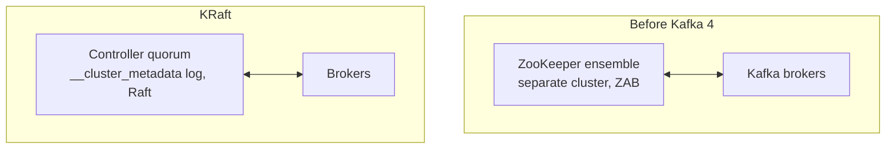

# Lesson 07: KRaft, Kafka Without ZooKeeper

> **Part 1: Kafka Without Code**

---

## What you'll learn

- What cluster metadata is, and why exactly one node must own it
- How KRaft replaces ZooKeeper by storing metadata in a Kafka log
- Why quorums have odd sizes, and how many failures each size tolerates
- How to kill the active controller and watch the cluster elect another

---

## Why this matters

In Lesson 06 you stopped a broker and the ISR changed within seconds. Something noticed, decided, recorded the decision and told everyone else. This lesson is about what that something is.

It also closes a loop you have been circling since Lesson 01. You read the metadata log off disk, you watched consumer offsets live in a topic, and you saw the quorum replicate with a leader and two followers exactly like a data partition. KRaft is the reason all of that is the same mechanism.

---

## Before you start

[Lesson 06](06-replication-and-isr.md), with all three brokers healthy:

```bash
docker compose ps kafka-1 kafka-2 kafka-3
```

---

## The concept

### Somebody has to be in charge

Some questions no single broker can answer alone:

- Which brokers are alive right now?
- Which topics and partitions exist, with what configuration?
- Who leads partition 2 of a given topic?
- Who is in its ISR?

That body of facts is **cluster metadata**, and the **controller** owns it. When you stopped a broker in Lesson 06, the controller updated the ISR and propagated the change. When a leader dies, the controller picks a replacement from the ISR.

There is exactly one active controller at a time. If there were two they would disagree, and two brokers would each believe they lead the same partition. That is a split brain, and data loss follows.

So the real problem is: how does a group of machines agree on one leader, and on one ordered history of decisions, when any of them may crash? That is the consensus problem, and it is genuinely hard.

### The old answer was ZooKeeper

Kafka outsourced it. ZooKeeper, a separate cluster of three or five nodes running the ZAB consensus protocol, stored the metadata and elected the controller.

It worked, and it cost three things:

- **A second distributed system.** Its own processes, configuration, JVM tuning, ports, security model, upgrade path and failure modes. On-call engineers had to understand both.
- **A scaling ceiling.** Metadata lived in ZooKeeper's data nodes, and on controller failover the new controller had to read all of it back. With hundreds of thousands of partitions that took minutes, and no leader elections could happen meanwhile.
- **Two sources of truth that could diverge.** Kafka cached metadata, ZooKeeper stored it, and reconciling them was a recurring source of subtle bugs.

### The new answer is KRaft

KRaft, from Kafka Raft, is Kafka running the Raft consensus protocol itself. It arrived with KIP-500, became production-ready in 3.3, and as of **Kafka 4.0 ZooKeeper support is removed entirely**. Your cluster runs Kafka 4.x, so there was never a choice to make: this is the only mode that exists.

The insight is the one from Lesson 02. Kafka already knows how to maintain a replicated, ordered, durable log, and cluster metadata is a log of changes. So store it in one.

Metadata lives in an internal topic, `__cluster_metadata`, which is the log you read from disk in Lesson 01. A set of nodes designated as **controllers** form a **quorum**: they elect a leader among themselves via Raft, and that leader is the active controller. Every metadata change is appended to the log, and the other controllers replicate it.

Failover is now cheap. A standby controller has been tailing the log all along, so its state is already current. Promotion takes milliseconds because there is nothing to reload.



### Roles, and combined mode

A KRaft node has one or both roles:

- **`broker`** stores partition data and serves clients
- **`controller`** participates in the metadata quorum

In production you separate them: three dedicated controllers, and as many brokers as you need. Controller work is latency-sensitive and should not compete with heavy disk and network traffic from the data path.

Your cluster runs **combined mode**, where each node is both. You can see it:

```bash
docker exec kafka-1 printenv KAFKA_PROCESS_ROLES
```

```
broker,controller
```

And the voter list you edited in Lesson 06:

```bash
docker exec kafka-1 printenv KAFKA_CONTROLLER_QUORUM_VOTERS
```

```
1@kafka-1:29093,2@kafka-2:29093,3@kafka-3:29093
```

Three voters, each reachable on port 29093, the dedicated `CONTROLLER` listener from your Compose file. It is deliberately separate from the inter-broker listener on 29092 and the client listener on 9092, because controller traffic should not queue behind data.

### Static and dynamic voter sets

The list above is a **static** voter set: every node is told the full membership at startup, and all three must agree. That is what made Lesson 06's expansion work. You added the same three-entry list to all three nodes, restarted, and they formed a quorum without any coordination step.

It also has a limitation. Because the membership comes from configuration, changing it means changing configuration on every node and restarting them. There is no way to add a fourth controller to a running cluster.

Kafka 3.9 introduced an alternative under KIP-853. Nodes are given `controller.quorum.bootstrap.servers`, just an address to start from, and the voter set itself is stored *in the metadata log*, where it can be changed at runtime with `kafka-metadata-quorum add-controller` and `remove-controller`. The membership becomes data rather than configuration, which is the same move Kafka keeps making.

This course stays with static voters, because three controllers that never change is the simpler thing to reason about and to configure. Knowing the dynamic option exists matters the moment someone asks you to grow a production quorum without downtime.

### Why quorums have odd sizes

Raft requires a majority to make progress, which is `(N / 2) + 1` voters.

| Controllers | Majority | Failures tolerated |
|---|---|---|
| 1 | 1 | 0 |
| 3 | 2 | 1 |
| 4 | 3 | 1 |
| 5 | 3 | 2 |

Four controllers tolerate exactly as many failures as three, while costing an extra machine and an extra vote to collect on every decision. That is why quorums are odd-sized: even sizes buy nothing.

A majority is also what prevents split brain. Two halves of a partitioned network cannot both hold a majority, so at most one side can elect a controller. The other side stops making metadata changes: unavailable, but never wrong.

This is why Lesson 06 stopped only one broker. Stopping two would have left one controller out of three, which is not a majority, so the cluster would have stopped accepting metadata changes altogether. You would have been looking at a broken quorum and a shrunken ISR at the same time, unable to tell which was refusing your write.

---

## Hands-on

### 1. Ask the cluster about its quorum

```bash
docker exec kafka-1 kafka-metadata-quorum \
  --bootstrap-server kafka-1:29092 \
  describe --status
```

```
ClusterId:              MkU3OEVBNTcwNTJENDM2Qg
LeaderId:               1
LeaderEpoch:            4
HighWatermark:          2380
MaxFollowerLag:         0
MaxFollowerLagTimeMs:   0
CurrentVoters:          [{"id": 1, "endpoints": ["CONTROLLER://kafka-1:29093"]}, {"id": 2, "endpoints": ["CONTROLLER://kafka-2:29093"]}, {"id": 3, "endpoints": ["CONTROLLER://kafka-3:29093"]}]
CurrentObservers:       []
```

- **`LeaderId`** is the active controller. Yours may be any of the three.
- **`LeaderEpoch`** is a counter incremented on every leader election. It is how a node detects that it is talking to a stale leader.
- **`HighWatermark`** is how many metadata records have been committed. It is a log offset on a real topic, because metadata really is a log.
- **`CurrentVoters`** lists the three controllers and the endpoint each is reachable on.
- **`MaxFollowerLag: 0`** means the standby controllers are fully caught up, so failover would be immediate.

### 2. See the replication detail

```bash
docker exec kafka-1 kafka-metadata-quorum \
  --bootstrap-server kafka-1:29092 \
  describe --replication
```

```
NodeId	DirectoryId           	LogEndOffset	Lag	LastFetchTimestamp	LastCaughtUpTimestamp	Status
1     	AAAAAAAAAAAAAAAAAAAAAA	2406        	0  	1785399538284     	1785399538284        	Leader
2     	AAAAAAAAAAAAAAAAAAAAAA	2405        	1  	1785399538230     	1785399537799        	Follower
3     	AAAAAAAAAAAAAAAAAAAAAA	2406        	0  	1785399538274     	1785399538274        	Follower
```

One leader, two followers, near-identical `LogEndOffset`, essentially zero lag. A `Lag` of 1 on a follower is normal: it means one metadata record was appended between that follower's last fetch and the moment you ran the command.

Now compare this output with `kafka-topics --describe` on any of your topics. Same shape, because it is the same mechanism. **The controller quorum is a replicated log with a leader and followers, exactly like your data partitions.** That is KRaft in one screen.

### 3. Kill the active controller

Take the `LeaderId` from step 1 and stop that node. Assuming it is node 1:

```bash
docker compose stop kafka-1
```

Then ask a survivor, because the node you just stopped can no longer answer:

```bash
docker exec kafka-2 kafka-metadata-quorum \
  --bootstrap-server kafka-2:29092 \
  describe --status | grep -E 'LeaderId|LeaderEpoch'
```

A different `LeaderId`, and `LeaderEpoch` has incremented. The two surviving controllers held a majority, elected a new leader among themselves and carried on. The cluster never stopped serving clients.

Bring it back:

```bash
docker compose start kafka-1
```

Wait about 20 seconds and describe again. Node 1 rejoins as a follower, and it does **not** take leadership back. Unlike partition leadership, there is no preferred controller and no automatic rebalancing of the controller role.

> If a command hangs or errors, you pointed `--bootstrap-server` at the node you stopped. Point it at a survivor. This is a good habit generally: never bootstrap diagnostics through the node you are testing the failure of.

---

## Try it yourself

1. Run `describe --status` and note `HighWatermark`. Create a topic. Run it again. Did it move, and by more than one? What does that tell you about how many records a single "create a topic" decision actually is?

2. Stop two nodes, leaving one. Then try each of these and explain the difference:

   ```bash
   docker exec kafka-3 kafka-topics --bootstrap-server kafka-3:29092 --create --topic quorum-test
   docker exec kafka-3 kafka-console-consumer --bootstrap-server kafka-3:29092 \
     --topic lessons-demo --from-beginning --max-messages 1 --timeout-ms 8000
   ```

   One of them cannot work and the other may. Say which, and why the answer is about metadata rather than about data. Then start both nodes again.

3. `CurrentObservers` was empty. What kind of node would tail the metadata log without voting in elections, and why would it want to? Think about what a node running only the `broker` role needs from the controller.

4. Compare `LeaderEpoch` in the controller quorum with the `Elr` and `Isr` fields from Lesson 06. Both layers use an epoch to fence stale leaders. Describe the specific bad outcome that fencing prevents in each case.

---

## Common mistakes

**Following a tutorial that starts ZooKeeper.**
Kafka 4.0 removed ZooKeeper support entirely. If a Compose file has a `zookeeper` service or passes `--zookeeper` to a CLI tool, it predates 2024 and will not work against your cluster.

**Running four controllers.**
Tolerates the same single failure as three and costs more on every decision. Use three, or five for a large cluster.

**Running combined mode in production.**
Fine on a laptop. In production, controller latency competes with data-path disk and network load, and a broker under garbage-collection pressure is a poor place to run consensus.

**Confusing the controller with a partition leader.**
Different elections, different logs. One active controller per cluster, one leader per partition. A node can be both, and in combined mode usually is.

**Assuming a stopped controller means data loss.**
The quorum survives a minority failure, and metadata is replicated across all voters.

**Trying to grow a static voter set one node at a time.**
With static voters every node must be given the same complete list. Adding an entry to one node only produces a node that disagrees with the quorum about who is allowed to vote.

---

## Check your understanding

**1. Kafka stores cluster metadata in a Kafka topic. Does a topic not need metadata in order to exist?**

<details>
<summary>Reveal answer</summary>

It would, which is why `__cluster_metadata` is bootstrapped from static configuration rather than from metadata.

Every controller is told the full voter list at startup through `controller.quorum.voters`, which you printed above. That is enough for them to find each other, run a Raft election and start replicating the metadata log, with no lookup required.

Once that log is live, every other topic's metadata is stored in it. The circularity is broken by one list of addresses that is known before any log exists. Under KIP-853's dynamic voters the same trick is used with `controller.quorum.bootstrap.servers`: one address to start from, and everything else comes from the log.

</details>

**2. A 3-node quorum loses one controller. A 5-node quorum loses two. Both still work. Which cluster is now more fragile?**

<details>
<summary>Reveal answer</summary>

Both are one failure away from losing quorum, so in that narrow sense they are equally fragile.

With 3 nodes, 2 remain and the majority is 2. One more failure leaves 1, which is not a majority of 3, so metadata changes stop. With 5 nodes, 3 remain and the majority is 3. One more failure leaves 2, also not a majority of 5, so metadata changes stop.

Identical outcomes. The difference is history: the 5-node cluster already absorbed two failures to reach that state, and in normal operation it lets you take one node down for a rolling restart while still tolerating a surprise failure. With three, one planned restart leaves zero margin.

</details>

**3. In Lesson 06 you stopped one broker and only the ISR changed. What else would have broken if you had stopped two, and why does that make `min.insync.replicas` hard to demonstrate on this cluster?**

<details>
<summary>Reveal answer</summary>

You would have lost the controller quorum as well as shrinking the ISR. In combined mode each node is both broker and controller, so stopping two leaves one controller, which is not a majority of three. Metadata changes halt: no leader elections, no topic creation, no ISR updates.

A failed write could then be caused by the floor rejecting it, or by there being no functioning controller. Two failures, one symptom, no way to attribute it.

That is exactly why Lesson 06 set `min.insync.replicas=3` and stopped a single broker. The ISR dropped below the floor while the quorum stayed healthy at two of three. One variable at a time.

</details>

**4. `LeaderEpoch` increments on every controller election. What breaks without it?**

<details>
<summary>Reveal answer</summary>

A deposed controller could keep issuing orders.

Imagine controller A is partitioned from the cluster but does not know it. The others elect B. If A can still reach some brokers, it might tell them to change partition leadership based on its stale view while B tells them something else. Split brain.

The epoch prevents it. Every message carries the sender's epoch, and a broker rejects anything with an epoch lower than the highest it has seen. When A resurfaces at epoch 4 while the cluster is at 5, A's instructions are ignored and A learns it has been replaced.

This is a general pattern called fencing, and partition leaders use leader epochs in exactly the same way.

</details>

**5. Removing ZooKeeper made controller failover dramatically faster. What specifically was slow, and what changed?**

<details>
<summary>Reveal answer</summary>

Under ZooKeeper, metadata was stored there and the controller kept an in-memory cache. When the controller failed, the new one had to load the entire cluster metadata out of ZooKeeper before it could act: every topic, partition, ISR and configuration entry. With hundreds of thousands of partitions that took minutes, and no leader elections could happen in the meantime.

Under KRaft the standby controllers are followers of the metadata log. They have been replicating every change continuously, so their state is already current. When the leader dies, a follower with an up-to-date log wins the election and is immediately ready.

The shift is from fetching state on failover to streaming it continuously, which is exactly the advantage a log gives you. It is the same reason a Kafka consumer can resume instantly from a committed offset instead of rebuilding its position.

</details>

**6. Lesson 06 grew the voter list from one entry to three by editing configuration and restarting. Why can that not be done one node at a time?**

<details>
<summary>Reveal answer</summary>

Because with a static voter set, the membership is not agreed on anywhere. It is asserted independently by each node from its own configuration.

If you added the three-entry list to `kafka-1` only, it would expect votes from two nodes that do not consider themselves voters, and it would never assemble a majority under the new membership. The nodes must agree on who is entitled to vote before they can vote on anything, and with static configuration the only way to establish that agreement is to give all of them the same list.

That is precisely the problem dynamic quorums solve. When the voter set lives in the metadata log, adding a controller is itself a metadata change, agreed by the existing majority, so the cluster is never in a state where members disagree about the membership.

</details>

---

## Recap

The controller owns cluster metadata, and there must be exactly one. Kafka used to rent that guarantee from ZooKeeper; KRaft provides it in-house by storing metadata in a replicated log and electing a leader over it with Raft. Majorities prevent split brain, odd quorum sizes avoid paying for nothing, and standby controllers are always warm because they have been tailing the log.

You killed the active controller and the cluster elected another without dropping a client connection.

The pattern should feel familiar by now. When Kafka needs durable, ordered, replicated state, it uses a log. Consumer offsets, cluster metadata and, from Lesson 25, schemas all live in topics.

---

## End of Part 1

You have not written a line of Java, and you can:

- explain why Kafka is a log rather than a queue, and what that buys
- write a Compose file for a three-broker KRaft cluster and explain every line of it
- create topics, produce and consume records, and read partition and offset metadata
- predict which partition a keyed record lands on, and explain why keyless records clump
- read consumer lag, split partitions across a group, and replay a topic by resetting offsets
- shrink an ISR by killing a broker, and explain why `acks` and `min.insync.replicas` are useless apart
- distinguish a write that was refused from one that was accepted but never committed
- read a KRaft quorum's status and reason about how many failures it tolerates

Every one of those is something you can see rather than recite. When your Spring Boot producer misbehaves in the next lesson, you have a CLI and a UI to interrogate the broker directly, and a model to interpret what they tell you.

Now write some code.

**Next:** [Lesson 08: Your First KafkaTemplate.send()](08-first-kafkatemplate-send.md)
