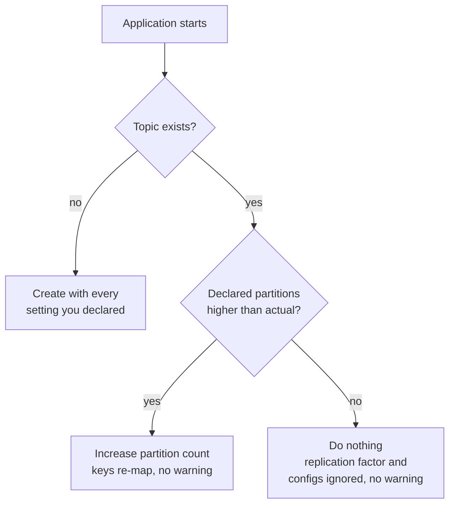

# Lesson 09: Topics as Code

> **Part 2: The Producer**

---

## What you'll learn

- How to declare a topic as a Spring bean with `TopicBuilder`
- What `KafkaAdmin` does at startup, and what it silently refuses to do
- Which topic settings you must get right the first time
- Why declaring a topic in code is not the same as managing it

---

## Why this matters

In Lesson 08 the broker invented your topic. It received three partitions and three replicas from the broker defaults, with `min.insync.replicas=1`, no retention policy and no compression. None of the durability reasoning from Lesson 06 was applied, because nobody applied it.

Some of those settings you can change later. One you cannot: **partition count only goes up, and raising it re-maps every key.** Getting a topic right at creation is not a tidiness concern.

Declaring the topic in code makes its configuration reviewable, diffable and identical in every environment. It also has a sharp edge, which is most of this lesson.

---

## Before you start

[Lesson 08](08-first-kafkatemplate-send.md), with a producer that runs and sends.

Delete the auto-created topic so you can watch it be recreated properly:

```bash
docker exec kafka-1 kafka-topics \
  --bootstrap-server kafka-1:29092 \
  --delete --topic wikimedia-stream
```

---

## The concept

### `KafkaAdmin` and `NewTopic`

Spring Boot auto-configures a `KafkaAdmin` bean. At startup it scans the application context for beans of type `NewTopic`, connects to the cluster, and creates any that do not exist.

So declaring a topic is declaring a bean:

```java
@Bean
public NewTopic myTopic() {
    return TopicBuilder.name("my-topic").partitions(3).replicas(3).build();
}
```

`TopicBuilder` is a fluent wrapper over `NewTopic`. Nothing magical happens: it becomes the same admin API call that `kafka-topics --create` makes.

### What it will and will not do

This is the part that surprises people.

| On startup, if the topic | `KafkaAdmin` will |
|---|---|
| does not exist | create it with your settings |
| exists with **more** partitions than declared | leave it alone |
| exists with **fewer** partitions than declared | **increase** the partition count |
| exists with a different replication factor | do nothing, silently |
| exists with different configs such as retention or the ISR floor | do nothing, silently |

Read the last two rows again. Change `.replicas(3)` to `.replicas(5)` and redeploy, and nothing happens and nothing warns you. Change retention from 7 days to 30, and nothing happens.

`NewTopic` is create-if-absent, not "make the cluster match this declaration". It is not Flyway for Kafka. It is genuinely useful for development and for bootstrapping a fresh environment, and it will quietly lie to you about the state of a long-lived topic.

Worse, the partition increase *is* applied. So a careless bump from 3 to 6 in a configuration file silently re-maps every key on a live topic, which is the one change from Lesson 04 you most wanted to think about first.



### The settings that matter

**`min.insync.replicas` of 2 with `replicas(3)`** is Lesson 06's conclusion encoded: survive one broker loss, refuse to lose committed data. This is also the setting Lesson 06 showed you cannot usefully set at the broker level on this image, so the topic is the right place for it.

**Retention has two dimensions and they are an OR.** A segment is deleted when it exceeds *either* `retention.ms` or `retention.bytes`. And `retention.bytes` is **per partition**, not per topic, which is the single most common capacity-planning error with Kafka.

**`compression.type` on the topic** should match what the producer sends. If it matches, the broker stores the batch as it arrived. If it differs, the broker decompresses and recompresses every batch, which is a large and completely invisible CPU cost. You will set the producer to `snappy` in Lesson 12; this is the other half of that pair.

---

## Hands-on

### 1. Create the topic configuration

`src/main/java/com/example/wikimedia/producer/config/WikimediaTopicConfig.java`:

```java
package com.example.wikimedia.producer.config;

import org.apache.kafka.clients.admin.NewTopic;
import org.apache.kafka.common.config.TopicConfig;
import org.springframework.context.annotation.Bean;
import org.springframework.context.annotation.Configuration;
import org.springframework.kafka.config.TopicBuilder;

@Configuration
public class WikimediaTopicConfig {

    @Bean
    public NewTopic wikimediaStreamTopic() {
        return TopicBuilder
                .name("wikimedia-stream")
                // Caps consumer parallelism at 3. Can only ever increase,
                // and increasing it re-maps every key.
                .partitions(3)
                // One leader and two followers, spread across the three brokers.
                .replicas(3)
                // Pairs with the producer's acks=all: a write needs two in-sync replicas.
                .config(TopicConfig.MIN_IN_SYNC_REPLICAS_CONFIG, "2")
                // 7 days.
                .config(TopicConfig.RETENTION_MS_CONFIG, "604800000")
                // 10 GiB per partition, so up to 30 GiB for this topic.
                .config(TopicConfig.RETENTION_BYTES_CONFIG, "10737418240")
                // Match the producer's compression so the broker never recompresses.
                .config(TopicConfig.COMPRESSION_TYPE_CONFIG, "snappy")
                .build();
    }
}
```

Use the constants on `TopicConfig` rather than raw strings such as `"min.insync.replicas"`. A misspelled configuration key is not always an error, so a typo can leave you with a topic that silently lacks the setting you believe you applied. `TopicConfig.MIN_IN_SYNC_REPLICAS_CONFIG` fails at compile time; `"min.insync.replicase"` does not.

### 2. Run and verify

```bash
./mvnw spring-boot:run
```

Then from another terminal:

```bash
docker exec kafka-1 kafka-topics \
  --bootstrap-server kafka-1:29092 \
  --describe --topic wikimedia-stream
```

```
Topic: wikimedia-stream	PartitionCount: 3	ReplicationFactor: 3	Configs: compression.type=snappy,min.insync.replicas=2,retention.ms=604800000,retention.bytes=10737418240
	Topic: wikimedia-stream	Partition: 0	Leader: 3	Replicas: 3,1,2	Isr: 3,1,2	Elr: 	LastKnownElr: 
	Topic: wikimedia-stream	Partition: 1	Leader: 1	Replicas: 1,2,3	Isr: 1,2,3	Elr: 	LastKnownElr: 
	Topic: wikimedia-stream	Partition: 2	Leader: 2	Replicas: 2,3,1	Isr: 2,3,1	Elr: 	LastKnownElr: 
```

Every setting you declared is present. Three partitions, three leaders on three different brokers, and an ISR of three for each.

Compare that with the auto-created topic from Lesson 08: the same partition count by accident, and none of the durability configuration.

### 3. Watch it fail to update

Change `.replicas(3)` to `.replicas(2)` and restart. No error. Describe the topic again: still `ReplicationFactor: 3`.

Change `RETENTION_MS_CONFIG` from `"604800000"` to `"60000"`, one minute, and restart. Describe again: still `retention.ms=604800000`.

Nothing happened, twice, and the application started cleanly both times. This is `KafkaAdmin` doing exactly what it promises.

Now change `.partitions(3)` to `.partitions(6)` and restart:

```bash
docker exec kafka-1 kafka-topics \
  --bootstrap-server kafka-1:29092 \
  --describe --topic wikimedia-stream | head -1
```

`PartitionCount: 6`. That one it applied, without asking, on a live topic.

Put it back to `3` and restart. It stays at 6, because partitions never decrease. To reset, delete the topic and let the application recreate it:

```bash
docker exec kafka-1 kafka-topics \
  --bootstrap-server kafka-1:29092 --delete --topic wikimedia-stream
```

> That asymmetry is the whole danger of this feature. The settings you would want applied are ignored, and the one setting that silently rewrites your key distribution is applied eagerly.

### 4. Turn off auto-creation

With topics declared in code, auto-creation is pure downside. Add this to each broker in `docker-compose.yml`:

```yaml
      KAFKA_AUTO_CREATE_TOPICS_ENABLE: "false"
```

Restart the cluster with `docker compose up -d`, then prove it:

```bash
docker exec kafka-1 kafka-console-producer \
  --bootstrap-server kafka-1:29092 --topic wikimedia-strem <<< 'typo'
```

Instead of creating a phantom topic, you now get `UNKNOWN_TOPIC_OR_PARTITION`. That is the error you want, because a producer writing happily to a misspelled topic while every consumer waits on the correct one is indistinguishable from data loss.

Your declared topics are unaffected: `KafkaAdmin` uses the admin API to create them explicitly, which is not auto-creation.

---

## Try it yourself

1. Add a second `NewTopic` bean for `wikimedia-stream.dlt`, with 3 partitions, 3 replicas, a floor of 2, but **30 days** of retention and `retention.bytes` of `-1`. Restart and describe it. Why would a dead-letter topic want longer retention and no size cap than the topic it shadows? You will build the dead-letter path itself in Lesson 21.

2. Declare a topic with `.partitions(3).replicas(5)` on your three-broker cluster. Does the application start? Is this a silent no-op like step 3's replication change, or something louder? Explain why this case differs.

3. Set `retention.ms` to `10000` on a fresh topic, produce some records, wait two minutes, then consume `--from-beginning` and check `kafka-get-offsets`. Did the records disappear? Did the end offset change? Explain any gap between what you expected and what you saw, using the word *segment*.

4. With auto-creation now off, delete `wikimedia-stream` and start your producer. Does it recreate the topic? Now delete the topic, comment out the `@Bean` method, and start the producer again. Compare the two failures and say which one you would rather debug at 3 a.m.

---

## Common mistakes

**Believing `NewTopic` keeps the topic in sync with your code.**
It creates if absent. On an existing topic, replication factor and configuration changes are ignored silently.

**Bumping `.partitions()` casually.**
This one is applied to live topics, and it re-maps `murmur2(key) % partitionCount` for every key. On a keyed topic that breaks per-key ordering across the boundary, permanently.

**Assuming `retention.bytes` is per topic.**
It is per partition. Multiply by the partition count for the topic's size, then by the replication factor for the cluster's.

**Mismatching producer and topic compression.**
The broker decompresses and recompresses every batch to normalise it, and you pay broker CPU for nothing.

**Using string literals for configuration keys.**
`TopicConfig.MIN_IN_SYNC_REPLICAS_CONFIG` fails at compile time when you mistype it. A string does not.

**Treating a clean startup as confirmation.**
The application starting proves your declaration parsed, not that the cluster matches it. Describe the topic.

---

## Check your understanding

**1. You change `.replicas(3)` to `.replicas(5)` and redeploy. The application starts cleanly. What is the topic's replication factor?**

<details>
<summary>Reveal answer</summary>

Still 3.

`KafkaAdmin` only creates topics that do not exist. For an existing topic it will increase the partition count if your declaration is higher, and it ignores everything else: replication factor, retention, compression and the ISR floor.

Nothing warns you. Your code now says 5, your cluster says 3, and every code review from here on will read the wrong number. Changing the replication factor of an existing topic requires a partition reassignment, which is an operational task rather than a deploy-time one.

</details>

**2. Why is the partition-count behaviour more dangerous than the replication-factor behaviour, given that one is applied and one is ignored?**

<details>
<summary>Reveal answer</summary>

Because the applied one changes data routing on a live topic, and the ignored one merely leaves you with stale configuration.

Raising partitions from 3 to 6 changes `murmur2(key) % partitionCount` for most keys, exactly as you measured in Lesson 04. A user whose records always went to partition 1 starts landing on partition 4. Their history is split across two partitions and the per-key ordering guarantee no longer holds across that boundary. There is no error, no warning, and no way back, because partitions never decrease.

The replication-factor no-op is misleading. The partition bump is destructive.

</details>

**3. Your topic has `retention.bytes` of 10 GiB and 3 partitions, with replication factor 3. How much disk does the topic occupy at most, across the cluster?**

<details>
<summary>Reveal answer</summary>

`retention.bytes` is per partition, so the topic's logical size is up to 3 times 10 GiB, which is 30 GiB.

Every partition is stored on three brokers, so the cluster stores up to 90 GiB in total, 30 GiB per broker.

Two multiplications that are routinely forgotten, in opposite directions. If you budgeted 10 GiB for this topic, you are wrong by a factor of nine.

</details>

**4. Records are deleted when `retention.ms` expires or `retention.bytes` is exceeded. Which fires first on a topic with 7 days and 1 GiB, receiving 10 GiB per day?**

<details>
<summary>Reveal answer</summary>

The size limit, after roughly two and a half hours. It is an OR, and whichever triggers first wins.

You would believe you had a week of replay available. You would actually have a couple of hours, and you would discover this during an incident, when you tried to reset a consumer group to yesterday and found the records gone.

This is why a dead-letter topic is usually given unlimited `retention.bytes` alongside a long `retention.ms`, which is exactly what the first exercise asked you to configure. For records that represent failures, time should be the only dimension that governs deletion.

</details>

**5. Kafka deletes old log segments rather than individual records. Why does that distinction matter to you as a developer?**

<details>
<summary>Reveal answer</summary>

Because retention is coarse-grained and lags your configuration in one direction only.

A partition is a sequence of segment files, as you saw on disk in Lesson 01. Kafka deletes a segment only once every record in it is past the retention threshold, and it never deletes the segment currently being written to. With a large segment size, a low-traffic topic can keep records long past `retention.ms` simply because the segment has not rolled.

So "7-day retention" means at least 7 days, possibly much longer. You can rely on data still being there. You cannot rely on it being gone, which matters a great deal for deletion requirements under privacy law, where compaction with tombstone records rather than retention is the right tool.

</details>

**6. Declaring topics in code makes configuration reviewable. Given everything in this lesson, why is it still not topic management?**

<details>
<summary>Reveal answer</summary>

Because management requires convergence, and this mechanism only creates.

A managed resource means the declaration is the truth: change it and the system moves to match, or tells you it cannot. `NewTopic` gives you neither. It applies your settings exactly once, at first creation, then ignores almost all subsequent changes and applies one of them destructively.

The practical consequence is that your Java file is an accurate record of how a topic was created and an unreliable record of what it is now. In a real deployment, topic configuration belongs in something that can diff and converge, driven by the admin API or a tool built on it, with `NewTopic` reserved for bootstrapping local and test environments.

That is worth knowing before you rely on it, rather than after a code review approves a retention change that never took effect.

</details>

---

## Recap

Declaring `NewTopic` beans makes topic configuration reviewable and reproducible, and `KafkaAdmin` creates them at startup. But it is create-if-absent: replication factor and configuration on an existing topic are silently ignored, while partition increases are silently applied. Treat it as a bootstrapping convenience, never as schema migration.

You also turned off auto-creation, so a misspelled topic name is now an error rather than a phantom topic.

Your topic now carries the durability settings you reasoned about in Lesson 06. The producer, however, is still sending with default `acks`, so you have not yet asked the broker to enforce any of it.

**Next:** [Lesson 10: acks and the Idempotent Producer](10-acks-and-idempotence.md)
