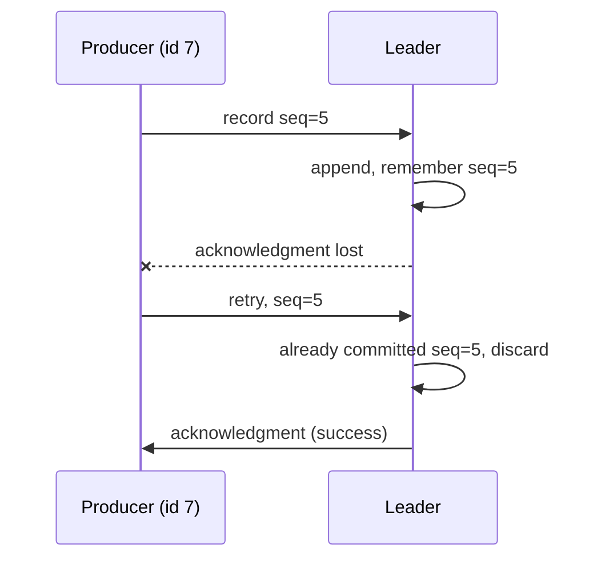

# Lesson 10: acks and the Idempotent Producer

> **Part 2: The Producer**

---

## What you'll learn

- What each `acks` setting actually promises, and what it costs
- Why retries create duplicates, and how idempotence removes them
- What idempotence does not give you, which is more than people expect
- Which settings Kafka refuses to let you combine

---

## Why this matters

Lesson 09 gave your topic real durability settings. Your producer has been ignoring them, because durability is a negotiation between the two: the topic states a floor, and the producer decides whether to ask anyone to respect it.

This lesson is also where the most expensive Kafka misconception lives. `acks=1` feels safe, because a broker acknowledged the write. It is the setting most likely to lose data in production while every dashboard stays green.

---

## Before you start

[Lesson 09](09-topics-as-code.md), with a declared `wikimedia-stream` topic and a healthy three-broker cluster.

---

## The concept

### `acks`, or who must confirm the write

`acks` is a producer setting answering one question: before the broker tells my producer "success", how many replicas must hold the record?

| `acks` | Producer waits for | Throughput | Risk |
|---|---|---|---|
| `0` | nothing at all | highest | record lost on any failure, silently |
| `1` | the leader only | high | lost if the leader dies before a follower fetches |
| `all` | every replica currently in the ISR | lower | none, when paired with a floor of 2 or more |

`acks=0` is genuinely fire-and-forget. The producer writes to its socket and considers the job done. It will not even notice a leader election. Use it for metrics you do not mind losing, and nothing else.

`acks=1` is the dangerous middle. A broker acknowledged, which feels like safety, but the acknowledgment came from the leader alone before any follower replicated the record. If that leader fails in the next few milliseconds the record is gone, and your producer was told it succeeded.

`acks=all` waits for the full ISR. Note the precise wording: all *in-sync* replicas, not all replicas. If two of three replicas have fallen out of the ISR, "all" means one, and `acks=all` quietly becomes `acks=1`.

That is why `min.insync.replicas` exists. It is the floor beneath "all":

> `acks=all` with a floor of 2 and three replicas means a write must reach two replicas, and if it cannot, it is refused rather than accepted unsafely.

Neither setting works alone, and you proved both halves of that from the CLI in Lesson 06.

### The defaults changed, and it matters

Since Kafka 3.0 the producer defaults are `acks=all` and `enable.idempotence=true`. Every tutorial written before 2021 tells you the default is `acks=1`, and that has been wrong for years.

Setting both explicitly is still worth doing. It documents the intent for whoever reads the configuration next, and it means an accidental conflict becomes a startup failure rather than a silent change in behaviour.

### Retries create duplicates

Now a subtler problem. With `acks=all`, consider this sequence:

1. The producer sends record R to the leader.
2. The leader appends R and replicates it to both followers.
3. The leader sends the acknowledgment, and the network drops it.
4. The producer times out. It has no idea whether R was written.
5. The producer retries R.
6. The leader appends R again, at a new offset.

The topic now contains R twice. The producer did nothing wrong: it cannot distinguish "the write failed" from "the write succeeded and the acknowledgment was lost". With retries enabled, which you want, this is not a rare edge case. It is the expected behaviour under packet loss.

This is why Kafka's baseline delivery guarantee is **at-least-once**.

### Idempotence removes the duplicate

With `enable.idempotence=true`, the producer gets:

- a **producer ID**, assigned by the broker when the producer starts
- a **monotonic sequence number** per producer ID and partition, attached to every record

The broker remembers the highest sequence number it has committed for each pair. When a retry arrives carrying a sequence number it has already seen, it discards the duplicate and returns success. When a sequence number arrives out of order, it rejects the batch, which also preserves ordering.



The retry is absorbed. One record on disk, one success reported.

### What idempotence is not

This is where people go wrong, and all three of these matter later in the course.

**It is scoped to one producer session, per partition.** The producer ID is assigned at startup. Restart your application and it gets a new one, and the broker has no way to know the new producer is retrying something the old one sent. Duplicates across restarts are not prevented.

**It does not deduplicate your application logic.** If your code calls `send()` twice with the same payload, those are two records with two sequence numbers, and Kafka will faithfully store both. Idempotence collapses only the client's own internal retries.

**It is not exactly-once end to end.** That requires transactions on the producer and `isolation.level=read_committed` on the consumer, and it only covers flows that stay inside Kafka. A write to a database sits outside the transaction. Lesson 17 covers the practical alternative, which is at-least-once delivery plus idempotent processing.

### What idempotence requires

Turning it on constrains three other settings:

| Setting | Required | If you conflict |
|---|---|---|
| `acks` | `all` | `ConfigException` at startup |
| `retries` | greater than 0 | `ConfigException` at startup |
| `max.in.flight.requests.per.connection` | 5 or fewer | `ConfigException` at startup |

### `max.in.flight.requests.per.connection`

This is how many unacknowledged batches the producer will have on the wire to a single broker at once.

Without idempotence, anything above 1 can reorder records: batch 1 fails and is retried while batch 2 has already succeeded, so batch 2's records end up before batch 1's in the log. To guarantee ordering you had to set it to 1 and pay for that in throughput.

With idempotence, sequence numbers let the broker reject out-of-order batches, so up to five in-flight requests preserve ordering and keep the pipeline full. This is the setting whose default turned "fast or ordered" into "both".

---

## Hands-on

### 1. Configure the producer

Replace `src/main/resources/application.yml` with this complete file:

```yaml
spring:
  application:
    name: wikimedia-producer

  kafka:
    producer:
      bootstrap-servers: localhost:9092,localhost:9093,localhost:9094

      key-serializer: org.apache.kafka.common.serialization.StringSerializer
      value-serializer: org.apache.kafka.common.serialization.StringSerializer

      # The leader waits for every in-sync replica before acknowledging.
      # Combined with the topic's floor of 2, a write must reach two of three
      # replicas or be refused outright.
      acks: all

      # With idempotence on, the client retries within delivery.timeout.ms.
      # A finite cap surfaces persistent broker problems to the application
      # instead of hiding them behind indefinite retrying.
      retries: 3

      properties:
        # Producer ID plus per-partition sequence numbers, so a lost
        # acknowledgment cannot turn into a duplicate record.
        enable.idempotence: true

        # Safe at 5 because idempotence lets the broker reject out-of-order
        # batches. Without it, anything above 1 can reorder records on retry.
        max.in.flight.requests.per.connection: 5

server:
  port: 8081
```

`spring.kafka.producer.*` covers the properties Spring Boot knows by name. Anything else, including both properties above, goes under `properties:` and is passed to the Kafka client verbatim using Kafka's own dotted names.

That distinction is worth dwelling on, because misplacing a property here fails silently. `spring.kafka.producer.enable-idempotence` is not a Spring Boot property, so putting it there parses cleanly, configures nothing, and leaves you believing you have idempotence.

### 2. Prove `acks=all` is enforced

Recreate Lesson 06's strict-topic experiment, this time driving it from Java.

```bash
docker exec kafka-1 kafka-topics \
  --bootstrap-server kafka-1:29092 \
  --create --topic acks-demo \
  --partitions 1 --replication-factor 3 \
  --config min.insync.replicas=3
```

Change the `TOPIC` constant in `WikimediaProducer` to `"acks-demo"`, then break the cluster and run:

```bash
docker compose stop kafka-3
./mvnw spring-boot:run
```

The send fails. With `acks=all`, an ISR of 2 and a floor of 3, the broker returns `NotEnoughReplicasException`, the same error you saw from the CLI, now arriving in your Java code.

### 3. Now set `acks: 1`, and check the broker rather than the log

Leave `kafka-3` down. Set `acks: 1`, comment out the `enable.idempotence` line so the configuration is valid, and run again.

This time nothing fails. Your application logs `Sent:` and exits cleanly. The topic demands three in-sync replicas; your producer declined to ask, and no exception was raised.

Now ask the broker what it actually has:

```bash
docker exec kafka-1 kafka-get-offsets \
  --bootstrap-server kafka-1:29092 --topic acks-demo
```

```
acks-demo:0:0
```

Zero records. The write your producer reported as successful is not readable by anyone.

It is not lost either. It is on the leader's disk, exactly as you proved with `kafka-dump-log` in Lesson 06: while the ISR is below `min.insync.replicas`, the partition's high watermark does not advance, so consumers cannot see records past it. Start `kafka-3` again, wait for the ISR to recover, and the record appears.

So `acks=1` did not defeat the topic's durability setting. It did something worse: it produced a write that the application believes succeeded, that no consumer can read, and that would have been lost outright had the leader failed in the meantime.

Restore everything:

```bash
docker compose start kafka-3
docker exec kafka-1 kafka-topics --bootstrap-server kafka-1:29092 --delete --topic acks-demo
```

Set `acks: all`, restore `enable.idempotence: true`, and point `TOPIC` back at `wikimedia-stream`.

### 4. Watch a configuration conflict fail fast

Set these together:

```yaml
      acks: 1
      properties:
        enable.idempotence: true
```

Start the application. It refuses:

```
org.apache.kafka.common.config.ConfigException: Must set acks to all in order to use the idempotent producer. Otherwise we cannot guarantee idempotence.
```

A startup failure rather than a silent downgrade. An idempotent producer with `acks=1` would be a contradiction, so Kafka will not let you build one.

Set `acks: all` back.

---

## Try it yourself

1. Set `acks: 0`, comment out idempotence, stop all three brokers, and run the application. Does `send()` throw? Does anything log an error at all? What does that tell you about where `acks=0` records go, and why the setting is unsuitable for anything you would miss?

2. Set `max.in.flight.requests.per.connection: 6` with idempotence on and read the exception. Then work out why the limit is 5 rather than 50. The broker tracks a bounded window of recent sequence numbers per partition; what would a much larger window cost it?

3. Reason this through without running it. Your application sends record R, the acknowledgment is lost, the process is killed before it can retry, and a new instance starts and re-sends R from an application-level outbox. Does idempotence deduplicate it? Explain using the phrase *producer ID*.

4. Repeat step 3's experiment, but stop the *leader* of `acks-demo` while the `acks=1` record is uncommitted, instead of a follower. Predict first, then check whether the record ever becomes readable. This is the difference between "invisible for now" and "gone".

---

## Common mistakes

**Thinking `acks=all` means all replicas.**
It means all replicas currently in the ISR, which can be one. `min.insync.replicas` is what puts a floor under it.

**Thinking a successful `send()` means a readable record.**
Step 3 produced a write with no error that no consumer could see. Acknowledged and committed are different states.

**Thinking `enable.idempotence=true` gives exactly-once.**
It removes duplicates caused by the producer's own retries within one producer session. Application-level double sends, and duplicates across restarts, are untouched.

**Setting `retries: 0` to avoid duplicates.**
Now a transient network blip loses the record permanently. Enable idempotence and keep retrying: that is the combination that gives you neither loss nor duplication.

**Setting `acks=1` for latency without measuring.**
`acks=all` waits for followers that are already fetching continuously, so on a healthy cluster the extra latency is usually a few milliseconds. You would be trading a rare, silent, permanent loss for a small, common, recoverable delay.

**Putting `enable.idempotence` directly under `spring.kafka.producer:`.**
No such Spring Boot property exists. It must go under `properties:` with Kafka's dotted name, and misplacing it is silently ignored.

**Assuming the old defaults.**
Since Kafka 3.0 the defaults are `acks=all` and idempotence on. Material telling you otherwise is describing a Kafka you are not running.

---

## Check your understanding

**1. Your topic has a floor of 2 and three replicas. Your producer uses `acks=all`. One broker is down. Do writes succeed?**

<details>
<summary>Reveal answer</summary>

Yes. The ISR is 2, which meets the floor of 2, so `acks=all` is satisfied by the leader plus one follower.

This is the whole point of the standard configuration. You can lose one broker, for a failure or a deploy, and keep writing with full durability. Lose a second and the ISR drops to 1, below the floor, and writes are refused.

</details>

**2. A colleague sets `acks=1` for latency on a topic with a floor of 2. Kafka logs no errors. What have they changed?**

<details>
<summary>Reveal answer</summary>

Two things, and only one of them is the one people usually describe.

The familiar risk is data loss: with `acks=1` the leader acknowledges alone, so a record can be reported as successful and then vanish when the leader fails before any follower fetches it.

The risk you measured in step 3 is stranger. While the ISR is below the floor, those `acks=1` writes are appended to the leader's log but never committed, so the high watermark does not advance past them and no consumer can read them. The producer sees success, the consumer sees nothing, and the topic quietly accumulates records that become visible only if and when the ISR recovers.

Both failures are silent from the producer's point of view, which is what makes this setting expensive.

</details>

**3. Idempotence is enabled. Your code calls `send()` twice with an identical payload. How many records land?**

<details>
<summary>Reveal answer</summary>

Two.

Those are two separate calls, so they receive two different sequence numbers and the broker treats them as two distinct records. It has no notion of payload equality, and no reason to guess that identical bytes were a mistake.

Idempotence collapses only the client's internal retries of a single logical send. Deduplicating your own logic is your job, and Lesson 17 shows the usual approach, which is to make the consumer's processing idempotent instead.

</details>

**4. Why does idempotence allow five in-flight requests when ordering used to require one?**

<details>
<summary>Reveal answer</summary>

Because the broker can now detect and reject out-of-order batches, so it no longer needs the client to serialise them.

Without sequence numbers, the only way to guarantee that batch 1 landed before batch 2 was to refuse to send batch 2 until batch 1 was acknowledged, which idles the connection for a full round trip on every batch.

With sequence numbers per producer and partition, the broker knows the next number it expects. A batch arriving out of order is rejected and retried, so the client can keep several batches in flight and still be certain the log ends up in send order.

The limit is five rather than unlimited because the broker keeps a bounded amount of recent sequence-number state per partition. A larger window would cost more memory on every partition for a diminishing throughput gain.

</details>

**5. Kafka's baseline guarantee is at-least-once. With idempotence enabled, is it exactly-once?**

<details>
<summary>Reveal answer</summary>

No, and the gap is worth being precise about.

Idempotence gives you exactly-once for one producer session, per partition. Within that scope, the client's retries cannot duplicate a record.

Outside that scope nothing is protected. A producer restart means a new producer ID, so a re-send after a crash is a brand-new record. An application that sends the same event twice sends two events. And nothing at all is guaranteed about what your consumer does with a record it receives twice after a rebalance.

End-to-end exactly-once inside Kafka needs transactions plus `read_committed` consumers. End-to-end exactly-once including your database does not exist, which is why Lesson 17 builds idempotent processing instead.

</details>

**6. You set `retries: 3` even though idempotence would retry within `delivery.timeout.ms` anyway. Why put a finite cap on it?**

<details>
<summary>Reveal answer</summary>

To make persistent failures visible to your application rather than absorbed by the client.

With retries effectively unbounded, a broker problem lasting minutes shows up as `send()` calls that simply take a very long time. Your application has no error to handle, no metric that moves, and a producer buffer that fills until `max.block.ms` starts blocking your threads. The symptom appears a long way from the cause.

A finite cap turns that into an exception you can log, count, alert on and decide about. That is exactly what Lesson 13 wires up, by attaching a callback to the future this lesson's code still ignores.

Note the interaction, though. `delivery.timeout.ms` is the real upper bound on a send, and `retries` only matters if the attempts are exhausted before that deadline arrives. Set `retries` very low with a long timeout, or very high with a short one, and one of the two settings is doing nothing.

</details>

---

## Recap

`acks` decides how many replicas must hold a record before your producer is told it succeeded, and `min.insync.replicas` decides how few "all in-sync replicas" is allowed to mean. You watched `acks=all` refuse a write it could not make durable, and watched `acks=1` accept one that no consumer could read.

Idempotence gives the producer an ID and per-partition sequence numbers so the broker can absorb the client's own retries, turning at-least-once into exactly-once within a single producer session. It does not deduplicate your application's logic, does not survive a restart, and is not end-to-end exactly-once.

Both are on by default since Kafka 3.0, and both are worth setting explicitly anyway.

**Next:** [Lesson 11: Keys and Partition Affinity in Code](11-keys-and-partition-affinity.md)
