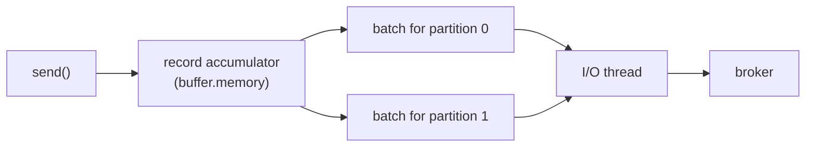

# Lesson 12 — Batching, Linger & Compression

> **Part 2 — The Producer** · 25 minutes

---

## What you'll learn

- How `batch.size` and `linger.ms` interact — and why tuning one without the other does nothing
- Why compression only works because of batching
- How to choose a compression codec, and why it must match the topic's
- What `buffer.memory` protects you from, and how it fails

---

## Why this matters

A Kafka producer that sends one record per network request is slow, and no amount of hardware fixes it. The cost of a produce request — TCP, the broker's request queue, the acknowledgment round trip — is roughly the same whether the request carries one record or ten thousand.

Batching is where Kafka's throughput actually comes from. It's also where its *latency* comes from, and the two are the same dial pointed in opposite directions.

---

## Before you start

[Lesson 11](11-keys-and-partition-affinity.md).

---

## The concept

### The producer is asynchronous, and that's the point

`send()` does not talk to a broker. It serialises the record, appends it to an in-memory buffer, and returns.

A background I/O thread drains that buffer, groups records into **batches** — one batch per partition — and ships each batch as a single request.



So the question "when does a record actually get sent?" has two answers, and the batch is sent when **either** is satisfied.

### `batch.size` — the size trigger

Maximum bytes in one batch, **per partition**. Default 16 KiB.

When a partition's batch fills to `batch.size`, it is sent immediately.

This is an upper bound, not a target. If the buffer holds only one record when the I/O thread comes around, that record is sent alone — a batch of one. `batch.size` never *makes* the producer wait.

> A record larger than `batch.size` gets its own batch. It isn't rejected. (The limit that rejects is `max.request.size`, default 1 MiB, and the broker's `message.max.bytes`.)

### `linger.ms` — the time trigger

How long the producer will **wait** for more records before sending a partially-full batch. Default `0`.

`linger.ms=0` does not mean "no batching." It means "don't deliberately wait." Records that arrive while a request is in flight still accumulate and go out together — you get batching only as an accident of load.

`linger.ms=20` means: when the first record lands in an empty batch, start a 20 ms timer. Send when the batch fills *or* the timer expires, whichever comes first.

**This is the setting that trades latency for throughput**, and it's the one people forget. Raising `batch.size` alone changes nothing under light load, because the batch is dispatched the moment the I/O thread is free. You must give the producer permission to wait.

Under heavy load, `linger.ms` costs almost nothing: batches fill before the timer expires, so the size trigger fires first. Under light load, it adds up to `linger.ms` of latency and dramatically improves batching. That asymmetry is why 5–20 ms is nearly free in practice.

### Compression needs batching

Kafka compresses the **batch**, not the record.

Compressing a single 200-byte JSON document achieves very little — there isn't enough repetition to build a dictionary from. Compressing 500 similar JSON documents together achieves a great deal, because they share field names, structure, and vocabulary.

So `compression.type` and `linger.ms` are the same lever. A producer with `linger.ms=0` under light load compresses batches of one, and reports a compression ratio near 1.0 while burning CPU for nothing.

| Codec | Ratio | CPU | Use when |
|---|---|---|---|
| `none` | 1.0 | none | records are already compressed (images, video) |
| `gzip` | best | highest | storage cost dominates, throughput doesn't |
| `snappy` | good | low | balanced default; what this project uses |
| `lz4` | good | lowest | maximum throughput |
| `zstd` | very good | moderate | best overall ratio-to-speed; Kafka 2.1+ |

`zstd` is the modern recommendation for most workloads. This project uses `snappy` because it's the conservative, universally-supported choice.

### Match the topic's codec

You set `compression.type=snappy` on the topic in Lesson 09. That was not decoration.

If the producer's codec matches the topic's, the broker stores the compressed batch **exactly as it arrived** — zero broker CPU. If they differ, the broker must decompress every batch and recompress it in the topic's codec, on every write, forever. It's a large cost, and nothing warns you.

Setting the topic to `producer` (the default) means "store whatever the producer sent," which side-steps the problem entirely — at the cost of a topic that may contain batches in several codecs.

### `buffer.memory` — and how `send()` blocks

Total memory the producer may use for un-sent records. Default 32 MiB.

If your application produces faster than the network can drain the buffer, the buffer fills. At that point `send()` — the method you believed was non-blocking — **blocks**, for up to `max.block.ms` (default 60 s), and then throws `TimeoutException`.

This is the producer applying backpressure to your application. It's the correct behaviour, and it's a nasty surprise the first time a thread pool stalls inside a "non-blocking" call.

---

## Hands-on

### 1. Configure batching and compression

Extend `application.yml`:

```yaml
spring:
  kafka:
    producer:
      bootstrap-servers: localhost:9092,localhost:9093,localhost:9094
      key-serializer: org.apache.kafka.common.serialization.StringSerializer
      value-serializer: org.apache.kafka.common.serialization.StringSerializer
      acks: all
      retries: 3

      # Batch up to 32 KiB per partition before flushing on size.
      # Bigger batches → better throughput and much better compression.
      batch-size: 32768

      # Total buffer for un-sent records. When this fills, send() blocks
      # for max.block.ms and then throws.
      buffer-memory: 33554432

      # Must match the topic's compression.type, or the broker
      # decompresses and recompresses every batch.
      compression-type: snappy

      properties:
        enable.idempotence: true
        max.in.flight.requests.per.connection: 5

        # Wait up to 20 ms for more records before sending a partial batch.
        # Without this, batch-size above is nearly meaningless under light load.
        linger.ms: 20

        # Total time send() has to succeed, including all retries and waiting.
        delivery.timeout.ms: 120000

        # How long to wait for a broker's response to a single request.
        request.timeout.ms: 30000
```

Note where each property lives. `batch-size`, `buffer-memory`, and `compression-type` are Spring Boot's own relaxed-binding names under `producer:`. `linger.ms`, `delivery.timeout.ms`, and `request.timeout.ms` have no Spring equivalent, so they go under `properties:` with Kafka's dotted names.

> Putting `linger.ms: 20` directly under `producer:` is silently ignored. The YAML parses, the app starts, and you get `linger.ms=0`. This is the single most common Kafka-in-Spring configuration bug.

### 2. The timeout hierarchy

Three timeouts, and they must be ordered correctly:

```
delivery.timeout.ms  >=  linger.ms + request.timeout.ms
   120,000           >=      20    +     30,000
```

- **`request.timeout.ms`** — one attempt to reach a broker and get a reply.
- **`delivery.timeout.ms`** — the total budget for a `send()`, covering time in the buffer, `linger.ms`, every retry, and every `request.timeout.ms`.

`retries` is almost irrelevant once idempotence is on. What actually bounds retrying is `delivery.timeout.ms`. When it expires, the `CompletableFuture` from `send()` completes exceptionally with a `TimeoutException`, and the record is dropped. Kafka validates the inequality at startup and refuses to start if it's violated.

### 3. Watch batching happen

Set `linger.ms: 0` and produce 1,000 records in a tight loop:

```java
    @Override
    public void run(ApplicationArguments args) {
        long start = System.nanoTime();
        for (int i = 0; i < 1_000; i++) {
            producer.sendMessage("key-" + (i % 100), "payload-number-" + i);
        }
        kafkaTemplate.flush();
        log.info("Took {} ms", (System.nanoTime() - start) / 1_000_000);
    }
```

`flush()` blocks until every buffered record has been acknowledged — otherwise you'd be timing how fast you can fill a buffer.

Now set `linger.ms: 20` and run again. Fewer, larger requests. On a local cluster the wall-clock difference is small; the difference in *request count* is not.

You can see it in the producer's own metrics. Add actuator and query:

```bash
curl -s localhost:8081/actuator/metrics/kafka.producer.record.send.rate
curl -s localhost:8081/actuator/metrics/kafka.producer.batch.size.avg
```

`batch.size.avg` is the number that tells the story. With `linger.ms=0` under light load it hovers near one record's worth. With `linger.ms=20` it climbs.

### 4. Compression ratio

```bash
curl -s localhost:8081/actuator/metrics/kafka.producer.compression.rate.avg
```

A value near `1.0` means "no compression happening." With `snappy` and real batches of similar JSON, expect something in the 0.2–0.4 range — a 60–80% reduction.

Then set `linger.ms: 0` and watch the ratio move back toward 1.0. Same codec, same data, no batches to compress.

**That's the lesson in one metric.** Compression is not a property of your codec choice. It is a property of your batching.

---

## Try it yourself

1. Set `batch-size: 1000000` (1 MB) and `linger.ms: 0`. Produce 1,000 small records. Does `batch.size.avg` go up? Explain why the large `batch.size` bought you nothing.

2. Set `buffer-memory: 32768` (32 KiB) and `max.block.ms: 2000`, then produce 100,000 records as fast as you can. What exception surfaces, and from which method? Was `send()` non-blocking?

3. Set the producer to `compression-type: gzip` while the topic stays `snappy`. Everything works. What is the broker doing on every single write, and how would you ever notice?

---

## Common mistakes

**Putting `linger.ms` under `producer:` instead of `properties:`.**
Silently ignored. You get `linger.ms=0` and wonder why `batch.size` did nothing.

**Raising `batch.size` without raising `linger.ms`.**
`batch.size` is a ceiling, not a target. Under light load the batch ships as soon as the I/O thread is free. Nothing changes.

**Enabling compression with `linger.ms=0` and light load.**
You compress batches of one, gain almost no ratio, and pay CPU on producer and broker. Then you conclude "compression doesn't help."

**Mismatching producer and topic codecs.**
The broker decompresses and recompresses every batch. Invisible, permanent, expensive.

**Assuming `send()` never blocks.**
It blocks when `buffer.memory` is exhausted, for `max.block.ms`, then throws. Under a downstream slowdown this is how a Kafka problem becomes a thread-pool exhaustion problem in your service.

**Setting `retries` high and thinking that controls retrying.**
`delivery.timeout.ms` is the real budget. When it expires, retries stop regardless.

---

## Check your understanding

**1. You set `batch.size=1MB`. Your app sends one record every 5 seconds. How large are your batches?**

<details>
<summary>Reveal answer</summary>

One record each.

`batch.size` is a maximum, not a target. The producer never delays a record to fill a batch unless `linger.ms` tells it to. With the default `linger.ms=0`, each record is dispatched as soon as the I/O thread can take it, alone.

To batch a low-rate stream you must raise `linger.ms` and accept the added latency. There is no way to batch without waiting — the records don't exist yet.

</details>

**2. Your compression ratio metric reads `0.98` with `snappy` enabled. What's wrong?**

<details>
<summary>Reveal answer</summary>

Your batches contain roughly one record each, so there's nothing for the compressor to exploit.

Compression operates on the batch. A lone 200-byte JSON record has no repeated structure to dictionary-encode. Five hundred of them share every field name, and compress superbly.

The fix is not a different codec — it's `linger.ms`. Raise it (and check your load is high enough to fill batches at all). You're currently paying CPU on both producer and broker for a 2% saving.

</details>

**3. Producer sets `compression.type=lz4`. Topic sets `compression.type=snappy`. Everything works. What is the cost, and how would you detect it?**

<details>
<summary>Reveal answer</summary>

The broker decompresses every incoming lz4 batch and recompresses it as snappy, on every write, forever. This is pure broker CPU, and it also defeats the zero-copy path the broker normally uses to serve batches straight from disk to consumers.

Nothing errors. Nothing logs. You'd detect it as unexplained broker CPU that scales with produce throughput, and you'd confirm it by comparing the producer's and topic's `compression.type`.

Setting the topic to `compression.type=producer` (the default) avoids this entirely: the broker stores whatever arrives, untouched.

</details>

**4. Explain how a slow Kafka broker can exhaust your web application's thread pool, given that `send()` is documented as asynchronous.**

<details>
<summary>Reveal answer</summary>

`send()` is asynchronous only while there is room in the record accumulator.

If brokers slow down, the I/O thread drains the buffer more slowly than your request threads fill it. `buffer.memory` (default 32 MiB) fills. The next `send()` cannot allocate space, so it **blocks** for up to `max.block.ms` — 60 seconds by default.

Now every HTTP request thread that calls `send()` parks for up to a minute. The thread pool exhausts, the service stops accepting requests, and health checks fail. Your service is down because a broker got slow, in a call you believed returned immediately.

The mitigations: lower `max.block.ms` so you fail fast, size `buffer.memory` deliberately, and never call `send()` from a thread whose blocking would take down the service.

</details>

**5. `delivery.timeout.ms=120000`, `retries=3`, `request.timeout.ms=30000`. A broker is unreachable for 90 seconds. How many attempts are made, and what does the caller observe?**

<details>
<summary>Reveal answer</summary>

Fewer than you'd guess from `retries=3`, and the caller observes a failed future — eventually.

Each attempt can consume up to `request.timeout.ms` (30 s) before it's considered failed, plus backoff between attempts. Within the 120 s `delivery.timeout.ms` budget there's room for roughly three or four attempts, but `retries=3` caps it at 4 total attempts anyway.

The important part: **`delivery.timeout.ms` is the authority.** If it expires mid-retry, the record is abandoned immediately even with retries remaining. The `CompletableFuture` returned by `send()` completes exceptionally with a `TimeoutException`.

And if you never looked at that future — as in Lesson 08 — you observe nothing at all. The record is silently gone. Which is precisely the subject of the next lesson.

</details>

---

## Recap

`send()` buffers; a background thread batches per partition and ships. `batch.size` caps a batch, `linger.ms` grants permission to wait for one, and neither works without the other. Compression operates on batches, so `linger.ms` is really a compression setting too — and the codec must match the topic's or the broker pays forever. When the buffer fills, `send()` blocks and then throws.

Every failure in this lesson arrives on the `CompletableFuture` you've been discarding since Lesson 08.

**Next:** [Lesson 13 — Send callbacks & error handling →](13-send-callbacks-and-errors.md)
