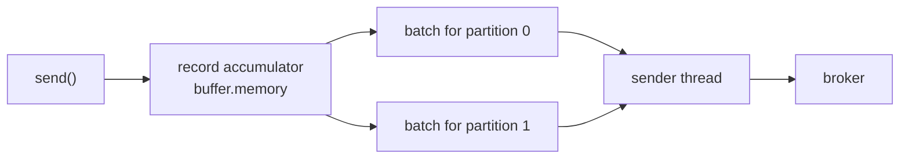

# Lesson 12: Batching, Linger and Compression

> **Part 2: The Producer**

---

## What you'll learn

- How `batch.size` and `linger.ms` interact, and why tuning one without the other does nothing
- Why compression only works because of batching
- How to choose a codec, and why it must match the topic's
- What `buffer.memory` protects you from, and how it fails

---

## Why this matters

A producer that sends one record per network request is slow, and no amount of hardware fixes it. The cost of a produce request, meaning the TCP round trip, the broker's request queue and the acknowledgment, is roughly the same whether the request carries one record or ten thousand.

Batching is where Kafka's throughput actually comes from. It is also where its latency comes from, and the two are the same dial pointed in opposite directions.

---

## Before you start

[Lesson 11](11-keys-and-partition-affinity.md), with a keyed producer.

---

## The concept

### The producer is asynchronous, and that is the point

`send()` does not talk to a broker. It serialises the record, appends it to an in-memory buffer, and returns.

A background thread drains that buffer, groups records into **batches**, one batch per partition, and ships each batch as a single request.



So the question "when does a record actually get sent?" has two answers, and a batch is sent when either is satisfied.

### `batch.size` is the size trigger

The maximum bytes in one batch, per partition. The default is 16 KiB.

When a partition's batch fills to `batch.size`, it is sent immediately.

This is an upper bound rather than a target. If the buffer holds one record when the sender thread comes around, that record is sent alone, as a batch of one. `batch.size` never makes the producer wait.

It is also the value that drives the keyless partition switching you measured in Lesson 04, which is why raising it makes an unkeyed producer stick to one partition for longer.

> A record larger than `batch.size` gets its own batch rather than being rejected. The limits that reject are `max.request.size`, default 1 MiB, and the broker's `message.max.bytes`.

### `linger.ms` is the time trigger

How long the producer will wait for more records before sending a partially full batch. The default is `0`.

`linger.ms=0` does not mean no batching. It means no deliberate waiting. Records arriving while a request is already in flight still accumulate and go out together, so you get batching as an accident of load rather than as a policy.

`linger.ms=20` means that when the first record lands in an empty batch, a 20 millisecond timer starts. The batch is sent when it fills or when the timer expires, whichever happens first.

This is the setting that trades latency for throughput, and it is the one people forget. Raising `batch.size` alone changes nothing under light load, because the batch is dispatched the moment the sender thread is free. You have to give the producer permission to wait.

Under heavy load `linger.ms` costs almost nothing, because batches fill before the timer expires and the size trigger fires first. Under light load it adds up to `linger.ms` of latency and improves batching dramatically. That asymmetry is why 5 to 20 milliseconds is nearly free in practice.

### Compression needs batching

Kafka compresses the batch, not the record.

Compressing a single 200 byte JSON document achieves very little, because there is not enough repetition to build a dictionary from. Compressing 500 similar JSON documents together achieves a great deal, because they share field names, structure and vocabulary.

So `compression.type` and `linger.ms` are the same lever. A producer with `linger.ms=0` under light load compresses batches of one, reports a compression ratio near 1.0, and burns CPU for nothing.

| Codec | Ratio | CPU | Use when |
|---|---|---|---|
| `none` | 1.0 | none | records are already compressed, such as images or video |
| `gzip` | best | highest | storage cost dominates and throughput does not |
| `snappy` | good | low | a balanced, universally supported default |
| `lz4` | good | lowest | maximum throughput |
| `zstd` | very good | moderate | best overall ratio to speed |

`zstd` is the modern recommendation for most workloads. This course uses `snappy` as the conservative choice, and the exercises ask you to measure the difference rather than take that on faith.

### Match the topic's codec

You set `compression.type=snappy` on the topic in Lesson 09, and that was not decoration.

If the producer's codec matches the topic's, the broker stores the compressed batch exactly as it arrived, at zero broker CPU cost. If they differ, the broker decompresses every batch and recompresses it in the topic's codec, on every write, forever. The cost is large and nothing warns you.

Setting the topic to `producer`, which is the default, means "store whatever the producer sent". That side-steps the problem, at the cost of a topic whose batches may be in several codecs.

### `buffer.memory`, and how `send()` blocks

The total memory the producer may use for unsent records. The default is 32 MiB.

If your application produces faster than the network can drain the buffer, the buffer fills. At that point `send()`, the method you believed was non-blocking, blocks for up to `max.block.ms`, which defaults to 60 seconds, and then throws `TimeoutException`.

This is the producer applying backpressure to your application. It is correct behaviour, and it is an unpleasant surprise the first time a thread pool stalls inside a call documented as asynchronous.

---

## Hands-on

### 1. Add actuator

You are about to measure the producer, which means you need its metrics exposed. Add the dependency to `pom.xml`:

```xml
        <dependency>
            <groupId>org.springframework.boot</groupId>
            <artifactId>spring-boot-starter-actuator</artifactId>
        </dependency>
```

Adding actuator gives the application a web server, which has a side effect worth predicting: from now on it will keep running after `ApplicationRunner` finishes, instead of exiting as it did in Lesson 08. Stop it with Ctrl-C.

### 2. Configure batching and compression

Replace `application.yml` with this complete file. Every key from Lesson 10 is still here, plus the batching settings and the management block that exposes metrics:

```yaml
spring:
  application:
    name: wikimedia-producer

  kafka:
    producer:
      bootstrap-servers: localhost:9092,localhost:9093,localhost:9094

      key-serializer: org.apache.kafka.common.serialization.StringSerializer
      value-serializer: org.apache.kafka.common.serialization.StringSerializer

      acks: all
      retries: 3

      # Batch up to 32 KiB per partition before flushing on size.
      # Larger batches mean better throughput and much better compression.
      batch-size: 32768

      # Total buffer for unsent records. When this fills, send() blocks
      # for max.block.ms and then throws.
      buffer-memory: 33554432

      # Must match the topic's compression.type, or the broker
      # decompresses and recompresses every batch.
      compression-type: snappy

      properties:
        enable.idempotence: true
        max.in.flight.requests.per.connection: 5

        # Wait up to 20 ms for more records before sending a partial batch.
        # Without this, batch-size above is nearly meaningless under light load.
        linger.ms: 20

        # Total time send() has to succeed, including all retries and waiting.
        delivery.timeout.ms: 120000

        # How long to wait for a broker's response to a single request.
        request.timeout.ms: 30000

server:
  port: 8081

management:
  endpoints:
    web:
      exposure:
        include: health,info,metrics
  endpoint:
    health:
      show-details: always
```

Note where each property lives. `batch-size`, `buffer-memory` and `compression-type` are Spring Boot's own relaxed-binding names under `producer:`. `linger.ms`, `delivery.timeout.ms` and `request.timeout.ms` have no Spring equivalent, so they go under `properties:` with Kafka's dotted names.

The `management` block matters as much as the dependency. Actuator exposes only `health` by default, so without `include: metrics` every metrics URL below returns 404 even though the metrics are being collected.

> Putting `linger.ms: 20` directly under `producer:` is silently ignored. The YAML parses, the application starts, and you get `linger.ms=0`. This is the most common Kafka-in-Spring configuration mistake, and it is the same trap as `enable.idempotence` in Lesson 10.

### 3. The timeout hierarchy

Three timeouts, which must be ordered correctly:

```
delivery.timeout.ms  >=  linger.ms + request.timeout.ms
     120000          >=     20     +      30000
```

- **`request.timeout.ms`** is one attempt to reach a broker and get a reply.
- **`delivery.timeout.ms`** is the total budget for a `send()`, covering time in the buffer, `linger.ms`, every retry and every `request.timeout.ms`.

As Lesson 10 noted, `retries` is nearly irrelevant once idempotence is on. What actually bounds retrying is `delivery.timeout.ms`. When it expires, the `CompletableFuture` from `send()` completes exceptionally with a `TimeoutException` and the record is dropped. Kafka validates the inequality at startup and refuses to start if you violate it.

### 4. Watch batching happen

Set `linger.ms: 0` and produce a thousand records in a tight loop. `WikimediaProducer` needs to expose a flush for this, so add one method to it temporarily:

```java
    public void flush() {
        kafkaTemplate.flush();
    }
```

Then in `StartupMessageSender`:

```java
    @Override
    public void run(ApplicationArguments args) {
        long start = System.nanoTime();
        for (int i = 0; i < 1_000; i++) {
            producer.sendMessage("key-" + (i % 100), "payload-number-" + i);
        }
        producer.flush();
        log.info("Took {} ms", (System.nanoTime() - start) / 1_000_000);
    }
```

`flush()` blocks until every buffered record has been acknowledged. Without it you would be timing how fast you can fill a buffer, which is a measurement of nothing.

Run it, then read the producer's own metrics:

```bash
curl -s localhost:8081/actuator/metrics/kafka.producer.batch.size.avg
curl -s localhost:8081/actuator/metrics/kafka.producer.record.send.rate
```

Now set `linger.ms: 20` and run again.

`batch.size.avg` is the number that tells the story. With `linger.ms=0` under light load it sits near a single record's worth. With `linger.ms=20` it climbs, because the producer is finally allowed to wait. Wall-clock time on a local cluster barely moves; the request count does.

### 5. Compression ratio

```bash
curl -s localhost:8081/actuator/metrics/kafka.producer.compression.rate.avg
```

A value near 1.0 means compression is achieving nothing. Run this with `linger.ms=0` and again with `linger.ms=20`, and you will see the ratio improve purely because the batches got bigger. Nothing about the codec changed.

That is the point of this lesson in one measurement: compression is a function of batching, not a setting you turn on.

### 6. Put the sender back

Remove the loop, remove the temporary `flush()` method, and restore the six keyed records from Lesson 11.

---

## Try it yourself

1. Set `compression-type: gzip` on the producer while the topic is still `snappy`. Everything works. Explain what the broker is now doing on every write, and find a metric or a broker log line that would let you notice.

2. Set `buffer-memory: 65536`, which is 64 KiB, `linger.ms: 1000`, and produce 100,000 records in a loop. `send()` will start blocking. Time how long the loop takes, then set `max.block.ms: 1000` and run again. Which exception do you get, and on which call?

3. Set `delivery.timeout.ms: 1000` with `request.timeout.ms: 30000` and start the application. It refuses. Read the message, then explain the inequality in your own words.

4. Compare codecs on the same payload. Run the thousand-record loop with `snappy`, `lz4`, `gzip` and `zstd`, recording `compression.rate.avg` each time. Which would you pick for this workload, and what would change your mind if the records were 10 KiB each instead of 30 bytes?

---

## Common mistakes

**Raising `batch.size` and expecting more throughput.**
Under light load nothing changes, because the batch is sent as soon as the sender thread is free. `linger.ms` is what makes `batch.size` meaningful.

**Putting `linger.ms` under `producer:` instead of `properties:`.**
Silently ignored, and you keep the default of 0.

**Enabling compression with `linger.ms=0` under light load.**
You compress batches of one, gain nothing, and pay CPU on both the producer and the consumer.

**Mismatching producer and topic codecs.**
The broker decompresses and recompresses every batch, permanently, with no warning.

**Believing `send()` never blocks.**
It blocks when the buffer is full, for up to `max.block.ms`, then throws.

**Tuning `retries` to control how long a send keeps trying.**
`delivery.timeout.ms` is the real bound. With idempotence on, `retries` mostly determines how many attempts fit inside that budget.

**Adding actuator and forgetting the exposure list.**
The metrics exist and every URL returns 404 until you include them.

---

## Check your understanding

**1. You set `batch.size` to 1 MiB and see no throughput improvement. Why?**

<details>
<summary>Reveal answer</summary>

Because `batch.size` is a ceiling, not a target, and `linger.ms` is still 0.

The sender thread dispatches whatever is in the accumulator as soon as it is free. Under light load that is one or two records, far below either the old ceiling or the new one, so raising the ceiling changed nothing.

The producer only accumulates a large batch if it is either saturated with records or willing to wait. `linger.ms` is how you grant the second option.

</details>

**2. Your compression ratio metric reads 1.02 with `snappy` enabled. Is compression broken?**

<details>
<summary>Reveal answer</summary>

No. Your batches are too small to compress.

Compression operates on the batch. A batch containing one small JSON record has almost no internal repetition, so there is nothing for the codec to exploit, and you pay CPU on both sides for a ratio of essentially 1.

Raise `linger.ms` so batches actually accumulate, and the ratio improves without touching the codec. If it still does not improve, check whether your payloads are already compressed, in which case `none` is the honest setting.

</details>

**3. `delivery.timeout.ms` is 120 seconds and `retries` is 3. A broker is unreachable for 10 minutes. When does your `send()` fail, and with what?**

<details>
<summary>Reveal answer</summary>

After roughly 120 seconds, with the future completing exceptionally, carrying a `TimeoutException`.

`retries` does not decide this. Attempts are bounded by the delivery deadline, so whichever runs out first ends the send, and here the deadline does. Setting `retries` to 3 or to 300 would make no difference against a broker that is down for ten minutes.

The record is then dropped by the client. If your code ignored the future, as the producer did until Lesson 13, that drop is completely silent.

</details>

**4. Why does the same `linger.ms` value cost almost nothing under heavy load and a lot under light load?**

<details>
<summary>Reveal answer</summary>

Because it is a maximum wait rather than a fixed delay, and under heavy load the size trigger fires first.

With records arriving continuously, a batch reaches `batch.size` in well under 20 milliseconds, so the timer never expires and the added latency is a fraction of the batch fill time. With one record every few seconds, the timer always expires, so every record pays the full 20 milliseconds.

The asymmetry is why a small `linger.ms` is close to free in aggregate: it is applied exactly when the system is idle enough not to care, and skipped exactly when throughput matters.

</details>

**5. Your application's thread pool stalls, and stack traces show threads inside `kafkaTemplate.send()`. What has happened, and which two settings are involved?**

<details>
<summary>Reveal answer</summary>

The record accumulator is full, so `send()` is blocking rather than returning.

`buffer.memory` decides when this starts: once unsent records fill it, there is nowhere to append, and the only options are to wait or to fail. `max.block.ms` decides how long the wait lasts before a `TimeoutException` is thrown.

The underlying cause is always the same shape: you are producing faster than the cluster is accepting, whether because of a slow broker, a shrunken ISR refusing `acks=all` writes, or genuinely too much traffic. The buffer is the shock absorber, and blocking is what happens when it is exhausted.

Raising `buffer.memory` buys time and does not fix a sustained imbalance.

</details>

**6. Lesson 09 set the topic's codec and this lesson set the producer's. Why is that duplication not redundant?**

<details>
<summary>Reveal answer</summary>

Because they answer different questions, and only one of them is about your producer.

The producer's `compression.type` decides how batches are compressed on the wire. The topic's decides what the broker is willing to store. When they agree, the broker writes the batch through untouched, which is the cheap path.

The duplication exists because a topic has many producers, potentially written by other teams, and the topic's setting is the only place you can state a cluster-wide expectation. Setting it to `producer` avoids all recompression but gives up that control, leaving a topic whose segments hold a mixture of codecs that every consumer must be able to decode.

</details>

---

## Recap

`batch.size` and `linger.ms` are the size and time triggers for sending a batch, and either alone is nearly useless: a large ceiling with no willingness to wait produces batches of one. Compression operates on batches, so it is a function of your batching rather than a switch, and it must match the topic's codec or the broker pays to translate every write.

`buffer.memory` is the shock absorber between your application and the network, and `send()` blocks when it is exhausted.

You also added actuator, which means the producer can now be measured rather than guessed at, and it stays running instead of exiting.

**Next:** [Lesson 13: Send Callbacks and Error Handling](13-send-callbacks-and-errors.md)
