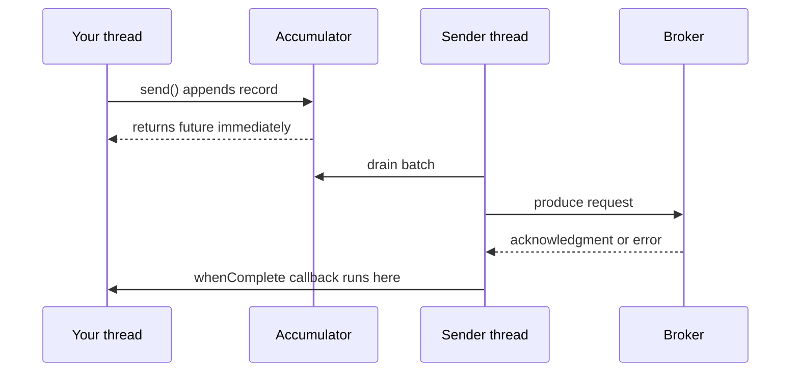

# Lesson 13: Send Callbacks and Error Handling

> **Part 2: The Producer**

---

## What you'll learn

- What the future returned by `send()` actually carries
- How to read the partition and offset the broker assigned
- Why blocking on that future destroys your throughput
- Which exceptions the client has already retried by the time you see them

---

## Why this matters

Every `send()` you have written so far has thrown away its return value. Lesson 08 warned you that `log.info("Sent")` proves only that a method was called, and Lesson 12 showed that a record can be dropped after `delivery.timeout.ms` with nothing to show for it.

This lesson closes that gap. It is also the point where a producer stops being a demo: a service that publishes events and cannot tell you whether publishing worked is not something you can operate.

---

## Before you start

[Lesson 12](12-batching-linger-compression.md), with actuator and batching configured.

---

## The concept

### `send()` returns a future

```java
CompletableFuture<SendResult<K, V>> future = kafkaTemplate.send(topic, key, value);
```

In Spring Kafka 3.0 and later this is a real `java.util.concurrent.CompletableFuture`. Older tutorials show `ListenableFuture` and `addCallback(...)`, which were removed; if you see those, the code predates 2022.

The future completes when the broker acknowledges the batch containing your record, or completes exceptionally when that never happens.

### `SendResult` and `RecordMetadata`

On success you get a `SendResult`, and its `getRecordMetadata()` tells you where the record landed:

```java
RecordMetadata m = result.getRecordMetadata();
m.topic();
m.partition();
m.offset();
m.timestamp();
```

This is the answer to "which partition did my key hash to?" coming from the broker rather than from your own arithmetic. Under `acks=all` it is also the definitive confirmation that the record is committed, which after Lesson 06 you know is a stronger statement than "the leader accepted it".

> The broker was always sending this back. Lesson 03's console producer discarded it, and so has your code until now.

### Two ways to consume the future

The non-blocking form, which is almost always the right one:

```java
kafkaTemplate.send(topic, key, value)
        .whenComplete((result, ex) -> { });
```

The callback runs on the producer's sender thread when the acknowledgment arrives, and your calling thread returns immediately. Batching is preserved.

The blocking form:

```java
SendResult<String, String> result = kafkaTemplate.send(topic, key, value).get();
```

`get()` waits for the broker, which means your thread waits at least `linger.ms`, plus the network round trip, plus replication to the ISR, for every record. You have serialised the producer and given up batching entirely, so a loop of blocking sends is slower than the same loop non-blocking by orders of magnitude.

There is one legitimate use: you genuinely cannot proceed until the record is durable, such as an HTTP handler that must only return `201 Created` if the event was published. Even then, prefer returning the future up the stack so the waiting happens as late as possible.

### Do not swallow the exception

The dangerous shape is this:

```java
.whenComplete((result, ex) -> {
    if (ex != null) {
        log.error("Failed to send: {}", ex.getMessage());
    }
});
```

By the time that line runs, the record is gone. It has exhausted `delivery.timeout.ms` worth of retries and will never be sent. You logged one line and continued as though the event had been published, so downstream systems will never see it and nothing else in your architecture knows.

Logging is not error handling. What you owe the caller is one of:

- **propagate**, letting the future's failure reach whoever asked you to publish
- **persist**, writing the record to an outbox table for a retry job to pick up
- **alert**, incrementing a failure metric that someone is paged on

Which one depends on whether losing the event is acceptable. A lone `log.error` never is.

### Retriable and fatal

The client already retries retriable exceptions for you, within `delivery.timeout.ms`. By the time an exception reaches your callback, retrying is finished.

| Exception | Retriable | Meaning |
|---|---|---|
| `NotEnoughReplicasException` | yes | ISR below the floor. The broker may recover and a retry may succeed. |
| `NotLeaderOrFollowerException` | yes | Leader election in progress. The client refreshes metadata. |
| `TimeoutException` | yes | The delivery deadline expired. The record is dropped. |
| `RecordTooLargeException` | no | Larger than `max.request.size`. Retrying changes nothing. |
| `SerializationException` | no | Your object cannot be serialised. It will never fix itself. |
| `AuthorizationException` | no | Access control. It will never fix itself. |
| `InvalidTopicException` | no | Bad topic name. |

The distinction decides what your callback should do. A `TimeoutException` is worth writing to an outbox, because the cluster may be healthy in ten seconds. A `SerializationException` will fail identically forever, so retrying it is a hot loop and the only sane response is to drop the record and alert loudly.

You will meet the same split on the consumer side in Lesson 20, where it decides whether a record goes to the dead-letter topic immediately or after backoff.



Note which thread the callback runs on. It is the sender thread, not yours, which is why blocking or doing slow work inside a callback stalls the producer for every partition.

---

## Hands-on

### 1. Add the callback

`src/main/java/com/example/wikimedia/producer/kafka/WikimediaProducer.java`:

```java
package com.example.wikimedia.producer.kafka;

import org.slf4j.Logger;
import org.slf4j.LoggerFactory;
import org.springframework.kafka.core.KafkaTemplate;
import org.springframework.stereotype.Service;

@Service
public class WikimediaProducer {

    private static final Logger log = LoggerFactory.getLogger(WikimediaProducer.class);
    private static final String TOPIC = "wikimedia-stream";

    private final KafkaTemplate<String, String> kafkaTemplate;

    public WikimediaProducer(KafkaTemplate<String, String> kafkaTemplate) {
        this.kafkaTemplate = kafkaTemplate;
    }

    public void sendMessage(String key, String message) {
        kafkaTemplate.send(TOPIC, key, message)
                .whenComplete((result, ex) -> {
                    if (ex != null) {
                        log.error("Failed to send key={}: {}", key, ex.getMessage());
                        return;
                    }
                    var metadata = result.getRecordMetadata();
                    log.debug("Sent topic={} partition={} offset={}",
                            metadata.topic(), metadata.partition(), metadata.offset());
                });
    }
}
```

Two details worth noting.

**Success logs at `debug`.** At the event rate you will reach in Lesson 14, often hundreds per second, an `info` line per record will drown your logs and become a bottleneck in its own right. Success is the boring case.

**An early `return` after the error branch** rather than `if` and `else`, which is the shape used throughout this course.

This callback is still only logging on failure, which the concept section just called unacceptable. That is deliberate: Lesson 14 gives the producer a real caller, and the last exercise here asks you to decide what should actually happen.

### 2. Watch the broker confirm your hashing

Enable debug logging for your package in `application.yml`:

```yaml
logging:
  level:
    com.example.wikimedia.producer: DEBUG
```

Run with the keyed sender from Lesson 11:

```
Sent topic=wikimedia-stream partition=1 offset=0
Sent topic=wikimedia-stream partition=0 offset=0
Sent topic=wikimedia-stream partition=1 offset=1
Sent topic=wikimedia-stream partition=2 offset=0
Sent topic=wikimedia-stream partition=1 offset=2
Sent topic=wikimedia-stream partition=0 offset=1
```

Every `en.wikipedia` record reports `partition=1` and every `de.wikipedia` reports `partition=0`. The broker is confirming, record by record, the affinity you predicted in Lesson 11, and the offsets within partition 1 count up in send order.

Notice that the callbacks can arrive out of send order across partitions. They fire when each batch is acknowledged, and different partitions have different leaders on different brokers.

### 3. Make it fail

Point the producer at a topic that cannot accept writes, exactly as in Lesson 10:

```bash
docker exec kafka-1 kafka-topics \
  --bootstrap-server kafka-1:29092 \
  --create --topic fail-demo \
  --partitions 1 --replication-factor 3 \
  --config min.insync.replicas=3

docker compose stop kafka-3
```

Change `TOPIC` to `"fail-demo"` and run. After the retries and the delivery deadline elapse:

```
ERROR Failed to send key=en.wikipedia: ...NotEnoughReplicasException...
```

Now compare that with Lesson 08's version of this class, which had no callback. Same broker state, same lost records, and it would have logged `Sent:` and exited cleanly.

Shorten the wait if you are impatient, by setting `delivery.timeout.ms: 5000` and `request.timeout.ms: 2000` temporarily. Put them back afterwards.

Restore:

```bash
docker compose start kafka-3
docker exec kafka-1 kafka-topics --bootstrap-server kafka-1:29092 --delete --topic fail-demo
```

Point `TOPIC` back at `wikimedia-stream`.

### 4. Measure the cost of blocking

Temporarily add a blocking variant alongside the real one:

```java
    public void sendMessageBlocking(String key, String message) {
        try {
            var result = kafkaTemplate.send(TOPIC, key, message).get();
            log.debug("Sent offset={}", result.getRecordMetadata().offset());
        } catch (InterruptedException e) {
            Thread.currentThread().interrupt();
            throw new IllegalStateException("Interrupted while sending", e);
        } catch (java.util.concurrent.ExecutionException e) {
            throw new IllegalStateException("Send failed", e.getCause());
        }
    }
```

Note the two catch blocks. `get()` throws both, and `InterruptedException` must restore the interrupt flag rather than being swallowed, because something above you may be trying to shut this thread down.

Now time a thousand records each way, with `linger.ms: 20` still set:

```java
    @Override
    public void run(ApplicationArguments args) {
        long t1 = System.nanoTime();
        for (int i = 0; i < 1_000; i++) {
            producer.sendMessage("key-" + (i % 100), "payload-" + i);
        }
        log.info("Non-blocking submit took {} ms", (System.nanoTime() - t1) / 1_000_000);

        long t2 = System.nanoTime();
        for (int i = 0; i < 1_000; i++) {
            producer.sendMessageBlocking("key-" + (i % 100), "payload-" + i);
        }
        log.info("Blocking took {} ms", (System.nanoTime() - t2) / 1_000_000);
    }
```

The blocking loop is dramatically slower, and the reason is `linger.ms`. Each `get()` waits for a batch that will never fill, because the calling thread is the only source of records and it is blocked, so every record pays the full linger timeout before its batch is sent.

That is the trap in one measurement: blocking on the future does not merely add a round trip, it defeats the batching you configured in Lesson 12.

Delete `sendMessageBlocking` and restore the six keyed records afterwards.

---

## Try it yourself

1. In the callback, replace `log.error` with something that would actually survive an incident: increment a counter with Micrometer, then read it from `/actuator/metrics`. Which is more useful during an outage, the log line or the counter, and why?

2. Put a `Thread.sleep(50)` inside the success callback and produce a thousand records. Throughput collapses. Explain which thread you just blocked and why it affects partitions your callback was not called for.

3. Send a record larger than `max.request.size`, for example a 2 MiB string, and read the exception. Is it retriable? Explain what a retry would achieve, and what your callback should do instead.

4. Decide what `WikimediaProducer` should really do on failure, given that Lesson 14 will call it from an HTTP-triggered stream that cannot pause. Write down the choice between propagate, persist and alert, and what it would cost to implement. You will live with this decision for the rest of the course.

---

## Common mistakes

**Ignoring the future.**
The default failure mode of a Kafka producer is silence. Nothing tells you a record was dropped unless you ask.

**Logging the exception and moving on.**
The event is gone and your service believes it was published. Logging is not handling.

**Calling `.get()` in a loop.**
This serialises the producer and, with `linger.ms` set, makes every record wait for a timeout that only more records could have prevented.

**Doing slow work in the callback.**
It runs on the sender thread, so blocking there stalls production for every partition.

**Swallowing `InterruptedException`.**
Restore the flag with `Thread.currentThread().interrupt()`, or shutdown hangs in ways that are very hard to diagnose.

**Expecting the client to retry a fatal error.**
Serialization, authorization and record-size failures never resolve. Retrying them is a hot loop.

**Logging every success at `info`.**
At real event rates the logging becomes the bottleneck.

---

## Check your understanding

**1. Your callback logs a `TimeoutException`. What is the state of that record?**

<details>
<summary>Reveal answer</summary>

Gone. The client retried it until `delivery.timeout.ms` expired, then completed the future exceptionally and discarded it.

There is no queue holding it, no automatic retry after the callback, and no way to ask Kafka for it later. If losing that event matters, the callback is the last place you could have done something, which is why a bare log line there is a decision to lose data.

</details>

**2. Why is `.get()` on the future so much slower than a callback, beyond the obvious round trip?**

<details>
<summary>Reveal answer</summary>

Because it interacts badly with `linger.ms`.

The producer waits up to `linger.ms` for more records before sending a partially full batch. If your only producing thread is blocked inside `get()`, no more records can arrive, so the batch can never fill and the timer always expires in full. Every record pays the maximum wait.

You therefore lose the round trip, the batching, and the compression that depended on batching, all at once. Non-blocking sends let the next record join the batch that the previous record is still waiting in.

</details>

**3. The callback fires on the producer's sender thread. Why does that make a slow callback worse than a slow caller?**

<details>
<summary>Reveal answer</summary>

Because that thread is shared across every partition and every in-flight request.

Your calling thread only affects your own code path. The sender thread drains the accumulator, dispatches batches to all partitions, and processes all acknowledgments. Block it for 50 milliseconds and nothing is sent to any partition for 50 milliseconds, regardless of which record's callback you were in.

Callbacks should record a fact and return: increment a counter, enqueue to something else, log at debug. Any real work belongs on another thread.

</details>

**4. `NotEnoughReplicasException` is retriable and `SerializationException` is not. Why does your code need to care, if the client handles retrying?**

<details>
<summary>Reveal answer</summary>

Because the client's retrying is already over by the time you see either one, and the correct response differs completely.

A retriable exception reaching your callback means transient trouble that outlasted your delivery budget. The cluster may well be healthy again shortly, so persisting the record for a later attempt is sensible.

A fatal exception means the record can never be sent as it stands. Persisting it for retry creates a poison entry that fails identically forever. The right action is to drop it, capture enough to reproduce the problem, and alert, because the fault is in your code or configuration rather than in the cluster.

Treating both the same way gives you either lost events or an outbox that never drains.

</details>

**5. Under `acks=all`, the callback reporting `partition=1 offset=4823` is a stronger statement than "the leader accepted it". Why?**

<details>
<summary>Reveal answer</summary>

Because with `acks=all` the acknowledgment is only sent after every in-sync replica has the record, and the offset you are given is a committed offset.

Lesson 06 showed the alternative. With `acks=1`, or with `acks=all` against an ISR below the floor, a record can sit on the leader's disk without being committed, invisible to consumers and lost if the leader fails. A successful `acks=all` acknowledgment excludes that state: the record is on at least `min.insync.replicas` disks and is readable.

So this callback is not merely reporting where the record went. It is the point at which "published" becomes true.

</details>

---

## Recap

`send()` returns a `CompletableFuture<SendResult>` that carries the topic, partition, offset and timestamp the broker assigned, or the exception that ended the attempt. Consume it with `whenComplete` and do almost nothing inside the callback, because it runs on the sender thread.

Blocking with `get()` costs you the round trip and the batching, since a blocked producing thread guarantees the linger timer expires in full.

By the time an exception reaches you, the client has finished retrying and the record is gone. Retriable failures are worth persisting for another attempt; fatal ones will fail identically forever and need alerting instead.

**Next:** [Lesson 14: Real Data, the Wikimedia SSE Stream](14-wikimedia-sse-stream.md)
