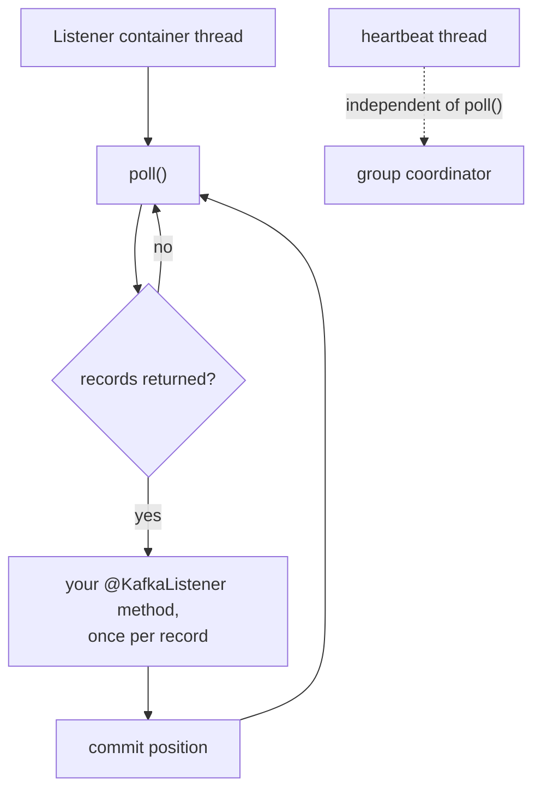

# Lesson 15: Your First KafkaListener

> **Part 3: The Consumer**

---

## What you'll learn

- What the listener container does on your behalf, and what you inherit from it
- Why `groupId` is the most consequential string in a consumer application
- When `auto-offset-reset` applies, which is rarer than most people think
- Why deserializers must mirror serializers exactly

---

## Why this matters

Part 2 built a producer that publishes live Wikimedia edits. Nothing reads them. Everything you learned about consumer groups, offsets and lag in Lesson 05 was done from the CLI, and this is where it becomes an application.

The consumer side is also where Kafka's failure modes get interesting. A producer either publishes or does not. A consumer can process a record twice, lose one, block a partition, or silently stop reading, and each of those has a specific cause you can control.

---

## Before you start

[Lesson 14](14-wikimedia-sse-stream.md), and a producer that can fill the topic. Records already in `wikimedia-stream` are ideal, because you will watch them replay.

---

## The concept

### The listener container

The raw Kafka consumer API is a loop:

```java
while (true) {
    ConsumerRecords<String, String> records = consumer.poll(Duration.ofSeconds(3));
    for (ConsumerRecord<String, String> record : records) {
        process(record);
    }
    consumer.commitSync();
}
```

Spring's **listener container** runs that loop on a background thread and calls your annotated method once per record. `@KafkaListener` registers your method with a container.

This matters because the loop has properties you inherit whether or not you know about them:

- **A single thread owns a consumer**, and it must return to `poll()` regularly. If your method takes longer than `max.poll.interval.ms`, five minutes by default, the group decides you are dead and your partitions are reassigned.
- **Records arrive in batches and are handed to you one at a time.** `max-poll-records`, default 500, caps how many arrive per poll. It is not a batch size for your method.
- **Heartbeating is separate from polling.** Modern clients heartbeat on their own thread, which is why `session.timeout.ms` and `max.poll.interval.ms` are two different settings, covered in Lesson 19.



### `groupId`, the most consequential string in the application

From Lesson 05: a group owns committed offsets, and within a group each partition goes to exactly one member.

Two consequences catch people out.

**Two applications sharing a `groupId` split the partitions.** Each sees only some records. If two unrelated services both use `my-group`, each processes roughly half the events and both appear to work. There is no error, just silent partial data.

**Changing the `groupId` resets your position.** A new group has no committed offsets, so `auto-offset-reset` decides where it starts. Renaming a group in a configuration file can replay an entire topic, or skip everything in it.

### `auto-offset-reset` applies only when there is no offset

```yaml
auto-offset-reset: earliest
```

This is consulted in exactly one situation: the group has no valid committed offset for a partition. That happens when the group is brand new, or when its committed offset points at a record retention has already deleted.

| Value | Behaviour |
|---|---|
| `earliest` | start at the oldest retained record |
| `latest` | start at the end, taking only records produced from now on |
| `none` | throw an exception |

The default is `latest`, which is why `kafka-console-consumer` printed nothing in Lesson 03 until you passed `--from-beginning`.

Once the group has a committed offset this setting is ignored entirely. It is not "always start from the beginning". It is "where do I start when I have no idea where I was".

Choose `earliest` when reprocessing history is safe. Choose `latest` for a live dashboard where old events are worthless. Choose `none` when a missing offset means something has gone badly wrong and you would rather fail than guess.

### Deserializers mirror serializers

The producer serialised `String` to `byte[]`, so the consumer must reverse it:

```yaml
key-deserializer: org.apache.kafka.common.serialization.StringDeserializer
value-deserializer: org.apache.kafka.common.serialization.StringDeserializer
```

These must correspond to what the producer wrote. Deserialise Avro bytes with a `StringDeserializer` and you get unreadable text rather than an exception, which is one of several reasons Lesson 25 exists.

---

## Hands-on

### 1. Create the consumer project

Generate a second project from [start.spring.io](https://start.spring.io), alongside the producer:

| Field | Value |
|---|---|
| Project | Maven |
| Spring Boot | 4.1.0 |
| Group | `com.example.wikimedia` |
| Artifact | `wikimedia-consumer` |
| Java | 25 |
| Dependencies | Spring for Apache Kafka, Spring Boot Actuator |

```
kafka-course/
├── docker-compose.yml
├── wikimedia-producer/
└── wikimedia-consumer/
```

`pom.xml`:

```xml
<?xml version="1.0" encoding="UTF-8"?>
<project xmlns="http://maven.apache.org/POM/4.0.0"
         xmlns:xsi="http://www.w3.org/2001/XMLSchema-instance"
         xsi:schemaLocation="http://maven.apache.org/POM/4.0.0 https://maven.apache.org/xsd/maven-4.0.0.xsd">
    <modelVersion>4.0.0</modelVersion>

    <parent>
        <groupId>org.springframework.boot</groupId>
        <artifactId>spring-boot-starter-parent</artifactId>
        <version>4.1.0</version>
        <relativePath/>
    </parent>

    <groupId>com.example.wikimedia</groupId>
    <artifactId>wikimedia-consumer</artifactId>
    <version>0.0.1-SNAPSHOT</version>

    <properties>
        <java.version>25</java.version>
    </properties>

    <dependencies>
        <dependency>
            <groupId>org.springframework.boot</groupId>
            <artifactId>spring-boot-starter-kafka</artifactId>
        </dependency>

        <dependency>
            <groupId>org.springframework.boot</groupId>
            <artifactId>spring-boot-starter-actuator</artifactId>
        </dependency>

        <dependency>
            <groupId>org.springframework.boot</groupId>
            <artifactId>spring-boot-starter-test</artifactId>
            <scope>test</scope>
        </dependency>
    </dependencies>

    <build>
        <plugins>
            <plugin>
                <groupId>org.springframework.boot</groupId>
                <artifactId>spring-boot-maven-plugin</artifactId>
            </plugin>
        </plugins>
    </build>
</project>
```

Actuator is included from the start here, because a consumer's lag and listener state are the things you will want to see in Lesson 19 and Lesson 26.

### 2. `src/main/resources/application.yml`

```yaml
spring:
  application:
    name: wikimedia-consumer

  kafka:
    # Declared at the top level rather than under consumer:, because the
    # dead-letter producer in Lesson 21 needs it as well.
    bootstrap-servers: localhost:9092,localhost:9093,localhost:9094

    consumer:
      group-id: wikimedia-consumer-group

      # Only consulted when this group has no committed offset for a partition.
      # Once it has one, this setting is ignored.
      auto-offset-reset: earliest

      key-deserializer: org.apache.kafka.common.serialization.StringDeserializer
      value-deserializer: org.apache.kafka.common.serialization.StringDeserializer

      # How many records one poll() may return. Spring still hands them to your
      # method one at a time.
      max-poll-records: 500

server:
  port: 8082

management:
  endpoints:
    web:
      exposure:
        include: health,info,metrics
  endpoint:
    health:
      show-details: always
```

`server.port: 8082`, because the producer owns 8081 and Kafka UI owns 8080.

### 3. `ConsumerApplication.java`

```java
package com.example.wikimedia.consumer;

import org.springframework.boot.SpringApplication;
import org.springframework.boot.autoconfigure.SpringBootApplication;

@SpringBootApplication
public class ConsumerApplication {

    public static void main(String[] args) {
        SpringApplication.run(ConsumerApplication.class, args);
    }
}
```

### 4. `src/main/java/com/example/wikimedia/consumer/kafka/WikimediaConsumer.java`

```java
package com.example.wikimedia.consumer.kafka;

import org.apache.kafka.clients.consumer.ConsumerRecord;
import org.slf4j.Logger;
import org.slf4j.LoggerFactory;
import org.springframework.kafka.annotation.KafkaListener;
import org.springframework.stereotype.Service;

@Service
public class WikimediaConsumer {

    private static final Logger log = LoggerFactory.getLogger(WikimediaConsumer.class);

    @KafkaListener(
            topics = "wikimedia-stream",
            groupId = "wikimedia-consumer-group"
    )
    public void consume(ConsumerRecord<String, String> record) {
        log.info("Consumed key={} partition={} offset={} valueLength={}",
                record.key(), record.partition(), record.offset(), record.value().length());
    }
}
```

Take a `ConsumerRecord<String, String>` rather than a bare `String`. The bare version gives you the value and hides everything else, while `ConsumerRecord` gives you `key()`, `partition()`, `offset()`, `timestamp()` and `headers()`. In Lesson 22 the headers are the whole point.

> No `@EnableKafka` is needed. Boot's auto-configuration adds it when the starter is present, which is the same starter-versus-library distinction from Lesson 08.

### 5. Run it

Start the consumer:

```bash
cd wikimedia-consumer
./mvnw spring-boot:run
```

If the topic already holds records from Part 2, they replay immediately:

```
Consumed key=Nikola Tesla partition=0 offset=0 valueLength=1834
Consumed key=Berlin partition=0 offset=1 valueLength=1502
Consumed key=Category:Living people partition=2 offset=0 valueLength=2011
```

Two things to notice.

**The keys are page titles**, which is the producer's keying decision from Lesson 14 arriving intact on the consumer side.

**Partitions interleave.** You will see offsets from partition 0, then 2, then 1, then 0 again. Each partition is ordered internally and there is no order at all across them, exactly as Lesson 01 promised and Lesson 04 demonstrated from the CLI.

Now start the producer in another terminal and trigger the stream:

```bash
curl http://localhost:8081/api/v1/wikimedia
```

Live edits scroll past.

### 6. Prove `auto-offset-reset` fires only once

Stop the consumer, then restart it.

It does not replay from the beginning. It resumes from its committed offsets, because the group now has them. `auto-offset-reset: earliest` was consulted on the first run and ignored on the second.

Now change `groupId` in both `application.yml` and the annotation to `wikimedia-consumer-group-v2` and restart. Everything replays from offset 0, because that is a brand-new group with no offsets.

```bash
docker exec kafka-1 kafka-consumer-groups \
  --bootstrap-server kafka-1:29092 --list
```

Two groups, two independent positions over the same data. That is Lesson 05's independence, now from Java.

Change the `groupId` back before continuing.

### 7. Watch the group from outside

While the consumer runs:

```bash
docker exec kafka-1 kafka-consumer-groups \
  --bootstrap-server kafka-1:29092 \
  --describe --group wikimedia-consumer-group
```

This is the same output you read in Lesson 05, now with populated `CONSUMER-ID`, `HOST` and `CLIENT-ID` columns, because there is a live member. One member holds all three partitions, since the group has one consumer. Lesson 19 changes that.

Stop the consumer and describe again. The group persists with its offsets and reports no active members, which is the state Lesson 05 showed you first.

---

## Try it yourself

1. Set `auto-offset-reset: none` and use a group ID that has never existed. Read the exception. Then explain when this would be the setting you actually want in production.

2. Start a second instance of the consumer with `SERVER_PORT=8083 ./mvnw spring-boot:run`. Describe the group. How were the three partitions split, and what happened to the log output of each instance?

3. Change the listener parameter from `ConsumerRecord<String, String>` to `String` and run. Everything still works. What did you lose, and which later lesson would break first?

4. Deliberately create the split-brain bug: give a second, differently named application the same `groupId` and the same topic. Confirm from the logs that each sees only some records, then explain why no error is raised anywhere.

---

## Common mistakes

**Sharing a `groupId` between two applications that each need every record.**
The partitions are split between them and each sees a subset. There is no error, and it looks like random data loss.

**Expecting `auto-offset-reset` to control every start.**
It applies only when there is no committed offset. Once the group has one, it is ignored.

**Renaming a `groupId` casually.**
That is a new group, so it replays from `earliest` or skips to `latest`. Both can be catastrophic depending on what your consumer does with a record.

**Mismatching deserializers.**
The wrong deserializer often produces unreadable data rather than an exception.

**Doing slow work in the listener method.**
Exceeding `max.poll.interval.ms` makes the group treat you as dead and reassign your partitions. Lesson 19 covers the consequences.

**Taking a bare `String` parameter.**
You lose the partition, offset, key, timestamp and headers, and Lesson 22 needs all of them.

---

## Check your understanding

**1. You restart the consumer and it does not replay the topic, despite `auto-offset-reset: earliest`. Bug?**

<details>
<summary>Reveal answer</summary>

No, that is the setting working correctly.

`auto-offset-reset` is consulted only when the group has no valid committed offset for a partition. Your first run committed offsets, so the second run resumed from them and never consulted the setting.

To replay you need to remove the position rather than change the setting: reset the group's offsets with `kafka-consumer-groups --reset-offsets`, as in Lesson 05, or use a new group ID.

</details>

**2. Two services share `groupId: my-group` and each processes about half the records. Which of them is misconfigured?**

<details>
<summary>Reveal answer</summary>

Both, and the fix is to stop sharing the group.

A group is a unit of work division. Its partitions are distributed among members so that each record is processed once *by the group*, which is what you want for scaling one logical consumer and exactly wrong for two independent consumers.

Two applications that each need every record need two group IDs. That is the fan-out from Lesson 01, and it requires nothing more than a different string.

The reason this is nasty is that neither service errors. Each just sees a subset, and if both write to different destinations, both destinations look plausibly populated.

</details>

**3. Your listener method takes 6 minutes on one record. What happens?**

<details>
<summary>Reveal answer</summary>

You exceed `max.poll.interval.ms`, which defaults to 5 minutes, so the group coordinator concludes this member is stuck and reassigns its partitions to someone else.

Your method then finishes and the container tries to commit a position it no longer owns, which fails. The record is meanwhile being processed again by whichever member took over the partition, so slow processing turns into duplicate processing.

Heartbeats do not save you. They run on a separate thread and keep reporting that the process is alive, which is precisely why there are two separate timeouts. Lesson 19 covers both.

</details>

**4. The producer keys by page title. Your consumer logs show `key=Berlin` on partition 0 every time. Why is that guaranteed?**

<details>
<summary>Reveal answer</summary>

Because the partition is derived arithmetically from the key, as `murmur2(key) % partitionCount`, and neither the key nor the partition count is changing.

That is the affinity you predicted in Lesson 04 and confirmed from the broker in Lesson 13, now visible from the consumer side. Every edit to Berlin is in one partition, in the order it was produced, and read by one member of the group.

It stops being guaranteed the moment someone increases the partition count, which is why Lesson 09 treated that as the one declaration you cannot casually edit.

</details>

**5. `max-poll-records: 500` is set. Does your listener method receive 500 records?**

<details>
<summary>Reveal answer</summary>

No. It receives one record per call, five hundred times.

`max.poll.records` caps how many records a single `poll()` returns to the container. The container then iterates and invokes your method once per record.

The setting still matters, because it decides how much work the container takes on between polls. Five hundred records that each take 10 milliseconds is 5 seconds of processing before the next `poll()`, which counts against `max.poll.interval.ms`. Lowering it is the usual first fix when slow processing triggers rebalances.

Spring can hand you a `List` of records instead, by enabling batch listening, but that is a different container mode and not what you have configured.

</details>

---

## Recap

`@KafkaListener` registers your method with a listener container that runs the poll loop for you, and you inherit that loop's constraints: one thread per consumer, a bounded number of records per poll, and a deadline for returning to `poll()`.

`groupId` decides which offsets you own and who you share partitions with, and changing it silently changes where you start. `auto-offset-reset` matters only on the first run of a group, or after retention has deleted the record you were pointing at.

Your consumer currently logs the length of a JSON string. Next it learns what the JSON means.

**Next:** [Lesson 16: DTO Records and Deserialization](16-dtos-and-deserialization.md)
