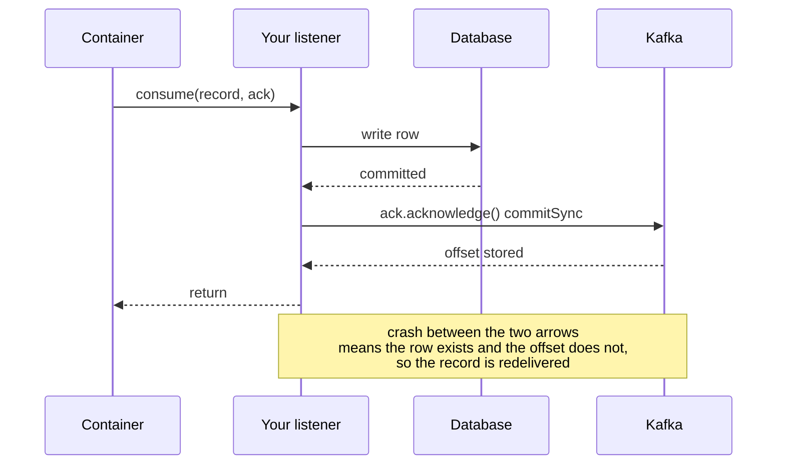

# Lesson 17: Manual Acknowledgment

> **Part 3: The Consumer**

---

## What you'll learn

- Why committing an offset on a timer loses or duplicates records
- What each Spring ack mode actually commits, and when
- Why at-least-once plus idempotent processing beats chasing exactly-once
- What `isolation.level` does, and when it does nothing

---

## Why this matters

An offset commit is a claim: everything up to here has been processed. If that claim is made by a timer rather than by your code, it is a guess, and it will occasionally be wrong in whichever direction is worse for you.

This is also the lesson that decides what Lesson 18 has to look like. Once you accept at-least-once delivery, the database write has to tolerate being repeated, and that shapes the entity.

---

## Before you start

[Lesson 16](16-dtos-and-deserialization.md), with a consumer that parses events into a DTO.

---

## The concept

### What the container already does, and what the raw client does

There is a widespread claim that auto-commit is the default and therefore your risk by default. That is true of the raw Kafka client and misleading in Spring.

`enable.auto.commit` defaults to `true` in the Kafka consumer API. Spring's listener container overrides it to `false` unless you explicitly set it, and commits offsets itself after your listener has been invoked. So out of the box you are already better off than the raw client.

What you do not have out of the box is control over *when*. That is what the ack modes below decide, and it is why this lesson exists even though the dangerous default was already handled for you.

### How auto-commit loses records

Set `enable-auto-commit: true` explicitly and the container steps aside, letting the client commit on a timer, every `auto.commit.interval.ms`, from inside the poll loop. It commits the offsets of the last `poll()`, and it does not consult whether your listener finished, succeeded, or ran at all.

The loss window is narrower than most explanations suggest, and worth getting right.

A single-threaded container hands every record from one poll to your listener before calling `poll()` again, and the commit is issued from inside `poll()`. So the timer cannot fire midway through your batch. What it can do is commit the *previous* poll's offsets while you are working, and commit the current batch the moment you return, whether or not the work stuck.

The genuine loss cases are these:

- **Your listener hands work to another thread.** The listener returns, the offset is committed, and the actual processing is still queued somewhere. Kill the process and that work is lost while Kafka says it was done.
- **Your listener returns successfully but the effect is not durable.** A buffered write, an unflushed file, an async HTTP call. Same shape: the commit outran the work.
- **You catch the exception and return normally.** The container sees success, commits, and the record is never retried.

The duplication case is simpler and unavoidable. Your listener processes records 100 to 199 and writes them to a database, then the process is killed before the commit is sent. On restart the group resumes at 100 and those records are processed again.

You get loss or duplication, and with a timer you do not choose which.

### Manual acknowledgment

Take an `Acknowledgment` parameter and commit explicitly:

```java
public void consume(ConsumerRecord<String, String> record, Acknowledgment ack) {
    process(record);
    ack.acknowledge();
}
```

The offset advances only after processing succeeded. If `process()` throws, no commit happens, the record is redelivered, and with the error handler from Lesson 20 it is retried or routed to a dead-letter topic.

The ordering is the entire point:

> Do the work. Then commit. Never the reverse.

### Ack modes

`ContainerProperties.AckMode` controls when a commit is actually sent:

| Mode | Commits |
|---|---|
| `BATCH` (default) | after all records from one `poll()` have been processed |
| `RECORD` | after each record's listener returns |
| `MANUAL` | when you call `acknowledge()`, queued until the poll loop completes |
| `MANUAL_IMMEDIATE` | when you call `acknowledge()`, sent straight away |

`MANUAL` and `MANUAL_IMMEDIATE` both require the `Acknowledgment` parameter. The difference is latency: `MANUAL` defers the commit until the current poll's records are done, while `MANUAL_IMMEDIATE` issues it on the consumer thread as soon as you ask.

This course uses `MANUAL_IMMEDIATE`, so that the committed offset reflects reality within milliseconds and the duplicate window after a database write is as short as possible. You pay one commit request per record.

One correction worth making explicitly, because it is stated the wrong way round in a lot of material: **`MANUAL_IMMEDIATE` commits synchronously.** Spring's `ConsumerProperties.syncCommits` defaults to `true`, so the container calls `commitSync()` and waits for the broker to confirm. It is not a fire-and-forget `commitAsync()`.

That matters for two reasons. It costs a round trip per record, which is the real price of this mode. And it means that when `acknowledge()` returns, the offset genuinely is stored, so a crash immediately afterwards does not re-deliver the record.

### At-least-once, and why that is fine

Manual ack gives you at-least-once delivery: every record is processed one or more times.

Consider the gap you cannot close:

```
1. process(record)      row written to the database
2. process crashes here
3. ack.acknowledge()    never runs
```

On restart the record is redelivered and the row is written again. Reordering does not help, because committing first gives you at-most-once and actual data loss instead. There is no ordering of two non-atomic operations that produces exactly-once.

The fix is not better ordering. It is making step 1 **idempotent**, so applying it twice has the same effect as applying it once.

For this pipeline the natural idempotency key is the partition and offset together, which uniquely identify a record. That is exactly why the entity in Lesson 18 stores both, and why a unique constraint on that pair turns a duplicate write into a no-op.

> At-least-once delivery plus idempotent processing gives you effectively-once. This is what almost every production Kafka pipeline actually does, and it is simpler, faster and more robust than transactions when your sink is a database rather than another Kafka topic.

### Exactly-once, honestly

Kafka does offer exactly-once semantics through transactional producers and `isolation.level=read_committed`. It works, with two caveats worth stating plainly.

**It only covers Kafka to Kafka.** A transaction spans a consume, a process and a produce back to Kafka, atomically committing offsets and output records together. A write to PostgreSQL is not in that transaction and cannot be.

**It costs throughput.** Transaction coordination, markers in the log, and consumers buffering until commit.

### `isolation.level`

```yaml
isolation.level: read_committed
```

This is a consumer setting that filters records written by transactional producers:

- `read_uncommitted`, the default, delivers every record including those from transactions that later aborted
- `read_committed` delivers only records from committed transactions

If no producer on the topic uses transactions, this setting changes nothing you can observe. Setting it anyway is cheap insurance: if a transactional producer ever writes to this topic, your consumer will not process records from rolled-back transactions.

One real consequence: with `read_committed` a consumer cannot read past an open transaction, known as the last stable offset. A long-running transaction stalls consumers and lag climbs even though records are being produced.



---

## Hands-on

### 1. Configure the consumer

Replace `application.yml` with this complete file:

```yaml
spring:
  application:
    name: wikimedia-consumer

  kafka:
    bootstrap-servers: localhost:9092,localhost:9093,localhost:9094

    consumer:
      group-id: wikimedia-consumer-group
      auto-offset-reset: earliest

      key-deserializer: org.apache.kafka.common.serialization.StringDeserializer
      value-deserializer: org.apache.kafka.common.serialization.StringDeserializer

      # Explicit, even though the listener container already defaults this to
      # false. Stating it means nobody has to know that to read the config.
      enable-auto-commit: false

      max-poll-records: 500

      properties:
        # No effect unless a transactional producer writes to this topic, and
        # correct behaviour if one ever does.
        isolation.level: read_committed

server:
  port: 8082

management:
  endpoints:
    web:
      exposure:
        include: health,info,metrics
  endpoint:
    health:
      show-details: always
```

Note what is deliberately absent: any `spring.kafka.listener.*` properties. The next step declares the container factory in code, which owns the ack mode and every other listener-level setting, and Boot's auto-configured factory is not used. Splitting listener configuration between YAML and Java is how you end up with a setting that appears to be ignored.

### 2. Declare the container factory

`src/main/java/com/example/wikimedia/consumer/config/KafkaConsumerConfig.java`:

```java
package com.example.wikimedia.consumer.config;

import org.apache.kafka.clients.consumer.ConsumerConfig;
import org.springframework.context.annotation.Bean;
import org.springframework.context.annotation.Configuration;
import org.springframework.kafka.config.ConcurrentKafkaListenerContainerFactory;
import org.springframework.kafka.core.ConsumerFactory;
import org.springframework.kafka.listener.ContainerProperties;

@Configuration
public class KafkaConsumerConfig {

    /**
     * Owns every listener-level setting. Declared explicitly rather than
     * configured through spring.kafka.listener.* so there is one place to look.
     */
    @Bean
    public ConcurrentKafkaListenerContainerFactory<String, String> kafkaListenerContainerFactory(
            ConsumerFactory<String, String> consumerFactory) {

        var factory = new ConcurrentKafkaListenerContainerFactory<String, String>();
        factory.setConsumerFactory(consumerFactory);

        // Commit only when the listener says so, and send it immediately.
        // MANUAL_IMMEDIATE uses commitSync, so acknowledge() waits for the broker.
        factory.getContainerProperties().setAckMode(ContainerProperties.AckMode.MANUAL_IMMEDIATE);

        return factory;
    }
}
```

The `ConsumerFactory` is injected rather than constructed, so it still comes from your `application.yml`. You are overriding how the container behaves, not where it connects or how it deserialises.

`ConsumerConfig` is imported for the exercises below; remove the import if your build warns about it being unused.

### 3. Acknowledge explicitly

```java
package com.example.wikimedia.consumer.kafka;

import com.example.wikimedia.consumer.dto.WikimediaEventDto;
import org.apache.kafka.clients.consumer.ConsumerRecord;
import org.slf4j.Logger;
import org.slf4j.LoggerFactory;
import org.springframework.kafka.annotation.KafkaListener;
import org.springframework.kafka.support.Acknowledgment;
import org.springframework.stereotype.Service;
import tools.jackson.core.JacksonException;
import tools.jackson.databind.ObjectMapper;

@Service
public class WikimediaConsumer {

    private static final Logger log = LoggerFactory.getLogger(WikimediaConsumer.class);

    private final ObjectMapper objectMapper;

    public WikimediaConsumer(ObjectMapper objectMapper) {
        this.objectMapper = objectMapper;
    }

    @KafkaListener(
            topics = "wikimedia-stream",
            groupId = "wikimedia-consumer-group"
    )
    public void consume(ConsumerRecord<String, String> record, Acknowledgment acknowledgment) {
        WikimediaEventDto event = parse(record);

        log.info("Consumed partition={} offset={} type={} title='{}'",
                record.partition(), record.offset(), event.type(), event.title());

        // Only now. Anything that throws above this line leaves the offset
        // uncommitted, so the record is redelivered.
        acknowledgment.acknowledge();
    }

    private WikimediaEventDto parse(ConsumerRecord<String, String> record) {
        try {
            return objectMapper.readValue(record.value(), WikimediaEventDto.class);
        } catch (JacksonException e) {
            throw new IllegalArgumentException(
                    "Unparseable Wikimedia event [partition=%d offset=%d]: %s"
                            .formatted(record.partition(), record.offset(), e.getMessage()), e);
        }
    }
}
```

### 4. Prove the offset does not advance on failure

Start the consumer, then produce a malformed record:

```bash
echo 'not json' | docker exec -i kafka-1 kafka-console-producer \
  --bootstrap-server kafka-1:29092 --topic wikimedia-stream
```

Stop the consumer, then check the group:

```bash
docker exec kafka-1 kafka-consumer-groups \
  --bootstrap-server kafka-1:29092 \
  --describe --group wikimedia-consumer-group
```

The partition holding the bad record shows lag that does not clear, and its `CURRENT-OFFSET` sits at the bad record rather than past it. The offset was never committed because `acknowledge()` was never reached.

That is manual acknowledgment working exactly as designed, and it is also the poison pill from Lesson 16 in its permanent form. Part 4 is what makes this recoverable.

Clear it the same way as before, with the consumer stopped:

```bash
docker exec kafka-1 kafka-consumer-groups \
  --bootstrap-server kafka-1:29092 \
  --group wikimedia-consumer-group --topic wikimedia-stream \
  --reset-offsets --shift-by 1 --execute
```

### 5. Compare the modes

Change the ack mode to `ContainerProperties.AckMode.BATCH`, remove the `Acknowledgment` parameter, and restart. Everything still works, because the container commits after each poll's records are processed.

Now put a `throw new IllegalStateException("boom")` at the end of the listener and compare behaviour under `BATCH` and under `MANUAL_IMMEDIATE`. In both cases the offset should not advance, because the container does not commit after a failed batch. The difference is granularity: under `BATCH`, one bad record in a poll of 500 means the whole poll's progress is unconfirmed.

Restore `MANUAL_IMMEDIATE` and the `Acknowledgment` parameter, and remove the throw.

---

## Try it yourself

1. Add `Thread.sleep(2000)` before `acknowledge()`, handling `InterruptedException` by restoring the interrupt flag and rethrowing. Kill the process during the sleep with Ctrl-C, then restart. Is the record redelivered? Explain which of the two operations completed.

2. Set `enable-auto-commit: true` and remove the `Acknowledgment` parameter. Does the application start? Read any warning carefully, then explain what the container is now no longer able to guarantee.

3. Set `isolation.level: read_uncommitted` and observe that nothing changes. Then explain precisely what would have to be true of the producer for you to see a difference, and what a long-running transaction would do to your lag.

4. Time it. Log the duration of `acknowledge()` for a thousand records under `MANUAL_IMMEDIATE`, then under `MANUAL`. Given what this lesson said about `commitSync`, predict the direction of the difference before you measure.

---

## Common mistakes

**Committing before processing.**
That is at-most-once, and the failure mode is silent data loss rather than duplication.

**Believing auto-commit is Spring's default.**
It is the raw client's default. The listener container turns it off and commits after invoking your listener.

**Believing `MANUAL_IMMEDIATE` is asynchronous.**
`syncCommits` defaults to true, so it is a synchronous commit with a round trip per record.

**Handing work to another thread and then acknowledging.**
The listener returns, the offset is committed, and the work has not happened. This is the real auto-commit failure shape, and manual ack does not save you from it.

**Catching the exception inside the listener and acknowledging anyway.**
You have converted a retryable failure into permanent silent loss.

**Chasing exactly-once for a database sink.**
Kafka transactions cannot include your database. Idempotent processing is the answer.

**Splitting listener configuration between YAML and a factory bean.**
Whichever one you did not look at is the one that is in effect.

---

## Check your understanding

**1. Your listener writes a row and then the process is killed before `acknowledge()`. What happens on restart?**

<details>
<summary>Reveal answer</summary>

The record is redelivered, because the offset was never committed, and the row is written a second time.

This gap cannot be closed by reordering. Acknowledging first would mean that a crash after the commit and before the write loses the record entirely, which is worse.

The answer is to make the write idempotent, so that the second attempt has no additional effect. Lesson 18 uses the partition and offset as the identity that makes that possible.

</details>

**2. Why does at-least-once plus idempotent processing beat Kafka transactions here?**

<details>
<summary>Reveal answer</summary>

Because the sink is a database, and a Kafka transaction cannot span it.

Kafka's exactly-once machinery atomically commits offsets together with records produced back to Kafka. It has no way to include an external system, so a consume, transform and write-to-Postgres pipeline gets no atomicity from it at all.

Idempotent processing solves the actual problem: if applying a record twice has the same effect as applying it once, redelivery stops mattering, and you no longer need atomicity between two systems. It is also cheaper, with no transaction coordination and no consumer buffering.

</details>

**3. `MANUAL_IMMEDIATE` costs a round trip per record. When would `MANUAL` or `BATCH` be the better choice?**

<details>
<summary>Reveal answer</summary>

When throughput matters more than the size of the duplicate window.

Every mode here gives at-least-once. They differ in how many records can be redelivered after a crash. `MANUAL_IMMEDIATE` keeps that to roughly one record, at the cost of a synchronous commit each time. `BATCH` commits once per poll, so a crash can redeliver up to `max.poll.records` records, and pays one round trip for all of them.

If your processing is idempotent, and it should be, redelivering 500 records is a correctness non-event and a performance detail. That makes `BATCH` the right default for high-throughput pipelines, and `MANUAL_IMMEDIATE` right when each record's side effect is expensive to repeat.

</details>

**4. A colleague says manual ack gives exactly-once because the offset only moves after success. What are they missing?**

<details>
<summary>Reveal answer</summary>

The crash between the work and the commit.

Manual ack removes the possibility of committing before the work, which eliminates data loss. It cannot make the work and the commit a single atomic operation, so there is always a window in which the effect is durable and the offset is not.

That window is what makes the guarantee at-least-once rather than exactly-once. Shrinking it, which is what `MANUAL_IMMEDIATE` does, does not close it.

</details>

**5. You set `isolation.level: read_committed` and nothing changed. Was it pointless?**

<details>
<summary>Reveal answer</summary>

Not pointless, but currently inert, and it is worth knowing which.

The setting filters out records belonging to aborted transactions. Your producer is not transactional, so every record on the topic is an ordinary write and there is nothing to filter.

It becomes load-bearing the moment any transactional producer writes to this topic, at which point the default of `read_uncommitted` would hand your consumer records from transactions that were rolled back, which is data that was explicitly retracted.

The cost of setting it now is one line and one behaviour to remember: a `read_committed` consumer cannot read past an open transaction, so a long-running transaction elsewhere shows up as lag on your consumer that no amount of scaling will fix.

</details>

---

## Recap

An offset commit is a claim that everything up to it has been processed, so your code should make that claim rather than a timer. The container already disables the raw client's auto-commit, and manual acknowledgment is how you take control of *when*.

`MANUAL_IMMEDIATE` commits synchronously, one round trip per record, in exchange for the shortest possible duplicate window. Do the work, then commit, never the reverse.

The gap between the work and the commit cannot be closed, which makes the guarantee at-least-once. That is fine, provided processing is idempotent, and the partition and offset give you the identity to make it so.

**Next:** [Lesson 18: Persisting with JPA](18-persisting-with-jpa.md)
