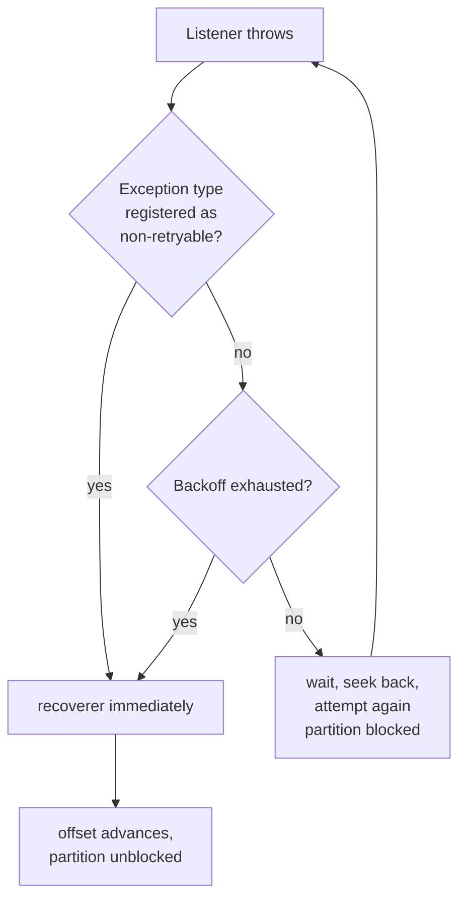

# Lesson 20: DefaultErrorHandler and Retries

> **Part 4: Resilience**

---

## What you'll learn

- What the container does when your listener throws, with no configuration at all
- How `ExponentialBackOff` decides when to stop, which is not what it looks like
- Why some exceptions must never be retried, and how the handler learns which
- Why a retry blocks one partition and not the others

---

## Why this matters

Lesson 16 produced a malformed record and watched one partition stop forever. Lesson 18 made a database failure redeliver in a tight loop. Both are the same missing piece: nothing decides how many times to try, how long to wait, or what to do when trying is pointless.

This is also where a decision you made three lessons ago pays off. The exception type you chose in Lesson 16 is the routing rule this lesson reads.

---

## Before you start

[Lesson 19](19-concurrency-and-rebalancing.md), with concurrency set to 3.

---

## The concept

### What happens when your listener throws

The container catches the exception and hands the record, plus the exception, to a `CommonErrorHandler`.

Configure nothing and you get `DefaultErrorHandler` with its defaults: retry the record nine times with no delay, then log the failure and skip that delivery. Because the offset was never committed, the next `poll()` returns the same record and the cycle starts again. That is the rapid, endless hammering you saw in Lesson 16.

Two things worth being precise about.

**Retries are seeks, not redeliveries.** The error handler tells the consumer to seek back to the failed record's offset, so the next poll returns it again. There is no retry queue and no broker involvement.

**Retries block the partition.** The consumer thread is busy reprocessing one record, and everything behind it on that partition waits. With concurrency of 3, the other two partitions keep flowing, so a poison pill costs a third of your throughput rather than all of it. That is precisely why it is easy to miss.

### `DefaultErrorHandler`

```java
var handler = new DefaultErrorHandler(recoverer, backOff);
```

Two collaborators. A `BackOff` decides how long to wait between attempts and when to stop, and a recoverer is invoked once retries are exhausted.

Without a recoverer, an exhausted record is logged and skipped, which means silent data loss with a log line. Lesson 21 supplies a recoverer that publishes it somewhere you can inspect.

> `DefaultErrorHandler` replaced `SeekToCurrentErrorHandler`, which was removed in Spring Kafka 3.0. If a tutorial mentions `SeekToCurrentErrorHandler`, `ErrorHandler` or `BatchErrorHandler`, it predates 2022.

### `ExponentialBackOff` and the `maxElapsedTime` surprise

```java
var backoff = new ExponentialBackOff(1_000L, 2.0);
backoff.setMaxInterval(10_000L);
backoff.setMaxElapsedTime(7_000L);
```

`ExponentialBackOff(initialInterval, multiplier)` produces intervals of 1 second, 2 seconds, 4 seconds and so on, capped at `maxInterval`.

`maxElapsedTime` is what stops it, and it works in a way that catches people out. The backoff tracks the **cumulative sum of the intervals it has handed out**, not real elapsed time. Each call adds to that total, and once the total reaches `maxElapsedTime` the next call returns a stop signal and the handler invokes the recoverer.

So `maxElapsedTime` of 7,000 gives exactly this:

| Attempt | Wait before it | Cumulative |
|---|---|---|
| 1 | immediate | 0 |
| 2 | 1,000 ms | 1,000 |
| 3 | 2,000 ms | 3,000 |
| 4 | 4,000 ms | 7,000 |
| none | stop, recoverer runs | |

Four attempts, three retries, seven seconds of waiting. Raise `maxElapsedTime` to 15,000 and you get a fifth attempt after a further 8 seconds.

The consequence of it summing intervals rather than measuring time is worth stating: if your listener takes 30 seconds per attempt, the backoff neither knows nor cares. You will get four attempts spread over roughly two minutes, and the name `maxElapsedTime` will have told you nothing useful.

`ExponentialBackOffWithMaxRetries(3)` counts attempts directly and is easier to read. Both are correct; this course uses the `maxElapsedTime` form because you will meet it in existing code and the sum-of-intervals behaviour is the part that surprises people.

### Retryable and non-retryable

Here is the crux of the lesson.

A retry is a bet that the same input will produce a different outcome next time. That bet pays off when the failure came from something transient and external: the database was briefly down, a downstream call timed out, the ISR dipped below the floor.

It never pays off when the failure is caused by the record itself: the JSON is malformed, a required field is missing, a value fails validation. The bytes do not change between attempts.

Retrying a malformed record four times blocks the partition for seven seconds and then fails anyway. Retrying it indefinitely blocks the partition indefinitely.

```java
handler.addNotRetryableExceptions(IllegalArgumentException.class);
```

That tells the handler to skip the backoff entirely for this exception type and go straight to the recoverer.

Now look back at Lesson 16's parse method:

```java
} catch (JacksonException e) {
    throw new IllegalArgumentException("Unparseable Wikimedia event ...", e);
}
```

That wrapping was never cosmetic. It chose the exception type this line matches. `JacksonException` would have been retried; `IllegalArgumentException` is not. The exception type is the routing decision, made three lessons before the router existed.



Note what the recoverer does for you at the end: once it has run, the container treats the record as handled and the offset advances. That is what unblocks the partition, and it is why a recoverer that does nothing is data loss.

---

## Hands-on

### 1. Reproduce the block, and measure it

Start the consumer and the producer, then produce a poison pill:

```bash
echo 'not json' | docker exec -i kafka-1 kafka-console-producer \
  --bootstrap-server kafka-1:29092 --topic wikimedia-stream
```

Watch the group while it happens:

```bash
docker exec kafka-1 kafka-consumer-groups \
  --bootstrap-server kafka-1:29092 \
  --describe --group wikimedia-consumer-group
```

One partition's `CURRENT-OFFSET` is frozen while its `LAG` climbs. The other two are healthy. That asymmetry is the signature of a poison pill, and it is what to look for when a pipeline is "mostly working".

Stop the consumer.

### 2. Add the error handler

Update `KafkaConsumerConfig`:

```java
package com.example.wikimedia.consumer.config;

import org.springframework.context.annotation.Bean;
import org.springframework.context.annotation.Configuration;
import org.springframework.kafka.config.ConcurrentKafkaListenerContainerFactory;
import org.springframework.kafka.core.ConsumerFactory;
import org.springframework.kafka.listener.ContainerProperties;
import org.springframework.kafka.listener.DefaultErrorHandler;
import org.springframework.util.backoff.ExponentialBackOff;

@Configuration
public class KafkaConsumerConfig {

    /**
     * Retry schedule, per record:
     *   attempt 1, immediate
     *   attempt 2, after 1,000 ms
     *   attempt 3, after 2,000 ms
     *   attempt 4, after 4,000 ms, then give up
     *
     * ExponentialBackOff sums the intervals it hands out. Once that total reaches
     * maxElapsedTime, which is 1,000 + 2,000 + 4,000, the next call returns STOP.
     * It does not measure wall-clock time, so a slow listener does not shorten it.
     */
    @Bean
    public DefaultErrorHandler errorHandler() {
        var backoff = new ExponentialBackOff(1_000L, 2.0);
        backoff.setMaxInterval(10_000L);
        backoff.setMaxElapsedTime(7_000L);

        var handler = new DefaultErrorHandler(backoff);

        // A malformed record will never parse, however often it is retried.
        // Skip the backoff rather than block the partition for seven seconds.
        handler.addNotRetryableExceptions(IllegalArgumentException.class);

        return handler;
    }

    @Bean
    public ConcurrentKafkaListenerContainerFactory<String, String> kafkaListenerContainerFactory(
            ConsumerFactory<String, String> consumerFactory,
            DefaultErrorHandler errorHandler) {

        var factory = new ConcurrentKafkaListenerContainerFactory<String, String>();
        factory.setConsumerFactory(consumerFactory);
        factory.setConcurrency(3);
        factory.getContainerProperties().setAckMode(ContainerProperties.AckMode.MANUAL_IMMEDIATE);
        factory.setCommonErrorHandler(errorHandler);

        return factory;
    }
}
```

`setCommonErrorHandler` is the line that replaces the default. Omit it and the bean exists, is never consulted, and you spend an hour wondering why your backoff is not applied.

### 3. Watch a non-retryable failure skip the backoff

Start the consumer. The poison pill from step 1 is still there.

```
ERROR ... Unparseable Wikimedia event [partition=1 offset=1043]
WARN  ... Backoff none exhausted for ...
```

One attempt, no waiting, and then the partition moves on. Confirm it:

```bash
docker exec kafka-1 kafka-consumer-groups \
  --bootstrap-server kafka-1:29092 \
  --describe --group wikimedia-consumer-group
```

Lag on that partition clears. The record was skipped, which is progress and also the problem: it is gone, and all you have is a log line naming the partition and offset. Lesson 21 gives it somewhere to go.

### 4. Watch a retryable failure use the backoff

Now simulate a transient failure. Add a temporary rule to the listener that throws a retryable exception for one specific title:

```java
        if ("RETRY_ME".equals(event.title())) {
            throw new IllegalStateException("Simulated transient failure");
        }
```

`IllegalStateException` is not registered as non-retryable, so it takes the backoff path. Produce a matching record:

```bash
echo '{"type":"edit","title":"RETRY_ME","user":"u","bot":false,"wiki":"enwiki","server_name":"en.wikipedia.org","timestamp":1,"comment":"c","namespace":0}' \
  | docker exec -i kafka-1 kafka-console-producer \
    --bootstrap-server kafka-1:29092 --topic wikimedia-stream
```

Watch the timestamps in the log. Four attempts, roughly 1, 2 and 4 seconds apart, then the record is given up on. Time the whole sequence: about seven seconds, exactly as the table predicted.

While it is retrying, describe the group again. That partition is frozen for the full seven seconds and the other two keep working.

Remove the temporary rule afterwards.

### 5. Compare the two paths deliberately

Produce one of each, a malformed record and a `RETRY_ME` record, and note the difference in the logs.

The malformed one is handled in milliseconds. The transient one costs seven seconds of that partition's throughput. Both end in the same place, which is the record being skipped.

That is the trade the `addNotRetryableExceptions` line manages. Classify an exception wrongly in one direction and you waste seven seconds per bad record; wrongly in the other and you throw away a record that would have succeeded on the second attempt.

---

## Try it yourself

1. Remove `addNotRetryableExceptions` and produce a malformed record. Time how long the partition is blocked, then put the line back. Multiply that by a thousand malformed records and describe what your lag graph looks like.

2. Change `maxElapsedTime` to 15,000 and predict the schedule before running it. How many attempts, and at what intervals? Verify against the log timestamps.

3. Make the listener take 20 seconds per attempt and keep `maxElapsedTime` at 7,000. How many attempts do you get, and how long does the whole sequence take in real time? Explain why the setting's name is misleading.

4. Register `IllegalStateException` as non-retryable as well, then produce the `RETRY_ME` record again. It is now skipped immediately. Argue for and against that classification for a failure that represents a database outage.

---

## Common mistakes

**Defining the error handler bean and not calling `setCommonErrorHandler`.**
The bean exists, the defaults apply, and nothing you configured takes effect.

**Retrying a malformed record.**
The bytes do not change. You block the partition and fail anyway.

**Leaving `DefaultErrorHandler` with no recoverer.**
An exhausted record is logged and skipped, which is silent data loss with a paper trail nobody reads.

**Assuming `maxElapsedTime` measures elapsed time.**
It sums the intervals it hands out. Slow attempts do not count against it.

**Assuming a poison pill stops the consumer.**
It stops one partition. With concurrency of 3 you lose a third of throughput and the process looks healthy.

**Classifying exceptions by where they were thrown rather than by whether a retry could help.**
The only question that matters is whether the same input might succeed next time.

**Using `SeekToCurrentErrorHandler`.**
Removed in Spring Kafka 3.0.

---

## Check your understanding

**1. With no error handler configured, a malformed record arrives. Describe what happens over the next hour.**

<details>
<summary>Reveal answer</summary>

The record is retried nine times with no delay, the handler gives up on that delivery, and because the offset was never committed the next poll returns the same record and it all happens again. That loop continues indefinitely.

The partition makes no progress for the entire hour while its lag grows. The other partitions are unaffected, so throughput drops by roughly a third and nothing crashes.

The only signals are per-partition lag and a very large volume of repeated error logs. Aggregate lag on a busy topic may not even look alarming.

</details>

**2. Why does registering `IllegalArgumentException` as non-retryable belong in the error handler rather than in the listener?**

<details>
<summary>Reveal answer</summary>

Because the listener's job is to say what went wrong, and the handler's job is to decide what to do about it.

The listener already made its contribution in Lesson 16, by translating a Jackson failure into an exception type that means "this input is permanently invalid". That is information the listener has and the handler does not.

Putting the policy in the handler keeps it in one place for every listener, and lets you change the retry strategy without touching business code. It also means the classification is visible where the backoff is configured, which is where someone debugging retry behaviour will look.

</details>

**3. `maxElapsedTime` is 7,000 ms and each attempt takes 20 seconds. How many attempts, and over what period?**

<details>
<summary>Reveal answer</summary>

Four attempts, over roughly 87 seconds.

The backoff sums the intervals it hands out, which are 1,000, 2,000 and 4,000 milliseconds, reaching 7,000 and then stopping. It has no visibility into how long each attempt itself took.

So the real elapsed time is four attempts at 20 seconds each, plus 7 seconds of waiting, and the partition is blocked for all of it. The setting's name suggests it bounds that duration and it does not, which matters a great deal when your processing is slow.

If you need to bound real time, you have to bound the work: reduce what one attempt does, or use a smaller retry count and let the recoverer handle it sooner.

</details>

**4. A recoverer that only logs is described here as data loss. Why, given that the log line contains the partition and offset?**

<details>
<summary>Reveal answer</summary>

Because after the recoverer runs, the container advances the offset and the record is never delivered again.

The log line tells you a record existed and where it was, which is genuinely more than nothing, and it depends entirely on someone reading it before the topic's retention deletes the record. With seven-day retention you have seven days to notice, find the log, extract the partition and offset, and go and fetch the payload by hand.

At any real volume that does not happen. The record is effectively lost the moment the recoverer returns, which is why Lesson 21 replaces logging with publishing to a topic that keeps the payload, the headers and the failure reason together for thirty days.

</details>

**5. Why does the error handler seek backwards rather than keeping the record in memory to retry?**

<details>
<summary>Reveal answer</summary>

Because the log is already a durable, ordered store of the record, so holding a copy would duplicate state that Kafka is better at holding.

Seeking back to the offset means the retry reads the record from the broker again, which keeps exactly one source of truth. If the process dies during retries, nothing is lost, because nothing was being held anywhere: the offset is still uncommitted and the next owner of the partition starts from it.

It also explains why retries block the partition. The consumer has moved its read position backwards, so it must work forwards through that record again before it can reach anything behind it. An in-memory retry queue could have avoided that, at the cost of records that vanish on a crash and an ordering guarantee that no longer holds.

</details>

---

## Recap

The container hands a thrown exception to a `CommonErrorHandler`, and the default retries nine times with no delay, forever, because the offset never advances.

`DefaultErrorHandler` with an `ExponentialBackOff` bounds that, and `maxElapsedTime` bounds it by summing the intervals handed out rather than by measuring real time. Four attempts and seven seconds of waiting is the schedule you configured.

Exceptions that cannot succeed on a retry must be registered as non-retryable, and the exception type your listener throws is what makes that possible. Retries seek backwards, so they block one partition and leave the others alone.

What you still do not have is anywhere for a failed record to go. It is skipped, and a log line is all that remains.

**Next:** [Lesson 21: Dead-Letter Topics](21-dead-letter-topics.md)
