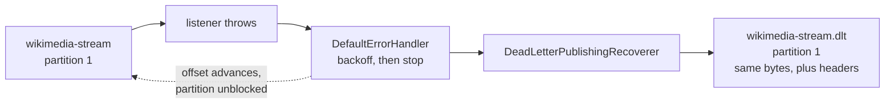

# Lesson 21: Dead-Letter Topics

> **Part 4: Resilience**

---

## What you'll learn

- What a recoverer is, and how `DeadLetterPublishingRecoverer` uses one
- Why the failed record goes to the same partition number it came from
- Which diagnostic headers you get, and which exception actually ends up in them
- Why a dead-letter topic gets longer retention than the topic it shadows

---

## Why this matters

Lesson 20 bounded your retries, and then threw the record away. A log line naming a partition and offset is not a recovery plan: by the time anyone reads it, the record may already have aged out of the topic.

A dead-letter topic turns a lost record into a parked one. The payload, the reason it failed and its exact origin are stored together, in Kafka, with retention you choose, and you can read them with the same tools you already use.

---

## Before you start

[Lesson 20](20-error-handler-and-retries.md), with an error handler using exponential backoff and non-retryable exceptions.

---

## The concept

### The recoverer

`DefaultErrorHandler` takes an optional first collaborator, a recoverer, invoked exactly once when the backoff stops:

```java
new DefaultErrorHandler(recoverer, backOff);
```

It is a `BiConsumer<ConsumerRecord<?, ?>, Exception>`: the record that failed, and why. What you do with it is up to you. Write it to a table, call an alerting API, or publish it to another topic.

`DeadLetterPublishingRecoverer` does the last of those, and it needs a `KafkaTemplate`, because publishing to Kafka means producing.

By default it publishes to a topic named after the original with `.DLT` appended, note the capitals, on a partition chosen by the producer's partitioner.

### Controlling the destination

The second constructor argument is a function from the record and exception to a `TopicPartition`:

```java
new DeadLetterPublishingRecoverer(kafkaTemplate,
        (record, ex) -> new TopicPartition(record.topic() + ".dlt", record.partition()));
```

Two decisions are encoded there.

**Lowercase `.dlt`.** Cosmetic, but be consistent, because `wikimedia-stream.DLT` and `wikimedia-stream.dlt` are different topics and auto-creation would happily make both. You turned auto-creation off in Lesson 09, which converts that particular mistake into an error instead of a mystery.

**`record.partition()`.** The failed record goes to the same partition number on the dead-letter topic that it occupied on the source. This is the interesting one.

### Why same-partition routing

Records that shared a partition on the source shared it because they shared a key, which means they had a relative order that mattered.

If three records for one key fail in sequence and land on three different dead-letter partitions, their order is gone. Replaying them later, in whatever order three partitions happen to be read, could apply an update before the creation it depends on.

Routing to the same partition number preserves per-partition ordering on the dead-letter side. Read partition 1 of the dead-letter topic and you get the failures from partition 1 of the source, in the order they failed.

This requires the dead-letter topic to have at least as many partitions as the source. Publish to partition 2 of a single-partition topic and it fails, which is why both are declared with three.

> A subtlety worth stating: this preserves the order in which records *failed*, which equals source order only if failures are processed in order. With concurrency of 3 each partition is single-threaded, so within a partition it holds.

### The headers you get, and the one that surprises people

`DeadLetterPublishingRecoverer` attaches diagnostic headers to every record it publishes. The key and value are unchanged, byte for byte.

| Header | Type | Content |
|---|---|---|
| `kafka_dlt-original-topic` | UTF-8 string | `wikimedia-stream` |
| `kafka_dlt-original-partition` | 4-byte big-endian int | source partition |
| `kafka_dlt-original-offset` | 8-byte big-endian long | source offset |
| `kafka_dlt-original-timestamp` | 8-byte big-endian long | source timestamp |
| `kafka_dlt-exception-fqcn` | UTF-8 string | the exception the container caught |
| `kafka_dlt-exception-message` | UTF-8 string | its message |
| `kafka_dlt-exception-cause-fqcn` | UTF-8 string | the root cause class |

Now the part that catches everyone, and that most tutorials get wrong.

`kafka_dlt-exception-fqcn` does **not** hold your exception. When a `@KafkaListener` method throws, Spring wraps it in a `ListenerExecutionFailedException` before the error handler ever sees it, and that wrapper is what gets recorded. Your `IllegalArgumentException` from Lesson 16 appears in `kafka_dlt-exception-cause-fqcn` instead.

So filtering a dead-letter topic by `kafka_dlt-exception-fqcn` for your own exception type returns nothing at all, and the emptiness looks like an absence of failures rather than a mistake in your query. Lesson 22 decodes these headers and proves it.

### Retention: longer than the source

The source topic keeps records for 7 days. The dead-letter topic should keep them for longer, for a simple operational reason: a failure needs a longer investigation window than a success.

A record fails on a Friday evening. Nobody looks until Monday. With matching retention you have four days left; with 30 days you have four weeks, and time to deploy a fix before deciding whether to replay.

The size cap deserves the opposite treatment. Lesson 09's fourth quiz question showed that `retention.bytes` and `retention.ms` are an OR, so a size cap can quietly delete records long before the time limit. On a dead-letter topic that is exactly wrong, so set `retention.bytes` to `-1`, meaning unlimited, and let time be the only thing that deletes a failure.



---

## Hands-on

### 1. Declare the dead-letter topic

Create `src/main/java/com/example/wikimedia/consumer/config/WikimediaTopicConfig.java`. This is a new file in the consumer project, and it is the first `NewTopic` declaration on this side of the pipeline.

The consumer owns this topic rather than the producer, and the reason is worth stating: the consumer is what fails, so the consumer is what needs somewhere to put failures. The producer has no interest in this topic and should not create it.

```java
package com.example.wikimedia.consumer.config;

import org.apache.kafka.clients.admin.NewTopic;
import org.apache.kafka.common.config.TopicConfig;
import org.springframework.context.annotation.Bean;
import org.springframework.context.annotation.Configuration;
import org.springframework.kafka.config.TopicBuilder;

@Configuration
public class WikimediaTopicConfig {

    @Bean
    public NewTopic wikimediaStreamDltTopic() {
        return TopicBuilder
                .name("wikimedia-stream.dlt")
                // At least as many partitions as the source, because the recoverer
                // publishes to the same partition number the record failed on.
                .partitions(3)
                .replicas(3)
                .config(TopicConfig.MIN_IN_SYNC_REPLICAS_CONFIG, "2")
                // 30 days. A failure needs a longer investigation window than a success.
                .config(TopicConfig.RETENTION_MS_CONFIG, "2592000000")
                // Unlimited size. Retention is an OR, and a size cap would delete
                // failures before the 30 days elapsed.
                .config(TopicConfig.RETENTION_BYTES_CONFIG, "-1")
                .build();
    }
}
```

### 2. Give the consumer a producer

Publishing to the dead-letter topic means producing, so the consumer application now needs producer configuration. Add it under `spring.kafka` in `application.yml`, as a sibling of `consumer:`:

```yaml
    # Used only by DeadLetterPublishingRecoverer. This application does not
    # produce to any user-facing topic.
    producer:
      key-serializer: org.apache.kafka.common.serialization.StringSerializer
      value-serializer: org.apache.kafka.common.serialization.StringSerializer
      acks: all
      retries: 3
```

`bootstrap-servers` is already declared at the `spring.kafka` level rather than under `consumer:`, which Lesson 15 did deliberately for exactly this moment. Both the consumer factory and the producer factory inherit it.

`acks: all` on a dead-letter producer is not optional. A dead-letter record is the only remaining copy of a failure, so losing it because one replica acknowledged and then died would defeat the entire mechanism.

### 3. Wire the recoverer into the error handler

Update `KafkaConsumerConfig`:

```java
package com.example.wikimedia.consumer.config;

import org.apache.kafka.common.TopicPartition;
import org.springframework.context.annotation.Bean;
import org.springframework.context.annotation.Configuration;
import org.springframework.kafka.config.ConcurrentKafkaListenerContainerFactory;
import org.springframework.kafka.core.ConsumerFactory;
import org.springframework.kafka.core.KafkaTemplate;
import org.springframework.kafka.listener.ContainerProperties;
import org.springframework.kafka.listener.DeadLetterPublishingRecoverer;
import org.springframework.kafka.listener.DefaultErrorHandler;
import org.springframework.util.backoff.ExponentialBackOff;

@Configuration
public class KafkaConsumerConfig {

    /**
     * Publishes a failed record to <topic>.dlt, on the same partition number it
     * failed on, so that per-partition ordering survives into the dead-letter topic.
     */
    @Bean
    public DeadLetterPublishingRecoverer deadLetterPublishingRecoverer(
            KafkaTemplate<String, String> kafkaTemplate) {

        return new DeadLetterPublishingRecoverer(kafkaTemplate,
                (record, exception) ->
                        new TopicPartition(record.topic() + ".dlt", record.partition()));
    }

    /**
     * Retry schedule, per record: immediate, then after 1s, 2s and 4s.
     * ExponentialBackOff sums the intervals it hands out, so maxElapsedTime of
     * 7,000 permits exactly four attempts. Then the recoverer runs.
     */
    @Bean
    public DefaultErrorHandler errorHandler(DeadLetterPublishingRecoverer recoverer) {
        var backoff = new ExponentialBackOff(1_000L, 2.0);
        backoff.setMaxInterval(10_000L);
        backoff.setMaxElapsedTime(7_000L);

        var handler = new DefaultErrorHandler(recoverer, backoff);

        // A malformed record will never parse. Skip the backoff and dead-letter it
        // immediately rather than blocking the partition for seven seconds first.
        handler.addNotRetryableExceptions(IllegalArgumentException.class);

        return handler;
    }

    @Bean
    public ConcurrentKafkaListenerContainerFactory<String, String> kafkaListenerContainerFactory(
            ConsumerFactory<String, String> consumerFactory,
            DefaultErrorHandler errorHandler) {

        var factory = new ConcurrentKafkaListenerContainerFactory<String, String>();
        factory.setConsumerFactory(consumerFactory);
        factory.setConcurrency(3);
        factory.getContainerProperties().setAckMode(ContainerProperties.AckMode.MANUAL_IMMEDIATE);
        factory.setCommonErrorHandler(errorHandler);

        return factory;
    }
}
```

The `KafkaTemplate<String, String>` is injected, not constructed. Spring Boot auto-configures it from the `producer:` block you just added, which is the same starter-provides-the-bean point from Lesson 08.

### 4. Send a record to its death

Start the consumer, then produce a poison pill:

```bash
echo 'this is not json' | docker exec -i kafka-1 kafka-console-producer \
  --bootstrap-server kafka-1:29092 --topic wikimedia-stream
```

The consumer logs the failure once, with no backoff, because `IllegalArgumentException` is non-retryable. Then look at the dead-letter topic:

```bash
docker exec kafka-1 kafka-get-offsets \
  --bootstrap-server kafka-1:29092 --topic wikimedia-stream.dlt
```

One record. And read it:

```bash
docker exec kafka-1 kafka-console-consumer \
  --bootstrap-server kafka-1:29092 \
  --topic wikimedia-stream.dlt \
  --from-beginning --max-messages 1 \
  --formatter-property print.headers=true \
  --formatter-property print.partition=true
```

The value is `this is not json`, byte-identical to what you produced. The headers carry the diagnosis.

### 5. Confirm which exception is recorded

Look carefully at the header output:

```
kafka_dlt-exception-fqcn:org.springframework.kafka.listener.ListenerExecutionFailedException
kafka_dlt-exception-cause-fqcn:java.lang.IllegalArgumentException
```

Your exception is in the **cause** header, not the primary one, because Spring wrapped it before the error handler saw it.

Note this now. It is the single most common mistake made when querying a dead-letter topic, and Lesson 22 builds a consumer that reads the right header.

You will also see `kafka_dlt-original-partition` printed as something unreadable. That is a four-byte integer being displayed as text, and decoding it properly is Lesson 22's main exercise.

### 6. Confirm the partition mapping

Produce poison pills with keys that hash to different partitions, using the keys you verified in Lesson 04:

```bash
printf 'en.wikipedia:bad-1\nde.wikipedia:bad-2\nfr.wikipedia:bad-3\n' \
  | docker exec -i kafka-1 kafka-console-producer \
    --bootstrap-server kafka-1:29092 --topic wikimedia-stream \
    --reader-property parse.key=true --reader-property key.separator=:
```

Then compare the per-partition offsets on both topics:

```bash
docker exec kafka-1 kafka-get-offsets --bootstrap-server kafka-1:29092 --topic wikimedia-stream
docker exec kafka-1 kafka-get-offsets --bootstrap-server kafka-1:29092 --topic wikimedia-stream.dlt
```

Each failure appears on the dead-letter partition matching its source partition: partition 1 for `en.wikipedia`, 0 for `de.wikipedia`, 2 for `fr.wikipedia`.

### 7. Confirm the partition is no longer blocked

```bash
docker exec kafka-1 kafka-consumer-groups \
  --bootstrap-server kafka-1:29092 \
  --describe --group wikimedia-consumer-group
```

Lag is clear on every partition. Compare that with Lesson 20's step 1, where one partition was frozen indefinitely.

That is the whole point of a recoverer: once it returns, the container advances the offset. The difference from Lesson 20 is not that the partition unblocks, it is that the record still exists somewhere.

---

## Try it yourself

1. Declare the dead-letter topic with `.partitions(1)` instead of 3, delete and recreate it, then produce a record that fails on source partition 2. Read the error carefully. Which component failed, and what happened to the record?

2. Set `retention.bytes` to something small such as `1024` alongside the 30-day `retention.ms`, then produce enough failures to exceed it. Which limit wins, and what does that tell you about relying on the time value alone?

3. Remove `acks: all` from the dead-letter producer, leaving the default. Look up what the default actually is in Kafka 4, then explain whether this change is dangerous or a no-op.

4. Route by exception type instead of by partition: send `IllegalArgumentException` failures to `wikimedia-stream.invalid` and everything else to `wikimedia-stream.dlt`. What do you gain operationally, and which guarantee from this lesson do you give up?

---

## Common mistakes

**Giving the dead-letter topic fewer partitions than the source.**
Same-partition routing then publishes to a partition that does not exist, and the recoverer itself fails.

**Querying `kafka_dlt-exception-fqcn` for your own exception type.**
It holds `ListenerExecutionFailedException`. Yours is in the cause header, and the empty result set looks like good news.

**Matching the source topic's retention.**
A Friday failure needs to survive until Monday, and then until a fix ships.

**Leaving a size cap on the dead-letter topic.**
Retention is an OR, so the cap silently deletes failures before the time limit.

**Forgetting that the consumer now needs producer configuration.**
The recoverer produces, so the application needs a `KafkaTemplate` and somewhere to send it.

**Using `acks=1` for dead-letter writes.**
The dead-letter record is the last remaining copy of the failure.

**Mixing `.DLT` and `.dlt`.**
Two different topics, and with auto-creation enabled you would end up with both.

---

## Check your understanding

**1. Why publish the failed record to the same partition number it failed on?**

<details>
<summary>Reveal answer</summary>

To preserve the ordering that the key bought you in the first place.

Records sharing a partition on the source shared it because they shared a key, and per-key ordering was the reason for keying them. If several failures for one key were scattered across dead-letter partitions, reading them back later would give you no ordering guarantee at all, and a replay could apply an update before the creation it depends on.

Same-partition routing means partition 1 of the dead-letter topic holds partition 1's failures, in the order they failed, so a replay can preserve the order that mattered.

</details>

**2. Your dead-letter topic keeps records for 30 days and the source keeps 7. Why not match them?**

<details>
<summary>Reveal answer</summary>

Because the two topics answer different questions on different timescales.

The source topic's retention bounds how far you can replay normal traffic, and 7 days is a capacity decision. The dead-letter topic's retention bounds how long you have to notice a failure, diagnose it, ship a fix, and decide whether to replay. That is human time, and it includes weekends.

Matching them would mean a failure that happened last Friday has already expired by the time you have a fix ready, and the only record of it is a log line.

</details>

**3. A record is dead-lettered. Has the consumer group's lag gone up or down?**

<details>
<summary>Reveal answer</summary>

Down, and that is the part worth understanding.

Once the recoverer has published the record, the container treats it as handled and the offset advances, so the partition resumes and lag clears. That is the difference between this and Lesson 20's blocked partition.

It also means lag is now a poor signal for this failure mode. The pipeline reports itself healthy while records accumulate on the dead-letter topic, so the metric to watch is the dead-letter topic's own message rate. Lesson 26 wires that up.

</details>

**4. Why does the consumer declare the dead-letter topic rather than the producer?**

<details>
<summary>Reveal answer</summary>

Because the consumer is what fails, so the consumer is what needs somewhere to put failures.

The producer has no relationship with this topic. It never reads from it, never writes to it, and would have no reason to know it exists. Declaring it there would couple the producer to a consumer's error-handling strategy, and a second consumer group with a different strategy would need a topic the producer knew nothing about.

The general rule is that a topic is declared by whichever application's behaviour depends on its configuration. The partition count on this topic exists to match the recoverer's routing, and that routing lives in the consumer.

</details>

**5. What exactly makes replay possible, given that all you have is a record on another topic?**

<details>
<summary>Reveal answer</summary>

That the key and value are the original bytes, unmodified.

`DeadLetterPublishingRecoverer` adds headers and changes the destination, and it does not touch the payload. So the record on the dead-letter topic is byte-identical to the one that failed, which means producing it back to the source topic recreates the exact input.

That is also why the headers matter so much. The payload alone tells you what failed but not why or where it came from, and without the original partition and offset you cannot correlate it with anything else that happened at the time.

Lesson 22 decodes those headers and then walks through why replay is harder than producing the bytes back.

</details>

---

## Recap

A recoverer is what `DefaultErrorHandler` calls when retries are exhausted, and `DeadLetterPublishingRecoverer` publishes the failed record to another topic instead of dropping it. Routing to the same partition number preserves the ordering the key was there to provide, which requires the dead-letter topic to be at least as wide as the source.

The record's payload is preserved byte for byte, with diagnostic headers added. The exception header holds Spring's wrapper, and your exception is in the cause header.

The dead-letter topic gets 30 days of retention and no size cap, because a failure needs a longer investigation window than a success and because retention limits are an OR.

Lag now clears when a record fails, which means lag has stopped being the metric that tells you about this failure.

**Next:** [Lesson 22: DLT Headers and Replay](22-dlt-headers-and-replay.md)
