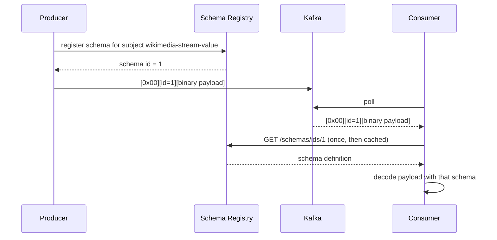

# Lesson 25 — Schema Registry & Avro

> **Part 5 — Production** · 40 minutes

---

## What you'll learn

- What a `StringSerializer` actually costs you, and why "it's just JSON" fails at scale
- How Avro's wire format works — and why a message carries 5 bytes of schema, not the schema
- How to generate Java classes from an `.avsc` and produce/consume them
- What BACKWARD, FORWARD, and FULL compatibility mean, and which one you want

---

## Why this matters

Your topic currently holds raw JSON strings. Nothing stops a producer from renaming `server_name` to `serverName` tomorrow. Nothing stops it sending `"bot": "false"` as a string instead of a boolean. Nothing tells you until the consumer throws — in production, on records already durably written, which you now cannot parse.

The consumer's `@JsonIgnoreProperties(ignoreUnknown = true)` from Lesson 16 protects you against *added* fields. It offers nothing against removed fields, renamed fields, or changed types.

A schema registry makes that class of incident structurally impossible: it **rejects the producer's schema at registration time** if it would break existing consumers. The failure moves from your 3 a.m. pager to the producer team's CI pipeline.

---

## Before you start

[Lesson 24](24-testing-with-testcontainers.md). Schema Registry is already running from Lesson 00:

```bash
curl -s http://localhost:8085/subjects
```

`[]` — no schemas registered yet. Note the port: **8085** on your host, mapped to the container's 8081 (which would collide with the producer).

---

## The concept

### The problem with JSON on a topic

Three costs, in ascending order of pain.

**Size.** Every record repeats every field name. `{"server_name":"en.wikipedia.org","bot":false,...}` sends the string `"server_name"` with each of the millions of events. Across a 7-day retention that's gigabytes of field names.

**No contract.** The topic's schema is "whatever the producer felt like sending." It's documented in a Java record on the consumer side, which the producer team has never read.

**Failure is deferred and asymmetric.** A bad change is accepted by Kafka instantly and discovered by the consumer later. By then the records are durable and unparseable. Your only options are to fix the consumer to handle both shapes, or skip records.

### Avro

Avro is a binary serialization format with a schema written in JSON. The schema declares field names and types once, and the data on the wire is just the values — positionally encoded, no field names.

A 1.8 KB Wikimedia JSON event becomes a few hundred bytes.

More importantly the schema is a *contract*, and a machine-checkable one.

### The wire format

This is the part worth understanding precisely, because it explains everything else.

A Confluent Avro message is:

```
[magic byte 0x00][4-byte schema ID][avro-encoded payload]
```

Five bytes of overhead. The **schema itself is not in the message** — only an integer ID.



Consequences that follow directly:

- **Producers and consumers both need the registry**, at least once. It's a hard dependency.
- **The consumer caches by ID**, so the registry isn't on the hot path.
- **The consumer decodes with the *writer's* schema**, then projects onto its own **reader's** schema. That projection is where compatibility rules live.

### Subjects and compatibility

The registry stores schemas under a **subject**. The default naming strategy is `<topic>-value` (and `<topic>-key` for keys). So `wikimedia-stream-value`.

Each subject has a **compatibility mode** that governs which new versions are allowed:

| Mode | New schema must be able to… | Safe change | Upgrade first |
|---|---|---|---|
| `BACKWARD` (default) | read data written by the **previous** schema | delete a field; add a field **with a default** | consumers |
| `FORWARD` | be read **by** the previous schema | add a field; delete a field **with a default** | producers |
| `FULL` | both | add or delete only fields with defaults | either |
| `NONE` | anything | — | pray |

The mental model that actually sticks:

> **BACKWARD** means *new code can read old data.* You upgrade **consumers first**, then producers.
>
> **FORWARD** means *old code can read new data.* You upgrade **producers first**, then consumers.

BACKWARD is the default because the common case is reprocessing history: a new consumer must be able to read the whole topic, including records written months ago.

**Defaults are what make evolution work.** Adding a field with a default is backward-compatible because a consumer reading an old record — where the field is absent — substitutes the default. Adding a field *without* a default is a breaking change, and the registry will reject it.

### What the registry actually prevents

It doesn't validate data. It validates **schemas**, at registration.

When a producer starts and its schema differs from the latest registered version, the client tries to register the new version. The registry checks it against the subject's compatibility rules and **returns HTTP 409 if it would break consumers.**

The producer fails to start. Nobody's 3 a.m. is ruined. That's the whole product.

---

## Hands-on

### 1. Add the dependencies

Confluent's artifacts are not on Maven Central. Both modules need the repository and the serializer:

```xml
<repositories>
    <repository>
        <id>confluent</id>
        <url>https://packages.confluent.io/maven/</url>
    </repository>
</repositories>

<dependencies>
    <dependency>
        <groupId>io.confluent</groupId>
        <artifactId>kafka-avro-serializer</artifactId>
        <version>8.0.3</version>
    </dependency>
    <dependency>
        <groupId>org.apache.avro</groupId>
        <artifactId>avro</artifactId>
    </dependency>
</dependencies>
```

Keep `kafka-avro-serializer` aligned with the `cp-schema-registry` image tag from `docker-compose.yml` — both are `8.0.3` here. A mismatch usually works and occasionally produces baffling deserialization errors.

`avro` itself is version-managed by Spring Boot's BOM.

### 2. Define the schema

`src/main/resources/avro/wikimedia-event.avsc`:

```json
{
  "namespace": "com.javaguy.avro",
  "type": "record",
  "name": "WikimediaEventAvro",
  "fields": [
    { "name": "type",       "type": "string" },
    { "name": "title",      "type": "string" },
    { "name": "user",       "type": ["null", "string"], "default": null },
    { "name": "bot",        "type": "boolean", "default": false },
    { "name": "namespace",  "type": ["null", "int"],    "default": null },
    { "name": "wiki",       "type": "string" },
    { "name": "serverName", "type": ["null", "string"], "default": null },
    { "name": "timestamp",  "type": ["null", "long"],   "default": null },
    { "name": "comment",    "type": ["null", "string"], "default": null }
  ]
}
```

Two conventions that matter:

**A nullable field is a union `["null", "T"]` with `"default": null`.** Avro has no implicit nullability. The order matters — `null` first, because the default must match the *first* branch of the union.

**Every optional field has a default.** This is what makes future schema evolution possible. A field without a default can never be added later under BACKWARD compatibility, and can never be removed under FORWARD.

`type`, `title`, and `wiki` are required, on purpose. A Wikimedia event without them is meaningless, and making them nullable "just in case" pushes the null check into every consumer forever.

### 3. Generate the Java class

```xml
<plugin>
    <groupId>org.apache.avro</groupId>
    <artifactId>avro-maven-plugin</artifactId>
    <executions>
        <execution>
            <phase>generate-sources</phase>
            <goals><goal>schema</goal></goals>
            <configuration>
                <sourceDirectory>${project.basedir}/src/main/resources/avro</sourceDirectory>
                <outputDirectory>${project.build.directory}/generated-sources/avro</outputDirectory>
                <stringType>String</stringType>
            </configuration>
        </execution>
    </executions>
</plugin>
```

```bash
./mvnw generate-sources
```

`target/generated-sources/avro/com/javaguy/avro/WikimediaEventAvro.java` now exists — a `SpecificRecord` with a builder.

`<stringType>String</stringType>` matters. Without it, Avro generates `CharSequence` fields (backed by `Utf8`), and `event.getTitle().equals("Nikola Tesla")` returns `false` in a way that will cost you an afternoon.

> The generated class is build output. Don't commit it, don't edit it. The `.avsc` is the source of truth.

### 4. Configure the producer

```yaml
spring:
  kafka:
    producer:
      bootstrap-servers: localhost:9092,localhost:9093,localhost:9094
      key-serializer: org.apache.kafka.common.serialization.StringSerializer
      value-serializer: io.confluent.kafka.serializers.KafkaAvroSerializer
      acks: all
      properties:
        enable.idempotence: true
        schema.registry.url: http://localhost:8085
        # Fail at startup if the schema is incompatible, rather than at first send.
        auto.register.schemas: true
```

And the producer's type parameter changes:

```java
private final KafkaTemplate<String, WikimediaEventAvro> kafkaTemplate;

public void sendMessage(WikimediaEventAvro event) {
    kafkaTemplate.send(TOPIC, event.getWiki(), event)
            .whenComplete((result, ex) -> { /* as Lesson 13 */ });
}
```

Note the key is now `event.getWiki()` — Lesson 11's keying decision, finally expressible because the producer now has a parsed object rather than an opaque string.

> **`auto.register.schemas: true` is a development setting.** In production it's `false`, and schemas are registered by a CI step or by the Schema Registry Maven plugin, so a rogue producer cannot introduce a schema nobody reviewed.

### 5. Configure the consumer

```yaml
spring:
  kafka:
    consumer:
      key-deserializer: org.apache.kafka.common.serialization.StringDeserializer
      value-deserializer: io.confluent.kafka.serializers.KafkaAvroDeserializer
      properties:
        schema.registry.url: http://localhost:8085
        # Deserialize into the generated class rather than a generic GenericRecord.
        specific.avro.reader: true
```

```java
@KafkaListener(topics = "wikimedia-stream", groupId = "wikimedia-consumer-group")
public void consume(ConsumerRecord<String, WikimediaEventAvro> record, Acknowledgment ack) {
    WikimediaEventAvro event = record.value();
    // no parse(), no ObjectMapper, no JacksonException
    ...
}
```

**The `parse()` method is gone**, and with it the `IllegalArgumentException` wrapping from Lesson 16.

Think about what that means for Lesson 20's error handler. A malformed payload can no longer reach your listener — it fails inside `KafkaAvroDeserializer`, during `poll()`, before the container invokes you. It throws `SerializationException`, which your `DefaultErrorHandler` cannot route to the DLT, because the failure happened before there was a record to route.

That's what `ErrorHandlingDeserializer` is for. Wrap the real deserializer:

```yaml
      value-deserializer: org.springframework.kafka.support.serializer.ErrorHandlingDeserializer
      properties:
        spring.deserializer.value.delegate.class: io.confluent.kafka.serializers.KafkaAvroDeserializer
```

Now a deserialization failure yields a `null` value plus a header carrying the exception, the error handler sees a real record, and the DLT still works. Without this, moving to Avro silently disables the dead-letter path you built in Part 4.

### 6. Watch the schema register

Start the producer and send one event. Then:

```bash
curl -s http://localhost:8085/subjects | jq
```

```json
["wikimedia-stream-value"]
```

```bash
curl -s http://localhost:8085/subjects/wikimedia-stream-value/versions | jq
curl -s http://localhost:8085/subjects/wikimedia-stream-value/versions/1 | jq '.schema | fromjson'
```

The schema you wrote, stored under version 1, subject `wikimedia-stream-value`.

### 7. See the five-byte header

```bash
docker exec kafka-1 kafka-console-consumer \
  --bootstrap-server kafka-1:29092 \
  --topic wikimedia-stream --max-messages 1
```

Binary garbage. The `StringDeserializer` the console consumer uses has no idea what this is. That's the point — the bytes are meaningless without the schema.

Read it properly, resolving the schema ID against the registry:

```bash
docker exec schema-registry kafka-avro-console-consumer \
  --bootstrap-server kafka-1:29092 \
  --property schema.registry.url=http://localhost:8081 \
  --topic wikimedia-stream --max-messages 1
```

(Inside that container the registry is on its own port 8081, not the host's 8085.)

Your event, decoded.

### 8. Break compatibility on purpose

Check the mode:

```bash
curl -s http://localhost:8085/config | jq
```

```json
{"compatibilityLevel": "BACKWARD"}
```

Now add a **required** field to the `.avsc` — no default:

```json
{ "name": "revisionId", "type": "long" }
```

Regenerate and restart the producer.

```
Schema being registered is incompatible with an earlier schema for subject
"wikimedia-stream-value"; error code: 409
```

**The producer refuses to start.** Under BACKWARD, a consumer using the *new* schema must be able to read data written with the *old* one. Old records have no `revisionId` and the field has no default, so there is nothing to substitute. The registry rejects it.

Now give it a default:

```json
{ "name": "revisionId", "type": "long", "default": 0 }
```

Restart. It registers as version 2, and old records read back with `revisionId = 0`.

```bash
curl -s http://localhost:8085/subjects/wikimedia-stream-value/versions | jq
```

```json
[1, 2]
```

That 409 is the entire value proposition. The incident was prevented at the producer's startup, not discovered on the consumer's pager.

### 9. Test compatibility before you deploy

You don't need a running producer to check a schema:

```bash
curl -s -X POST \
  -H "Content-Type: application/vnd.schemaregistry.v1+json" \
  --data '{"schema": "{\"type\":\"record\",\"name\":\"WikimediaEventAvro\",\"namespace\":\"com.javaguy.avro\",\"fields\":[{\"name\":\"type\",\"type\":\"string\"}]}"}' \
  http://localhost:8085/compatibility/subjects/wikimedia-stream-value/versions/latest | jq
```

```json
{"is_compatible": false}
```

Put that in CI. A pull request that changes an `.avsc` gets a compatibility check before a human reviews it.

---

## Try it yourself

1. Set the subject to `FORWARD` (`PUT /config/wikimedia-stream-value` with `{"compatibility":"FORWARD"}`). Now *delete* a field without a default. Does it register? Now try under `BACKWARD`. Explain both results in terms of who reads whose data.

2. Remove `<stringType>String</stringType>` and regenerate. Write `assertThat(event.getTitle()).isEqualTo("Nikola Tesla")`. Watch it fail. What type is `getTitle()` returning, and why does `equals` return false?

3. Produce with Avro, then consume with `StringDeserializer`. What do you get? Now do the reverse. Which failure is louder, and which would you rather have in production?

4. Move to Avro *without* `ErrorHandlingDeserializer`, then produce a corrupt record (`echo 'garbage' | kafka-console-producer`). Where does the exception surface, does it reach the DLT, and can the consumer make progress?

5. Set compatibility to `NONE` and rename a field. Everything registers cleanly. When and how do you find out?

---

## Common mistakes

**Adding a field without a default under BACKWARD.**
Rejected with a 409. That's the system working. Add the default.

**Forgetting `<stringType>String</stringType>`.**
Fields become `CharSequence` (`Utf8`), and `.equals(String)` silently returns `false`.

**Omitting `specific.avro.reader: true`.**
You get `GenericRecord` and a `ClassCastException` when you assign it to your generated type.

**Moving to Avro and losing the DLT.**
Deserialization now fails inside `poll()`, before your listener runs. `DefaultErrorHandler` can't route what it never received. Use `ErrorHandlingDeserializer`.

**`auto.register.schemas: true` in production.**
Any producer can register any compatible schema without review. Register from CI instead.

**Mismatching `kafka-avro-serializer` and Schema Registry versions.**
Usually fine, occasionally produces deserialization errors that make no sense.

**Treating Schema Registry as optional infrastructure.**
Producers and consumers both hard-depend on it. If it's down and a consumer restarts with a cold cache, it cannot decode anything.

**Committing generated Avro classes.**
The `.avsc` is the source of truth. Generated code drifts.

---

## Check your understanding

**1. A Kafka message with Avro carries a 4-byte schema ID rather than the schema. Name two things that would be worse if it carried the full schema.**

<details>
<summary>Reveal answer</summary>

**Size.** The Wikimedia schema is roughly a kilobyte of JSON. Attaching it to every event would make the schema larger than most payloads, and over a 7-day retention it would dwarf the data — you'd be back to the JSON problem, worse.

**No identity.** With an ID, a consumer can cache the schema after one fetch, and — crucially — the registry knows the *exact* schema version each record was written with. That's what lets it resolve the writer's schema against the reader's schema and apply defaults for missing fields. A self-describing message tells you what it contains; it doesn't tell you which registered version it is, so compatibility checking has nothing to check against.

A third: the registry could not reject a bad schema at *registration*, because there'd be no registration step. Failure would move back to the consumer.

</details>

**2. BACKWARD compatibility. You want to add a field. What must be true, and who upgrades first?**

<details>
<summary>Reveal answer</summary>

The field must have a **default**, and you upgrade **consumers first**.

BACKWARD means "the new schema can read data written with the old schema." Old records simply don't contain the new field. Reading them with the new schema, Avro substitutes the field's default — so a default is mandatory. Without one, there is nothing to put there and the registry returns 409.

Consumers first, because a consumer on the new schema can read both old and new records. If you upgraded the producer first, it would emit records containing a field that the old consumers' schema doesn't know about — which BACKWARD makes no promises about.

The mnemonic: BACKWARD = *new code reads old data* = roll out the new code (consumers) ahead of the new data (producers).

</details>

**3. You migrate to Avro. A producer with a bug emits a corrupt record. Your `DefaultErrorHandler` with the DLT recoverer is unchanged. Where does the record end up?**

<details>
<summary>Reveal answer</summary>

Nowhere good. It does **not** reach the dead-letter topic, and the consumer stops making progress.

`KafkaAvroDeserializer` runs inside the Kafka client, during `poll()`, before Spring's listener container has a `ConsumerRecord` to hand anyone. The corrupt bytes throw `SerializationException` out of `poll()` itself. Your listener is never invoked, so `DefaultErrorHandler` — which handles exceptions thrown *by the listener* — never sees it. The recoverer never runs.

The consumer retries the poll, hits the same record, throws again. The partition is blocked exactly as it was in Lesson 16, before you had an error handler at all.

The fix is `ErrorHandlingDeserializer` wrapping the Avro deserializer. It catches the failure, hands the container a record with a `null` value and the exception in a header, and the error handler routes it to the DLT normally.

Migrating to Avro silently disables Part 4 unless you do this.

</details>

**4. Schema Registry validates schemas, not data. So what stops a producer sending `"bot": "yes"` when the schema says `boolean`?**

<details>
<summary>Reveal answer</summary>

The **serializer**, on the producer side, before anything reaches Kafka.

`KafkaAvroSerializer` encodes your object against the registered schema. A `boolean` field is written as a single byte. There is no code path that lets a `String` become that byte — the generated `WikimediaEventAvro` class has a `boolean` field, so `"yes"` doesn't compile.

That's the real mechanism: Avro moves the type check from *runtime data validation* to *compile-time typing plus binary encoding*. The schema constrains the generated class; the class constrains your code.

Contrast JSON, where `{"bot": "yes"}` serialises fine, is accepted by the broker, is durably stored, and explodes on the consumer three days later.

So the registry validates schema *evolution*, the generated class validates *your code*, and the binary format leaves no room for the data to disagree with the schema.

</details>

**5. Compatibility is set to `NONE` and a producer renames `title` to `pageTitle`. Trace what a consumer experiences.**

<details>
<summary>Reveal answer</summary>

Registration succeeds — `NONE` checks nothing. The producer starts happily and begins writing records under schema version 2.

The consumer fetches schema 2 by ID and decodes the payload with it (the writer's schema), then projects onto its own reader's schema, which still expects `title`. Avro resolves fields **by name**. There is no `title` in the writer's schema, and `title` has no default in the reader's schema.

So deserialization throws `AvroTypeException` — for every record written after the rename. Meanwhile `pageTitle` is silently ignored, because the reader doesn't know it.

The consumer fails on record after record. The records are durable and unreadable. The rename looks harmless in a diff, and there is no test that would have caught it.

Under `BACKWARD`, the registry would have returned 409 and the producer would not have started. This is precisely the incident class the registry exists to eliminate, and `NONE` opts out of it.

(A rename is a delete plus an add. To do it safely you add `pageTitle` with a default, migrate consumers, then remove `title` — two compatible steps rather than one incompatible one.)

</details>

---

## Recap

Avro puts a machine-checkable contract on the topic. The wire format carries a magic byte, a 4-byte schema ID, and the encoded values — never the field names, never the schema. The registry stores schemas per subject and rejects, with a 409 at producer startup, any version that would break existing consumers under the subject's compatibility mode. BACKWARD (the default) means new code reads old data: upgrade consumers first, and give every optional field a default.

Two traps worth remembering: `<stringType>String</stringType>`, or `equals` lies to you; and `ErrorHandlingDeserializer`, or your dead-letter topic quietly stops working.

The pipeline is durable, resilient, tested, and typed. You still can't see what it's doing.

**Next:** [Lesson 26 — Observability →](26-observability.md)
