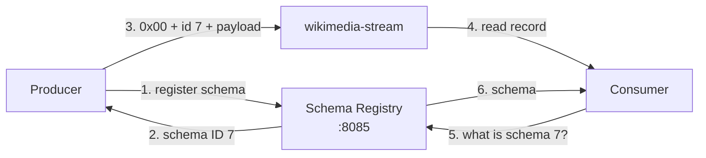

# Lesson 25: Schema Registry and Avro

> **Part 5: Production**

---

## What you'll learn

- What a schema registry stores, and what the five bytes at the front of every Avro record mean
- How to generate Java types from a schema and produce them
- Why an incompatible schema fails on the first `send()` rather than at startup
- Why the dead-letter topic must stay untyped when everything else becomes typed

---

## Why this matters

Your topic carries JSON strings. Nothing validates them, nothing versions them, and the only reason your consumer survives a Wikimedia field change is the `ignoreUnknown` flag you set in Lesson 16.

That works because you own neither end. When you own both, a registry gives you something better: a schema the broker's clients agree on, checked at publish time, so an incompatible change fails in the pipeline that made it rather than in the consumer that received it.

This is also the lesson with the most moving parts, because a typed value changes the producer, the consumer, both build files, and the dead-letter path.

---

## Before you start

[Lesson 24](24-testing-with-testcontainers.md), with a passing test suite.

---

## The concept

### What the registry stores

Schema Registry is a small HTTP service that stores schemas and assigns each one an integer ID. It stores them in a Kafka topic called `_schemas`, which is the pattern you have now seen three times: consumer offsets, cluster metadata, and now schemas all live in logs.

Clients talk to it, not to each other. A producer registers a schema and gets an ID. A consumer sees an ID and asks for the schema.

### The five bytes

An Avro record on a Kafka topic is not just Avro. The Confluent serializer writes:

```
byte 0        magic byte, always 0x00
bytes 1 to 4  schema ID, 4-byte big-endian int
bytes 5 to n  the Avro-encoded payload
```

This is why a consumer using `StringDeserializer` on an Avro topic gets unreadable text rather than an exception, as Lesson 15 warned. It is also why the payload is compact: field names are in the schema, not in every record, which is the main size win over JSON.



### Subjects and compatibility

A **subject** is the unit of versioning, named `<topic>-value` by default. Each subject holds an ordered list of schema versions and a compatibility rule.

The default rule is `BACKWARD`, meaning a new schema must be able to read data written with the previous one. In practice that allows adding a field with a default and removing a field, and forbids adding a required field or changing a type.

`BACKWARD` is the right default because it lets you deploy consumers before producers.

### Where the failure actually surfaces

This is the detail most material gets wrong, and it matters operationally.

`KafkaAvroSerializer` registers the schema **lazily, inside `serialize()`**, on the first record it handles. So an incompatible schema does not fail at startup. Your application starts cleanly, reports healthy, and then the first `send()` fails with a `SerializationException` wrapping a `RestClientException` carrying HTTP 409.

Setting `auto.register.schemas` to false does not add a startup check either. It changes who may register, not when the lookup happens.

The consequence is worth planning for: a bad schema deploy looks like a healthy rollout followed by a producer that cannot publish anything. If you want a startup check, you have to make one, and the last exercise asks you to.

---

## Hands-on

### 1. Add Schema Registry to the cluster

Append to `docker-compose.yml`:

```yaml
  schema-registry:
    image: confluentinc/cp-schema-registry:8.3.1
    hostname: schema-registry
    container_name: schema-registry
    ports:
      - "8085:8081"
    environment:
      SCHEMA_REGISTRY_HOST_NAME: schema-registry
      SCHEMA_REGISTRY_KAFKASTORE_BOOTSTRAP_SERVERS: 'kafka-1:29092,kafka-2:29092,kafka-3:29092'
      SCHEMA_REGISTRY_LISTENERS: http://0.0.0.0:8081
      # The registry stores schemas in a Kafka topic it creates itself.
      SCHEMA_REGISTRY_KAFKASTORE_TOPIC: _schemas
      SCHEMA_REGISTRY_KAFKASTORE_TOPIC_REPLICATION_FACTOR: 3
    networks:
      - kafka-network
    depends_on:
      kafka-1:
        condition: service_healthy
```

Note the port mapping. The container listens on 8081, which your producer already owns on the host, so it is published on **8085**. Getting this backwards produces a port conflict that looks like the registry failing to start.

```bash
docker compose up -d
curl -s localhost:8085/subjects
```

An empty array. And the topic it created:

```bash
docker exec kafka-1 kafka-topics --bootstrap-server kafka-1:29092 --list | grep _schemas
```

Lesson 02 predicted this one: `_schemas` appears when Schema Registry starts, not before.

### 2. Add the dependencies

Confluent's artifacts are not on Maven Central, so both projects need the repository:

```xml
    <repositories>
        <repository>
            <id>confluent</id>
            <url>https://packages.confluent.io/maven/</url>
        </repository>
    </repositories>
```

And the dependencies, in both projects:

```xml
        <dependency>
            <groupId>io.confluent</groupId>
            <artifactId>kafka-avro-serializer</artifactId>
            <version>8.3.1</version>
        </dependency>

        <dependency>
            <groupId>org.apache.avro</groupId>
            <artifactId>avro</artifactId>
            <version>1.12.1</version>
        </dependency>
```

Both versions are explicit, and that is not an oversight. **Neither artifact is in Spring Boot's BOM**, so a versionless declaration fails the build with a missing-version error. This is worth knowing generally: the BOM covers a large surface, and assuming it covers everything is how you discover it does not.

Keep `kafka-avro-serializer` aligned with the `cp-schema-registry` image tag. Both are 8.3.1 here.

### 3. The schema

`src/main/resources/avro/wikimedia-event.avsc`, in both projects:

```json
{
  "namespace": "com.example.wikimedia.avro",
  "type": "record",
  "name": "WikimediaEventAvro",
  "fields": [
    {"name": "type", "type": "string"},
    {"name": "title", "type": "string"},
    {"name": "user", "type": ["null", "string"], "default": null},
    {"name": "bot", "type": "boolean", "default": false},
    {"name": "namespace", "type": ["null", "int"], "default": null},
    {"name": "wiki", "type": ["null", "string"], "default": null},
    {"name": "serverName", "type": ["null", "string"], "default": null},
    {"name": "timestamp", "type": ["null", "long"], "default": null},
    {"name": "comment", "type": ["null", "string"], "default": null}
  ]
}
```

Every optional field is a union with `null` **and** carries a default. The default is what makes a later removal backward-compatible, so omitting it is how you paint yourself into a corner three releases from now.

### 4. Generate the Java class

Add the plugin to both projects, with an explicit version for the same reason as above:

```xml
            <plugin>
                <groupId>org.apache.avro</groupId>
                <artifactId>avro-maven-plugin</artifactId>
                <version>1.12.1</version>
                <executions>
                    <execution>
                        <phase>generate-sources</phase>
                        <goals>
                            <goal>schema</goal>
                        </goals>
                        <configuration>
                            <sourceDirectory>${project.basedir}/src/main/resources/avro</sourceDirectory>
                            <outputDirectory>${project.build.directory}/generated-sources/avro</outputDirectory>
                        </configuration>
                    </execution>
                </executions>
            </plugin>
```

```bash
./mvnw generate-sources
```

`WikimediaEventAvro` now exists under `target/generated-sources/avro`, with a builder. It is generated code, so it does not go in version control.

### 5. Producer: serialize Avro

In the producer's `application.yml`, change the value serializer and point at the registry:

```yaml
      value-serializer: io.confluent.kafka.serializers.KafkaAvroSerializer

      properties:
        schema.registry.url: http://localhost:8085
        # Registering from the producer is convenient locally. In a pipeline with
        # a CI schema check you would set this false and register there instead.
        auto.register.schemas: true
```

The template type changes, so `WikimediaProducer` becomes:

```java
@Service
public class WikimediaProducer {

    private static final Logger log = LoggerFactory.getLogger(WikimediaProducer.class);
    private static final String TOPIC = "wikimedia-stream";

    private final KafkaTemplate<String, WikimediaEventAvro> kafkaTemplate;

    public WikimediaProducer(KafkaTemplate<String, WikimediaEventAvro> kafkaTemplate) {
        this.kafkaTemplate = kafkaTemplate;
    }

    public void sendMessage(String key, WikimediaEventAvro event) {
        kafkaTemplate.send(TOPIC, key, event)
                .whenComplete((result, ex) -> {
                    if (ex != null) {
                        log.error("Failed to send key={}: {}", key, ex.getMessage());
                        return;
                    }
                    var metadata = result.getRecordMetadata();
                    log.debug("Sent topic={} partition={} offset={}",
                            metadata.topic(), metadata.partition(), metadata.offset());
                });
    }
}
```

### 6. Producer: map JSON to Avro

This is the step the pipeline actually needs and the one most Avro tutorials skip. The SSE feed gives you JSON, and the producer now has to build a typed object from it.

In `WikimediaStreamPublisher`, replace `publish` and `partitionKey` with:

```java
    private void publish(String json) {
        JsonNode node;
        try {
            node = objectMapper.readTree(json);
        } catch (Exception e) {
            log.warn("Skipping unparseable SSE event: {}", e.getMessage());
            return;
        }

        String title = text(node, "title");
        if (title == null) {
            log.warn("Skipping SSE event with no title");
            return;
        }

        producer.sendMessage(title, toAvro(node, title));
    }

    private WikimediaEventAvro toAvro(JsonNode node, String title) {
        return WikimediaEventAvro.newBuilder()
                .setType(text(node, "type") == null ? "unknown" : text(node, "type"))
                .setTitle(title)
                .setUser(text(node, "user"))
                .setBot(node.path("bot").asBoolean(false))
                .setNamespace(node.hasNonNull("namespace") ? node.get("namespace").asInt() : null)
                .setWiki(text(node, "wiki"))
                .setServerName(text(node, "server_name"))
                .setTimestamp(node.hasNonNull("timestamp") ? node.get("timestamp").asLong() : null)
                .setComment(text(node, "comment"))
                .build();
    }

    private String text(JsonNode node, String field) {
        return node.hasNonNull(field) ? node.get(field).asText() : null;
    }
```

Notice the shape change. Parsing moved from the consumer to the producer, so a malformed SSE event is now dropped at the edge rather than published and dead-lettered later.

That is a real improvement and a real trade. The pipeline can no longer carry a record it cannot understand, which means Lesson 16's poison pill scenario mostly disappears, and it also means you have lost the audit trail of the malformed input. Whether that is progress depends on whether you would ever have investigated it.

### 7. Consumer: deserialize Avro

```yaml
      value-deserializer: io.confluent.kafka.serializers.KafkaAvroDeserializer

      properties:
        schema.registry.url: http://localhost:8085
        # Without this you get a GenericRecord instead of WikimediaEventAvro.
        specific.avro.reader: true
```

`specific.avro.reader` is the line people forget. Omit it and every record arrives as a `GenericRecord`, your cast fails, and the error message says nothing about this property.

The listener now receives a typed value, and Lesson 16's `parse` method is gone entirely:

```java
    @KafkaListener(topics = "wikimedia-stream", groupId = "wikimedia-consumer-group")
    public void consume(ConsumerRecord<String, WikimediaEventAvro> record,
                        Acknowledgment acknowledgment) {

        WikimediaEventAvro event = record.value();

        try {
            repository.save(toEntity(event, record));
        } catch (DataIntegrityViolationException e) {
            log.debug("Already stored partition={} offset={}",
                    record.partition(), record.offset());
        }

        acknowledgment.acknowledge();
    }
```

`toEntity` needs its accessors updated to Avro's getters, and any `CharSequence` from Avro converted with `toString()` before it reaches a `String` field.

### 8. The dead-letter path must stay untyped

Here is the problem the type change creates, and it will stop your application from starting.

`DeadLetterPublishingRecoverer` needs a `KafkaTemplate`. Your container's records are now `WikimediaEventAvro`, but a record that failed may have failed *because* it could not be deserialised, in which case there is no Avro object to republish, only bytes.

So the dead-letter template must be a byte-array template, declared separately:

```java
    @Bean
    public KafkaTemplate<byte[], byte[]> dltKafkaTemplate(
            ProducerFactory<?, ?> producerFactory) {

        Map<String, Object> config = new HashMap<>(producerFactory.getConfigurationProperties());
        config.put(ProducerConfig.KEY_SERIALIZER_CLASS_CONFIG, ByteArraySerializer.class);
        config.put(ProducerConfig.VALUE_SERIALIZER_CLASS_CONFIG, ByteArraySerializer.class);
        config.remove("schema.registry.url");

        return new KafkaTemplate<>(new DefaultKafkaProducerFactory<>(config));
    }

    @Bean
    public DeadLetterPublishingRecoverer deadLetterPublishingRecoverer(
            KafkaTemplate<byte[], byte[]> dltKafkaTemplate) {

        return new DeadLetterPublishingRecoverer(dltKafkaTemplate,
                (record, exception) ->
                        new TopicPartition(record.topic() + ".dlt", record.partition()));
    }
```

Two things follow, and both are the right outcome.

The dead-letter topic now holds **raw bytes including the five-byte Avro envelope**, which is exactly what you want: byte-identical to what failed, replayable, and inspectable with the registry's help. Your Lesson 22 dead-letter consumer needs its value type changed to `byte[]`, and its payload logging becomes a hex or length summary rather than a string.

And a record that failed to deserialise can still be parked, which a typed template could not have done.

### 9. Run the migration

Delete the topic so you are not mixing JSON and Avro records:

```bash
docker exec kafka-1 kafka-topics --bootstrap-server kafka-1:29092 \
  --delete --topic wikimedia-stream
```

Start the consumer, then the producer, and trigger the stream. Then check what got registered:

```bash
curl -s localhost:8085/subjects
curl -s localhost:8085/subjects/wikimedia-stream-value/versions
curl -s localhost:8085/subjects/wikimedia-stream-value/versions/1 | head -c 400
```

And confirm the wire format directly:

```bash
docker exec kafka-1 kafka-console-consumer \
  --bootstrap-server kafka-1:29092 --topic wikimedia-stream --max-messages 1
```

Unreadable, with a visible leading null byte. That is the magic byte and schema ID, and it is exactly the failure Lesson 15 predicted for a mismatched deserializer.

### 10. Break compatibility on purpose

Add a required field with no default to the schema:

```json
    {"name": "mandatoryThing", "type": "string"}
```

Regenerate, restart the producer, and watch what happens. The application **starts cleanly**. Then the first record fails:

```
SerializationException: Error registering Avro schema
Caused by: RestClientException: Schema being registered is incompatible with an earlier schema; error code: 409
```

Note where that appeared: on the first `send()`, not at startup, because the serializer registers lazily. Your health endpoint was green the whole time.

Remove the field and regenerate.

---

## Try it yourself

1. Add an optional field with a default, regenerate, and restart the producer. Check `versions` on the subject. Why was that accepted when step 10 was rejected? State the rule in terms of what the old schema can read.

2. Set `auto.register.schemas: false` and remove the subject with `curl -X DELETE localhost:8085/subjects/wikimedia-stream-value`. Start the producer. Where does it fail, and what does that tell you about who should own registration in a real deployment?

3. Read a dead-letter record's bytes and decode them by hand: strip the first byte, read the next four as a big-endian int, fetch that schema from the registry. This is Lesson 22's header decoding applied to a payload.

4. Build the startup check this lesson says does not exist: a bean that posts the local schema to `/compatibility/subjects/wikimedia-stream-value/versions/latest` and fails the context if the registry says it is incompatible. Where in the lifecycle does it belong, and why is that better than discovering it on the first send?

---

## Common mistakes

**Declaring `avro` or `kafka-avro-serializer` without a version.**
Neither is in Spring Boot's BOM, and the build fails with a missing version.

**Publishing Schema Registry on 8081.**
Your producer owns that port on the host. Use 8085 and map to 8081 inside.

**Omitting `specific.avro.reader: true`.**
Every record arrives as a `GenericRecord` and the error says nothing about the cause.

**Omitting defaults on optional Avro fields.**
A union with `null` makes the field nullable. The default is what makes removing it compatible later.

**Expecting an incompatible schema to fail at startup.**
Registration is lazy. It fails on the first `send()`, after a green rollout.

**Using a typed `KafkaTemplate` for the dead-letter path.**
A record that failed to deserialise has no typed form. The dead-letter template must handle bytes.

**Mixing JSON and Avro records on one topic.**
The consumer cannot tell which is which. Delete the topic during the migration.

---

## Check your understanding

**1. A consumer reads an Avro topic with `StringDeserializer`. What happens?**

<details>
<summary>Reveal answer</summary>

It succeeds and produces nonsense, which is the worst of the available outcomes.

`StringDeserializer` calls `new String(bytes, UTF_8)` on whatever it is given. Avro bytes are mostly valid UTF-8 sequences, so decoding does not throw. You get a string containing the magic byte, the schema ID and the binary payload rendered as unprintable characters.

This is the same class of failure as decoding a numeric header as a string in Lesson 22: a type mismatch that produces a plausible-looking wrong answer instead of an error.

</details>

**2. Why is the schema ID in the record rather than the schema itself?**

<details>
<summary>Reveal answer</summary>

Size, and it is the main reason Avro beats JSON on the wire.

JSON repeats every field name in every record. Avro puts the field names in the schema, stored once in the registry, and each record carries a four-byte reference to it plus the values. On a payload with a dozen fields and short values, the field names were most of the bytes.

It also means a schema change is one registry write rather than a change to every record, and a consumer can decode a record written under a schema it has never seen by asking for it.

The cost is a hard dependency: a consumer that cannot reach the registry cannot decode anything, so the registry becomes infrastructure you have to keep up.

</details>

**3. `BACKWARD` compatibility is the default. Which deployment order does it enable?**

<details>
<summary>Reveal answer</summary>

Consumers first, then producers.

`BACKWARD` means the new schema can read data written with the old one. So a consumer upgraded to the new schema still handles every record already on the topic, and every record still being produced by the not-yet-upgraded producers.

Deploy the producer first and you would be writing records that old consumers cannot read, which is what `FORWARD` compatibility permits and why it implies the opposite rollout order.

Adding a field with a default satisfies `BACKWARD` because an old record simply lacks it and the default fills in. Adding a required field does not, because there is nothing to read for it.

</details>

**4. Your producer starts healthy and cannot publish. What is the most likely cause, and why was startup no help?**

<details>
<summary>Reveal answer</summary>

A schema incompatibility, surfacing as a 409 wrapped in a `SerializationException` on the first `send()`.

Startup was no help because `KafkaAvroSerializer` registers the schema lazily, inside `serialize()`. Nothing contacts the registry until the first record needs encoding, so context startup, health checks and readiness probes all pass on an application that cannot do its job.

Setting `auto.register.schemas` to false does not change the timing, only who is permitted to register.

If you want this caught at deploy time you have to check it yourself, either in CI against the registry's compatibility endpoint or in a startup bean, which is the fourth exercise.

</details>

**5. Why must the dead-letter template be a byte-array template once values are Avro?**

<details>
<summary>Reveal answer</summary>

Because the records most likely to fail are the ones with no valid typed form.

A deserialization failure means the bytes could not become a `WikimediaEventAvro`, so a template typed to that class has nothing it could publish. The record would be unrecoverable at exactly the moment you most want it parked.

A byte-array template republishes the original bytes untouched, including the magic byte and schema ID. That keeps Lesson 22's replay property intact and lets you decode the payload later by fetching the referenced schema from the registry.

It also changes your dead-letter consumer's value type to `byte[]`, which is the honest consequence: the dead-letter topic is now the one place in the pipeline that is deliberately untyped, because it exists to hold things that did not fit their type.

</details>

---

## Recap

Schema Registry stores schemas in a Kafka topic and hands out integer IDs, and every Avro record on your topic begins with a magic byte and a four-byte reference to one. Field names live in the schema rather than in each record, which is the size win and the reason the registry becomes required infrastructure.

Subjects are versioned with a compatibility rule, `BACKWARD` by default, which lets you deploy consumers ahead of producers. Registration is lazy, so an incompatible schema fails on the first `send()` after a green startup.

Both Avro dependencies need explicit versions because Boot's BOM does not manage them, and the dead-letter path must stay on bytes so that a record which failed to deserialise can still be parked.

**Next:** [Lesson 26: Observability](26-observability.md)
