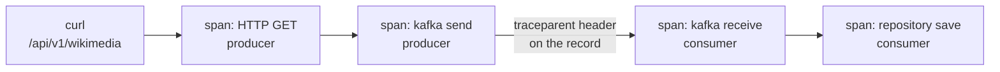

# Lesson 26: Observability

> **Part 5: Production**

---

## What you'll learn

- Which of the three signals Spring Boot exports for free, and which one needs four pieces of wiring
- Why metrics are scraped while traces and logs are pushed
- How a trace crosses the Kafka boundary from producer to consumer
- Four ways this stack fails silently, and how to confirm each one

---

## Why this matters

You have a pipeline with a producer, three brokers, three consumer threads, a database and a dead-letter topic. When it misbehaves at 3 a.m., the question is never "is Kafka up". It is "where did this record go, and why is that partition behind".

Lesson 22 also left you with a specific problem: dead-lettering a record advances the offset, so lag clears and the pipeline reports itself healthy while discarding everything. You need a signal that catches that.

The other reason this lesson exists is that observability fails quietly. A misconfigured exporter does not crash your application, it just produces an empty dashboard, and an empty dashboard looks like a healthy system.

---

## Before you start

[Lesson 25](25-schema-registry-and-avro.md). If you skipped the Avro migration, everything here works identically on the JSON version.

---

## The concept

### Three signals, two directions

| Signal | Direction | Mechanism |
|---|---|---|
| Metrics | pulled | Prometheus scrapes `/actuator/prometheus` |
| Traces | pushed | OTLP to Tempo |
| Logs | pushed | OTLP to Loki |

Metrics are scraped because they are a current value that can be sampled at any time, and because scraping gives you a free liveness check: a target that stops answering is visibly down. Traces and logs are events that already happened, so there is nothing to sample and they have to be sent.

This is also why `kafka-exporter` exists. Brokers speak Kafka's protocol, not Prometheus, so the exporter translates consumer group lag and topic offsets into a scrapeable endpoint.

### What Spring Boot gives you, and what it does not

This is the part worth being precise about, because two of the three signals are nearly free and one is not.

**Metrics are configuration.** Micrometer already instruments your application, Kafka clients, the JVM, HikariCP and the web layer. Adding a registry and exposing an endpoint is all that is required.

**Traces are configuration plus one trap.** `spring-boot-starter-opentelemetry` bundles the OTel SDK and the Micrometer tracing bridge. Set the endpoint, and set `management.tracing.sampling.probability` explicitly, because it defaults to **0.1** and will silently discard 90% of your traces.

**Logs need four separate things**, and none of them is automatic:

1. the `opentelemetry-logback-appender-1.0` dependency
2. a `logback-spring.xml` registering that appender on the root logger
3. a bean that installs the SDK into the appender after the context is ready
4. the logging OTLP endpoint property

Step 3 is the one that surprises people. Logback initialises before the Spring context exists, so the appender is constructed before the `OpenTelemetry` bean does. `OpenTelemetryAppender.install(openTelemetry)` retro-fits the SDK into the already-running appender. Without it the appender is present, accepts every log event, and exports nothing, with no error anywhere.

### The two property prefixes

There are two, because there are two export paths, and mixing them up is the most common configuration failure here.

```yaml
management:
  otlp:
    metrics:
      export:
        url: ...            # Micrometer's OTLP registry
  opentelemetry:
    tracing:
      export:
        otlp:
          endpoint: ...     # the OTel SDK
    logging:
      export:
        otlp:
          endpoint: ...     # the OTel SDK
```

Metrics go through Micrometer, so they use `management.otlp.metrics`. Traces and logs go through the OTel SDK, so they use `management.opentelemetry`. A property under the wrong prefix binds to nothing and is ignored in silence.

This lesson scrapes metrics rather than pushing them, so you will only use the second prefix. The first is here because you will meet it, and because knowing there are two is what stops you searching for a property that does not exist.

### No collector, and why

The production-standard architecture puts an OpenTelemetry Collector between your applications and the backends. It decouples the app from the storage choice, batches and retries centrally, and lets you change backends without redeploying anything.

This lesson exports directly to Tempo and Loki instead, for one reason: a collector adds a container, a config file, and a hop where every endpoint can be wrong. Two of the four silent failures below were originally collector misconfigurations, and they are more instructive when they are yours.

Add the collector when you have more than a couple of services, or when you want to change backends without touching application config. The closing exercise walks through inserting one.

### How a trace crosses Kafka

A trace is a tree of spans sharing a trace ID. The interesting part here is that the producer and consumer are separate processes.



The link is a `traceparent` header on the Kafka record, which is exactly the use for headers that Lesson 22 described. Micrometer's instrumentation writes it on send and reads it on receive, so the consumer's spans join the producer's trace.

That only happens if the listener container has observation enabled, which is one line and is otherwise off.

---

## Hands-on

### 1. Add the observability stack

Append to `docker-compose.yml`:

```yaml
  prometheus:
    image: prom/prometheus:v3.13.2
    container_name: prometheus
    ports:
      - "9090:9090"
    volumes:
      - ./prometheus.yml:/etc/prometheus/prometheus.yml:ro
      - prometheus-data:/prometheus
    networks:
      - kafka-network

  tempo:
    image: grafana/tempo:3.0.3
    container_name: tempo
    ports:
      # 3200 is the query API that Grafana reads. 4318 is OTLP ingest, which
      # your applications write to. Both must be published, because the apps
      # run on your machine rather than in this network.
      - "3200:3200"
      - "4318:4318"
    command: [ "-config.file=/etc/tempo/tempo.yml" ]
    volumes:
      - ./tempo-config.yml:/etc/tempo/tempo.yml:ro
      - tempo-data:/var/tempo
    networks:
      - kafka-network

  loki:
    image: grafana/loki:3.7.6
    container_name: loki
    ports:
      - "3100:3100"
    networks:
      - kafka-network

  grafana:
    image: grafana/grafana:13.1.3
    container_name: grafana
    # The container listens on 3000. It is published on 3001 to stay clear of
    # anything else you may be running.
    ports:
      - "3001:3000"
    environment:
      GF_SECURITY_ADMIN_USER: admin
      GF_SECURITY_ADMIN_PASSWORD: admin
      GF_AUTH_ANONYMOUS_ENABLED: 'true'
    volumes:
      - grafana-data:/var/lib/grafana
    networks:
      - kafka-network

  kafka-exporter:
    image: danielqsj/kafka-exporter:v1.9.0
    container_name: kafka-exporter
    ports:
      - "9308:9308"
    command:
      - '--kafka.server=kafka-1:29092'
      - '--kafka.server=kafka-2:29092'
      - '--kafka.server=kafka-3:29092'
    networks:
      - kafka-network
    depends_on:
      kafka-1:
        condition: service_healthy
```

And add the new volumes:

```yaml
volumes:
  kafka-1-data:
  kafka-2-data:
  kafka-3-data:
  prometheus-data:
  tempo-data:
  grafana-data:
```

Every tag is pinned. Note the Tempo comment: this is the one image where a version bump is a config change, and the pin is load-bearing rather than habitual.

### 2. `prometheus.yml`

Create it next to `docker-compose.yml`:

```yaml
global:
  scrape_interval: 15s
  evaluation_interval: 15s

scrape_configs:
  # Consumer group lag and topic offsets, translated from Kafka's protocol.
  - job_name: kafka-exporter
    static_configs:
      - targets: ['kafka-exporter:9308']

  # The applications run on your machine, not in the Docker network, so
  # Prometheus reaches them through the host gateway.
  - job_name: wikimedia-producer
    metrics_path: /actuator/prometheus
    static_configs:
      - targets: ['host.docker.internal:8081']

  - job_name: wikimedia-consumer
    metrics_path: /actuator/prometheus
    static_configs:
      - targets: ['host.docker.internal:8082']
```

`host.docker.internal` is how a container reaches a process on your machine. On Linux without Docker Desktop you may need `extra_hosts: ["host.docker.internal:host-gateway"]` on the Prometheus service.

This asymmetry is worth noticing: Prometheus reaches into the host to scrape, while your applications reach into the Docker network to push. It is the same two-address problem from Lesson 00, now in both directions at once.

### 3. `tempo-config.yml`

```yaml
stream_over_http_enabled: true

server:
  http_listen_port: 3200
  log_level: warn

distributor:
  receivers:
    otlp:
      protocols:
        http:
          endpoint: 0.0.0.0:4318

storage:
  trace:
    backend: local
    wal:
      path: /var/tempo/wal
    local:
      path: /var/tempo/blocks

usage_report:
  reporting_enabled: false
```

Note the two ports. **3200 is the query API** that Grafana reads from, and **4318 is the OTLP ingest** that your applications write to. Posting traces to 3200 returns a 404, which is the third silent failure below.

This is Tempo running as a single binary, which is why the config is this short. Tempo 3.0 reorganised its clustered deployment substantially, replacing the `ingester` and `compactor` components with `live_store`, `block_builder` and a backend scheduler, and its microservices configuration requires Kafka for ingest. None of that applies here: a single-binary local Tempo needs a server port, a receiver and somewhere to put blocks, and that shape is unchanged.

The lesson is worth generalising. A major version bump that breaks a clustered deployment can leave a simple one untouched, so "3.x renamed the config" is true and not necessarily true of *your* config. Read the migration notes for the deployment mode you actually run.

### 4. Add the dependencies, in both projects

```xml
        <dependency>
            <groupId>org.springframework.boot</groupId>
            <artifactId>spring-boot-starter-opentelemetry</artifactId>
        </dependency>

        <dependency>
            <groupId>io.micrometer</groupId>
            <artifactId>micrometer-registry-prometheus</artifactId>
        </dependency>

        <!-- Bridges Logback events into the OTel SDK. Not pulled in by the starter. -->
        <dependency>
            <groupId>io.opentelemetry.instrumentation</groupId>
            <artifactId>opentelemetry-logback-appender-1.0</artifactId>
            <version>2.29.0-alpha</version>
        </dependency>

        <!-- Required by the log appender at runtime. Without it the log export
             thread dies with NoClassDefFoundError on ExtendedAttributes and no
             log ever reaches Loki. -->
        <dependency>
            <groupId>io.opentelemetry</groupId>
            <artifactId>opentelemetry-api-incubator</artifactId>
            <version>${opentelemetry.version}-alpha</version>
        </dependency>
```

`${opentelemetry.version}` is managed by Spring Boot's BOM, currently 1.62.0, so the alpha artifact stays aligned with the stable ones automatically.

The starter exports; it does not instrument. Micrometer does the instrumenting and is already in your application. The starter bundles the OTel API and SDK plus the Micrometer tracing bridge so those signals can be shipped over OTLP.

It also does not require actuator, which you added separately in Lesson 12 and Lesson 15.

### 5. Configure both applications

Replace the `management` block in each `application.yml`:

```yaml
management:
  endpoints:
    web:
      exposure:
        include: health,info,metrics,prometheus
  endpoint:
    health:
      show-details: always

  # Traces and logs go through the OTel SDK, so they use the
  # management.opentelemetry prefix. Metrics are scraped, not pushed, so
  # management.otlp.metrics is deliberately absent.
  opentelemetry:
    tracing:
      export:
        otlp:
          endpoint: http://localhost:4318/v1/traces
    logging:
      export:
        otlp:
          endpoint: http://localhost:3100/otlp/v1/logs

  tracing:
    sampling:
      # Defaults to 0.1, which silently discards 90% of traces. Fine locally,
      # ruinous at scale, and always worth setting explicitly.
      probability: 1.0
```

Add `prometheus` to the exposure list or `/actuator/prometheus` returns 404 while the metrics are collected perfectly well, which is the first silent failure below.

The endpoints are `localhost` because the applications run on your machine and Docker publishes those ports. Running them inside the Compose network instead means `http://tempo:4318` and `http://loki:3100`.

### 6. Wire up log export

`src/main/resources/logback-spring.xml`, in both projects:

```xml
<?xml version="1.0" encoding="UTF-8"?>
<configuration>
    <include resource="org/springframework/boot/logging/logback/base.xml"/>

    <appender name="OTEL"
              class="io.opentelemetry.instrumentation.logback.appender.v1_0.OpenTelemetryAppender"/>

    <root level="INFO">
        <appender-ref ref="CONSOLE"/>
        <appender-ref ref="OTEL"/>
    </root>
</configuration>
```

And the bean that makes it work, in each project's base package:

```java
package com.example.wikimedia.consumer.observability;

import io.opentelemetry.api.OpenTelemetry;
import io.opentelemetry.instrumentation.logback.appender.v1_0.OpenTelemetryAppender;
import org.springframework.beans.factory.InitializingBean;
import org.springframework.stereotype.Component;

/**
 * Logback initialises before the Spring context, so the OTEL appender is created
 * before the OpenTelemetry bean exists. This installs the SDK into the appender
 * once the context is ready. Without it the appender silently exports nothing.
 */
@Component
class OpenTelemetryAppenderInstaller implements InitializingBean {

    private final OpenTelemetry openTelemetry;

    OpenTelemetryAppenderInstaller(OpenTelemetry openTelemetry) {
        this.openTelemetry = openTelemetry;
    }

    @Override
    public void afterPropertiesSet() {
        OpenTelemetryAppender.install(openTelemetry);
    }
}
```

### 7. Join the trace across Kafka

One line in the consumer's `KafkaConsumerConfig`:

```java
        factory.getContainerProperties().setObservationEnabled(true);
```

This makes the listener container create a span per record and read the `traceparent` header, so consumer spans join the producer's trace. Without it you get two unrelated traces and no way to follow a record across the boundary.

### 8. Run it and verify each signal separately

```bash
docker compose up -d
```

Verify them one at a time, because a single blank dashboard cannot tell you which of four things is broken.

**Metrics, at the source:**

```bash
curl -s localhost:8082/actuator/prometheus | grep -c '^kafka'
```

A non-zero count. If it is 404, `prometheus` is missing from your exposure list.

**Metrics, at Prometheus:** open `http://localhost:9090/targets`. All four targets should be `UP`. A target that is `DOWN` with a connection error is the `host.docker.internal` problem from step 2.

**Traces:**

```bash
curl -s -o /dev/null -w '%{http_code}\n' -X POST localhost:4318/v1/traces \
  -H 'Content-Type: application/json' -d '{}'
```

Anything other than a connection failure means Tempo's OTLP receiver is listening. A 404 means you are talking to 3200.

**Logs:**

```bash
curl -s 'localhost:3100/loki/api/v1/labels'
```

Then trigger some traffic and query for your service.

### 9. The four ways this fails silently

Every one of these leaves your application healthy and a dashboard empty. Each is worth causing on purpose once.

**The appender that exports nothing.** Delete the `OpenTelemetryAppenderInstaller` bean. Logs still appear on the console, the OTEL appender still receives every event, and Loki receives nothing. There is no error, because an appender with no SDK installed is a functioning appender with nowhere to send.

*Confirm it:* query Loki for your service and get an empty result while `docker compose logs` shows plenty of output.

**The missing incubator dependency.** Remove `opentelemetry-api-incubator`. The log export thread dies with `NoClassDefFoundError` on `ExtendedAttributes`. This one does produce a stack trace, once, at startup, in among the banner, and then never again.

*Confirm it:* search your application's own startup output for `NoClassDefFoundError` before assuming Loki is at fault.

**Traces posted to the query port.** Point the tracing endpoint at `http://localhost:3200/v1/traces`. Tempo answers, with a 404, and the OTel SDK logs an export failure at a level you are probably not watching.

*Confirm it:* the curl in step 8 distinguishes the two ports in one command.

**Sampling at the default.** Remove `management.tracing.sampling.probability`. It reverts to 0.1, so nine out of ten traces never leave the application. Your dashboards are not empty, which is what makes this the worst of the four: they are 90% incomplete, and the traces you happen to look for are usually the missing ones.

*Confirm it:* produce ten records and count the traces in Grafana.

### 10. Wire up Grafana

Open `http://localhost:3001`, log in with `admin` and `admin`, and add three data sources under Connections:

| Type | URL |
|---|---|
| Prometheus | `http://prometheus:9090` |
| Tempo | `http://tempo:3200` |
| Loki | `http://loki:3100` |

Container hostnames, not `localhost`, because Grafana is inside the Docker network.

Note that Tempo's data source is the **query** port, while your application writes to 4318. Same service, two ports, two different jobs.

Then import dashboard **7589** for Kafka Exporter and **12900** for JVM Micrometer.

### 11. The query that matters

The metric to alert on is consumer lag:

```promql
sum(kafka_consumergroup_lag{consumergroup="wikimedia-consumer-group"})
```

And the one Lesson 22 said you also need, because dead-lettering clears lag:

```promql
sum(rate(kafka_topic_partition_current_offset{topic="wikimedia-stream.dlt"}[5m]))
```

Those two together cover both failure shapes. Rising lag means a consumer that has stopped or fallen behind. A rising dead-letter rate with flat lag means a consumer that is running fine and rejecting everything it receives.

Alerting on only the first is how a pipeline discards a day of records while every graph looks healthy.

---

## Try it yourself

1. Trigger the stream, then find a single record's full trace in Grafana: the HTTP request, the send, the receive and the database write. Confirm the producer and consumer spans share one trace ID. Then remove `setObservationEnabled(true)` and look again.

2. Set `probability: 0.1`, produce exactly 100 records, and count the traces. Then explain why sampling is applied at the start of a trace rather than per span.

3. Add a Micrometer counter for dead-letter records, tagged by the cause class from Lesson 22's header decoding. Graph it next to lag, then produce a poison pill and watch the two move in opposite directions.

4. Insert an OpenTelemetry Collector. Add `otel/opentelemetry-collector-contrib:0.158.0` with a config that receives OTLP and exports to Tempo and Loki, then point both applications at the collector instead. What did you gain, and which two of the four silent failures above did you just reintroduce?

---

## Common mistakes

**Omitting `prometheus` from the actuator exposure list.**
The metrics are collected and the endpoint returns 404.

**Leaving `management.tracing.sampling.probability` unset.**
It defaults to 0.1 and discards 90% of traces without telling you.

**Putting tracing properties under `management.otlp`.**
Metrics use that prefix; traces and logs use `management.opentelemetry`. The wrong prefix binds to nothing.

**Expecting log export to work from the dependency alone.**
It needs the appender registered in `logback-spring.xml` and the SDK installed into it at runtime.

**Omitting `opentelemetry-api-incubator`.**
The log export thread dies with `NoClassDefFoundError` and only says so once.

**Posting traces to Tempo's port 3200.**
That is the query API. Ingest is 4318.

**Using `localhost` in Grafana's data source URLs.**
Grafana is in the Docker network and needs container hostnames.

**Alerting on lag alone.**
Dead-lettering advances the offset, so a consumer rejecting everything reports zero lag.

**Bumping the Tempo image without reading its changelog.**
3.x renamed configuration keys, and the container will reject the config in this lesson.

---

## Check your understanding

**1. Why are metrics scraped while traces and logs are pushed?**

<details>
<summary>Reveal answer</summary>

Because they are different kinds of data.

A metric is a current value. It exists whether or not anyone asks, so it can be sampled at any interval, and pulling it gives you a free liveness signal: a target that stops answering is visibly down, which is information you would otherwise have to invent.

A trace or a log is an event that already happened. There is no current value to sample, so the application has to send it when it occurs. Nobody can scrape something that existed for two milliseconds.

That is also why a push pipeline needs its own health checks. An application that has stopped exporting traces looks identical to one that is idle.

</details>

**2. You add the logback appender dependency and the endpoint property, and no logs reach Loki. What is missing?**

<details>
<summary>Reveal answer</summary>

The runtime install, and possibly the incubator dependency.

Logback initialises before the Spring context, so the OTEL appender is constructed before an `OpenTelemetry` bean exists to give it. It runs happily with no SDK attached, accepting every log event and exporting none of them, and it does not consider that an error.

`OpenTelemetryAppender.install(openTelemetry)`, called once the context is ready, is what connects the two. That is the entire job of the installer bean.

If the install is present and logs still do not arrive, look for `NoClassDefFoundError` on `ExtendedAttributes` in your startup output, which means `opentelemetry-api-incubator` is absent and the export thread died early.

</details>

**3. Which prefix does each signal use, and what happens if you get it wrong?**

<details>
<summary>Reveal answer</summary>

Metrics use `management.otlp.metrics`, because they are exported through Micrometer's OTLP registry. Traces and logs use `management.opentelemetry`, because they go through the OpenTelemetry SDK.

Getting it wrong does nothing at all, which is the problem. Spring Boot binds properties it recognises and ignores the rest, so `management.otlp.tracing.export.otlp.endpoint` is not an error. It is a line in your configuration that has no effect, and the symptom is an empty Tempo.

Two prefixes exist because there are genuinely two export paths in the application. Knowing that is what stops you searching for a property that was never going to exist.

</details>

**4. Sampling is at 0.1 and your traces look fine. Why is this worse than an empty dashboard?**

<details>
<summary>Reveal answer</summary>

Because an empty dashboard tells you something is broken, and a 90% incomplete one tells you nothing is.

With one trace in ten arriving, dashboards populate, spot checks succeed, and the system appears instrumented. Then you go looking for the specific slow request a user complained about, and it is not there, and you cannot tell whether that is because it was not sampled or because it never happened.

The incompleteness is also biased in a way people do not expect. Sampling decisions are made at the start of a trace, so you either get a whole request or none of it. You are not losing 90% of spans evenly, you are losing 90% of stories entirely.

Setting it explicitly, at whatever value you have chosen, means the number is a decision rather than a default you never saw.

</details>

**5. Lag is zero and the pipeline is discarding every record. How does that happen, and what catches it?**

<details>
<summary>Reveal answer</summary>

Lesson 21 caused it. When the error handler's recoverer publishes a failed record to the dead-letter topic, the container treats the record as handled and the offset advances.

So a consumer that fails on every single record still commits every offset, keeps up with the log end, and reports lag of zero. The pipeline is maximally broken and maximally healthy-looking, and lag is structurally incapable of detecting it.

What catches it is the dead-letter topic's own throughput, which is why this lesson graphs it alongside lag. The two signals cover the two shapes: lag catches a consumer that has stopped, and the dead-letter rate catches one that is running and rejecting everything.

Tagging that counter by the cause class from Lesson 22 tells you which of the two it is before you open a log.

</details>

---

## Recap

Metrics are scraped from `/actuator/prometheus`, while traces and logs are pushed over OTLP, because a current value can be sampled and an event cannot. `kafka-exporter` translates broker state into something scrapeable.

Metrics and traces are configuration, with the sampling default of 0.1 as the one trap. Logs need a dependency, an appender in `logback-spring.xml`, a runtime install of the SDK into that appender, and an endpoint. Skip the third and everything works except the exporting.

Two property prefixes exist because there are two export paths, and the wrong one binds to nothing.

All four of this stack's failure modes leave the application healthy, which is why you verified each signal separately rather than trusting one dashboard. And because dead-lettering clears lag, the dead-letter rate is the second alert you cannot do without.

**Next:** [Lesson 27: Ops Toolbox and Production Checklist](27-ops-and-production-checklist.md)
