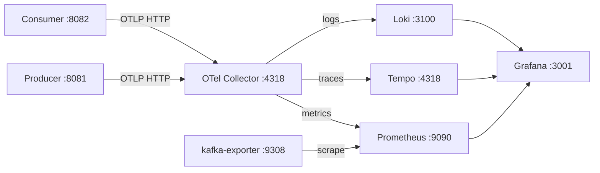

# Lesson 26 — Observability

> **Part 5 — Production** · 35 minutes

---

## What you'll learn

- How metrics, traces, and logs flow from a Spring Boot 4 app to Prometheus, Tempo, and Loki
- Why consumer lag is the only Kafka metric you must alert on
- How a trace follows a record across the producer/consumer boundary
- Four real misconfigurations in this repository's observability stack, and how each one failed silently

---

## Why this matters

Your pipeline is durable, resilient, tested, and typed. If it stopped working right now, you would find out from a user.

Kafka's failure modes are unusually quiet. A consumer that dies leaves lag climbing on a broker nobody is watching. A dead-letter topic absorbs records and reports zero lag on the source topic, because dead-lettering *is* a successful outcome. A partition blocked by a poison pill affects one third of throughput and nothing else.

None of these throw. None of them fail a health check. Observability is not a nice-to-have on a Kafka pipeline; it is the only way to know it is working.

This lesson also contains four bugs that were live in this repository. Every one of them broke a signal silently — the containers were running, no errors were logged, and no data arrived. That is the normal way observability fails.

---

## Before you start

[Lesson 25](25-schema-registry-and-avro.md). The full stack from Lesson 00 running.

---

## The concept

### Three signals, one protocol

**Metrics** are aggregates over time: lag, request rate, heap used. Cheap, always on, the basis of alerts.

**Traces** are the causal path of one operation across services: an HTTP request → a Kafka produce → a Kafka consume → a database write, as a single waterfall with timings.

**Logs** are discrete events with context. Correlated to traces by `traceId`, they answer "what exactly happened during that slow span."

**OTLP** (OpenTelemetry Protocol) carries all three. Spring Boot 4's `spring-boot-starter-opentelemetry` pushes them over OTLP HTTP to a collector, which fans them out to a backend per signal.



Two things arrive at Prometheus by different routes. The apps **push** metrics to the collector, which exposes them for Prometheus to **pull** on `:8889`. `kafka-exporter` is scraped directly — it reads consumer lag and topic offsets from the Kafka admin API and exposes them as Prometheus metrics. Your apps cannot report their own lag accurately; only the broker knows the log end offset.

### Consumer lag is the metric

If you alert on one thing, alert on this:

```promql
kafka_consumergroup_lag{consumergroup="wikimedia-consumer-group"}
```

Lag is `log end offset − committed offset`, per partition. It captures every failure mode in one number, regardless of cause:

- consumer crashed → lag climbs
- consumer slow → lag climbs
- database down → lag climbs (because you ack after the write — Lesson 18)
- partition blocked by a poison pill → lag climbs on *that partition only*

And it has a deadline attached. Once lag exceeds what retention will hold, records are deleted unread.

CPU tells you nothing. A consumer pinned at 100% CPU and keeping up is fine. A consumer at 2% CPU blocked on a slow database is an incident.

**Alert on the rate of change, not the absolute value.** Lag of 50,000 during a replay is expected. Lag growing steadily for ten minutes is not.

The one thing lag *cannot* see: a consumer group with no members. Zero lag and zero consumers looks identical to zero lag and a healthy consumer. Alert on both.

### Traces across the Kafka boundary

A trace normally follows a thread. Kafka breaks that — the producer's thread ends, and minutes later a different process picks the record up.

Spring Kafka bridges it by injecting the W3C `traceparent` header into the record. The consumer extracts it and continues the trace. This is why `KafkaConsumerConfig` sets:

```java
factory.getContainerProperties().setObservationEnabled(true);
```

Without that line the consumer's spans exist but are **not linked** to the producer's. You get two disconnected traces and no way to see that they're the same record.

Headers again — the same mechanism that carried the DLT diagnostics in Lesson 22.

---

## The four bugs

Everything above describes how it should work. Here is how this repository actually behaved, and why each failure was invisible.

### Bug 1 — The apps pushed to a hostname that doesn't exist

```yaml
management:
  otlp:
    metrics:
      export:
        url: http://otel-collector:4318/v1/metrics
```

`otel-collector` is a **Docker network hostname**. It resolves from inside the compose network. The README tells you to run the apps on the host with `./mvnw spring-boot:run`, where that name resolves to nothing.

Every metric, trace, and log export failed with an unresolvable host. The apps started fine and served traffic. The exporter retried in a background thread and logged at a level nobody had enabled.

**The fix** makes the default correct for the documented workflow, and still allows containerised runs:

```yaml
  otlp:
    metrics:
      export:
        url: ${OTEL_COLLECTOR_URL:http://localhost:4318}/v1/metrics
        enabled: true
  opentelemetry:
    tracing:
      export:
        otlp:
          endpoint: ${OTEL_COLLECTOR_URL:http://localhost:4318}/v1/traces
    logging:
      export:
        otlp:
          endpoint: ${OTEL_COLLECTOR_URL:http://localhost:4318}/v1/logs
  tracing:
    sampling:
      probability: 1.0
```

Run the app inside compose instead? Set `OTEL_COLLECTOR_URL=http://otel-collector:4318`.

> `sampling.probability: 1.0` traces every request. Correct for a demo, ruinous in production — sample at 1–10%, or use tail sampling in the collector to keep only the slow and failed traces.

### Bug 2 — The collector shipped traces into a 404

```yaml
exporters:
  otlphttp/tempo:
    endpoint: http://tempo:3200/otlp
```

Tempo listens on **3200 for its query API** and **4318 for OTLP ingest**. Posting traces to `3200/otlp/v1/traces` returns `404`.

You can verify it yourself:

```bash
curl -s -o /dev/null -w '%{http_code}\n' -X POST \
  -H 'Content-Type: application/json' -d '{"resourceSpans":[]}' \
  http://localhost:3200/otlp/v1/traces
```

`404`. The collector's `otlphttp` exporter appends `/v1/traces` to whatever endpoint you give it, so the endpoint must be the host and port only:

```yaml
exporters:
  otlphttp/tempo:
    endpoint: http://tempo:4318
    tls:
      insecure: true
```

The collector retried, logged at debug, and reported itself healthy the entire time.

### Bug 3 — Tempo never started, and `docker compose ps` hid it

`tempo-config.yml` set two top-level keys:

```yaml
ingester:
  max_block_duration: 5m
compactor:
  compaction:
    block_retention: 1h
```

Tempo 2.10 **removed both**, replacing them with `live_store`, `block_builder`, and `backend_scheduler`. Tempo exited immediately:

```
failed parsing config: field ingester not found in type app.Config
```

Two things made this invisible. `docker compose ps` lists running services, so an exited container simply wasn't in the output — you had to run `docker compose ps -a`. And the image was pinned to `grafana/tempo:latest`, so a working setup silently acquired a breaking change on some later `docker compose pull`.

**The fix** removes the dead keys and pins the tag:

```yaml
# docker-compose.yml
tempo:
  image: grafana/tempo:2.10.4
```

This is the concrete argument for the rule *never use `latest`*. The config was correct when it was written. The image moved underneath it.

> Removing the `compactor` block means Tempo's default block retention applies rather than 1 hour. Fine locally; set it explicitly under the new keys if it matters.

### Bug 4 — The log appender threw on a background thread

```
Exception in thread "BatchLogRecordProcessor_WorkerThread-1"
java.lang.NoClassDefFoundError: io/opentelemetry/api/incubator/common/ExtendedAttributes
```

`opentelemetry-logback-appender-1.0:2.29.0-alpha` needs `opentelemetry-api-incubator`, which is not a transitive dependency and is not in the OpenTelemetry BOM that Spring Boot manages (it lives in `opentelemetry-bom-alpha`).

The application started, served requests, and logged normally to the console. Only the *log export thread* died, so logs never reached Loki. Nothing in the request path noticed.

**The fix** — add the missing artifact, versioned against the OTel version Spring Boot already manages:

```xml
<dependency>
    <groupId>io.opentelemetry.instrumentation</groupId>
    <artifactId>opentelemetry-logback-appender-1.0</artifactId>
    <version>2.29.0-alpha</version>
</dependency>
<dependency>
    <groupId>io.opentelemetry</groupId>
    <artifactId>opentelemetry-api-incubator</artifactId>
    <version>${opentelemetry.version}-alpha</version>
</dependency>
```

`${opentelemetry.version}` is inherited from `spring-boot-dependencies` (1.62.0 in Boot 4.1.0), so the two stay aligned across upgrades.

**The pattern across all four:** every one of these failed on a background thread, in a retry loop, or in a container that had already exited. None of them affected a request. This is what observability failure looks like — the system that tells you things are broken is itself broken, and by construction it cannot tell you.

The only reliable check is to send a signal end-to-end and confirm it arrives.

---

## Hands-on

### 1. Verify each signal end-to-end

Don't trust "the container is up." Push a signal and read it back.

**Traces:**

```bash
TRACE_ID=$(openssl rand -hex 16)
NOW=$(( $(date +%s) * 1000000000 ))

curl -s -o /dev/null -w 'POST /v1/traces -> %{http_code}\n' \
  -X POST -H 'Content-Type: application/json' \
  -d "{\"resourceSpans\":[{\"resource\":{\"attributes\":[{\"key\":\"service.name\",\"value\":{\"stringValue\":\"probe\"}}]},\"scopeSpans\":[{\"spans\":[{\"traceId\":\"$TRACE_ID\",\"spanId\":\"$(openssl rand -hex 8)\",\"name\":\"probe-span\",\"kind\":1,\"startTimeUnixNano\":\"$NOW\",\"endTimeUnixNano\":\"$(( NOW + 1000000 ))\"}]}]}]}" \
  http://localhost:4318/v1/traces

sleep 5
curl -s "http://localhost:3200/api/traces/$TRACE_ID" | head -c 200
```

If the span comes back, the whole chain works: app → collector → Tempo.

**Logs:**

```bash
curl -s -o /dev/null -w 'POST /v1/logs -> %{http_code}\n' \
  -X POST -H 'Content-Type: application/json' \
  -d "{\"resourceLogs\":[{\"resource\":{\"attributes\":[{\"key\":\"service.name\",\"value\":{\"stringValue\":\"probe\"}}]},\"scopeLogs\":[{\"logRecords\":[{\"timeUnixNano\":\"$(( $(date +%s) * 1000000000 ))\",\"severityText\":\"ERROR\",\"body\":{\"stringValue\":\"probe-line\"}}]}]}]}" \
  http://localhost:4318/v1/logs

sleep 5
curl -sG 'http://localhost:3100/loki/api/v1/query_range' \
  --data-urlencode '{service_name="probe"}' | head -c 200
```

**Metrics:**

```bash
curl -s 'http://localhost:9090/api/v1/targets?state=active' \
  | jq -r '.data.activeTargets[] | "\(.labels.job) \(.health)"'
```

```
kafka-exporter up
otel-collector up
```

Both `up`, or your metrics never arrive.

### 2. Watch lag climb, then drain

The single most useful thing in this lesson.

With the producer streaming and the consumer running, open **http://localhost:9090/graph** and run:

```promql
kafka_consumergroup_lag{consumergroup="wikimedia-consumer-group"}
```

Near zero across three partitions. Now stop the consumer:

```bash
# Ctrl-C the consumer
```

Refresh. Lag climbs, per partition, linearly with the producer's rate. Nothing has failed. No exception exists anywhere. The only evidence that your pipeline is broken is this graph.

Restart the consumer and watch it drain back to zero. That drain rate — how fast a consumer catches up — is your real recovery-time budget after an outage.

Other queries worth knowing:

```promql
# Total lag across partitions — the number to alert on
sum(kafka_consumergroup_lag{consumergroup="wikimedia-consumer-group"})

# Is anyone consuming at all?
kafka_consumergroup_members{consumergroup="wikimedia-consumer-group"}

# Producer throughput proxy: the write head
kafka_topic_partition_current_offset{topic="wikimedia-stream"}

# Records landing on the dead-letter topic (should be flat at zero)
rate(kafka_topic_partition_current_offset{topic="wikimedia-stream.dlt"}[5m])

# JVM heap
jvm_memory_used_bytes{job="otel-collector", area="heap"}
```

That fourth query is the DLT alert Lesson 21 said you needed. A non-zero rate means records are being parked, and the source topic's lag will stay at zero while it happens.

### 3. Grafana

Open **http://localhost:3001** — port **3001**, not 3000. The container listens on 3000 internally; compose maps it to 3001 on the host to avoid a collision.

Log in `admin` / `admin`. Add three data sources under **Connections → Data Sources**, using the *internal* hostnames, because Grafana connects from inside the Docker network:

| Name | Type | URL |
|---|---|---|
| Prometheus | Prometheus | `http://prometheus:9090` |
| Tempo | Tempo | `http://tempo:3200` |
| Loki | Loki | `http://loki:3100` |

Tempo's data source URL *is* `3200` — that's the query API. Ingest is 4318. Getting these two backwards is Bug 2 in the other direction.

Import two dashboards (**Dashboards → Import**):

- **7589** — Kafka Exporter Overview: consumer lag, topic offsets, partition leaders
- **12900** — JVM (Micrometer): heap, GC, threads, HTTP rates

### 4. Follow one record through a trace

**Explore → Tempo**, search by service name `consumer`.

Open a trace and you should see the listener invocation as a span, with the JDBC insert nested beneath it. That nesting is `setObservationEnabled(true)` doing its job.

Now remove that line from `KafkaConsumerConfig`, restart, and look again. The database span is still there. The Kafka consume span isn't — and nothing links the consumer's work to the producer's send.

Restore it.

### 5. Correlate a log to a trace

**Explore → Loki**:

```logql
{service_name="consumer"}                          # all consumer logs
{service_name=~"producer|consumer"} |= "ERROR"     # errors across both
{service_name="consumer"} |= "DLT"                 # dead-letter failures
```

Each line carries an OTel `traceId`. In the Tempo data source settings, enable **Trace to logs** and point it at Loki. Now clicking a span jumps to the logs emitted during it.

That is the payoff of pushing all three signals through one collector: a slow trace, and the exact log lines that fired inside the slow span.

---

## Try it yourself

1. Stop the consumer and let lag reach 10,000. Write the PromQL alert you'd page on. Should it fire on `sum(lag) > 10000`, or on `deriv(sum(lag)[5m]) > 0` sustained? What does each miss?

2. Set `sampling.probability: 0.1`. Produce 100 records. How many traces appear in Tempo? Now reason about what you lose when the one failing request in 1,000 isn't sampled.

3. Kill the consumer group entirely (no members). What does `kafka_consumergroup_lag` report? Write the second alert that catches this, and explain why lag alone cannot.

4. Break Bug 2 again — point the collector at `http://tempo:3200`. Does the collector log an error? Does `docker compose ps` show anything wrong? How long would it take you to notice in production?

5. Produce a malformed record so it lands on the DLT. Does source-topic lag move? Does any alert fire? Write the one that would.

---

## Common mistakes

**Using a Docker hostname in an app that runs on the host.**
`otel-collector:4318` resolves inside the network only. Bug 1.

**Sending OTLP to Tempo's query port.**
3200 is queries, 4318 is ingest. Bug 2.

**Pinning images to `latest`.**
Your config silently stops matching the image. Bug 3.

**Trusting `docker compose ps`.**
It omits exited containers. Use `-a`.

**Assuming a started app means working telemetry.**
All four bugs left the app healthy and serving traffic. Send a probe signal and read it back.

**Alerting on absolute lag.**
A replay legitimately produces huge lag. Alert on sustained growth, plus member count.

**Alerting only on source-topic lag.**
Dead-lettered records reduce lag. A pipeline can be discarding every record with lag pinned at zero.

**`sampling.probability: 1.0` in production.**
Full-fidelity tracing at scale costs more than the service.

**Forgetting `setObservationEnabled(true)`.**
Consumer spans exist but never link to the producer's trace.

---

## Check your understanding

**1. Your consumer has been dead for an hour. CPU is 0%, no exceptions, health endpoint returns UP. Which signal tells you, and why do the others fail?**

<details>
<summary>Reveal answer</summary>

**Consumer lag**, climbing linearly for an hour.

The others fail because nothing is wrong *inside the process*. CPU is 0% because it isn't doing anything — which is indistinguishable from an idle, healthy consumer. There are no exceptions because a consumer that crashed already logged its last one, and a consumer that was evicted from the group throws nothing. The health endpoint reports on the Spring context, which is up.

Lag is measured by `kafka-exporter` against the **broker**, not against your application. It compares the topic's log end offset with the group's committed offset. Neither number comes from your process, which is exactly why it survives your process being wrong.

The corollary: if your consumer's health check is the only thing you alert on, a consumer evicted from its group by `max.poll.interval.ms` (Lesson 19) reports perfect health while consuming nothing.

</details>

**2. All four bugs left the applications healthy and serving traffic. What do they have in common structurally?**

<details>
<summary>Reveal answer</summary>

Every one failed **off the request path**, in a place with no caller to propagate an error to.

- Bug 1: the OTLP exporter runs on a background thread and retries. An unresolvable hostname is its problem, not the HTTP handler's.
- Bug 2: the collector retried the export, logged at debug, and continued reporting healthy.
- Bug 3: Tempo exited at startup — before it could ever be asked for anything — and `docker compose ps` doesn't list exited containers.
- Bug 4: `BatchLogRecordProcessor_WorkerThread-1` died. A dead daemon thread doesn't fail a health check.

Telemetry is by design asynchronous, best-effort, and fire-and-forget, so that it never slows or breaks the application. The price is that when it breaks, the application cannot tell you — and neither can the telemetry, because it's the thing that's broken.

The only reliable verification is end-to-end: emit a known signal, then query the backend for it. That's what the probes in step 1 do, and it's why "the container is up" is not evidence.

</details>

**3. Consumer lag is flat at zero. Records are being dead-lettered at 50/second. Is any alert firing?**

<details>
<summary>Reveal answer</summary>

No — and lag will *never* fire for this.

Dead-lettering a record is, from the source topic's perspective, a completed unit of work. The error handler exhausts retries, the recoverer publishes to `wikimedia-stream.dlt`, and the offset is committed. The consumer has moved past the record. Lag drops. Everything looks perfect.

Meanwhile 50 events per second are going into a topic nobody reads, with 30 days before retention deletes them.

You need a separate alert on the DLT itself — its produce rate, or a counter incremented in `DeadLetterPublishingRecoverer`, or a Micrometer counter in the DLT consumer:

```promql
rate(kafka_topic_partition_current_offset{topic="wikimedia-stream.dlt"}[5m]) > 0
```

This is Lesson 21's final quiz answer, made concrete. A DLT converts a loud failure into a silent one, and it's your job to make it loud again.

</details>

**4. `docker compose ps` shows 10 healthy services. `docker compose ps -a` shows 11. What's the difference, and why did it hide Bug 3 for so long?**

<details>
<summary>Reveal answer</summary>

`ps` lists running containers. `ps -a` includes stopped and exited ones.

Tempo crashed on startup — a config parse error, immediate exit code 1. It was never running, so it never appeared in `docker compose ps`. The output showed ten services, all healthy, and nothing suggested an eleventh was expected.

The failure mode is worse than a service being red: the service was *absent*. Nothing to be red. You'd only notice by counting, or by asking Grafana for a trace and getting nothing back — and "no traces" looks a lot like "no traffic."

`docker compose logs tempo` had the answer in plain text the whole time. Nobody ran it, because nothing indicated they should.

</details>

**5. `sampling.probability: 1.0` traces every request. Why is that wrong in production, and what breaks if you naively set it to `0.01`?**

<details>
<summary>Reveal answer</summary>

At 1.0, every request produces spans that are serialised, exported, ingested, indexed, and stored. On a service handling thousands of requests per second, the tracing pipeline can cost more than the service it observes, and Tempo's storage grows without bound.

Naively sampling at 1% breaks the thing you actually wanted traces for: **the rare failure**. Head-based sampling decides at the *start* of a trace, before anything has gone wrong. So the one request in 1,000 that took 30 seconds and threw has a 99% chance of not being recorded. You've kept a representative sample of the boring requests and thrown away the interesting ones.

The answer is **tail sampling** in the collector: buffer spans until the trace completes, then keep it if it errored, or exceeded a latency threshold, or — for baseline visibility — with some small probability. You keep every failure and 1% of successes.

There's also a subtlety with Kafka: sampling decisions propagate via the `traceparent` header, so an unsampled producer trace means the consumer's continuation is unsampled too. The decision made at the producer governs the whole pipeline.

</details>

---

## Recap

Three signals over one protocol: metrics to Prometheus, traces to Tempo, logs to Loki, all through the OTel Collector. Consumer lag is the alert that catches every failure mode, because it's measured at the broker rather than in your process — but it goes blind to dead-lettered records and to a group with no members, so alert on those too.

And four real bugs, each invisible: a Docker hostname unreachable from the host, traces posted to a query port, a container that exited before it could be asked anything, and a log-export thread that died alone. All four left the application healthy. The only test that would have caught any of them is sending a signal and reading it back.

**Next:** [Lesson 27 — Ops toolbox & production checklist →](27-ops-and-production-checklist.md)
