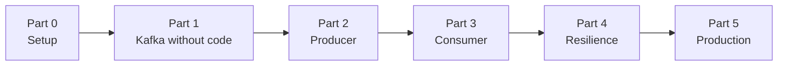
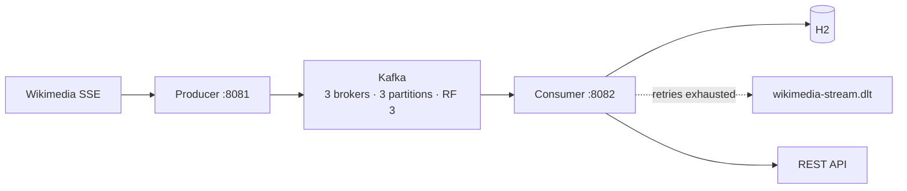

# Apache Kafka with Spring Boot — The Course

A 28-lesson path from "I have never touched Kafka" to a production-shaped streaming pipeline: live Wikipedia edits flowing through a 3-broker cluster into a Spring Boot service, with retries, a dead-letter topic, and full observability.

**You will not write a line of Java until Lesson 08.**

That is deliberate. Most Kafka tutorials hand you a `@KafkaListener` on page one, and you end up with a working demo and no mental model. Here, the first seven lessons happen entirely in Kafka UI and the command line. You will create topics, publish messages by hand, watch a consumer group rebalance, and kill a broker to see replication do its job — before any Spring annotation appears.

Once you can *see* what Kafka does, the code becomes obvious.

---

## How to use this course

Each lesson is self-contained and follows the same shape:

- **What you'll learn** — the three or four things you'll walk away with
- **Why this matters** — the problem the concept solves, *before* the mechanism
- **The concept** — explanation and diagrams
- **Hands-on** — clicks or code you perform yourself
- **Try it yourself** — an exercise with no answer given
- **Common mistakes** — the ones that actually bite people
- **Check your understanding** — a short quiz with reveal-on-click answers

Work through them in order. Lessons build on each other, and the quizzes assume you did the hands-on parts.

### Prerequisites

You should be comfortable with Java and basic Spring Boot (`@Service`, `@RestController`, constructor injection). You do **not** need any prior Kafka, Docker Compose, or observability experience.

Software you need is covered in [Lesson 00](00-prerequisites-and-cluster.md).

---

## The path

---

## Part 0 — Setup

| # | Lesson | Time |
|---|---|---|
| 00 | [Prerequisites & starting the cluster](00-prerequisites-and-cluster.md) | 15 min |

## Part 1 — Kafka Without Code

*Seven lessons, zero Java. Kafka UI and the CLI only.*

| # | Lesson | Time |
|---|---|---|
| 01 | [What Kafka actually is](01-what-kafka-actually-is.md) — a log, not a queue | 15 min |
| 02 | [A tour of Kafka UI](02-tour-of-kafka-ui.md) | 15 min |
| 03 | [Create a topic, produce and consume by hand](03-first-topic-by-hand.md) | 20 min |
| 04 | [Partitions & keys](04-partitions-and-keys.md) — watch distribution happen | 25 min |
| 05 | [Offsets & consumer groups](05-offsets-and-consumer-groups.md) | 25 min |
| 06 | [Replication & ISR](06-replication-and-isr.md) — kill a broker on purpose | 25 min |
| 07 | [KRaft](07-kraft-no-zookeeper.md) — Kafka without ZooKeeper | 15 min |

## Part 2 — The Producer

| # | Lesson | Time |
|---|---|---|
| 08 | [Your first `KafkaTemplate.send()`](08-first-kafkatemplate-send.md) | 25 min |
| 09 | [Topics as code](09-topics-as-code.md) — `TopicBuilder` | 20 min |
| 10 | [`acks` & the idempotent producer](10-acks-and-idempotence.md) | 25 min |
| 11 | [Keys & partition affinity in code](11-keys-and-partition-affinity.md) | 20 min |
| 12 | [Batching, linger & compression](12-batching-linger-compression.md) | 25 min |
| 13 | [Send callbacks & error handling](13-send-callbacks-and-errors.md) | 20 min |
| 14 | [Real data — the Wikimedia SSE stream](14-wikimedia-sse-stream.md) | 30 min |

## Part 3 — The Consumer

| # | Lesson | Time |
|---|---|---|
| 15 | [Your first `@KafkaListener`](15-first-kafkalistener.md) | 25 min |
| 16 | [DTO records & deserialization](16-dtos-and-deserialization.md) | 20 min |
| 17 | [Manual acknowledgment](17-manual-acknowledgment.md) — why auto-commit loses data | 30 min |
| 18 | [Persisting with JPA](18-persisting-with-jpa.md) — ack *after* the write | 25 min |
| 19 | [Concurrency & rebalancing](19-concurrency-and-rebalancing.md) | 25 min |

## Part 4 — Resilience

| # | Lesson | Time |
|---|---|---|
| 20 | [`DefaultErrorHandler` & retries](20-error-handler-and-retries.md) | 30 min |
| 21 | [Dead-letter topics](21-dead-letter-topics.md) | 30 min |
| 22 | [DLT headers & replay](22-dlt-headers-and-replay.md) | 30 min |

## Part 5 — Production

| # | Lesson | Time |
|---|---|---|
| 23 | [A REST API over consumed events](23-rest-api-over-events.md) | 25 min |
| 24 | [Testing Kafka with Testcontainers](24-testing-with-testcontainers.md) | 35 min |
| 25 | [Schema Registry & Avro](25-schema-registry-and-avro.md) — hands-on migration | 40 min |
| 26 | [Observability](26-observability.md) — OpenTelemetry, Prometheus, Grafana | 35 min |
| 27 | [Ops toolbox & production checklist](27-ops-and-production-checklist.md) | 25 min |

---

## What you'll have built

A real pipeline: live edits from Wikipedia, streamed through a replicated Kafka cluster, persisted, queryable over HTTP, with failed records diverted to a dead-letter topic instead of being lost.

---

## Falling behind, or jumping in?

The finished, reference implementation is the repository root itself — [`producer/`](../producer) and [`consumer/`](../consumer). The [main README](../README.md) covers the architecture, the quick start, and the service topology. Use it to run the thing; use these lessons to understand it.

Every lesson contains the complete code you need, so you can start from an empty Spring Initializr project at Lesson 08 and type your way to the finished pipeline. If you get stuck, diff your file against the one in the repository root.

---

Ready? **[Start with Lesson 00 →](00-prerequisites-and-cluster.md)**
