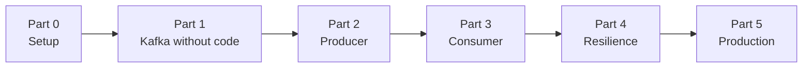
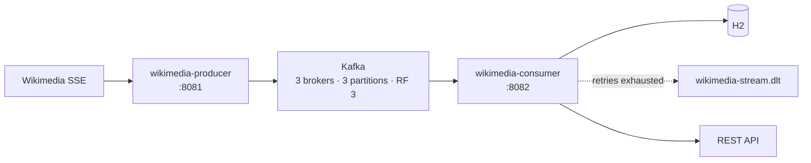

# Apache Kafka with Spring Boot: The Course

A 28-lesson path from "I have never touched Kafka" to a production-shaped streaming pipeline: live Wikipedia edits flowing through a replicated Kafka cluster into a Spring Boot service, with retries, a dead-letter topic, a schema registry and full observability.

**You will not write a line of Java until Lesson 08.**

That is deliberate. Most Kafka tutorials hand you a `@KafkaListener` on page one, and you end up with a working demo and no mental model. Here the first seven lessons happen entirely in Kafka UI and the command line. You will create topics, publish records by hand, watch a consumer group rebalance and kill a broker to see replication do its job, all before any Spring annotation appears.

Once you can see what Kafka does, the code becomes obvious.

---

## How to use this course

Everything is built from nothing. You write the Docker Compose file, both Spring Boot projects and every configuration file yourself, in a directory of your own:

```
kafka-course/
├── docker-compose.yml
├── prometheus.yml
├── tempo-config.yml
├── wikimedia-producer/
└── wikimedia-consumer/
```

The cluster grows with your understanding. Lesson 00 starts a single broker, because partitions, offsets, consumer groups and replay all work on one. Lesson 06 adds two more, in the lesson where replication is the subject. Lesson 25 adds a schema registry and Lesson 26 adds the observability stack.

Each lesson follows the same shape:

- **What you'll learn**, the three or four things you walk away with
- **Why this matters**, the problem the concept solves, before the mechanism
- **Before you start**, the previous lesson and a command to confirm your state
- **The concept**, explanation and diagrams
- **Hands-on**, clicks, commands and code you perform yourself
- **Try it yourself**, exercises with no answers given
- **Common mistakes**, the ones that actually bite people
- **Check your understanding**, a short quiz with reveal-on-click answers
- **Recap**

Work through them in order. Lessons build on each other, and the quizzes assume you did the hands-on parts.

### Prerequisites

You should be comfortable with Java and basic Spring Boot: `@Service`, `@RestController`, constructor injection. You need no prior Kafka, Docker Compose or observability experience.

Software requirements are covered in [Lesson 00](part-0-setup/00-prerequisites-and-cluster.md). Java and Maven are not needed until Lesson 08.

---

## The path



---

## Part 0: Setup

| # | Lesson |
|---|---|
| 00 | [Prerequisites and your first broker](part-0-setup/00-prerequisites-and-cluster.md) |

## Part 1: Kafka Without Code

*Seven lessons, zero Java. Kafka UI and the CLI only.*

| # | Lesson |
|---|---|
| 01 | [What Kafka actually is](part-1-kafka-without-code/01-what-kafka-actually-is.md), a log rather than a queue |
| 02 | [A tour of Kafka UI](part-1-kafka-without-code/02-tour-of-kafka-ui.md) |
| 03 | [Create a topic, produce and consume by hand](part-1-kafka-without-code/03-first-topic-by-hand.md) |
| 04 | [Partitions and keys](part-1-kafka-without-code/04-partitions-and-keys.md) |
| 05 | [Offsets and consumer groups](part-1-kafka-without-code/05-offsets-and-consumer-groups.md) |
| 06 | [Replication and ISR](part-1-kafka-without-code/06-replication-and-isr.md), grow the cluster and kill a broker |
| 07 | [KRaft](part-1-kafka-without-code/07-kraft-no-zookeeper.md), Kafka without ZooKeeper |

## Part 2: The Producer

| # | Lesson |
|---|---|
| 08 | [Your first `KafkaTemplate.send()`](part-2-producer/08-first-kafkatemplate-send.md) |
| 09 | [Topics as code](part-2-producer/09-topics-as-code.md) |
| 10 | [`acks` and the idempotent producer](part-2-producer/10-acks-and-idempotence.md) |
| 11 | [Keys and partition affinity in code](part-2-producer/11-keys-and-partition-affinity.md) |
| 12 | [Batching, linger and compression](part-2-producer/12-batching-linger-compression.md) |
| 13 | [Send callbacks and error handling](part-2-producer/13-send-callbacks-and-errors.md) |
| 14 | [Real data, the Wikimedia SSE stream](part-2-producer/14-wikimedia-sse-stream.md) |

## Part 3: The Consumer

| # | Lesson |
|---|---|
| 15 | [Your first `@KafkaListener`](part-3-consumer/15-first-kafkalistener.md) |
| 16 | [DTO records and deserialization](part-3-consumer/16-dtos-and-deserialization.md) |
| 17 | [Manual acknowledgment](part-3-consumer/17-manual-acknowledgment.md) |
| 18 | [Persisting with JPA](part-3-consumer/18-persisting-with-jpa.md) |
| 19 | [Concurrency and rebalancing](part-3-consumer/19-concurrency-and-rebalancing.md) |

## Part 4: Resilience

| # | Lesson |
|---|---|
| 20 | [`DefaultErrorHandler` and retries](part-4-resilience/20-error-handler-and-retries.md) |
| 21 | [Dead-letter topics](part-4-resilience/21-dead-letter-topics.md) |
| 22 | [DLT headers and replay](part-4-resilience/22-dlt-headers-and-replay.md) |

## Part 5: Production

| # | Lesson |
|---|---|
| 23 | [A REST API over consumed events](part-5-production/23-rest-api-over-events.md) |
| 24 | [Testing Kafka with Testcontainers](part-5-production/24-testing-with-testcontainers.md) |
| 25 | [Schema Registry and Avro](part-5-production/25-schema-registry-and-avro.md) |
| 26 | [Observability](part-5-production/26-observability.md) |
| 27 | [Ops toolbox and production checklist](part-5-production/27-ops-and-production-checklist.md) |

---

## What you'll have built



Live edits from Wikipedia, keyed so that edits to one page stay ordered, streamed through a replicated cluster, persisted idempotently, queryable over HTTP, with failed records diverted to a dead-letter topic instead of being lost, and all three observability signals reporting.

---

## Versions

Everything is pinned, and the course explains why each version matters where it does.

| | Version |
|---|---|
| Spring Boot | 4.1.0 |
| Java | 25 |
| Kafka | 4.x, via `confluentinc/cp-kafka:8.3.1` |
| Kafka UI | `kafbat/kafka-ui:v1.5.0` |
| Schema Registry | `confluentinc/cp-schema-registry:8.3.1` |
| Testcontainers | managed by Boot's BOM, currently 2.0.5 |
| Tempo · Loki · Prometheus · Grafana | 3.0.3 · 3.7.6 · v3.13.2 · 13.1.3 |
| Avro · Confluent serializers | 1.12.1 · 8.3.1 |

Two notes on those choices. Kafka UI is the maintained community fork, since the original Provectus project was paused in 2023. And Confluent's broker image is used rather than `apache/kafka` because it puts the CLI scripts on the container's `PATH`, which most of Part 1 depends on.

---

## Check your work

Every lesson contains the complete code and configuration you need, so there is nothing to diff against and nothing to download. Each one ends with a verification step: a command to run, an output to compare, or a query to make against the broker.

Where a lesson shows command output, that output came from running the command. Where a claim is version-specific, the version is named.

If something does not match what you see, the CLI is the source of truth. That habit is the point of Part 1, and Lesson 27 collects the commands worth knowing by heart.

---

Ready? **[Start with Lesson 00](part-0-setup/00-prerequisites-and-cluster.md)**
