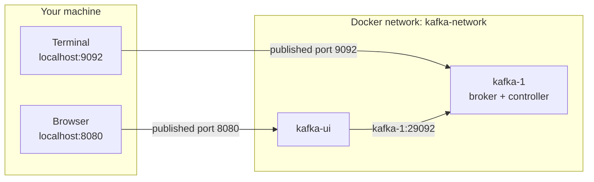

# Lesson 00: Prerequisites and Your First Broker

> **Part 0: Setup**

---

## What you'll learn

- What software you need, and how to confirm you have it
- How to start a Kafka broker with Docker Compose, and what every line of that file does
- Why "started" and "ready" are different claims
- How to verify the broker formed a working KRaft cluster before you blame your code

---

## Why this matters

Kafka is a distributed system, but you do not need a distributed system to learn one. A single broker teaches topics, partitions, offsets, consumer groups, lag and replay: everything in the next five lessons. Replication is the one idea a single broker cannot demonstrate, and in Lesson 06 you will add two more brokers specifically to see it fail and recover.

Starting small has a practical payoff. Two containers instead of eleven, roughly 1 GB of memory instead of 4, and a Compose file short enough to read from top to bottom and understand.

There is also a diagnostic reason to spend time here. Nearly every "Kafka isn't working" problem a beginner hits is one of two things: the broker was not ready yet, or the client connected to the wrong address. Both are addressed below, and both come back in later lessons.

---

## Before you start

Nothing. This is the first lesson.

---

## The concept

### Two containers

You will run a Kafka broker and a web UI for inspecting it.



Note the two different addresses reaching the same broker. Your terminal talks to `localhost:9092`, because Compose publishes that port to your machine. Kafka UI talks to `kafka-1:29092`, because it sits inside the Docker network where `kafka-1` is a resolvable hostname and `localhost` would mean the UI's own container. Getting these two mixed up is the single most common setup failure in Kafka, so it is worth naming now: the broker advertises two addresses, and which one is correct depends entirely on where the client is running.

### One node, two roles

Kafka needs two things: brokers to store records, and a controller to hold cluster metadata such as which topics exist and which broker leads which partition. Modern Kafka keeps that metadata in its own internal Raft log, a design called KRaft, so no separate ZooKeeper cluster is involved.

A node can be a broker, a controller, or both. Yours will be both, which is what `KAFKA_PROCESS_ROLES: 'broker,controller'` means. That is unusual in production and completely normal for local work. Lesson 07 comes back to KRaft properly, once you have something running to look at.

### Three listeners

A broker can listen on several ports at once, each with a name and a job:

| Listener | Port | Used by |
|---|---|---|
| `PLAINTEXT_HOST` | 9092 | Clients on your machine, through the published port |
| `PLAINTEXT` | 29092 | Other brokers, and containers on the Docker network |
| `CONTROLLER` | 29093 | Raft metadata traffic between controllers |

With one broker, the `PLAINTEXT` listener has almost nothing to do. It matters in Lesson 06, when three brokers start replicating to each other over it.

`PLAINTEXT` here is a Kafka protocol name meaning unencrypted and unauthenticated. Every byte, including any data you produce, crosses the network in the clear. That is acceptable for a laptop and unacceptable anywhere else, which Lesson 27 returns to.

---

## Hands-on

### 1. Check your software

| Tool | Minimum | Check with |
|---|---|---|
| Docker | 24 | `docker --version` |
| Docker Compose | v2 | `docker compose version` |

Run both now. If `docker compose version` works but `docker-compose version` does not, you have v2, which is what you want.

Java and Maven are not needed until Lesson 08, where the first code appears. When you get there you will want:

| Tool | Minimum | Check with |
|---|---|---|
| Java | 25 | `java -version` |
| Maven | 3.9 | `mvn -version` |

Spring Boot 4 requires Java 17 as an absolute minimum, but this course targets Java 25, the current long-term-support release. If `java -version` reports anything below 25 when you reach Part 2, upgrade then.

### 2. Create the course directory

Everything you build lives in one directory. Create it now:

```bash
mkdir kafka-course
cd kafka-course
```

By the end of the course it will look like this:

```
kafka-course/
├── docker-compose.yml
├── wikimedia-producer/
└── wikimedia-consumer/
```

The two Spring Boot projects arrive in Lesson 08 and Lesson 15. For now you need only the Compose file.

### 3. Write `docker-compose.yml`

Create `docker-compose.yml` in `kafka-course/`:

```yaml
name: kafka-course

services:

  kafka-1:
    image: confluentinc/cp-kafka:8.3.1
    hostname: kafka-1
    container_name: kafka-1
    ports:
      - "9092:9092"
    environment:
      # KRaft identity. One node, acting as both broker and controller.
      KAFKA_NODE_ID: 1
      KAFKA_PROCESS_ROLES: 'broker,controller'
      CLUSTER_ID: 'MkU3OEVBNTcwNTJENDM2Qg'
      KAFKA_CONTROLLER_QUORUM_VOTERS: '1@kafka-1:29093'

      # Three listeners, three jobs:
      #   PLAINTEXT_HOST  clients on your machine, via the published port 9092
      #   PLAINTEXT       broker-to-broker traffic inside the Docker network
      #   CONTROLLER      Raft metadata traffic between controllers
      KAFKA_LISTENER_SECURITY_PROTOCOL_MAP: 'CONTROLLER:PLAINTEXT,PLAINTEXT:PLAINTEXT,PLAINTEXT_HOST:PLAINTEXT'
      KAFKA_LISTENERS: 'PLAINTEXT://0.0.0.0:29092,CONTROLLER://0.0.0.0:29093,PLAINTEXT_HOST://0.0.0.0:9092'
      KAFKA_ADVERTISED_LISTENERS: 'PLAINTEXT://kafka-1:29092,PLAINTEXT_HOST://localhost:9092'
      KAFKA_INTER_BROKER_LISTENER_NAME: 'PLAINTEXT'
      KAFKA_CONTROLLER_LISTENER_NAMES: 'CONTROLLER'

      # One broker can hold only one copy of anything, so every replication
      # factor here is 1. Lesson 06 raises them.
      KAFKA_OFFSETS_TOPIC_REPLICATION_FACTOR: 1
      KAFKA_TRANSACTION_STATE_LOG_REPLICATION_FACTOR: 1
      KAFKA_TRANSACTION_STATE_LOG_MIN_ISR: 1
      KAFKA_DEFAULT_REPLICATION_FACTOR: 1
      KAFKA_NUM_PARTITIONS: 3

      # Keep records for 7 days.
      KAFKA_LOG_RETENTION_HOURS: 168

      # No artificial delay before a consumer group rebalances. Convenient
      # locally, too aggressive for production.
      KAFKA_GROUP_INITIAL_REBALANCE_DELAY_MS: 0
    volumes:
      - kafka-1-data:/var/lib/kafka/data
    networks:
      - kafka-network
    healthcheck:
      test: ["CMD", "kafka-broker-api-versions", "--bootstrap-server", "localhost:9092"]
      interval: 10s
      timeout: 10s
      retries: 10
      start_period: 20s

  kafka-ui:
    image: kafbat/kafka-ui:v1.5.0
    hostname: kafka-ui
    container_name: kafka-ui
    ports:
      - "8080:8080"
    environment:
      KAFKA_CLUSTERS_0_NAME: local-kraft-cluster
      KAFKA_CLUSTERS_0_BOOTSTRAPSERVERS: 'kafka-1:29092'
      DYNAMIC_CONFIG_ENABLED: 'true'
    networks:
      - kafka-network
    depends_on:
      kafka-1:
        condition: service_healthy

networks:
  kafka-network:
    driver: bridge

volumes:
  kafka-1-data:
```

Five things in that file are worth understanding rather than copying.

**`CLUSTER_ID`** is an identifier the Raft log is formatted with on first start. Any valid value works; this one is a base64-encoded UUID. It must stay the same for the life of the volume, because the broker refuses to start against a log formatted under a different cluster ID.

**`KAFKA_CONTROLLER_QUORUM_VOTERS`** lists every node allowed to vote on metadata, in the form `nodeId@host:port`. Right now that is one entry. In Lesson 06 it becomes three, and you will see why the list cannot simply be edited on a running cluster.

**Every replication factor is 1.** A replica is a copy on a *different* broker, so with one broker no topic can have more than one. Kafka's own internal topics obey the same rule, which is why the offsets and transaction-log factors are set explicitly. Leave the defaults at 3 and the broker starts, then fails the moment a consumer group tries to commit an offset.

**`KAFKA_NUM_PARTITIONS: 3`** means topics created without an explicit partition count get three. Partitions are not replicas: three partitions on one broker is perfectly valid, and it is what makes Lessons 04 and 05 work on a single node.

**The `healthcheck` is not decoration.** `kafka-ui` depends on it through `condition: service_healthy`, so the UI will not start until the broker actually answers an API request. Step 5 explains why that distinction matters.

Two smaller details you will need later. `name: kafka-course` at the top sets the Compose project name, which is what prefixes the resources Compose creates: the network becomes `kafka-course_kafka-network` and the volume `kafka-course_kafka-1-data`. And `confluentinc/cp-kafka:8.3.1` is Confluent's distribution of **Kafka 4.x**; it is used here rather than the `apache/kafka` image because it puts the `kafka-topics`, `kafka-console-producer` and related scripts on the container's `PATH`, which every command in Part 1 relies on.

### 4. Start it

```bash
docker compose up -d
```

The first run downloads roughly 1 GB of images, so expect a few minutes. After that, startup takes seconds.

### 5. Wait for healthy, not started

```bash
docker compose ps
```

Read the `STATUS` column, not the presence of a row. A container reporting `Up 8 seconds (health: starting)` is running but not accepting connections: `Up` describes the container, `(healthy)` describes the Kafka process inside it. The healthcheck runs `kafka-broker-api-versions` against the broker, and until that succeeds your clients will be refused.

Wait until you see this:

```
NAME       IMAGE                         COMMAND                  SERVICE    CREATED          STATUS                    PORTS
kafka-1    confluentinc/cp-kafka:8.3.1   "/etc/confluent/dock…"   kafka-1    27 seconds ago   Up 27 seconds (healthy)   0.0.0.0:9092->9092/tcp
kafka-ui   kafbat/kafka-ui:v1.5.0        "/bin/sh -c 'java --…"   kafka-ui   27 seconds ago   Up 9 seconds              0.0.0.0:8080->8080/tcp
```

Only `kafka-1` reports `(healthy)`, because it is the only service with a `healthcheck`. Nothing depends on the UI being ready, so it does not need one. `kafka-ui` starting nine seconds after the broker is the `condition: service_healthy` working: Compose held it back until the broker passed its check.

That takes about 20 to 40 seconds. If the broker is still `starting` after 90 seconds, read its logs:

```bash
docker compose logs kafka-1 | tail -30
```

### 6. Verify the cluster formed

A healthy container proves the process is up. It does not prove the metadata log is working. Ask the controller directly:

```bash
docker exec kafka-1 kafka-metadata-quorum \
  --bootstrap-server localhost:9092 \
  describe --status
```

```
ClusterId:              MkU3OEVBNTcwNTJENDM2Qg
LeaderId:               1
LeaderEpoch:            1
HighWatermark:          61
MaxFollowerLag:         0
MaxFollowerLagTimeMs:   0
CurrentVoters:          [{"id": 1, "endpoints": ["CONTROLLER://kafka-1:29093"]}]
CurrentObservers:       []
```

Two fields matter. `LeaderId: 1` means a controller won the election, which with one voter is a formality but still has to happen. `CurrentVoters` lists the nodes eligible to vote, and it should contain exactly the one node you configured.

If `LeaderId` is `-1`, no controller was elected. With a single node that almost always means the `CONTROLLER` listener is misconfigured; with three nodes, in Lesson 06, it usually means they cannot reach each other.

`HighWatermark` is the offset of the metadata log itself, so your number will differ from the one above and will keep climbing while the cluster runs. It is the first hint that Kafka stores its own configuration the same way it stores your data: as an append-only log. Lesson 01 opens that log and reads it.

### 7. Open Kafka UI

Browse to **http://localhost:8080**.

You should see one cluster, `local-kraft-cluster`, marked **Online** with a broker count of 1 and a metadata version such as `4.2-IV1`. If the page loads but reports the cluster offline, the UI connected before the broker finished starting; wait 20 seconds and refresh.

Lesson 02 is a full tour of this interface. For now, its existence is the confirmation you need.

### 8. Stop without losing your data

Three commands, and the difference between them matters more than it looks.

Stop the containers, keep everything:

```bash
docker compose stop
```

Start them again:

```bash
docker compose start
```

Destroy the containers and the data:

```bash
docker compose down -v
```

The `-v` deletes the named volume `kafka-1-data`, where the broker keeps every topic, record and committed offset. Plain `docker compose down` removes the containers and leaves the volume, so your topics survive.

Use `stop` and `start` between lessons. Use `down -v` only when a lesson tells you to, because a lesson that expects the topics you created earlier will not match what you see if you have wiped them.

---

## Try it yourself

1. Run `docker compose down` without `-v`, then `docker compose up -d` again. Once healthy, re-run the quorum check. `HighWatermark` is higher than before, and `LeaderEpoch` has also increased. Explain both, and say which of the two would still change if you had used `down -v`.

2. Stop the stack, change `CLUSTER_ID` to any other value, and start it again. Read the error in `docker compose logs kafka-1`. It names the exact file it disagreed with. Find that file's path, and explain why the cluster's identity lives there rather than in the Compose file.

3. Two commands that both look correct and both fail. Run each and read the error:

   ```bash
   docker run --rm confluentinc/cp-kafka:8.3.1 \
     kafka-broker-api-versions --bootstrap-server kafka-1:29092

   docker run --rm --network kafka-course_kafka-network confluentinc/cp-kafka:8.3.1 \
     kafka-broker-api-versions --bootstrap-server localhost:9092
   ```

   The first fails with `DNS resolution failed for kafka-1`, the second with `Request METADATA failed on brokers [localhost:9092]`. Both are the same mistake seen from opposite sides. Name it, then work out which address each container should have used.

---

## Common mistakes

**Assuming `Up` means ready.**
`docker compose ps` shows `Up 8 seconds (health: starting)` for a broker that will refuse every connection. Check the status before blaming a client.

**Using `docker compose down -v` between lessons.**
It deletes every topic, record and offset you created. Later lessons build on earlier ones, and the output will stop matching the text. Use `stop` and `start`.

**Editing `CLUSTER_ID` on an existing volume.**
The broker refuses to start against a log formatted with a different cluster ID. If you must change it, delete the volume with `docker compose down -v` first.

**Leaving the internal replication factors at 3.**
The broker starts fine, then the first consumer group fails to commit because `__consumer_offsets` cannot be created with three replicas on one broker. The failure appears far from its cause.

**Running out of memory.**
If the broker restarts in a loop, Docker may not have enough memory allocated. On Docker Desktop, raise the limit under Settings, then Resources.

---

## Check your understanding

**1. `docker compose ps` shows `kafka-1` as `Up 8 seconds (health: starting)`. Your application fails to connect. Is that a bug in your application?**

<details>
<summary>Reveal answer</summary>

No. The container has started but its healthcheck has not passed, which means Kafka has not finished initialising and is not accepting client connections. `Up` is a claim about the container; `(healthy)` is a claim about the process inside it.

This is exactly why `kafka-ui` uses `depends_on` with `condition: service_healthy` rather than a bare `depends_on`. A bare `depends_on` waits for the container to start, which is the wrong signal.

</details>

**2. The broker advertises `localhost:9092` and `kafka-1:29092`. Why two addresses for one broker, and how does a client know which to use?**

<details>
<summary>Reveal answer</summary>

Because "where the broker is" has two different answers depending on who is asking.

A client on your machine reaches the broker through the port Compose published, so it must use `localhost:9092`. A client inside the Docker network reaches it by container hostname, so it must use `kafka-1:29092`. Inside the network, `localhost` would mean the calling container itself.

The client does not choose. It connects to whichever address you gave it, and the broker then replies with metadata containing the advertised address for the listener that connection arrived on. That is why the two must be configured correctly: a client that bootstraps successfully can still fail on the next request if the broker hands back an address that client cannot resolve.

</details>

**3. You set `KAFKA_NUM_PARTITIONS: 3` but every replication factor to 1. Is that a contradiction?**

<details>
<summary>Reveal answer</summary>

No, because partitions and replicas answer different questions.

A partition is a slice of a topic, and slices are how Kafka spreads work across consumers. Three partitions can all live on one broker.

A replica is a copy of a partition on a *different* broker, which is how Kafka survives losing one. With a single broker there is nowhere for a second copy to go, so the maximum replication factor is 1.

So a single-broker cluster can teach you everything about partitioning and nothing about durability. That split is why the course adds brokers in Lesson 06 and not before.

</details>

**4. `kafka-metadata-quorum describe --status` reports `LeaderId: -1` while the container shows as running. What does that mean?**

<details>
<summary>Reveal answer</summary>

No controller has been elected, so the cluster has no working metadata log. `-1` is the "no leader" value.

A running container is not necessarily a functioning controller. On a single node the usual cause is a `CONTROLLER` listener that is not configured or not reachable: `KAFKA_CONTROLLER_LISTENER_NAMES` missing, or the listener absent from `KAFKA_LISTENERS`. On a multi-node cluster it usually means the voters cannot reach each other over the controller port.

None of this is visible in `docker compose ps`, which is exactly why the quorum check is worth running.

</details>

**5. You run `docker compose down -v`, restart, and yesterday's topic is gone. Why?**

<details>
<summary>Reveal answer</summary>

`-v` deletes the named volume `kafka-1-data`, which is the broker's log directory. Kafka keeps topics, records and committed consumer offsets on disk there, so removing the volume removes all three.

Plain `docker compose down` removes the containers and leaves the volume, so the data survives. Volumes outlive containers unless you say otherwise.

</details>

---

## Recap

You started a single Kafka broker and a UI for inspecting it, and you now know what every line of that Compose file does. You learned that `Up` and `(healthy)` are different claims, that a broker advertises one address for clients on your machine and another for clients inside the Docker network, and that a healthy container still has to elect a controller before the cluster works.

You also know why the cluster is deliberately small: partitions, offsets, consumer groups and replay all work on one broker, and replication is the one thing that does not. That is Lesson 06's job.

No code yet, and none for a while.

**Next:** [Lesson 01: What Kafka Actually Is](../part-1-kafka-without-code/01-what-kafka-actually-is.md)
