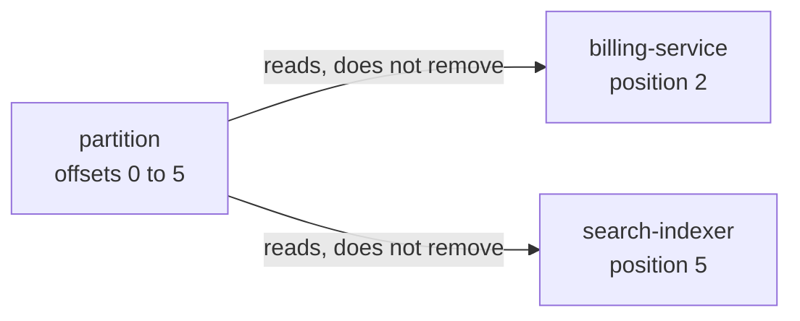
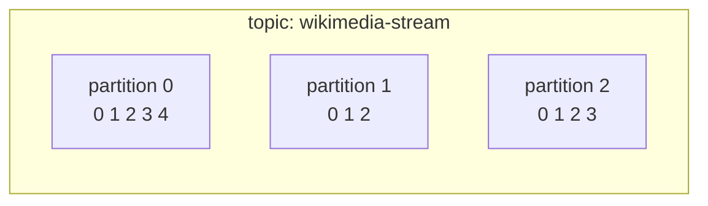

# Lesson 01: What Kafka Actually Is

> **Part 1: Kafka Without Code**

---

## What you'll learn

- Why Kafka is a log rather than a queue, and why that one distinction explains almost everything else
- What a topic, a partition and an offset are
- Why reading a record does not remove it
- Where Kafka is the wrong tool

---

## Why this matters

If you come from RabbitMQ, ActiveMQ or SQS, you have a mental model of a message broker: producers push messages into a queue, consumers pop them off, and a consumed message is gone.

Throw that model away. Keeping it is the single biggest source of confusion for people learning Kafka. It makes consumer groups look arbitrary, offsets look redundant and replay look like magic.

Kafka is closer to a file that many programs append to and many programs read from, independently, at their own pace.

Get this right and the rest of the course is mostly detail.

---

## Before you start

[Lesson 00](../part-0-setup/00-prerequisites-and-cluster.md), with your broker running:

```bash
docker compose ps kafka-1
```

---

## The concept

### A queue destroys, a log remembers

In a traditional queue, consuming is destructive. The message is delivered, acknowledged, removed. The queue's job is to reach empty.

```
QUEUE (RabbitMQ, SQS)
                                   consumer pops M1
  ┌────┬────┬────┐                ┌────┬────┐
  │ M1 │ M2 │ M3 │   ────────►    │ M2 │ M3 │      M1 is gone forever
  └────┴────┴────┘                └────┴────┘
```

In Kafka, consuming is a read. Nothing is removed. Each consumer only remembers how far it has read.

```
LOG (Kafka)

  offset:   0    1    2    3    4    5
          ┌────┬────┬────┬────┬────┬────┐
          │ M0 │ M1 │ M2 │ M3 │ M4 │ M5 │ ──► new records append here
          └────┴────┴────┴────┴────┴────┘
                       ▲              ▲
                       │              │
              billing-service    search-indexer
              has read to 2      has read to 5
```

Two consumers, one copy of the data, different positions, neither aware of the other:



The billing service falling behind does not slow the search indexer, and neither can delete data the other still needs.

Records leave only when a retention policy says so, after a period of time or once the log exceeds a size limit. Never because someone read them. Your broker keeps records for 7 days, because the Compose file in Lesson 00 set `KAFKA_LOG_RETENTION_HOURS: 168`.

### Why this changes everything

Because reads are non-destructive:

- **You can replay.** Deployed a consumer with a bug that mangled yesterday's data? Fix it, move your position back to yesterday, and reprocess. The records are still there. In a queue they are gone.
- **You can add a consumer later.** A new service can read from the beginning of history without asking anyone's permission and without affecting existing consumers.
- **Reading is cheap and parallel.** No coordination is needed between different applications reading the same topic.

That is the entire pitch. Kafka is a durable, replayable, append-only log that many independent readers share.

### Topics

A **topic** is a named log: `wikimedia-stream`, `orders`, `payments`. It is the unit you produce to and consume from.

### Partitions

A topic is split into **partitions**. Each partition is an independent append-only log with its own sequence of records.



Partitions exist for one reason: parallelism. A partition can be read by only one consumer within a group, so the partition count is the ceiling on how many consumers can work on a topic at once. Three partitions means at most three consumers sharing the load.

They cost you something, and it is the thing beginners miss:

> **Kafka guarantees ordering within a partition, and offers no ordering guarantee across partitions.**

If record A is written to partition 0 and record B to partition 1, nothing tells you which a consumer sees first. Two records whose relative order matters must land on the same partition. Lesson 04 is entirely about how you control that.

One more constraint worth knowing now: you can add partitions to a topic, but you can never remove them. The count is a decision you live with.

### Offsets

An **offset** is a record's position in its partition: a monotonically increasing integer starting at 0, meaningful only within one partition. "Offset 42" means nothing until you know which partition.

Offsets are assigned by the broker when the record is appended, and they never change.

A consumer's current offset is a bookmark saying "I have processed everything up to here". Kafka stores that bookmark in an internal topic called `__consumer_offsets`, which is a log, keyed by consumer group, topic and partition.

That is the whole model:

> **A topic is a set of partitions. A partition is an ordered, immutable sequence of records. An offset is a position in that sequence. Consuming means moving your bookmark.**

---

## Hands-on

You have not created a topic yet, and you do not need one, because your broker already has a log you can read: the one holding the cluster's own metadata. Everything Kafka knows about itself is stored as records in a partition, using exactly the structure described above. Looking at it is the fastest way to make the model concrete.

### 1. Find the log on disk

```bash
docker exec kafka-1 ls /var/lib/kafka/data/
```

```
__cluster_metadata-0
bootstrap.checkpoint
cleaner-offset-checkpoint
log-start-offset-checkpoint
meta.properties
recovery-point-offset-checkpoint
replication-offset-checkpoint
```

One directory, named `<topic>-<partition>`. The controller's metadata topic is `__cluster_metadata` and it has exactly one partition, so its data lives in `__cluster_metadata-0`. Every topic you create from Lesson 03 onward will add directories with the same naming.

`meta.properties` is the file Lesson 00's second exercise was about: it holds this log directory's cluster ID.

### 2. Look inside the partition

```bash
docker exec kafka-1 ls /var/lib/kafka/data/__cluster_metadata-0/
```

```
00000000000000000000.index
00000000000000000000.log
00000000000000000000.timeindex
leader-epoch-checkpoint
partition.metadata
quorum-state
```

A partition is not one giant file. It is a series of **segments**, and each segment is three files sharing a name that is the offset the segment starts at:

| File | Holds |
|---|---|
| `.log` | the records themselves |
| `.index` | a sparse map from offset to byte position in the `.log` |
| `.timeindex` | a sparse map from timestamp to offset |

The two index files are why Kafka can seek to an offset without scanning: it looks up the nearest indexed position and reads forward from there. When a segment reaches its size limit, Kafka closes it and starts a new one named after the next offset, which is also the unit retention deletes. Kafka does not delete individual records; it deletes whole segments once every record in them is older than the retention period.

### 3. Read the records

```bash
docker exec kafka-1 kafka-dump-log --cluster-metadata-decoder \
  --files /var/lib/kafka/data/__cluster_metadata-0/00000000000000000000.log \
  | grep -oE '"type":"[A-Z_]+"' | sort | uniq -c | sort -rn
```

```
     43 "type":"NO_OP_RECORD"
      6 "type":"FEATURE_LEVEL_RECORD"
      1 "type":"REGISTER_CONTROLLER_RECORD"
      1 "type":"REGISTER_BROKER_RECORD"
      1 "type":"END_TRANSACTION_RECORD"
      1 "type":"CONFIG_RECORD"
      1 "type":"BROKER_REGISTRATION_CHANGE_RECORD"
      1 "type":"BEGIN_TRANSACTION_RECORD"
```

Your counts will differ, because `NO_OP_RECORD` is a periodic heartbeat the controller appends and there will be more of them the longer the cluster has been up.

Now read one record in full:

```bash
docker exec kafka-1 kafka-dump-log --cluster-metadata-decoder \
  --files /var/lib/kafka/data/__cluster_metadata-0/00000000000000000000.log \
  | grep REGISTER_BROKER_RECORD
```

Trimmed to the interesting part:

```
| offset: 12 CreateTime: 1785389113914 keySize: -1 valueSize: 273 ...
  payload: {"type":"REGISTER_BROKER_RECORD","version":3,"data":{"brokerId":1,
  "endPoints":[{"name":"PLAINTEXT","host":"kafka-1","port":29092,...},
               {"name":"PLAINTEXT_HOST","host":"localhost","port":9092,...}],
  ...,"fenced":true,...}}
```

There are the two advertised addresses from Lesson 00, at a real offset, in a real log. When your broker started, it did not write its identity into a configuration table. It **appended a record**.

### 4. What that tells you

Three things you can now take as established rather than asserted:

1. A partition on disk is an append-only sequence of records with monotonic offsets, plus indexes for seeking.
2. Retention operates on segments, which is why it is a coarse time or size policy and not a per-record decision.
3. Kafka is built on its own abstraction. Cluster metadata is a topic, consumer positions are a topic (`__consumer_offsets`, which you will see in Lesson 02), and both get the same durability guarantees as your data.

---

## When Kafka is the wrong tool

Teaching material tends to skip this. Kafka is a poor fit when:

- **You need per-message acknowledgment and redelivery.** Kafka commits a position, not individual records. If you need "retry record 7 but not record 8", a real queue fits better.
- **You need low-latency request and response.** Kafka is throughput-oriented. Use HTTP or gRPC.
- **You have very few records.** A controller quorum, replication and partition rebalancing is a great deal of machinery for a hundred messages a day.
- **You need priority ordering.** A log has one order: the order things arrived.

Kafka earns its complexity when you have high-volume event streams that several independent consumers need, with the ability to replay.

---

## Try it yourself

1. A topic has 3 partitions. You produce records `A`, `B`, `C`, `D` with no key and they land on partitions 0, 1, 2, 0 respectively. A single consumer reads the topic. Can you predict the order it sees them in? Can you predict anything at all about the order?

2. Your `orders` topic has 7-day retention. A consumer has been offline for 9 days. What happens when it comes back and asks for the record after the last one it processed? Hold onto this answer: Lesson 05 shows the setting that decides it.

3. Restart the broker with `docker compose restart kafka-1`, wait for it to report healthy, then run the `ls` from step 2 again. A file that was not there before has appeared:

   ```
   00000000000000000254.snapshot
   ```

   Given that the `.log` is append-only and already contains every record, what job is that snapshot doing, and why is it named after an offset?

---

## Common mistakes

**"I consumed the record, so it is gone."**
It is not. It sits in the partition until retention expires. You moved a bookmark.

**"I will use one partition to guarantee global ordering."**
This works, and it is occasionally correct, but it caps consumer parallelism at exactly one forever. Usually the right answer is to partition by a key so that records which must be ordered relative to each other share a partition. That is Lesson 04.

**"Offsets are unique across the topic."**
They are not. Every partition has its own offset 0. A record is identified by partition and offset together; the offset alone identifies nothing.

**"More partitions means more throughput."**
Up to a point. Every partition costs open file handles, memory and replication traffic on every broker. The practical range is 10 to 50 partitions per broker across all topics. Thousands of partitions will make a cluster miserable.

---

## Check your understanding

**1. Two applications, `billing` and `analytics`, both need every record from the `orders` topic. In RabbitMQ you would need two queues and a fanout exchange. What do you need in Kafka?**

<details>
<summary>Reveal answer</summary>

Nothing extra. Both applications read the same topic using different consumer group IDs, and each group keeps its own independent offset.

Because reads are non-destructive, `billing` reading a record has no effect on `analytics`. There is no fanout to configure; it is the default behaviour of a log.

</details>

**2. A record sits at offset 5 in partition 2. A consumer commits offset 5. A consumer in a different group is at offset 1 in the same partition. Does the record at offset 5 still exist?**

<details>
<summary>Reveal answer</summary>

Yes. Committing an offset records a position. It does not delete or acknowledge anything. The record at partition 2, offset 5 stays readable by anyone until retention removes it.

This is also why the second consumer sitting at offset 1 is entirely fine and affects nobody.

</details>

**3. You produce `order-created` and then `order-cancelled` for the same order ID. They land on different partitions. Your consumer processes the cancellation before the creation and crashes. Whose fault is that?**

<details>
<summary>Reveal answer</summary>

Yours, and specifically it is a partitioning bug rather than a consumer bug.

Kafka only guarantees ordering within a partition. Two records whose relative order matters must be routed to the same partition, which you do by giving them the same key, here the order ID. Records with the same key always hash to the same partition.

The consumer did nothing wrong. It read each partition in order, exactly as promised.

</details>

**4. Why can you add partitions to a topic but never remove them?**

<details>
<summary>Reveal answer</summary>

Because each partition is an immutable log holding real records at real offsets. Removing partition 2 would mean either deleting its records or moving them, and moving them would give them new offsets in a different partition. That breaks every consumer's committed position and destroys the ordering guarantee for the keys that hashed there.

Adding partitions is safe for existing data, but it does change future key routing, since the partition for a key is derived from `hash(key) % partitionCount`. A key that used to go to partition 1 may start going to partition 4. That is why increasing the partition count on a keyed topic is not as harmless as it sounds.

</details>

**5. A topic has 7-day retention. Nobody has consumed from it in 30 days. How much data is in the topic?**

<details>
<summary>Reveal answer</summary>

At most 7 days' worth. Retention is driven by time, and optionally size, never by whether anyone read the data.

This is the flip side of non-destructive reads: Kafka will happily delete records no consumer ever saw. A consumer offline for longer than the retention window has permanently missed those records, which is what Lesson 05's `auto.offset.reset` setting exists to handle.

</details>

**6. You looked at `__cluster_metadata-0` and found a `.log`, an `.index` and a `.timeindex`. Why does a log that is only ever appended to and read forward need two index files?**

<details>
<summary>Reveal answer</summary>

Because consumers do not always read forward from where they are. They also need to start somewhere specific.

A consumer resuming after a restart says "give me offset 4711". Without an index, finding that record means scanning the segment from its start. The `.index` maps offsets to byte positions, so the broker jumps to the nearest indexed offset and reads a short way forward.

The `.timeindex` answers a different question: "give me the first record after this timestamp". That is what makes time-based replay possible, and you will use it in Lesson 05 to reset a consumer group by time rather than by offset.

Both are sparse, holding an entry every few kilobytes rather than one per record, which is a deliberate trade of a little scanning for a much smaller index.

</details>

---

## Recap

Kafka is an append-only log, not a queue. Reads do not destroy, they move a bookmark. A topic is split into partitions for parallelism, and the price of that parallelism is that ordering holds only within a partition. An offset is a position inside one partition.

You also read a real Kafka log from disk and found the segment structure, the offsets and your broker's own registration record inside it. Kafka stores its own state using the abstraction it sells you.

Everything in the next twenty-six lessons is a consequence of those sentences.

**Next:** [Lesson 02: A Tour of Kafka UI](02-tour-of-kafka-ui.md)
