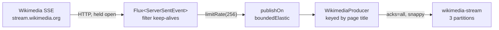

# Lesson 14: Real Data, the Wikimedia SSE Stream

> **Part 2: The Producer**

---

## What you'll learn

- What Server-Sent Events are, and why they suit Kafka
- How to consume an SSE stream with `WebClient` and `Flux`
- Why decoding to `ServerSentEvent<String>` beats parsing the raw body yourself
- Why an unbounded reactive stream feeding a bounded producer buffer is a real problem, and how to bound it

---

## Why this matters

Your producer works, but it sends `edit-1` at startup. Time to point it at something real: every edit made to every Wikimedia project, worldwide, as it happens.

Wikimedia publishes this at `https://stream.wikimedia.org/v2/stream/recentchange` as a public, unauthenticated Server-Sent Events feed. It emits somewhere between tens and hundreds of events per second, indefinitely. That makes it an ideal Kafka source: a firehose you do not control, which you want to buffer, replay and fan out to many consumers.

It is also the lesson where every setting from Lessons 10 to 13 stops being theoretical. Real volume, real batches, real compression, and a real reason to care what happens when the buffer fills.

---

## Before you start

[Lesson 13](13-send-callbacks-and-errors.md), and a working internet connection.

Look at the data before writing any code:

```bash
curl -N https://stream.wikimedia.org/v2/stream/recentchange | head -20
```

Press Ctrl-C when you have seen enough.

---

## The concept

### Server-Sent Events

SSE is a one-directional streaming protocol over ordinary HTTP. The server holds the response open and pushes text frames:

```
event: message
id: [{"topic":"eqiad.mediawiki.recentchange","partition":0,"offset":5410942}]
data: {"$schema":"/mediawiki/recentchange/1.0.0","meta":{...},"type":"edit","title":"Nikola Tesla",...}

```

The fields are `event:`, `id:`, `data:` and `retry:`, and a blank line ends the frame. The payload you want is the JSON after `data:`.

Compared with WebSockets, SSE is server to client only, runs over plain HTTP, and reconnects automatically. For a public event feed that is exactly right.

> Look at that `id:` field. Wikimedia's feed is itself backed by Kafka, and the SSE id carries a topic, partition and offset. You are consuming someone else's Kafka topic over HTTP, and about to put it into your own.

### Why not read the body yourself

You could stream the raw response and split on newlines, but you would have to handle multi-line `data:` fields, comment lines beginning with a colon that are used as keep-alives, blank-line frame boundaries, and `retry:` directives with reconnection.

`WebClient` decodes all of that. Ask for `ServerSentEvent<String>` and you get parsed frames, with `data()` giving you the payload:

```java
.bodyToFlux(new ParameterizedTypeReference<ServerSentEvent<String>>() {})
```

The `ParameterizedTypeReference` exists because of generic type erasure. `ServerSentEvent<String>.class` is not expressible in Java, so this anonymous subclass carries the type at runtime. It is the same trick as Jackson's `TypeReference`.

Calling `.bodyToFlux(String.class)` also works and still decodes frames, but you lose access to `event`, `id` and `retry`.

### `Flux` and the shape of the pipeline

`bodyToFlux` returns a `Flux<ServerSentEvent<String>>`, a reactive stream of zero to infinite elements. Nothing happens until you subscribe: a `Flux` is a recipe rather than a running process.

`subscribe()` returns immediately and the stream runs on a Reactor Netty event-loop thread.

### The backpressure problem, and why you must fix it

This is the part most tutorials skip, and it is the reason this lesson is not simply four lines of `WebClient`.

`subscribe(consumer)` with a plain lambda requests an **unbounded** number of elements. Reactor will push events at you as fast as Wikimedia sends them.

Meanwhile `producer.sendMessage()` appends to a bounded 32 MiB buffer, as you configured in Lesson 12. If Kafka slows down and that buffer fills, `send()` blocks for up to `max.block.ms`, which you measured in Lesson 12's second exercise.

That block would happen on a Netty event-loop thread, which is shared with other network activity and must never be blocked. With a local cluster and a modest event rate it never bites. During a broker failover, or an ISR dropping below the floor so that `acks=all` writes are refused, it would.

There are three ways to bound this, and you will use two:

| Approach | Effect |
|---|---|
| `limitRate(n)` | requests at most `n` elements at a time instead of unbounded demand |
| `publishOn(Schedulers.boundedElastic())` | moves the work off the event loop, so blocking harms only that scheduler |
| `onBackpressureBuffer(size, strategy)` | bounded queue with an explicit policy for overflow |

`limitRate` plus `publishOn` is the smallest change that makes the pipeline honest. It does not make blocking impossible; it makes blocking survivable, and moves it somewhere it cannot take down unrelated network activity.



---

## Hands-on

### 1. Add WebFlux and Jackson

`WebClient` lives in WebFlux, and you need Jackson to pull the key out of each event:

```xml
        <dependency>
            <groupId>org.springframework.boot</groupId>
            <artifactId>spring-boot-starter-webflux</artifactId>
        </dependency>

        <dependency>
            <groupId>org.springframework.boot</groupId>
            <artifactId>spring-boot-starter-jackson</artifactId>
        </dependency>
```

WebFlux also starts a Netty web server, which will serve the controller in step 4. You already have a web server from actuator in Lesson 12; adding WebFlux makes it a reactive one.

Declaring `spring-boot-starter-jackson` explicitly is deliberate. Boot 4 splits Jackson into its own starter, and while the web starters pull it in transitively for their codecs, this application is about to depend on `ObjectMapper` directly. Depending on something explicitly when you use it directly is worth the extra four lines.

### 2. `config/WebClientConfig.java`

```java
package com.example.wikimedia.producer.config;

import org.springframework.context.annotation.Bean;
import org.springframework.context.annotation.Configuration;
import org.springframework.web.reactive.function.client.WebClient;

@Configuration
public class WebClientConfig {

    @Bean
    public WebClient.Builder webClientBuilder() {
        return WebClient.builder();
    }
}
```

Exposing the builder rather than a finished `WebClient` lets each caller set its own base URL while still picking up Boot's auto-configured codecs and observability instrumentation. That instrumentation matters in Lesson 26.

### 3. `stream/WikimediaStreamPublisher.java`

This class consumes the SSE stream and publishes to Kafka, which is why it is named a publisher rather than a consumer. Naming it after the Kafka side avoids a class called a consumer that has nothing to do with a Kafka consumer.

```java
package com.example.wikimedia.producer.stream;

import com.example.wikimedia.producer.kafka.WikimediaProducer;
import java.util.concurrent.atomic.AtomicBoolean;
import org.slf4j.Logger;
import org.slf4j.LoggerFactory;
import org.springframework.core.ParameterizedTypeReference;
import org.springframework.http.codec.ServerSentEvent;
import org.springframework.stereotype.Service;
import org.springframework.web.reactive.function.client.WebClient;
import reactor.core.scheduler.Schedulers;
import tools.jackson.databind.JsonNode;
import tools.jackson.databind.ObjectMapper;

@Service
public class WikimediaStreamPublisher {

    private static final Logger log = LoggerFactory.getLogger(WikimediaStreamPublisher.class);

    private final WebClient webClient;
    private final WikimediaProducer producer;
    private final ObjectMapper objectMapper;
    private final AtomicBoolean running = new AtomicBoolean(false);

    public WikimediaStreamPublisher(WebClient.Builder webClientBuilder,
                                    WikimediaProducer producer,
                                    ObjectMapper objectMapper) {
        this.webClient = webClientBuilder.baseUrl("https://stream.wikimedia.org/v2").build();
        this.producer = producer;
        this.objectMapper = objectMapper;
    }

    public boolean startPublishing() {
        if (!running.compareAndSet(false, true)) {
            return false;
        }

        webClient.get()
                .uri("/stream/recentchange")
                .retrieve()
                .bodyToFlux(new ParameterizedTypeReference<ServerSentEvent<String>>() {})
                .filter(event -> event.data() != null && !event.data().isBlank())
                // Bound demand instead of asking for an unbounded number of events.
                .limitRate(256)
                // Move off the Netty event loop, because sendMessage can block
                // when the producer's buffer is full.
                .publishOn(Schedulers.boundedElastic())
                .subscribe(
                        event -> publish(event.data()),
                        error -> {
                            log.error("SSE stream failed: {}", error.getMessage());
                            running.set(false);
                        },
                        () -> {
                            log.warn("SSE stream completed unexpectedly");
                            running.set(false);
                        });

        return true;
    }

    private void publish(String json) {
        producer.sendMessage(partitionKey(json), json);
    }

    // The page title keeps every edit to one page on one partition, which is the
    // ordering guarantee from Lesson 11. Keying by meta.domain would have been the
    // hot-partition mistake: en.wikipedia.org alone dominates this feed.
    private String partitionKey(String json) {
        try {
            JsonNode node = objectMapper.readTree(json);
            String title = node.path("title").asText(null);
            return title == null || title.isBlank() ? null : title;
        } catch (Exception e) {
            log.warn("Could not read title, sending unkeyed: {}", e.getMessage());
            return null;
        }
    }
}
```

Four things in there are decisions rather than syntax.

**The `AtomicBoolean` guard.** Without it, calling the endpoint twice creates two independent subscriptions to the same stream, and every event is published to Kafka twice. This is the kind of bug that looks like Kafka duplicating records, which it is not.

**`limitRate(256)` and `publishOn`.** The two lines from the concept section, and the only reason this pipeline is safe to leave running.

**A `null` key is a deliberate fallback,** not an error. A record with no key goes through the built-in partitioner from Lesson 04, which is the correct degradation: you would rather publish an unordered event than drop it.

**`tools.jackson`, not `com.fasterxml.jackson`.** Jackson 3 changed its package root. Lesson 16 covers what else moved.

### 4. `controller/WikimediaController.java`

```java
package com.example.wikimedia.producer.controller;

import com.example.wikimedia.producer.stream.WikimediaStreamPublisher;
import org.springframework.http.ResponseEntity;
import org.springframework.web.bind.annotation.GetMapping;
import org.springframework.web.bind.annotation.RequestMapping;
import org.springframework.web.bind.annotation.RestController;

@RestController
@RequestMapping("/api/v1/wikimedia")
public class WikimediaController {

    private final WikimediaStreamPublisher publisher;

    public WikimediaController(WikimediaStreamPublisher publisher) {
        this.publisher = publisher;
    }

    @GetMapping
    public ResponseEntity<String> startPublishing() {
        if (!publisher.startPublishing()) {
            return ResponseEntity.status(409).body("Stream already running");
        }
        return ResponseEntity.accepted().body("Streaming started");
    }
}
```

`202 Accepted` is the honest status code: you have started a long-running background process, not completed a request. `409 Conflict` for a second call is the visible half of the guard in step 3.

### 5. Delete the startup sender

`StartupMessageSender` has served its purpose. Delete the file. Events now come from the stream, triggered by an HTTP call, and `WikimediaProducer` keeps the keyed signature from Lesson 11 unchanged.

### 6. Run it

```bash
./mvnw spring-boot:run
```

The application starts on port 8081 and publishes nothing, because `startPublishing()` has not been called. Trigger it:

```bash
curl http://localhost:8081/api/v1/wikimedia
```

```
Streaming started
```

Call it again and you get `Stream already running` with a 409.

Watch the topic fill:

```bash
docker exec kafka-1 kafka-get-offsets \
  --bootstrap-server kafka-1:29092 --topic wikimedia-stream
```

Run it twice a few seconds apart and the end offsets climb. Then look at the records:

```bash
docker exec kafka-1 kafka-console-consumer \
  --bootstrap-server kafka-1:29092 \
  --topic wikimedia-stream --max-messages 3 \
  --formatter-property print.key=true \
  --formatter-property print.partition=true \
  --formatter-property key.separator=' | '
```

You should see page titles as keys, spread across all three partitions, with a JSON document as each value.

### 7. Now the settings from Lessons 10 to 13 mean something

With real volume flowing, read the metrics you exposed in Lesson 12:

```bash
curl -s localhost:8081/actuator/metrics/kafka.producer.batch.size.avg
curl -s localhost:8081/actuator/metrics/kafka.producer.compression.rate.avg
curl -s localhost:8081/actuator/metrics/kafka.producer.record.send.rate
```

Compare these with the numbers from Lesson 12's thousand-record loop. Batches are now filling because records genuinely arrive continuously, so `linger.ms` rarely expires and compression finally has something to work with.

This is the difference between a tuning exercise and a tuned system: the same configuration, measured under load it was designed for.

---

## Try it yourself

1. Remove `limitRate(256)` and `publishOn(...)`, then stop two brokers so `acks=all` writes are refused. Watch what happens to the application. Where does it block, and which unrelated functionality stops working? Put both lines back.

2. Replace the key with `meta.domain` instead of `title`, run for a minute, and compare per-partition offsets. Quantify the skew, then explain which ordering guarantee each choice gives you and why one is a hot partition.

3. The stream stops if the connection drops, because the error callback sets `running` back to false and nothing restarts it. Add `.retryWhen(Retry.backoff(...))` before `subscribe`, then work out what happens to events that occurred during the gap. Can you recover them?

4. Compare `--formatter-property print.key=true` output against `kafka-get-offsets` per partition after ten minutes. Are the partitions evenly loaded? Given the key you chose, would you expect them to be?

---

## Common mistakes

**Subscribing with an unbounded lambda and calling it done.**
The stream will request as fast as the source sends, and the first slow Kafka write blocks a Netty event-loop thread.

**Blocking work on the event loop.**
`publishOn(Schedulers.boundedElastic())` exists precisely so that a blocking `send()` harms one scheduler instead of all network activity.

**Allowing the endpoint to start the stream twice.**
Two subscriptions publish every event twice, and it looks exactly like Kafka duplicating records.

**Parsing SSE framing by hand.**
Multi-line data fields, comment keep-alives and reconnect directives are all handled for you.

**Forgetting that a `Flux` is inert.**
No subscribe, no stream. A `Flux` you built and never subscribed to does nothing at all, silently.

**Using `com.fasterxml.jackson` imports.**
Jackson 3 moved to `tools.jackson`. The annotations did not move, which Lesson 16 explains.

**Assuming a null key is a failure.**
It is the correct fallback. Publishing an unordered record beats dropping it.

---

## Check your understanding

**1. `subscribe()` returns immediately and the stream runs for hours. Which thread is doing that work, and why does it matter?**

<details>
<summary>Reveal answer</summary>

Without `publishOn`, a Reactor Netty event-loop thread, which is shared with other network activity in the application.

It matters because `producer.sendMessage()` can block. When the record accumulator fills, `send()` waits for up to `max.block.ms`, and if that wait happens on an event-loop thread then every other connection served by that loop stalls with it, including your actuator endpoints and the HTTP request that started the stream.

`publishOn(Schedulers.boundedElastic())` moves the per-event work to a scheduler designed for blocking calls, which contains the damage.

</details>

**2. Why key by page title rather than by wiki domain?**

<details>
<summary>Reveal answer</summary>

Because the ordering requirement is per page, and the domain would concentrate traffic.

Two edits to the same page must be applied in order, so the page is the smallest key that satisfies the requirement. Titles have very high cardinality and no single title dominates, so the hash spreads them across partitions reasonably.

The domain would satisfy the same ordering requirement more strongly than needed, and English Wikipedia alone accounts for a large share of this feed. That is the hot partition from Lesson 11, produced by a real key on real data.

</details>

**3. The stream is running and you stop two of three brokers. What happens, with the pipeline as written?**

<details>
<summary>Reveal answer</summary>

The ISR falls below the topic's floor of 2, so the broker refuses every `acks=all` write with `NotEnoughReplicasException`.

Your callback from Lesson 13 logs each failure. The records are dropped after the delivery deadline, and events keep arriving from Wikimedia the whole time, so the accumulator fills. Once it is full, `send()` blocks for `max.block.ms` on a bounded-elastic thread, which slows consumption of the stream without taking down the web server.

That is the intended behaviour of a bounded pipeline. The events are still lost, because nothing persists them, which is exactly the decision Lesson 13's final exercise asked you to make.

</details>

**4. Calling the endpoint twice used to publish everything twice. Why is that not a Kafka problem?**

<details>
<summary>Reveal answer</summary>

Because two subscriptions are two independent streams, and each one calls `send()` for every event it receives. Those are distinct records with distinct sequence numbers, so idempotence has nothing to deduplicate.

This is the concrete version of Lesson 10's warning that idempotence does not deduplicate your application logic. Kafka faithfully stored what you asked it to store, twice, and the bug is entirely in the calling code.

</details>

**5. Lesson 12 showed compression achieving almost nothing. Why does it work now, with no configuration change?**

<details>
<summary>Reveal answer</summary>

Because compression operates on batches, and the batches are finally full.

In Lesson 12 you produced a burst from a single thread and then stopped, so under light load `linger.ms` expired with only a few records accumulated. Now events arrive continuously at tens to hundreds per second, so a partition's batch reaches `batch.size` before the linger timer expires.

The payloads help too. These are JSON documents sharing a schema, field names and vocabulary, which is close to the ideal case for a dictionary-based codec. Identical settings, different load, and an order-of-magnitude different result.

</details>

---

## End of Part 2

Your producer is real. It:

- streams live events from a public SSE feed with `WebClient` and `Flux`
- keys each record by page so that edits to one page stay ordered
- publishes with `acks=all` and idempotence, against a topic that demands two in-sync replicas
- batches and compresses under genuine load, and can prove it from its own metrics
- reports the partition and offset the broker assigned, and logs failures rather than discarding them
- bounds its own demand instead of pushing an unbounded stream into a bounded buffer

What it still does not do is survive its own failures. Records dropped after the delivery deadline are gone, and there is no consumer reading any of this.

Time to build the other half.

**Next:** [Lesson 15: Your First KafkaListener](../part-3-consumer/15-first-kafkalistener.md)
