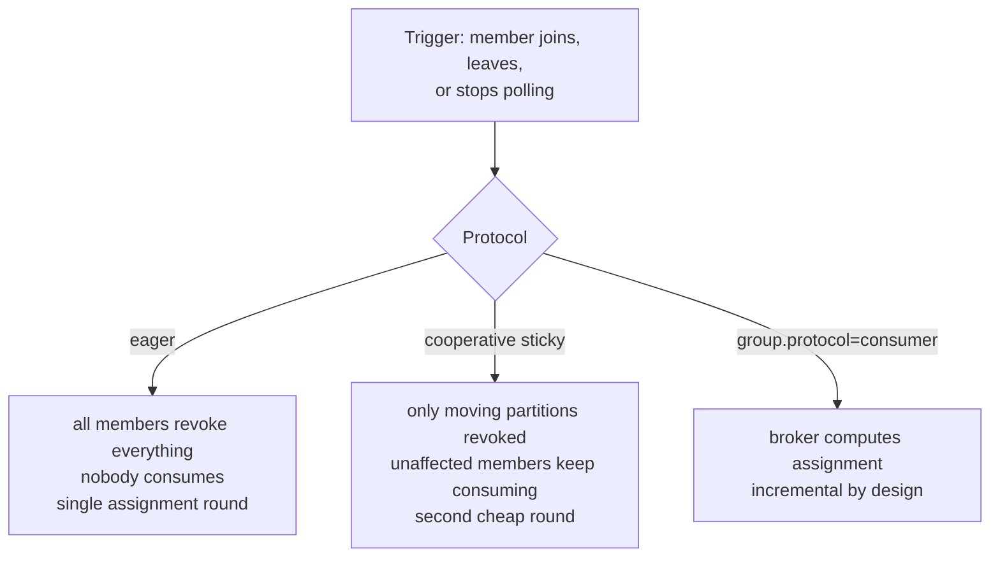

# Lesson 19: Concurrency and Rebalancing

> **Part 3: The Consumer**

---

## What you'll learn

- What `setConcurrency` actually creates, and why the partition count caps it
- Which of your code becomes thread-shared the moment concurrency exceeds one
- What a rebalance costs, and which assignment protocol you are actually using
- Why the two consumer timeouts fail in completely different ways

---

## Why this matters

Your consumer reads three partitions on one thread. That works until the producer is faster than the consumer, which with a live firehose and a database write per record happens quickly.

Scaling the consumer is one line. Understanding what that line does to ordering, to shared state and to rebalancing is the rest of this lesson, and it is where the most confusing Kafka production incidents come from.

---

## Before you start

[Lesson 18](18-persisting-with-jpa.md), with a consumer that persists events.

---

## The concept

### `setConcurrency` creates consumers, not threads in a pool

`ConcurrentKafkaListenerContainerFactory` creates N independent consumers, each on its own thread, each with its own `KafkaConsumer` instance, all in the same group.

They are not a thread pool sharing work. Each is a full group member with its own poll loop and its own assigned partitions.

From Lesson 05, one partition goes to exactly one member, so with three partitions:

| Concurrency | Result |
|---|---|
| 1 | one thread reads all three partitions |
| 2 | one thread gets two partitions, one gets one |
| 3 | one partition each, which is the sweet spot |
| 4 | three work, one sits idle indefinitely |

Setting concurrency to 4 on a three-partition topic creates a consumer that will never receive a record. It is not an error, and it costs a connection, a heartbeat and a place in every rebalance.

The partition count is the ceiling. To scale past it you must add partitions, which on a keyed topic re-maps keys, as Lesson 04 demonstrated and Lesson 09 warned.

### Thread safety becomes your problem

Three threads now run your listener concurrently, and `WikimediaConsumer` is a singleton.

It is safe as written, because it holds only the repository and the object mapper, both of which are thread-safe and stateless. Add a `private int counter`, a `List`, or any cached value and you have introduced a race that appears under load and never in tests.

Records from the same partition are still processed by one thread, in order. Records from different partitions run in parallel. That is exactly the guarantee keys buy you: same key, same partition, same thread, ordered.

### Rebalancing

A rebalance is the group coordinator reassigning partitions to members. It triggers when:

- a consumer joins, through a deploy, a scale-up or a concurrency increase
- a consumer leaves cleanly, through graceful shutdown
- a consumer fails to heartbeat for `session.timeout.ms`
- a consumer fails to poll for `max.poll.interval.ms`
- the partition count of a subscribed topic changes

The cost of a rebalance depends entirely on which protocol the group is using, and this is where most material is out of date.

### Which protocol you are actually using

Three things are true of Kafka 4.x, and they are usually described wrongly.

**Eager is not the default.** Since Kafka 3.0 the default `partition.assignment.strategy` is `[RangeAssignor, CooperativeStickyAssignor]`. A group whose members all support it negotiates the cooperative protocol, so the stop-the-world behaviour that older articles describe is not what you get out of the box.

**Eager still exists and still matters.** Under the eager protocol every member revokes all its partitions, the coordinator computes a new assignment, and everyone resumes. Nobody consumes anything for the duration. On a small group that is milliseconds; on a large one with heavy revocation work it can be seconds, and lag grows across every partition rather than only the ones that moved.

**Kafka 4 has a third option that supersedes the argument.** KIP-848 introduced a new consumer group protocol, selected with `group.protocol=consumer`, which moves assignment from the clients to the group coordinator on the broker. It is incrementally cooperative by construction, so `partition.assignment.strategy` and the careful two-phase migration below stop being relevant. It is the direction Kafka is going, and it is worth knowing exists before you spend an afternoon tuning assignors.

This lesson stays on the classic protocol, because the classic protocol is what almost every deployment is running today and what almost every error message you will search for refers to.



### Cooperative sticky, stated precisely

```yaml
properties:
  partition.assignment.strategy: org.apache.kafka.clients.consumer.CooperativeStickyAssignor
```

Two properties, both valuable. **Sticky** means a member tends to get back the partitions it had, so warmed caches and in-flight state survive. **Cooperative** means unaffected members never stop consuming.

Rolling-restart a ten-member group under the eager protocol and you trigger twenty stop-the-world rebalances. Under cooperative sticky the nine unaffected members keep working through each one.

> Setting this explicitly on a running group requires a two-step rolling upgrade, listing both strategies first and removing the old one afterwards, because members must agree on a protocol. On a new group, which is what you have, you can set it directly.

### The two timeouts

These are constantly confused, and they fail completely differently.

**`session.timeout.ms`**, 45 seconds as configured below, is how long the coordinator waits for a **heartbeat** before evicting a member. Heartbeats are sent by a background thread every `heartbeat.interval.ms`, independent of your listener, so a slow listener does not miss heartbeats. This timeout catches crashed processes and network partitions.

**`max.poll.interval.ms`**, five minutes by default, is how long the coordinator waits for a **`poll()`** call. Your listener runs inside the poll loop, so slow processing trips exactly this one.

The failure that second timeout produces is the nasty one:

1. Your listener takes six minutes on a batch.
2. At five minutes the coordinator evicts the member and reassigns its partitions.
3. Another consumer reprocesses them from the last committed offset, doing duplicate work.
4. Your original listener finishes and calls `acknowledge()`.
5. The commit fails with `CommitFailedException`, because it no longer owns the partition.
6. The evicted member rejoins, triggering another rebalance.

Under sustained load this loops, which is a **rebalance storm**. It looks like Kafka being flaky and it is your listener being slow.

The levers, in order of preference: make processing faster, lower `max-poll-records` so that one poll's work is smaller, then raise `max.poll.interval.ms`. Raising `session.timeout.ms` does nothing at all for this failure, which is why the distinction is worth holding onto.

---

## Hands-on

### 1. Set concurrency and the assignor

Update `KafkaConsumerConfig`:

```java
package com.example.wikimedia.consumer.config;

import org.apache.kafka.clients.consumer.CooperativeStickyAssignor;
import org.springframework.context.annotation.Bean;
import org.springframework.context.annotation.Configuration;
import org.springframework.kafka.config.ConcurrentKafkaListenerContainerFactory;
import org.springframework.kafka.core.ConsumerFactory;
import org.springframework.kafka.listener.ContainerProperties;

@Configuration
public class KafkaConsumerConfig {

    @Bean
    public ConcurrentKafkaListenerContainerFactory<String, String> kafkaListenerContainerFactory(
            ConsumerFactory<String, String> consumerFactory) {

        var factory = new ConcurrentKafkaListenerContainerFactory<String, String>();
        factory.setConsumerFactory(consumerFactory);

        // One consumer per partition. More would idle; fewer would share.
        factory.setConcurrency(3);

        // MANUAL_IMMEDIATE uses commitSync, so acknowledge() waits for the broker.
        factory.getContainerProperties().setAckMode(ContainerProperties.AckMode.MANUAL_IMMEDIATE);

        return factory;
    }
}
```

`CooperativeStickyAssignor` is imported here so you can reference the class rather than a string literal when you set it in the next step. A typo in an assignor class name is a runtime failure at group join, which is an unpleasant place to discover it.

### 2. Add the consumer properties

Append to the `consumer:` block in `application.yml`:

```yaml
      properties:
        isolation.level: read_committed

        # Only cooperative, on a brand-new group. On an existing group you would
        # list both strategies first and remove the old one in a second rollout.
        partition.assignment.strategy: org.apache.kafka.clients.consumer.CooperativeStickyAssignor

        # Heartbeats come from a background thread, so this catches dead
        # processes, not slow listeners.
        session.timeout.ms: 45000
        heartbeat.interval.ms: 15000

        # This is the one a slow listener trips.
        max.poll.interval.ms: 300000
```

The convention is that `heartbeat.interval.ms` should be around a third of `session.timeout.ms`, so that a member gets several chances to be heard before being evicted.

### 3. See three threads

Add the thread name to your log pattern in `application.yml`:

```yaml
logging:
  pattern:
    console: "%d{HH:mm:ss.SSS} %-5level [%thread] %logger{20} - %msg%n"
```

Run the consumer and produce some load. You will see three distinct container threads, each handling one partition:

```
[wikimedia-consumer-group-0-C-1] ... partition=0 offset=1041
[wikimedia-consumer-group-1-C-1] ... partition=1 offset=987
[wikimedia-consumer-group-2-C-1] ... partition=2 offset=1102
```

Those thread names come from the listener's `id`, which defaults to a generated value. If you have not set one, expect names of the form `org.springframework.kafka.KafkaListenerEndpointContainer#0-0-C-1` instead. To get the readable version, name the listener:

```java
    @KafkaListener(
            id = "wikimedia-consumer-group",
            topics = "wikimedia-stream",
            groupId = "wikimedia-consumer-group"
    )
```

Either way, the important observation is that a given partition only ever appears on one thread.

### 4. Confirm the assignment from outside

```bash
docker exec kafka-1 kafka-consumer-groups \
  --bootstrap-server kafka-1:29092 \
  --describe --group wikimedia-consumer-group
```

Three members now, each owning one partition, each with its own `CONSUMER-ID`. Compare that with Lesson 15, where one member owned all three.

### 5. Trip the poll timeout on purpose

Temporarily make the listener slow. Note the `InterruptedException` handling, which is not optional:

```java
        try {
            Thread.sleep(1000);
        } catch (InterruptedException e) {
            Thread.currentThread().interrupt();
            throw new IllegalStateException("Interrupted while processing", e);
        }
```

Then lower the timeout so you do not have to wait five minutes, and raise the records per poll so one poll's work is large:

```yaml
        max.poll.interval.ms: 10000
```

```yaml
      max-poll-records: 50
```

Fifty records at one second each is fifty seconds of work against a ten-second deadline. Run it and watch the logs:

```
CommitFailedException: Offset commit cannot be completed since the consumer is not part of an active group for auto partition assignment...
```

Then the member rejoins, is reassigned, starts again, and trips the deadline again. That is the rebalance storm, reproduced deliberately.

Fix it the right way round: restore `max.poll.interval.ms: 300000`, restore `max-poll-records: 500`, and remove the sleep. Then, as an exercise in the correct lever, try leaving the sleep in and setting `max-poll-records: 5` instead, and observe that the storm stops without touching either timeout.

### 6. Watch a rebalance that does not stop the world

With the consumer running and the producer streaming, start a second instance:

```bash
SERVER_PORT=8083 ./mvnw spring-boot:run
```

The group now has six members for three partitions, so three will idle. Describe the group and confirm it.

More interestingly, watch the logs of the first instance during the join. Under the cooperative assignor, partitions that do not need to move are not revoked, so records keep flowing on them throughout. Under the eager protocol every partition would have paused.

Stop the second instance and watch the partitions return.

---

## Try it yourself

1. Set `setConcurrency(6)` on a three-partition topic. Describe the group and identify the idle members. What does each idle consumer still cost the cluster, and what happens to them if one active member dies?

2. Introduce a genuine race: add a `private int processed` field to `WikimediaConsumer`, increment it in the listener, and log it every thousand records. Compare the final value with the row count in the database. Then fix it, and say why the fix you chose is better than `synchronized`.

3. Set `partition.assignment.strategy` to `RangeAssignor` explicitly, then repeat step 6 and compare the logs during the join. Quantify the difference in pause behaviour.

4. Read up on `group.protocol=consumer` and try enabling it. What changes in `kafka-consumer-groups --describe` output, and which of this lesson's settings become irrelevant?

---

## Common mistakes

**Setting concurrency higher than the partition count.**
The extra consumers idle forever while still consuming connections and participating in rebalances.

**Assuming concurrency makes processing unordered.**
Ordering is preserved per partition, which is where it was ever guaranteed. Concurrency parallelises across partitions, not within one.

**Adding mutable state to a listener once concurrency exceeds one.**
The listener is a singleton invoked from N threads. Fields are shared.

**Believing eager is the default.**
It has not been since Kafka 3.0. The default is a list that negotiates cooperative when all members support it.

**Flipping the assignor on a live group.**
Members must agree on a protocol, so this needs a two-step rollout.

**Raising `session.timeout.ms` to fix rebalances caused by slow processing.**
Wrong timeout entirely. Heartbeats are on their own thread and were never the problem.

**Calling `Thread.sleep` without handling the interrupt.**
Swallowing `InterruptedException` breaks shutdown in ways that are very hard to diagnose.

---

## Check your understanding

**1. Your topic has 3 partitions and you set concurrency to 10. How many consumers do work?**

<details>
<summary>Reveal answer</summary>

Three. The other seven join the group, heartbeat, participate in every rebalance and receive nothing.

They are not entirely useless, because they are warm standbys: if an active member dies, one of them picks up the orphaned partition within seconds rather than after a process start.

But you cannot exceed the partition count for throughput. To go faster you must add partitions, which on a keyed topic changes key routing and breaks per-key ordering across the change.

</details>

**2. Three threads now run your listener. Is per-key ordering still guaranteed?**

<details>
<summary>Reveal answer</summary>

Yes, and it is guaranteed by exactly the mechanism you have been building since Lesson 04.

A key hashes to one partition. A partition is assigned to one member of the group. Within a member, one thread runs the poll loop for that partition and processes its records in log order.

So the chain from key to ordered processing is intact: same key, same partition, same thread, log order. What is not ordered, and never was, is anything across partitions.

</details>

**3. A colleague raises `session.timeout.ms` from 45 seconds to 5 minutes to stop rebalance storms. Will it help?**

<details>
<summary>Reveal answer</summary>

No, because they have changed the timeout that was not firing.

`session.timeout.ms` governs heartbeats, which are sent by a background thread that keeps beating regardless of how slow the listener is. A member doing six minutes of work on one batch is heartbeating perfectly throughout.

The timeout that evicted it is `max.poll.interval.ms`, which measures the gap between `poll()` calls. The fixes are to make processing faster, reduce `max-poll-records` so each poll's workload is smaller, or raise that specific timeout.

Raising the session timeout does have a cost, though: genuinely dead members now take five minutes to be noticed, so real failures recover far more slowly.

</details>

**4. Why does the cooperative assignor matter more as a group gets larger?**

<details>
<summary>Reveal answer</summary>

Because the cost of the eager protocol scales with the size of the group while the benefit of a rebalance does not.

Under eager, one member joining makes every member revoke every partition, so a group of ten pauses ten members' worth of consumption to move perhaps one partition. A rolling restart of ten members means twenty such events.

Under cooperative, only the partitions that actually change hands are revoked. The other nine members never stop, so the disruption is proportional to what is moving rather than to how many members exist.

Stickiness compounds it: members tend to get their own partitions back, so caches and in-flight state survive and the second round often has very little to do.

</details>

**5. `CommitFailedException` appears in your logs. What actually went wrong, and where did the duplicate work come from?**

<details>
<summary>Reveal answer</summary>

Your member was evicted from the group while it was still processing, then tried to commit an offset for a partition it no longer owned.

The sequence is that the listener exceeded `max.poll.interval.ms`, the coordinator declared the member dead and reassigned its partitions, and another member began reading them from the last committed offset. That is the duplicate work: two consumers processed the same records, because the first one's progress was never committed.

The exception itself is harmless and is the correct behaviour, since accepting that commit would have overwritten the new owner's position. It is a symptom, and the disease is processing that takes longer than the poll deadline.

This is also the case that makes Lesson 18's unique constraint load-bearing rather than theoretical: the duplicate work happens, and the constraint is what stops it becoming duplicate rows.

</details>

---

## End of Part 3

Your consumer is real. It:

- runs one consumer per partition, with ordering preserved per key
- parses events into an immutable record, binding only the fields it uses
- persists them with Kafka provenance, and absorbs redelivery through a unique constraint
- commits only after the write succeeds, synchronously
- uses the cooperative assignor so that a deploy does not pause the whole group

What it still does badly is fail. A malformed record stops a partition indefinitely, a database outage becomes a tight retry loop, and there is nowhere for a record to go when retrying will never work.

**Next:** [Lesson 20: DefaultErrorHandler and Retries](../part-4-resilience/20-error-handler-and-retries.md)
