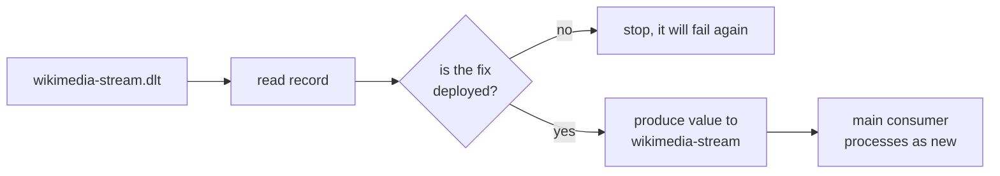

# Lesson 22: DLT Headers and Replay

> **Part 4: Resilience**

---

## What you'll learn

- Why a Kafka header is bytes rather than a string, and how to decode each one correctly
- Which exception header actually holds your exception
- Which headers accumulate across repeated failures and which are replaced
- Why a dead-letter consumer must never throw, and why replay is harder than it looks

---

## Why this matters

Lesson 21 parked a failed record with seven headers attached. Right now they are unreadable: two of them print as garbage and one of them holds a different exception than you would expect.

Reading them correctly is the difference between a dead-letter topic that supports an investigation and one that merely proves failures happened.

---

## Before you start

[Lesson 21](21-dead-letter-topics.md), with at least one record on `wikimedia-stream.dlt`. Produce another if you need one:

```bash
echo 'this is not json' | docker exec -i kafka-1 kafka-console-producer \
  --bootstrap-server kafka-1:29092 --topic wikimedia-stream
```

---

## The concept

### Headers are bytes

A Kafka record is a key, a value, a timestamp and **headers**: an ordered list of name and `byte[]` pairs.

Not a `Map<String, String>`. Three consequences follow.

**Values are raw bytes.** Kafka neither knows nor cares what is in them. A header holding the number 42 might be the four bytes `00 00 00 2A`, or the two ASCII characters `4` and `2`. You have to know which.

**Names can repeat.** Headers are a list, so `lastHeader(name)` returns the most recent occurrence.

**They travel with the record.** Headers are the standard place for cross-cutting metadata such as trace identifiers, schema versions and tenant identifiers, which do not belong in your payload schema. Lesson 26 relies on exactly that.

### The seven headers and their types

| Header | Type | Decode with |
|---|---|---|
| `kafka_dlt-original-topic` | UTF-8 string | `new String(bytes, UTF_8)` |
| `kafka_dlt-original-partition` | 4-byte big-endian int | `ByteBuffer.wrap(bytes).getInt()` |
| `kafka_dlt-original-offset` | 8-byte big-endian long | `ByteBuffer.wrap(bytes).getLong()` |
| `kafka_dlt-original-timestamp` | 8-byte big-endian long | `ByteBuffer.wrap(bytes).getLong()` |
| `kafka_dlt-exception-fqcn` | UTF-8 string | `new String(bytes, UTF_8)` |
| `kafka_dlt-exception-message` | UTF-8 string | `new String(bytes, UTF_8)` |
| `kafka_dlt-exception-cause-fqcn` | UTF-8 string | `new String(bytes, UTF_8)` |

Decode `kafka_dlt-original-partition` with `new String(...)` and you do not get `"1"`. You get four bytes, `00 00 00 01`, interpreted as UTF-8: three null characters and a control character. It prints as nothing or as garbage, and it does not throw.

That silent wrong answer is why this lesson exists. Java's `ByteBuffer` is big-endian by default, which matches Kafka's wire format, so `ByteBuffer.wrap(header.value()).getInt()` is correct with no configuration.

### Your exception is in the cause header

Lesson 21 flagged this and it is worth repeating, because it is the most common mistake made against a dead-letter topic.

When a `@KafkaListener` method throws, Spring wraps the exception in a `ListenerExecutionFailedException` before the error handler sees it. The recoverer records that wrapper in `kafka_dlt-exception-fqcn`, and your own exception in `kafka_dlt-exception-cause-fqcn`.

So a dashboard grouping failures by `kafka_dlt-exception-fqcn` shows one bucket containing everything, and a query filtering it for `IllegalArgumentException` returns nothing at all. The empty result looks like an absence of failures.

Read the cause header. That is where the information is.

### Which headers accumulate, and which do not

Here is a genuine subtlety that is widely misreported.

A record can fail, be dead-lettered, be replayed, and fail again. Headers are a list, so you might reasonably expect two full sets of `kafka_dlt-*` headers to build up. That is half right.

`DeadLetterPublishingRecoverer` treats the two families differently:

- **`original-*` headers append.** Each trip adds another set, so the list preserves the chain of origins.
- **`exception-*` headers are replaced.** The recoverer strips the previous ones before adding the new set, because `stripPreviousExceptionHeaders` defaults to true.

So after three failures you have three `original-offset` headers and exactly one `exception-fqcn`, describing the most recent failure only. If you want the full exception history, you have to ask for it with `setStripPreviousExceptionHeaders(false)`.

The reasoning is defensible: exception messages and stack traces are large, and an unbounded accumulation of them on a record that keeps failing would grow without limit. It is still surprising, and using `lastHeader()` on an exception header is not wrong so much as it is reading the only value there is.

### The value is untouched

The dead-letter record's key and value are the original bytes, republished verbatim. That is what makes replay possible at all: the payload is byte-identical to the one that failed, so you can fix the consumer, read the record back, and produce it to the source topic unchanged.

### A dead-letter consumer must not throw

This is the trap.

Your dead-letter listener uses the same container factory, so it has the same error handler and the same recoverer. If it throws, the recoverer publishes the record to `wikimedia-stream.dlt.dlt`. If that fails, `.dlt.dlt.dlt`, and a topic list nobody wants to explain.

So a dead-letter consumer's job is narrow and must be reliable:

1. **Record** the failure, by persisting it or at minimum logging it with full context.
2. **Alert**, by incrementing a metric someone is paged on.
3. **Acknowledge**, always. The record is already parked, and failing to acknowledge means redelivering it forever.

It must not do the thing that failed. It must not call the database that was down. It should do as close to nothing as possible.

### Replay, honestly

Replaying means producing the dead-letter record's value back to the source topic. There is no Kafka feature for this. You write it.



Three things make it harder than it sounds.

**Replaying a poison pill loops.** Replay a malformed record without fixing the parser and it fails again, returns to the dead-letter topic, and now you have two copies. Replay is only safe after the fix.

**A replayed record is a new record.** It gets a new offset and a new timestamp on the source topic, so the idempotency key from Lesson 18, partition and offset, will not match the original. The record is processed as new. If the original partially succeeded, you may double-apply, and only idempotency on a business key would save you.

**Order is not preserved across a replay.** The replayed record arrives at the end of the log, long after the records that originally followed it. If those depended on its effects, you have applied them in the wrong order, and no amount of same-partition routing helps.

Replay is a repair tool rather than a routine mechanism. Preventing the failure is better, which is why Lesson 20 spent so long on classifying exceptions.

---

## Hands-on

### 1. Look at the raw headers first

```bash
docker exec kafka-1 kafka-console-consumer \
  --bootstrap-server kafka-1:29092 \
  --topic wikimedia-stream.dlt \
  --from-beginning --max-messages 1 \
  --formatter-property print.headers=true \
  --formatter-property print.partition=true
```

The string headers are readable. `kafka_dlt-original-partition` and the two timestamp-shaped headers are visibly mangled, because the console consumer prints raw bytes as text and has no idea they are numbers.

Note also that `kafka_dlt-exception-fqcn` says `ListenerExecutionFailedException` rather than your exception.

### 2. Write the dead-letter consumer

`src/main/java/com/example/wikimedia/consumer/kafka/WikimediaDltConsumer.java`:

```java
package com.example.wikimedia.consumer.kafka;

import java.nio.ByteBuffer;
import java.nio.charset.StandardCharsets;
import org.apache.kafka.clients.consumer.ConsumerRecord;
import org.apache.kafka.common.header.Header;
import org.slf4j.Logger;
import org.slf4j.LoggerFactory;
import org.springframework.kafka.annotation.KafkaListener;
import org.springframework.kafka.support.Acknowledgment;
import org.springframework.stereotype.Service;

/**
 * Reads parked failures and does as little as possible. This listener shares the
 * error handler with the main consumer, so anything it throws would be published
 * to wikimedia-stream.dlt.dlt. It therefore catches everything and always
 * acknowledges.
 */
@Service
public class WikimediaDltConsumer {

    private static final Logger log = LoggerFactory.getLogger(WikimediaDltConsumer.class);

    @KafkaListener(
            topics = "wikimedia-stream.dlt",
            groupId = "wikimedia-dlt-consumer-group"
    )
    public void consume(ConsumerRecord<String, String> record, Acknowledgment acknowledgment) {
        try {
            log.error("""
                            Dead-letter record
                              origin        : {} partition={} offset={}
                              failed with   : {}
                              caused by     : {}
                              message       : {}
                              payload (200) : {}""",
                    asString(record, "kafka_dlt-original-topic"),
                    asInt(record, "kafka_dlt-original-partition"),
                    asLong(record, "kafka_dlt-original-offset"),
                    asString(record, "kafka_dlt-exception-fqcn"),
                    asString(record, "kafka_dlt-exception-cause-fqcn"),
                    asString(record, "kafka_dlt-exception-message"),
                    truncate(record.value()));
        } catch (Exception e) {
            // Never propagate. A throw here would dead-letter the dead letter.
            log.error("Failed to report dead-letter record at offset {}", record.offset(), e);
        } finally {
            acknowledgment.acknowledge();
        }
    }

    private String asString(ConsumerRecord<String, String> record, String name) {
        Header header = record.headers().lastHeader(name);
        return header == null ? "unknown" : new String(header.value(), StandardCharsets.UTF_8);
    }

    private int asInt(ConsumerRecord<String, String> record, String name) {
        Header header = record.headers().lastHeader(name);
        return header == null ? -1 : ByteBuffer.wrap(header.value()).getInt();
    }

    private long asLong(ConsumerRecord<String, String> record, String name) {
        Header header = record.headers().lastHeader(name);
        return header == null ? -1L : ByteBuffer.wrap(header.value()).getLong();
    }

    private String truncate(String value) {
        if (value == null) {
            return "null";
        }
        return value.length() <= 200 ? value : value.substring(0, 200) + "...";
    }
}
```

Four decisions in there worth naming.

**`acknowledge()` is in a `finally` block.** Whatever happens, the record is acknowledged. It is already parked, so redelivering it forever gains nothing.

**Everything is caught.** A header that is absent, a payload that is null, a decoding failure: none of them may escape.

**The cause header is logged alongside the primary one**, so the actual exception is visible rather than buried.

**The payload is truncated.** A dead-letter record can be large, and a log line containing an entire failed payload at full length is its own problem.

### 3. Run it and read the output

Restart the consumer. It now has two listeners in two groups.

```
Dead-letter record
  origin        : wikimedia-stream partition=1 offset=1043
  failed with   : org.springframework.kafka.listener.ListenerExecutionFailedException
  caused by     : java.lang.IllegalArgumentException
  message       : Listener failed; Unparseable Wikimedia event [partition=1 offset=1043]
  payload (200) : this is not json
```

The partition and offset are now numbers rather than garbage, and both exception classes are visible.

Note the correspondence: `partition=1 offset=1043` from the headers matches the partition and offset that Lesson 16's parse method put into its own exception message. Two independent records of the same fact, which is exactly what you want when correlating a log line with a topic.

### 4. Prove the decoding matters

Temporarily change `asInt` to decode as a string:

```java
        return header == null ? -1 : Integer.parseInt(
                new String(header.value(), StandardCharsets.UTF_8));
```

Restart and produce another poison pill. You get a `NumberFormatException`, caught by your own catch block, and the log line reports a reporting failure rather than the original one.

That is the good case. Had the header happened to contain bytes that parsed, you would have got a plausible wrong number and never known. Put `ByteBuffer` back.

### 5. Watch the header families diverge

Produce a poison pill, let it be dead-lettered, then replay it manually so that it fails a second time:

```bash
docker exec kafka-1 kafka-console-consumer \
  --bootstrap-server kafka-1:29092 --topic wikimedia-stream.dlt \
  --from-beginning --max-messages 1 \
  | docker exec -i kafka-1 kafka-console-producer \
    --bootstrap-server kafka-1:29092 --topic wikimedia-stream
```

You will still see `Processed a total of 1 messages` in your terminal. That is the consumer writing to stderr, which the pipe does not carry, so it reached your screen rather than the producer. Only the record value went down the pipe, which is also why the original key is lost in this replay.

Now count the headers on the second dead-letter record:

```bash
docker exec kafka-1 kafka-console-consumer \
  --bootstrap-server kafka-1:29092 --topic wikimedia-stream.dlt \
  --from-beginning --formatter-property print.headers=true --max-messages 2 \
  | tr ',' '\n' | grep -c 'kafka_dlt-original-offset'
```

You will find more than one `original-offset` and exactly one `exception-fqcn`. The origins accumulated and the exception was replaced, because `stripPreviousExceptionHeaders` defaults to true.

You have also just demonstrated the first replay hazard: replaying a poison pill without fixing anything produced a second copy of the same failure.

---

## Try it yourself

1. Set `setStripPreviousExceptionHeaders(false)` on the recoverer and repeat step 5. How many exception headers now? Argue for the default, given what a stack-trace-sized header does to a record that fails repeatedly.

2. Write a replay endpoint on the consumer that reads a given dead-letter offset and produces its value back to `wikimedia-stream`. Then use it on a malformed record without fixing the parser, and describe what you have created.

3. Persist dead-letter records to a table instead of logging them, with columns for the decoded origin and both exception classes. Which of the three responsibilities from the concept section does that satisfy, and which still needs doing?

4. Add a Micrometer counter for dead-letter records, tagged by the *cause* class. Read it from `/actuator/metrics`. Why is that a better alert than lag, given Lesson 21's conclusion that lag now clears when a record fails?

---

## Common mistakes

**Decoding numeric headers as strings.**
You get control characters rather than digits, and it does not throw.

**Reading `kafka_dlt-exception-fqcn` and reporting it as your exception.**
It is Spring's wrapper. Yours is in the cause header.

**Expecting exception headers to accumulate.**
They are stripped and replaced by default. Only the `original-*` family appends.

**Letting a dead-letter listener throw.**
It shares the error handler, so it produces `.dlt.dlt`.

**Forgetting to acknowledge in the dead-letter listener.**
The record is already parked, and not acknowledging redelivers it forever.

**Logging the whole payload.**
Dead-letter payloads can be large, and unbounded log lines are their own incident.

**Replaying before the fix is deployed.**
The record fails again and you now have two copies of it.

**Assuming a replayed record is deduplicated.**
It arrives at a new offset, so the partition-and-offset idempotency key from Lesson 18 does not match.

---

## Check your understanding

**1. `new String(header.value(), UTF_8)` on `kafka_dlt-original-partition` prints nothing. Why not an exception?**

<details>
<summary>Reveal answer</summary>

Because the bytes are valid UTF-8. They just do not mean what you hoped.

Partition 1 is the four bytes `00 00 00 01`, and every one of those is a legal UTF-8 code unit: three null characters and a start-of-heading control character. Decoding succeeds and produces a four-character string containing no printable glyphs.

That is the dangerous shape of this bug. A decoding error that threw would be found immediately. A decoding error that silently produces an empty-looking string survives into production and makes your dead-letter records look like they have no origin information.

</details>

**2. Why must a dead-letter consumer never throw?**

<details>
<summary>Reveal answer</summary>

Because it shares the container factory, and therefore the error handler and the recoverer, with the main consumer.

An exception from the dead-letter listener follows exactly the same path as an exception from the main one: backoff, then the recoverer, which appends `.dlt` to the current topic. So a failure while reporting a failure produces `wikimedia-stream.dlt.dlt`, and a failure reporting that produces another level.

The fix is not a separate error handler, though that would work. It is to make the listener incapable of failing: catch everything, acknowledge in a `finally`, and do as little work as possible. A dead-letter consumer that needs a database is a dead-letter consumer that will fail when the database is the thing that broke.

</details>

**3. You replay a dead-letter record after deploying a fix. Lesson 18's unique constraint does not prevent a duplicate. Why?**

<details>
<summary>Reveal answer</summary>

Because the idempotency key is the record's partition and offset, and a replayed record has new ones.

Producing the value back to the source topic creates a genuinely new record at the end of the log. It carries the same payload and a different identity, so the constraint on partition and offset sees nothing familiar and the insert succeeds.

If the original attempt had partially succeeded before failing, for example writing a row and then failing on something after it, the replay double-applies that part. Guarding against this needs idempotency on something intrinsic to the event rather than to the record that carried it, and Wikimedia gives you no such identifier, which is the honest limitation of this pipeline.

</details>

**4. After three failures of the same record you find three `original-offset` headers and one `exception-fqcn`. Is something broken?**

<details>
<summary>Reveal answer</summary>

No, that is the documented behaviour and it is deliberate.

`DeadLetterPublishingRecoverer` appends the `original-*` headers, so the chain of origins is preserved and you can see the record's whole journey. It strips and replaces the `exception-*` headers, because `stripPreviousExceptionHeaders` defaults to true.

The reason is size. An exception header can carry a message and, if configured, a stack trace, and a record that fails repeatedly would accumulate those without bound until it exceeded the maximum record size and could no longer be published at all.

The cost is that you only ever see the most recent failure reason. If the failure mode changed between attempts, that history is gone unless you turned stripping off.

</details>

**5. Lesson 21 said lag clears when a record is dead-lettered. What should you alert on instead?**

<details>
<summary>Reveal answer</summary>

The rate of records arriving on the dead-letter topic, and ideally broken down by cause class.

Lag measures the distance between the log end and the committed offset. Dead-lettering advances the offset, so a pipeline discarding every single record to the dead-letter topic reports zero lag and perfect health.

A count of dead-letter records is the direct measurement of the thing you care about, and tagging it by the cause class tells you whether you are looking at one broken publisher, one bad deploy, or a database outage. Lesson 26 wires this into Prometheus.

Keep the lag alert as well. The two catch different failures: lag catches a consumer that has stopped, and the dead-letter rate catches one that is running and rejecting everything.

</details>

---

## End of Part 4

Your pipeline now fails properly. It:

- retries transient failures with exponential backoff, bounded to four attempts
- skips the backoff entirely for exceptions that cannot succeed on a retry
- parks failed records on a dead-letter topic with their payload intact and their origin recorded
- keeps them for 30 days with no size cap, so a Friday failure survives the weekend
- reports them from a listener that cannot itself fail

You also know why replay is a repair tool rather than a routine mechanism, and which guarantees it cannot restore.

**Next:** [Lesson 23: A REST API over Consumed Events](../part-5-production/23-rest-api-over-events.md)
